# Tutorial: Building a smart Light Sheet Fluorescence Microscope

In this workshop, we will guide you through assembling a light sheet fluorescence microscope. This technique enables fast, gentle, and high-contrast imaging of biological samples by illuminating only a thin slice of the specimen. By systematically shifting the sample in x, y, and z directions and stacking the resulting images, you can reconstruct detailed three-dimensional visualizations of microscopic structures.

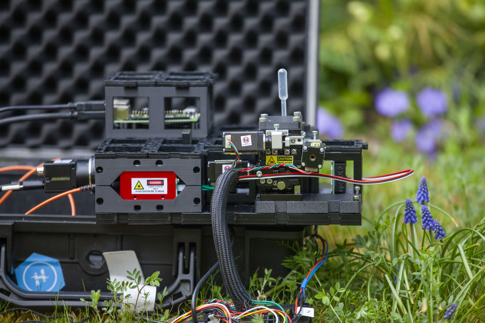


### Materials Needed

1. Laser diode 488 nm
2. Biconvex lens f'=25 mm
3. Cylindrical lens f'=100 mm
4. Mirror
3. LED-Satellite-Matrix (enables bright-field microscopy for aligning)
4. Electronic Z-stage (for camera focus)
4. Electronic XYZ-Stage (for moving the Probe)
5. Mainboard with UBC-mini cable
6. PS4 Controller (for controlling the Z-stage)
7. Infinity objective 10x
8. Objective 4x with RMS Insert
8. Probe Chamber
8. Probes
9. Emission filter
9. Camera with tube lens
12. Cubes and base plates


### Diagram

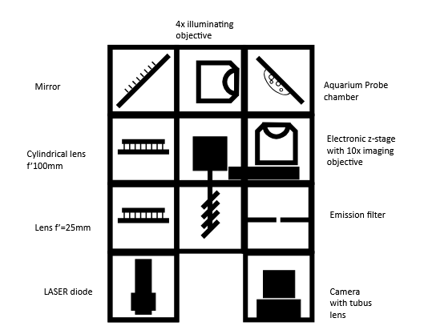

### Theory of Operation

Light-sheet microscopy is based on the principle of fluorescence and like confocal microscopy, it is a technique that creates optical sections that can then be reconstructed into a coherent image. It differs from traditional microscopy technologies in its special type of illumination and detection, which enables gentler and faster acquisition of 3D images, making it particularly suitable for the three-dimensional visualization of biological samples.

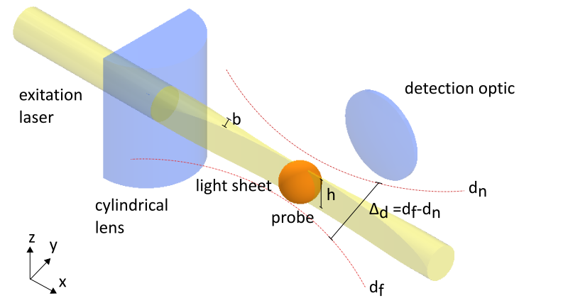

To illuminate the sample, a thin light sheet is used, which is guided through the sample perpendicular to the optical axis of the detection optics. This enables layer-by-layer illumination within the depth of field ∆d of the objective, whereby only the focal plane of the sample is illuminated, while all other planes remain in darkness.

Initially, a slit created in various ways was used to generate the light sheet, but for biological fluorescently stained samples, it has now been switched to directing an expanded laser beam through a cylindrical lens.

The cylindrical lens has an effective cut in which it refracts the light rays like a centered lens in the meridional section (principal section) and focuses the light in a line (XY plane). In the YZ plane, however, it acts like a plane-parallel plate,
in which the geometry of the beam is preserved. This creates a light sheet,
where the height h corresponds to the diameter of the expanded laser beam.
The light sheet then strikes the sample to be examined and can be moved through it layer by layer (translation in the Y direction). It is aligned perpendicular to the optical axis of the detection optics, with the
light sheet being within the depth of field (d < ∆d) of the objective lens. This ensures that the recorded image contains no out-of-focus components. To ensure this even when moving in the Y direction through the sample, the position of the objective lens is continuously readjusted. Alternatively, instead of the light sheet, the sample itself can be shifted in the Y direction. In fluorescence microscopy, in particular, the red-shifted radiation emitted from the respective sample plane is detected. Using image processing software, the images of all layers can then be superimposed, creating a 3D image (3D stack) of the sample.

### Theoretical Background: Fluorescence

Fluorescence is a photophysical process that describes the spontaneous emission of light shortly after an electron is excited to a higher-energy state.
First, an electron is excited from the ground state to the higher-energy state  through absorption. After a short time (approximately 10⁻⁹ s), the excited electron returns to the ground state, releasing energy in the form of radiation. Due to the Stokes-shift within the S₁ state, the emitted light has a longer wavelength (λ₂) than the radiation used for excitation (λ₁).


## Tutorial: Light-sheet fluorescence microscope

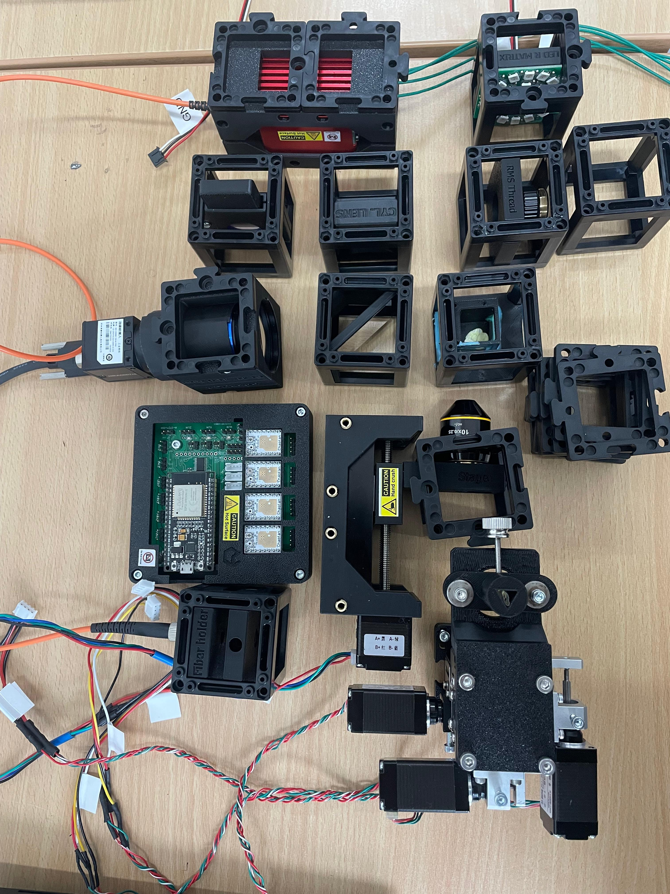

## Step 1: Assemble the Microscope

This guide will walk you through the microscope assembly step by step. You can follow the process according to the functional modules or refer to the diagram above for orientation.

1. **Install the Laser Source**  
   Connect the fiber-coupled laser to the fiber coupler insert and securely fasten it.

2. **Insert the Collimating Lens**  
   To collimate the laser beam, insert a biconvex lens with a focal length of f' = 25 mm directly behind the fiber output, within the same optical cube.

   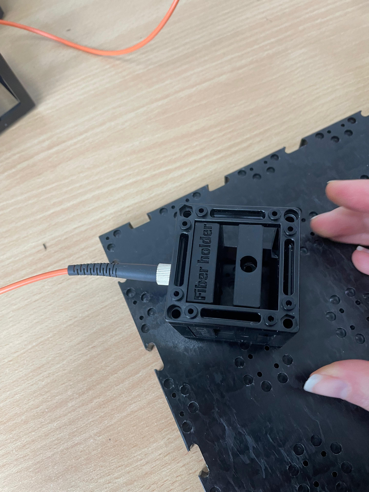

   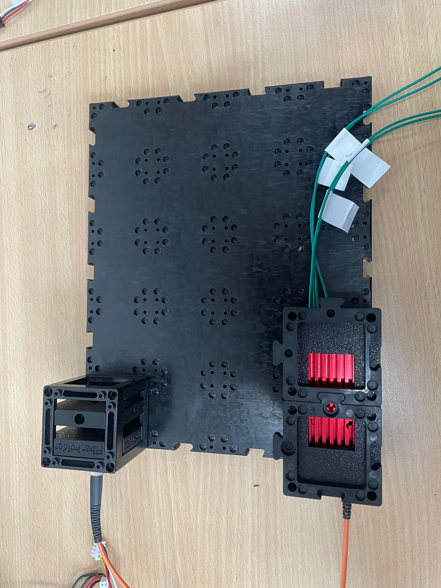


3. **Leave Space for the Cylindrical Lens**  
   Do not insert the cylindrical lens yet. Leave physical space for it at the appropriate position. It will be inserted after initial beam alignment (see step 3).

   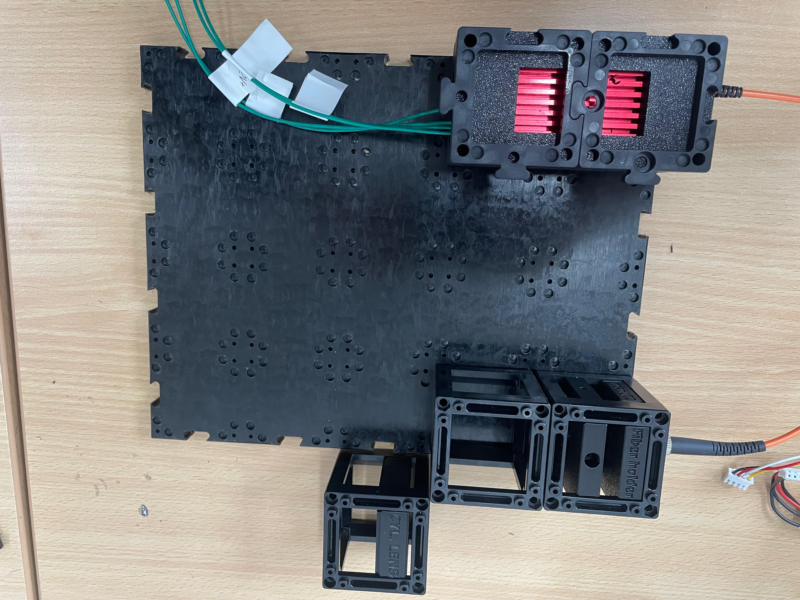


4. **Place the 45° Mirror**  
   Insert a dielectric mirror at a 45° angle to redirect the beam around a corner, as needed for the optical path.
   

5. **Prepare and Mount the 4× Objective**  
   Disassemble the 4× objective lens as shown in the reference image. This modification allows the focal plane to be positioned close enough to the sample for proper alignment. Mount the modified objective onto the RMS insert.

   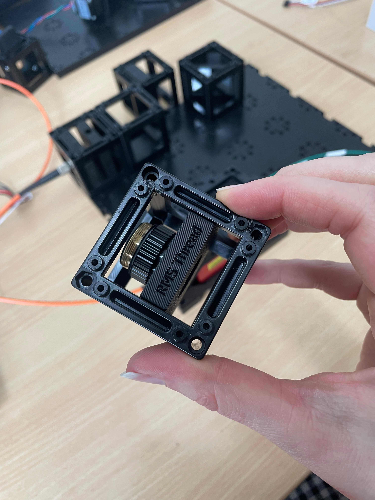

6. **Position the sample aquarium chamber**  
   Place the sample aquarium chamber on the stage and fill it with water or your desired immersion medium.

   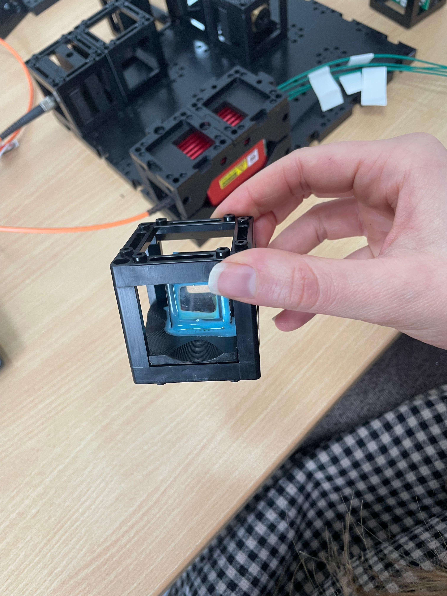

   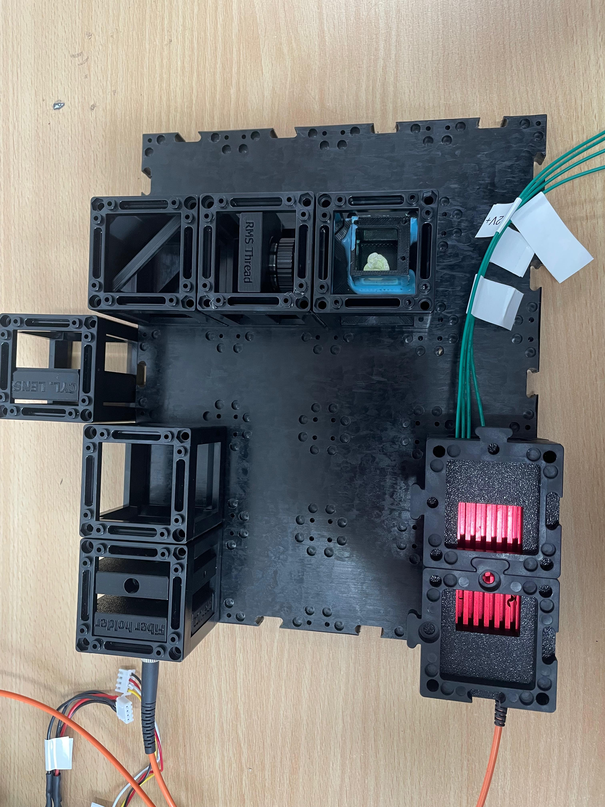

7. **Add the LED Satellite Matrix (Optional)**  
     Position the LED matrix in the camera path. While not part of the core light-sheet setup, it is useful for illumination and alignment purposes in Step 3.

     

     


8. **Mount the electronic Z-stage**  
   Install the motorized Z-stage. Attach the **10× infinity-corrected objective** to the stage. This objective is used for imaging.

   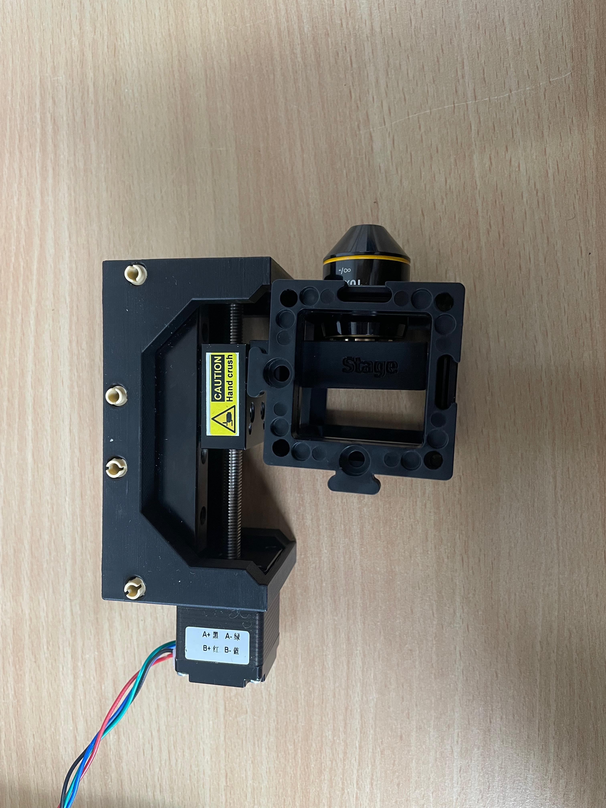


9. **Install the emission filter**  
   - If your emission filter is preassembled, proceed to the next step.  
   - Otherwise, locate the filter inside the **beamsplitter cube insert** from the FluoBox. It’s on the rear-facing side; the diagonal face holds the dichroic mirror.  Disassemble the beamsplitter to retrieve the emission filter and insert it into its designated mount. Secure it with the white retaining ring.

   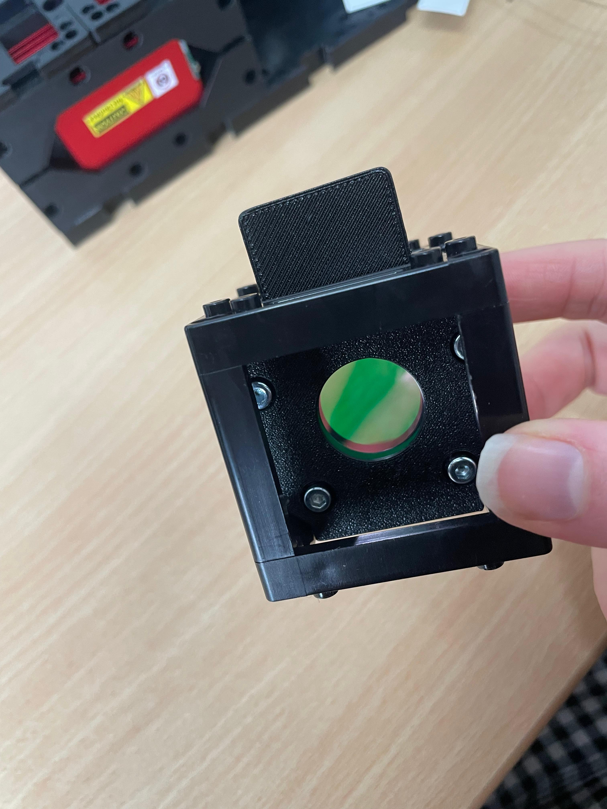


10. **Attach the Camera Module**  
   Align the camera unit and its corresponding **tube lens** directly behind the emission filter to ensure proper image formation.

   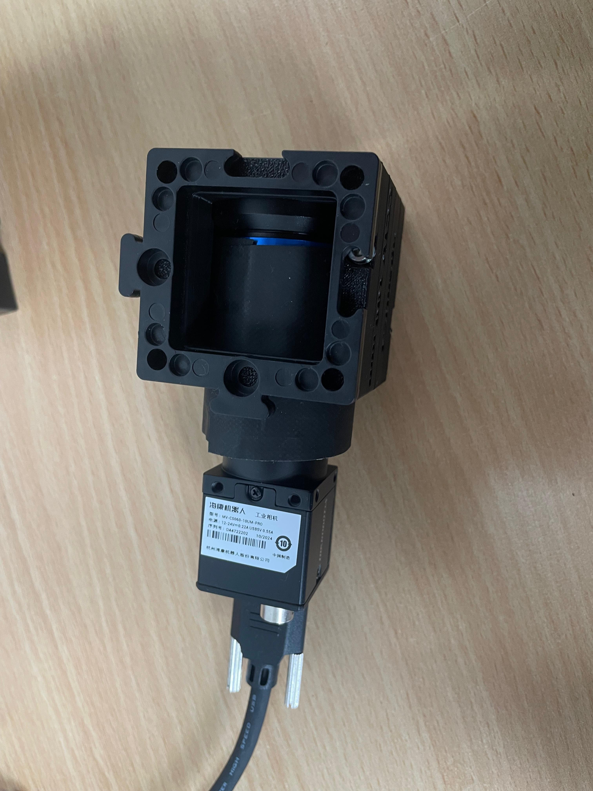

   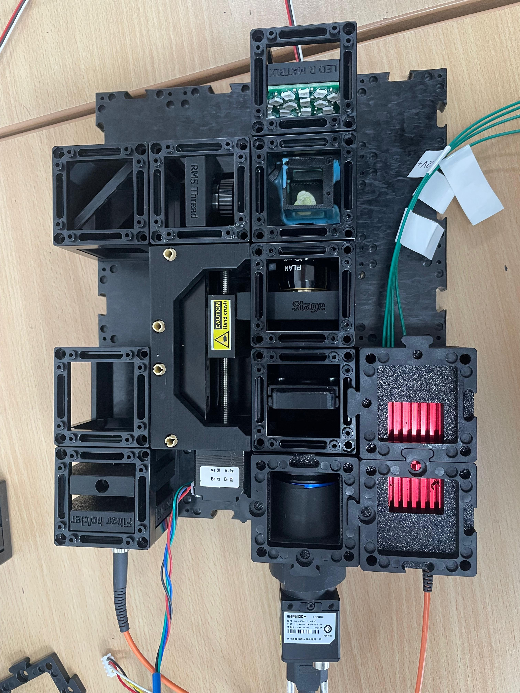


11. **Leave Space for the XYZ Stage**  
    The XYZ stage is not required for initial alignment. You may leave it out during this step to increase working space and simplify alignment. Install it later, after completing optical alignment.

    

12. **Connect and Secure Components**  
    Use the puzzle connectors to link the modules.  
     **Important:** Make sure you don't put puzzle pieces on the cylindrical lens and mirror yet — leave them easily removable for adjustments during Step 3. Only secure all components once alignment is complete.


## Step 2: Electronics

**⚠️ ATTENTION!**

NEVER LOOK DIRECTLY INTO THE LASER! EYE WILL BE DAMAGED DIRECTLY

NEVER SWITCH ON THE LASER WITHOUT INTENDED USE

BEAM HAS TO GO AWAY FROM ONESELF - ALWAYS!

### 2.1: Plug in the Electronics as Shown Below

**⚠️ Caution!**
If you need to change any of the cables or their position, always unplug the 12V power cable before doing so. Otherwise, the electronic components might get damaged!

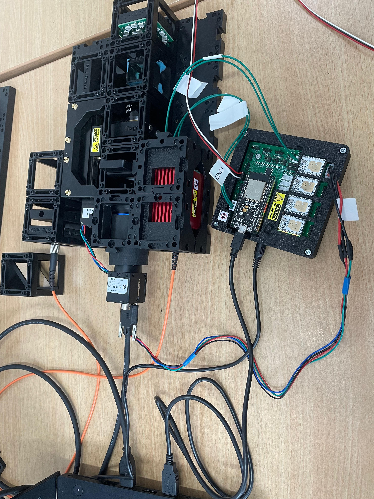
*Elektronik whithout XYZ-Stage*

- connect the LED-Matrix to the Mainboard at `LED1`

- Connect the Z-stage to the position `Z-Motor` on the main board. Ensure there's a motor driver.

- Connect the 3 Motors of the XYZ-Stage to the respective positions `A-Motor`,  `X-Motor`,  `Y-Motor`. Ensure there are motor drivers as well.

- Connect the Laser to the Mainboard at `PMW1`and to `12V` Power:

- Plug in the micro-USB at your ESP32 and connect to your PC.

- Plug in the 12V power cable.


### 2.2: Flashing the ESP32 Firmware

1. Before proceeding, ensure your ESP32 board has the latest firmware. You can download and flash the firmware via the official [openUC2 website](https://youseetoo.github.io/), selecting your version (most likely **ESO32-DEV-based UC2 standalone board V3 (beta)**), then click on the `connect` button.


The source code can be found [here](https://github.com/youseetoo/uc2-esp32).

2. Connect the ESP32 to your computer using the micro-USB cable.  


3. In your Chrome browser, a dialog will prompt you to select the COM port for your ESP32, which should be shown as `CP2102 USB to UART Bridge Controller`. Once connected, you can install the latest firmware by simply clicking the "Install" button.
  

  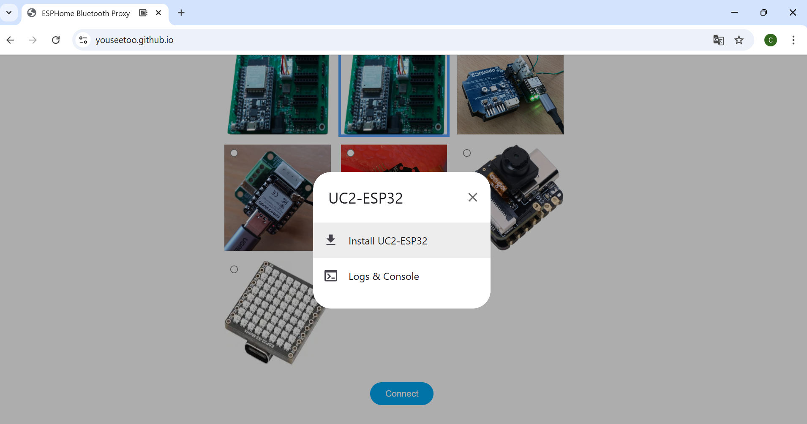

  If nothing shows up, you can install the drivers from the prompt that appears when you click anywhere on the screen:

   

4. Wait until the firmware has been successfully flashed.


### 2.3: Connecting to the Web Interface

1. After flashing the firmware, go to the testing section on the same website.

2. Connect to your ESP32 board using the "Connect" button again, ensuring the correct COM port is selected.  

   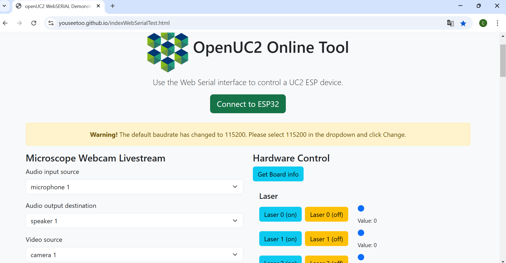

3. Once connected, test the system by sending a simple command:

```json
{"task":"/motor_act", "motor": { "steppers": [ { "stepperid": 3, "position": -1000, "speed": 1000, "isabs": 0, "isaccel": 0} ] } }
```


This command will move the Z-axis motor by -1000 steps (1 full rotation) at a speed of 1000 steps per second. Each step corresponds to a movement of 300nm when using microstepping. You’ll observe the motor rotating, adjusting the focus.

**Note:** Ensure that the command string has no line breaks.


### 2.4: Testing in the Web Interface

1. After completing the test, go back to the first tab to control the other components via buttons:
   - `Laser 1(on)` and `Laser 1(off)` control the laser diode.
   - `Motor Z(+)` and `Motor Z(-)` control the Z-stage.
   - `Motor X(+)/Y(+)/A(+)` and `Motor X(-)/Y(-)/A(-)` control the XYZ-stage.
   - `LED (on)` and `LED (off)` control the LED-matrix panel


### 2.5: Pairing the PS4 Controller &#x1F3AE;

The UC2-ESP firmware supports various input devices, including the PS4 controller, to make interacting with the microscope easier. While you've already worked with USB serial commands, using the PS4 controller offers a more flexible, hands-on approach. For more detailed instructions on pairing, refer to the[UC2 PS4 Controller Pairing Guide](https://openuc2.github.io/docs/Electronics/PS4-Controller/PS4-Controller). Here’s a brief summary:

1. **Put your PS4 controller into pairing mode** by holding down the `Share` button and the `PS` button simultaneously until the light bar starts blinking.
2. Click the `Pair Controller` button in the web interface. Alternatively, open the serial prompt in your browser (connected to the ESP32 board) or use the web interface and enter the following command:


```json
{"bt_scan":1}
```

  This will initiate the Bluetooth scan on the ESP32, which will detect and pair with the controller.

  Once paired, you can control the motorized stage using the analog sticks and switch the LED-matrix on/off using the buttons. The complete pinout of the diffrent function you can find here: [UC2 PS4 Controller Pairing Guide](https://openuc2.github.io/docs/Electronics/PS4-Controller/PS4-Controller)

### 2.6: Setup and Use the Camera Software

1. Connect the camera via cable to your PC.

2. For the installation process and useage of the software, follow these instructions: [Install MVS App for Camera Utilization](https://openuc2.github.io/docs/Electronics/HIKCamera/SoftwareTutorial)


## Step 3: Aligning the Microscope

Refer again to the alignment diagram that shows how the light sheet should intersect the detection path. The **focal point of the light sheet (its thinnest part)** must coincide precisely with the **optical axis of the detection optics**.

Following these steps carefully will ensure that the light sheet is centered within the field of view (FOV) and in focus with the detection objective. This alignment is crucial for obtaining high-resolution and reliable imaging results with the OpenUC2 light-sheet microscope.

👉 For additional tips and tricks, see:  
- [Light Sheet Sample Guide](https://openuc2.github.io/docs/Toolboxes/LightsheetBox/LightSheet%20Sample/)  
- [Alignment video of an older light-sheet version](https://openuc2.github.io/docs/Toolboxes/LightsheetBox/LightsheetCalibration)

---

1. **Collimate the Laser**  
   Remove the mirror temporarily and collimate the laser by adjusting the distance between the laser diode and the f' = 25 mm biconvex lens. The beam diameter should remain consistent regardless of viewing distance—this indicates good collimation.

   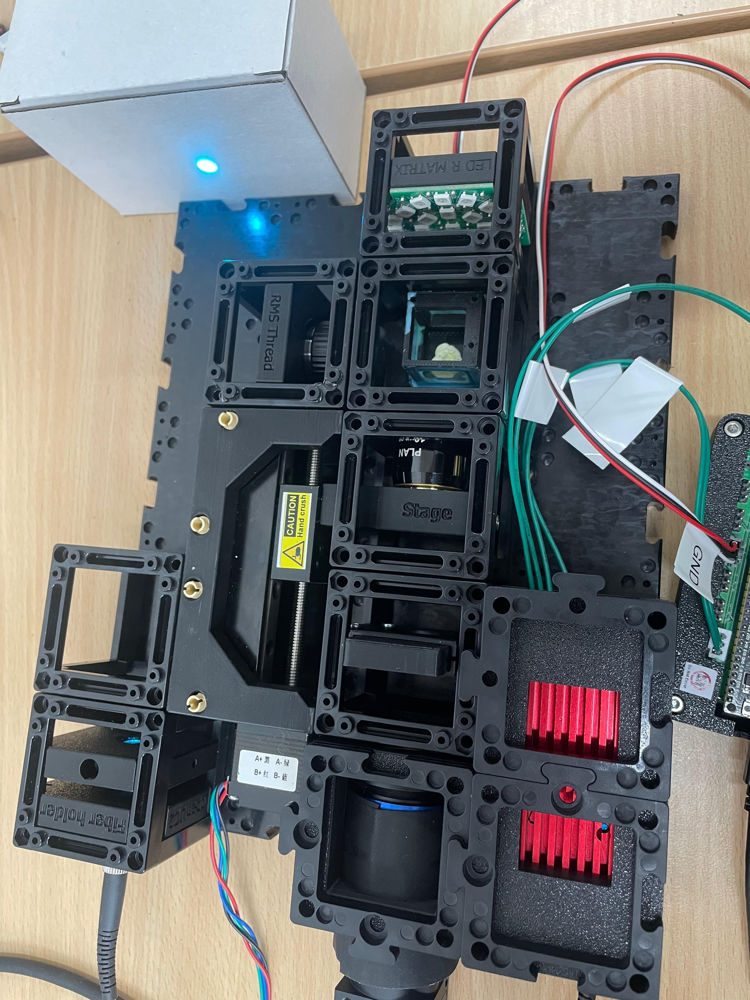

   


2. **Insert the Mirror**  
   Guide the collimated beam into the 4× illumination objective by inserting the 45° mirror back into the microscope.

   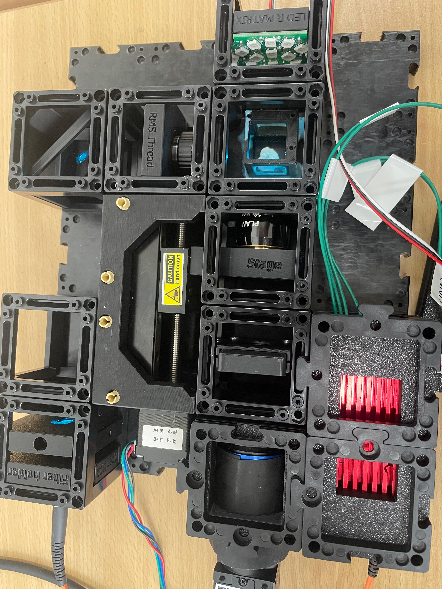

3. **Prepare the Probe Chamber**  
   Fill the chamber with water. To make the solution fluorescent, briefly dip the tip of a text marker into the water. This allows you to visualize the light sheet.
   Tonic Water or Bitter lemon would also work, but they tend to get sticky.

   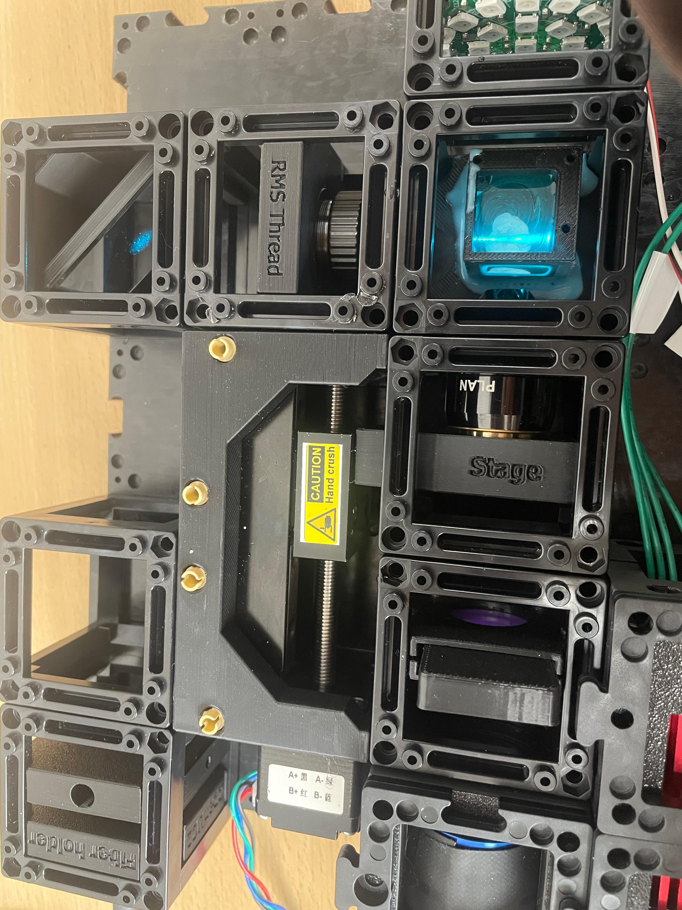

4. **Align the 4× Illumination Objective**  
   Turn on the laser and adjust the 4× objective so that the focus is on the optical axis of the detection path. The beam spot should appear as a small, focused dot.  For this it's easiest to use the camera:
     - Launch the software and **remove the emission filter**.
     - Turn on the **LED Satellite Matrix** to verify the camera is working (the screen should be bright white), then turn it off again.
     - Turn on the laser at full power.
     - Set the exposure time to **50,000–90,000 ms**, or higher if necessary.
     - You should now see a **sandglass-shaped beam**. Adjust the 4× objective to move the focal point (thinnest point) into the center.
     - Use the **Z-stage** to fine-tune the camera focus, making the beam waist as thin and sharp as possible.

     it should look something like this:
     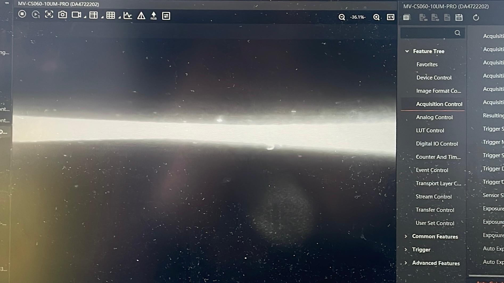


5. **Insert the Emission Filter**  
   Reinsert the emission filter. This will block the excitation light and allow only fluorescence to pass through to the camera. readjust the exposure time and the gain accordingly.

   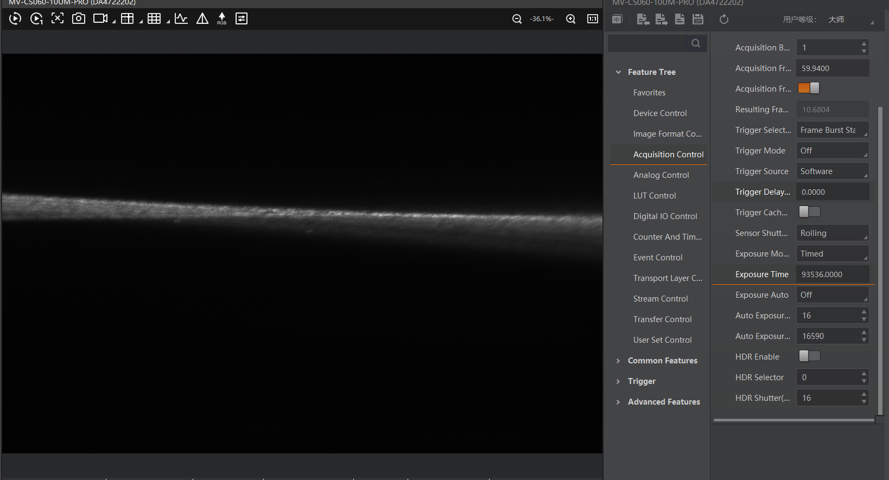

  Realign both the imaging and the dedection focus as needed. It then should look like this.

   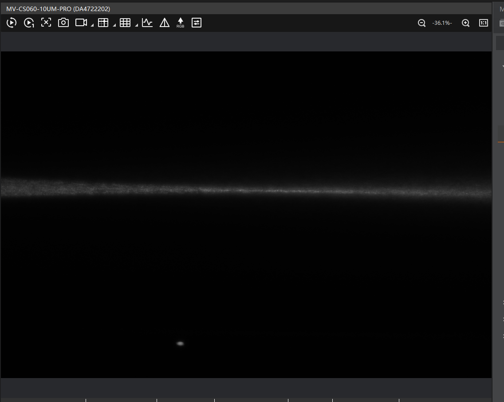


6. **Insert the Cylindrical Lens**  
      Insert the cylindrical lens to generate the light sheet. It should be positioned so that its focal plane aligns with the **back focal plane of the 4× objective (NA 0.1)**.  
      - For proper alignment, the **focal length of the cylindrical lens should match** the effective focal length of the 4× objective. Adjust until the sheet is as thin as possible (remove emission filter if needed).
      - After re-inserting the lens, recheck the alignment, as minor variations can occur during reassembly.

      > ℹ️ Once aligned, the cylindrical lens usually does not need to be recalibrated unless components are moved or replaced.
---
  7. **Final Check**

   - If alignment is correct and you **temporarily remove the emission filter**, you should see:
     - A fully illuminated camera image.
     - The light sheet filling the entire field of view.

     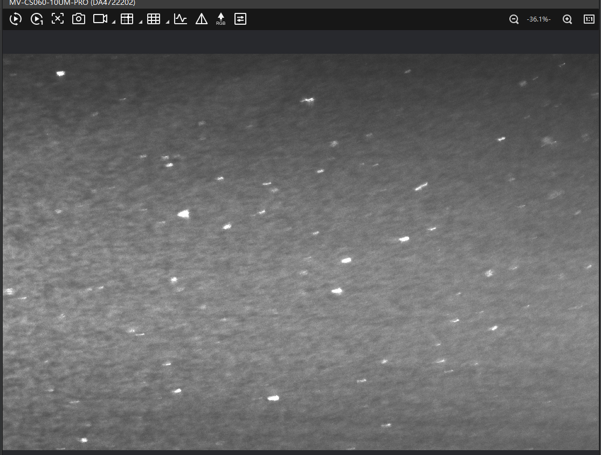


   - If the light sheet appears **too high or too low** like this
   
   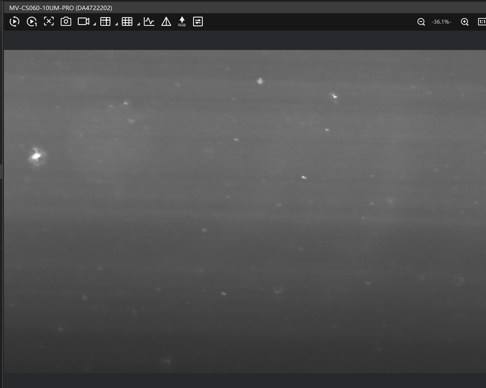

    check:
     - Whether the **10× detection objective** is correctly positioned on the optical axis (e.g., loose screws can shift alignment).
     - Whether all modules and puzzle pieces are properly secured.

- You should now see **fluorescent particles** in the water as bright dots. Use the **Z-stage** to focus on the plane containing those particles.

- **Reinsert the Emission Filter**  
    You should now see a dark image with only **a few bright dots**. These are the particles in focus.

    

    Adjust exposure time and gain as necessary.

    

- **Last step**: Remove the fluorescent water and thoroughly clean the probe aquarium chamber.  
    - First, use a pipette to extract the water.  
    - Then, use lint-free tissue paper along with a pointed tool like tweezers or a small screwdriver to gently clean the chamber windows.  
  This step is **essential**, as fluorescent particles tend to stick to the glass surfaces, causing **unwanted scattering** in future experiments.


## Experiment 1: Imaging with the light-sheet microscope

1. insert a Probe into the Sample Holder of the XYZ-Stage, mount the XYZ-Stage to the Board and connect the motors.

  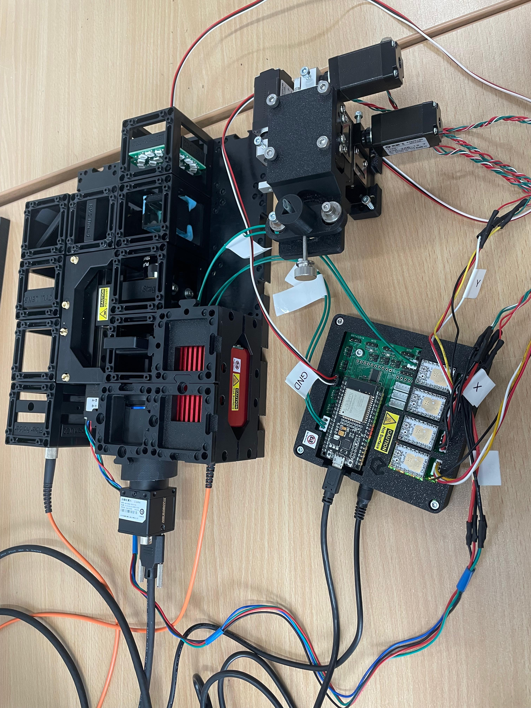

  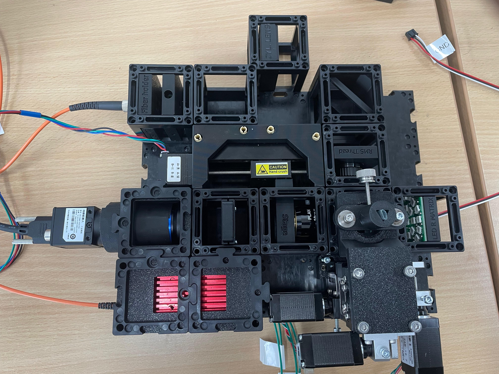

  sample preparation: https://openuc2.github.io/docs/Toolboxes/LightsheetBox/LightSheet%20Sample/#sample-preparation-%C3%A1-la-agarose-in-syringe-method

2. insert clear water into the sample aqarium chamber

3. insert the XYZ-Stage on the board and connect the motors to the main board (see Step 2, don't forget to plug the 12V cable before doing so)

4. position the Probe in the light sheet.

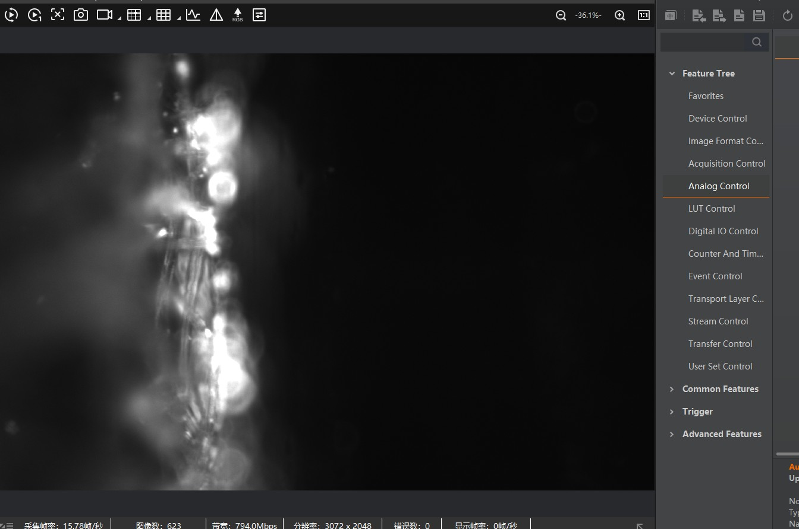

5. adjust the acquisition time and gain accordingly

6. by moving the X and Y axis you position the probe
7. by moving the A axis you can "scroll" through your probe

  after you finished your experiemnts, don't forget to clean the sample chamber.


## Experiment 2: Generating Sacks Using ImSwitch (Rasperry Pi)

### Step 1: Installation process

For this, please refer to the installation instructions [here](https://openuc2.github.io/docs/ImSwitch/Quickstart).

On top of this, you can use the following `ImSwitchClient` template to remote control your microscopy using google colab or jupyter notebook. This gives some hints on the use of the API:

<a target="_blank" href="https://colab.research.google.com/drive/1W3Jcw4gFn0jtQXa3_2aCtJYJglMNGkXr?usp=sharing">
  
</a>
This makes use of the default URL hosted publicly on https://imswitch.openuc2.com/imswitch/index.html, but you can change this to the `PORT` (i.e. 8001) nad `URL` (e.g. the Raspberry Pi's IP address that runs ImSwitch in docker and is in the same network as you computer).

### Step 2: Imaging and generating Stacks:
We assume the system is running and you were able to install ImSwitch on your computer. The configuration `JSON`file that describes the light-sheet system can be found further down this document. A tutorial on how to install our ImSwitch Version (SRC: https://github.com/openUC2/ImSwitch/) can be either found in the imSwitch repository or in the ImSwitch section in this wiki.

The Video below will show you how to run Imswitch and genereate data stacks.

<div style={{position: 'relative', paddingBottom: '56.25%', height: 0, overflow: 'hidden'}}>
  <iframe 
    style={{position: 'absolute', top: 0, left: 0, width: '100%', height: '100%'}}
    src="https://www.youtube.com/embed/kr9_7XD-a4M?si=I0qcmhLNnKMY2EwI" 
    title="YouTube video player" 
    frameBorder="0" 
    allow="accelerometer; autoplay; clipboard-write; encrypted-media; gyroscope; picture-in-picture" 
    allowFullScreen
  />
</div>
