Welcome to the openUC2 Light-Sheet Microscope Tips and Tricks. The openUC2 light-sheet microscope endeavors to bring accessible volumetric imaging of fluorescent samples to a wider audience. As you navigate through this documentation, please keep in mind the following key points:

1. **Dynamic Nature of the Microscope:**
   The openUC2 light-sheet microscope is in its early stages of development and refinement. As such, expect ongoing changes and updates to various components, techniques, and procedures. Your feedback, suggestions, and contributions are essential to enhancing the microscope's capabilities and documentation.


2. **Principles of Operation:**
   The fundamental concept of the openUC2 light-sheet microscope revolves around creating a static light-sheet using a fiber-coupled laser (488nm in 4µm single mode fiber). This light-sheet is formed by collimating the laser and subsequently shaping it using a cylindrical lens. The illumination object projects this light-sheet onto the sample plane for imaging.

3. **Sample Handling and Illumination:**
   The microscope's setup includes provisions for hanging the sample from above, enabling XYZ movement with micrometer precision. The static light-sheet intersects the sample, facilitating volumetric imaging. Please note that a rotational axis has not been implemented in the current design.

4. **Objective Lens Alignment:**
   The openUC2 light-sheet microscope incorporates the ability to adjust the objective lens for proper alignment with the light-sheet plane. This adjustment is crucial for achieving optimal imaging quality.

5. **Documentation Scope:**
   This document serves as an initial guide for the openUC2 light-sheet microscope. While comprehensive, it may not cover every detail or aspect. Your understanding and engagement with the microscope's components, principles, and setup will be crucial in filling any gaps in the documentation.

6. **Contributions and Support:**
   We invite you to actively contribute to this documentation and the overall openUC2 project. If you encounter challenges, have questions, or discover areas for improvement, please create issues in our GitHub repository: [https://github.com/openUC2/UC2-GIT/issues](https://github.com/openUC2/UC2-GIT/issues).

7. **Community Collaboration:**
   The openUC2 project thrives on community collaboration. We encourage users to share their experiences, insights, and modifications with the community. This collective effort ensures that the openUC2 light-sheet microscope continues to evolve and meet the needs of its users.

### ImSwitch integration into 3D imaging including 3D volumetric rendering

<iframe width="560" height="315" src="https://www.youtube.com/embed/EadREZTqJFo?si=IXIoxpxwjvSjv5M_" title="YouTube video player" frameborder="0" allow="accelerometer; autoplay; clipboard-write; encrypted-media; gyroscope; picture-in-picture; web-share" referrerpolicy="strict-origin-when-cross-origin" allowfullscreen></iframe>

Please dive into the documentation and begin your journey into the technical intricacies of the openUC2 light-sheet microscope.

## The fully assembled Light-sheet Microscope


- **Component Information:**
  This repository contains various components related to the openUC2 light-sheet microscope. You can explore these components to better understand their functionality and integration within the setup.

- **Component Replacement and Improvement:**
  If any component requires replacement or upgrading, please feel free to contact us. We're eager to provide you with the latest STL files to enhance the overall setup. Your feedback and insights are vital in refining the microscope's performance.


- **Assembled Light-Sheet Configuration:**
  The accompanying image showcases the fully assembled openUC2 light-sheet microscope, displaying all components in their designated positions.

- **Sample Mounting:**
  The sample is securely mounted within a syringe, which is a critical element of the imaging process. Precise sample positioning ensures accurate volumetric imaging.

- **System Requirements:**
  To operate the microscope effectively, you'll need a laptop with more than 8GB of RAM and a USB3 port. These specifications are necessary for handling the data-intensive operations and real-time imaging tasks.

- **ImSwitch Software Integration:**
  Our customized version of ImSwitch software is tailored for operating the light-sheet microscope and generating volumetric images. ImSwitch streamlines the imaging process, allowing you to focus on your research.

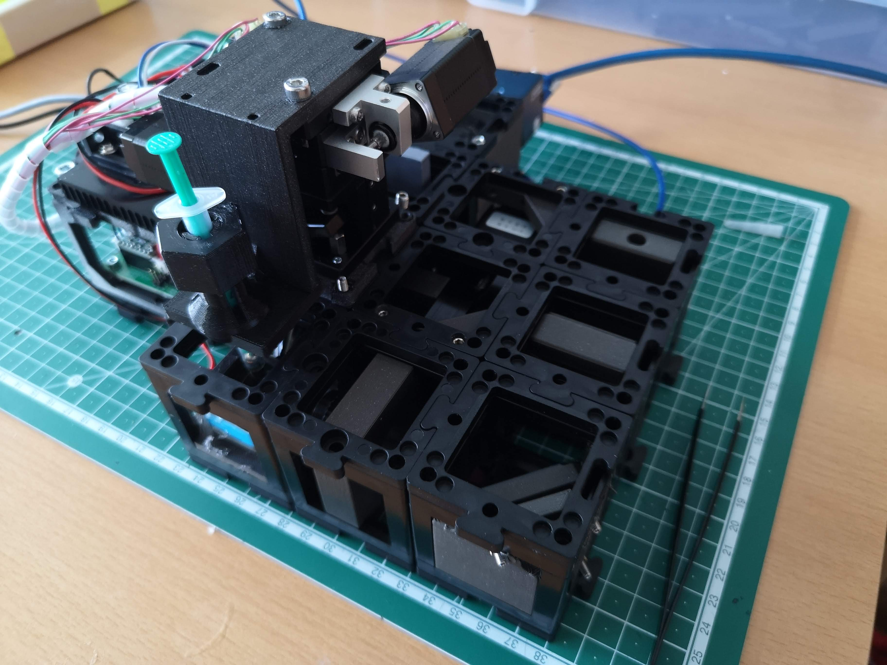

- **Motorized Axes:**
  The openUC2 light-sheet microscope features motorized axes for enhanced control and precision:
  - The `Z`-axis adjusts the objective lens focus relative to the light-sheet plane.
  - The `X` axis moves the sample in the vertical direction with respect to the ground surface.
  - The `Y` axis shifts the sample parallel to the light-sheet plane.
  - The `A` axis moves the sample along the light-sheet plane, towards or away from the objective lens.
  - Each step corresponds to approximately 300nm in physical units, enabling fine-tuned movement and positioning.

We appreciate your engagement with the openUC2 light-sheet microscope and hope that these technical details enhance your understanding of the setup and its capabilities. Should you have any inquiries or require further assistance, please don't hesitate to reach out.


## Protocol to align the light-sheet w.r.t. the focus plane

## Alignment Protocol for Light-Sheet Microscope Focus Plane

Efficient alignment of the light-sheet with the microscope objective lens's focus plane is crucial for optimal imaging results. This protocol outlines the steps to achieve precise alignment using fluorescent markers and manipulation of the kinematic mirror.


**Alignment Steps:**

1. **Fluorescent Marker Setup:**
   - Begin by ensuring that the light-sheet is coplanar with the microscope's objective lens field of view.
   - Use a fluorescent pen marker to label the embedding media, effectively visualizing the light-sheet.

 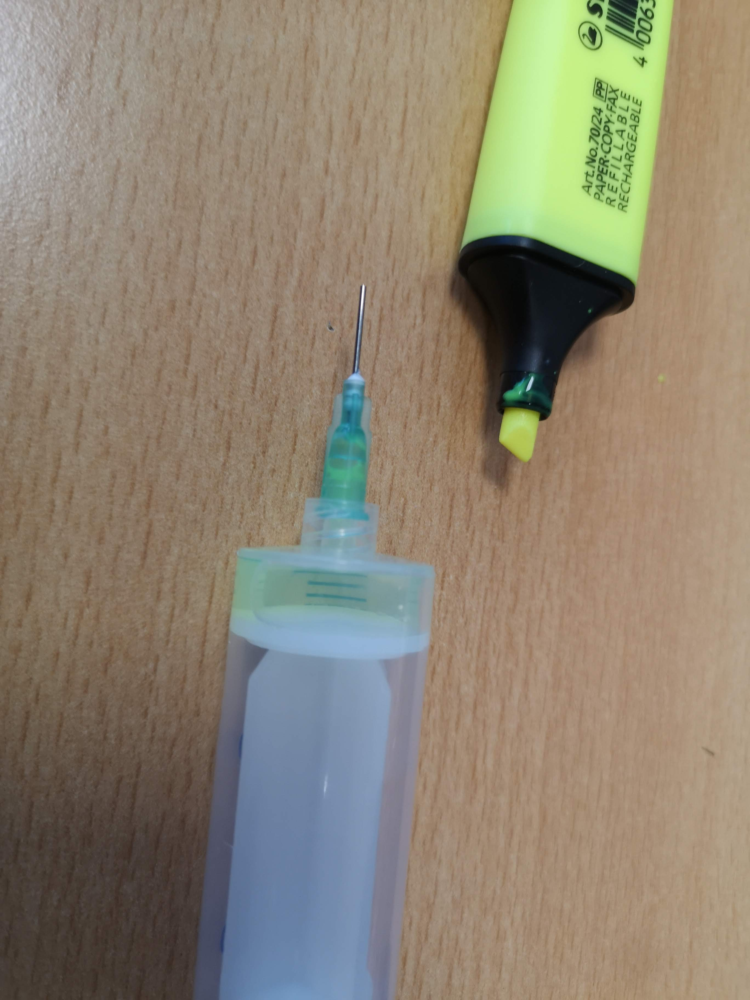

2. **Activating the Laser:**
   - Turn on the laser source either via ImSwitch software or the web interface [https://youseetoo.github.io/indexWebSerialTest.html](https://youseetoo.github.io/indexWebSerialTest.html).


3. **Visualizing the Light-Sheet:**
   - With the laser activated, you should observe the light-sheet within the water chamber. Refer to the provided image for a reference.

4. **Kinematic Mirror Adjustment:**
   - The three screws on the kinematic mirror in the right corner control the orientation of the light-sheet in 3D space.
   - Familiarize yourself with the degrees of freedom associated with these screws.

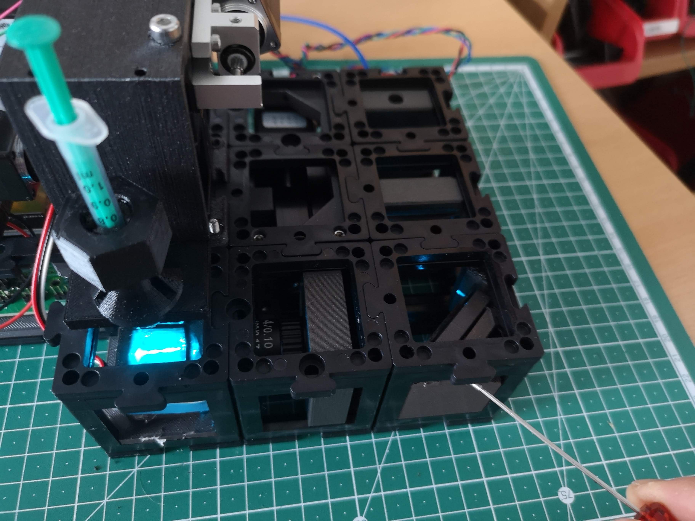


5. **Fundamental Considerations:**
   - The cylindrical lens focuses the primary light-sheet in the backfocal plane of the illumination objective (4x, 0.1 NA).
   - Rotating the objective lens adjusts the orientation of the light-sheet.
   - The square orientation of the cylindrical lens ensures proper alignment with the detection objective lens.
   - The primary light-sheet exits the cylindrical lens at the center.
   - The kinematic mirror manipulates the light-sheet's position in the x and y directions, as well as introducing an offset.
   - Correct mirror alignment is crucial, placing it precisely at the diagonal center of the cube.
   - This central placement ensures that the primary light-sheet enters the objective lens's backfocal plane (BFP) at the center.
   - Such alignment results in the secondary illuminating light-sheet being parallel to the detection lens's focus plane.
   - Observe the effects of rotating the screws and adjust accordingly.

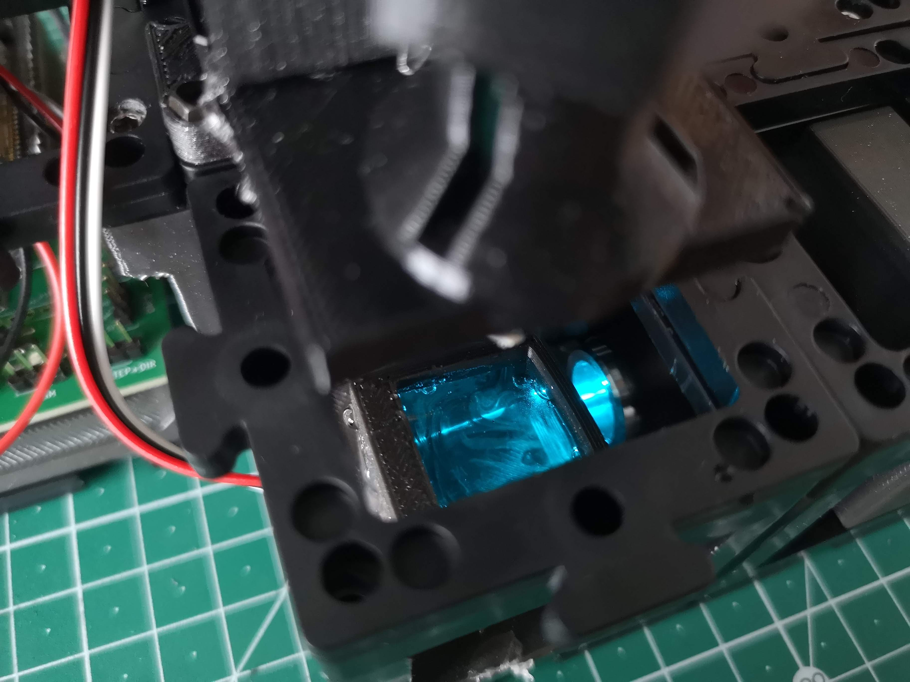

6. **Fluorescent Solution Application:**
   - Utilize a syringe for convenient application of the fluorescent solution.

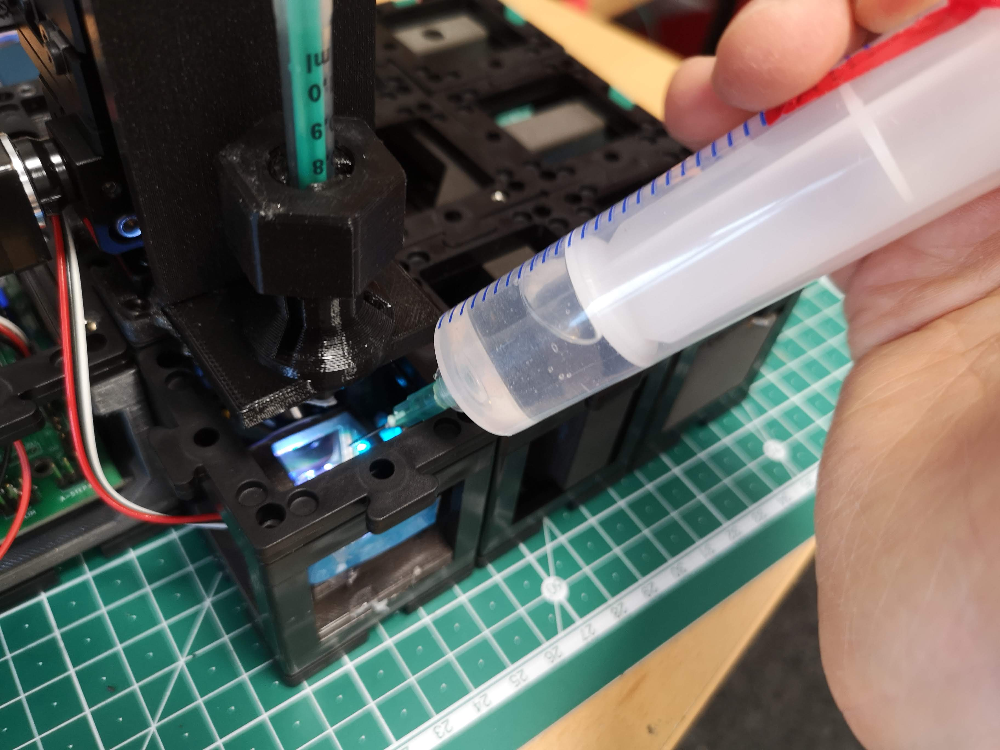
7. **Sample Cube Handling:**
   - The sample cube is magnetically held, facilitating easy removal for cleaning.
   - Take care as the sample cube's coverslips are relatively thin and can break.

   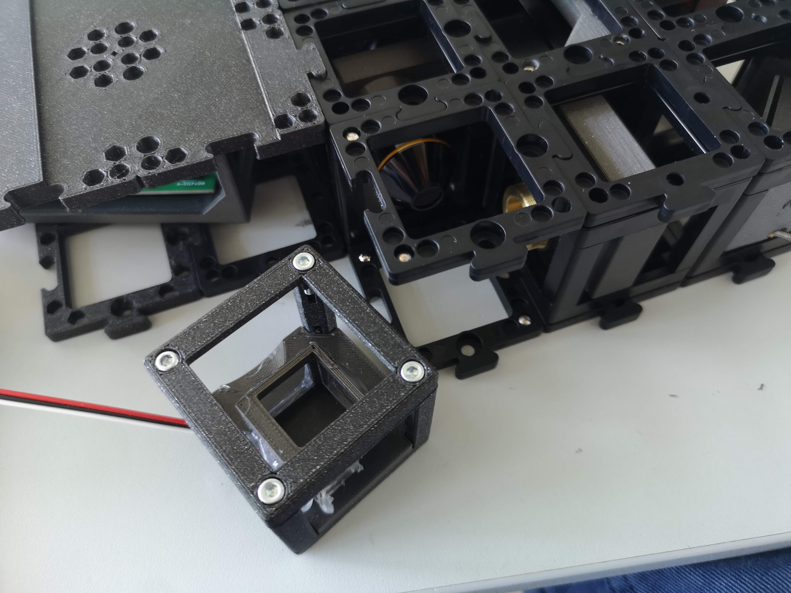

   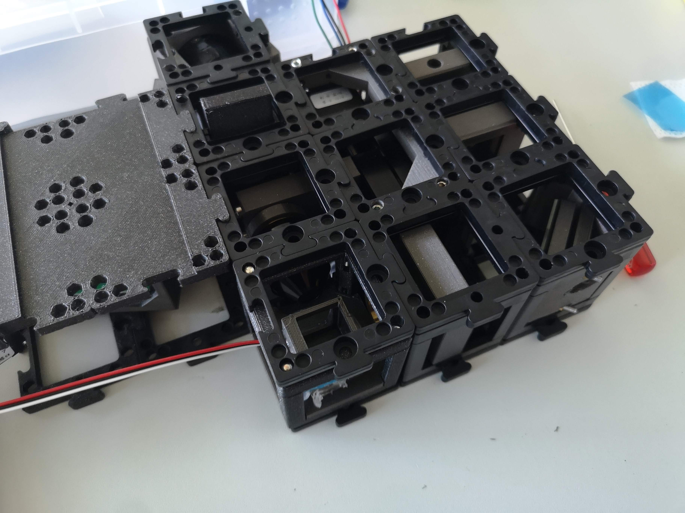


Achieving precise alignment between the light-sheet and the objective lens's focus plane is critical for obtaining accurate imaging results. This protocol provides a systematic approach to optimizing your light-sheet microscope setup. For further assistance or questions, feel free to reach out to our community and support channels. Your engagement contributes to the ongoing refinement of the openUC2 light-sheet microscope system.

## Finding the the focus (waiste) of the light-sheet

To effectively align the light-sheet in your setup, it's crucial to follow these two key steps:

**Step 1: Centering the Sheet within the Field of View (FOV)**
1. Begin by ensuring that the waist of the light-sheet is positioned at the center of the microscope's field of view (FOV).
2. To achieve this, the cylindrical lens needs to be temporarily removed. Carefully release the lower puzzle pieces to detach the cylindrical lens cube.


3. With the cylindrical lens removed, a collimated beam should enter the back focal plane (BFP) of the illuminating objective lens.
4. Adjust the kinematic mirror to guide the round beam, approximately 10mm in diameter, into the center of the BFP of the illuminating objective lens. This alignment should be parallel to the optical axis.

**Step 2: Achieving Focus with the Detection Objective Lens**
1. Activate the camera, such as using Galaxy Viewer software that comes with the camera drivers, to observe the light-sheet's focus.
2. The fluorescently labeled region should now exhibit a focused beam, perceptible to the naked eye.
3. Initiate axial movement of the objective lens (Axis Z) using the online control website. You'll notice an increase in intensity at either the positive or negative direction until the light-sheet focus becomes visible within the field of view.

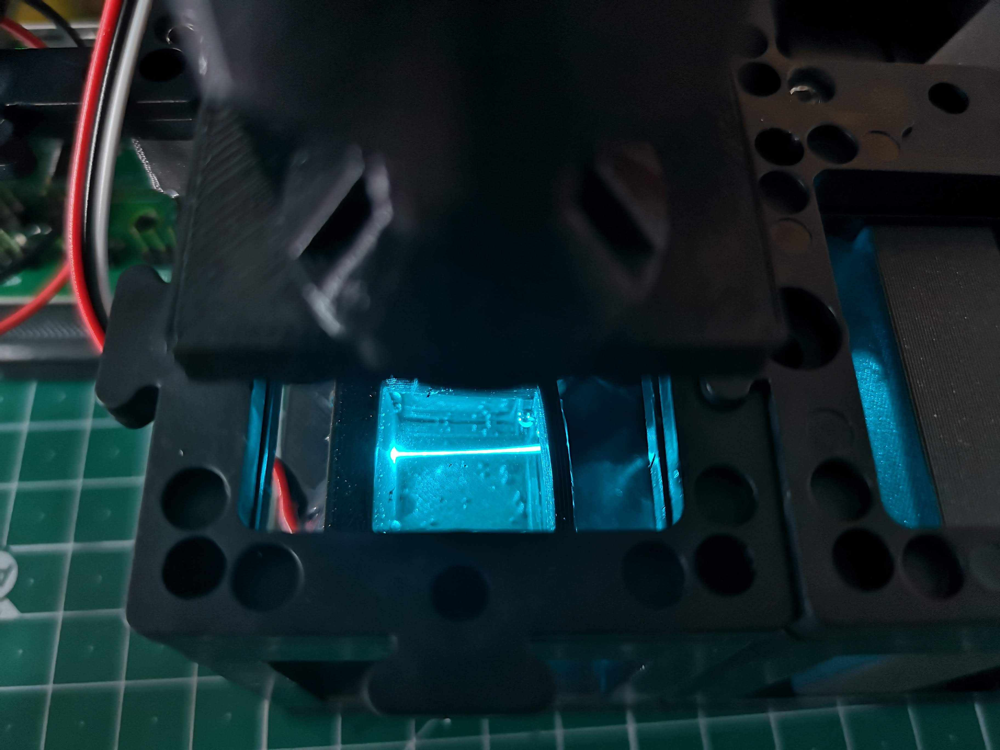

4. To optimize focus, make fine adjustments to the kinematic mirror to direct the light-sheet beam if it's positioned too high or too low.
5. It's common for the light-sheet's focus not to align precisely with the center of the FOV. In this case, carefully adjust the position of the illuminating objective lens along the cube axis to relocate the focus positions.
6. Once you're content with the alignment, deactivate the laser and reinsert the cylindrical lens.
7. Notably, this step doesn't need to be repeated each time the light-sheet is activated. The position of the cylindrical lens is relatively stable and doesn't require frequent recalibration.

Following these steps meticulously will ensure that the light-sheet is accurately aligned both within the FOV's center and in-focus with the detection objective lens. This alignment process is essential for obtaining reliable and high-quality imaging results with the openUC2 light-sheet microscope.

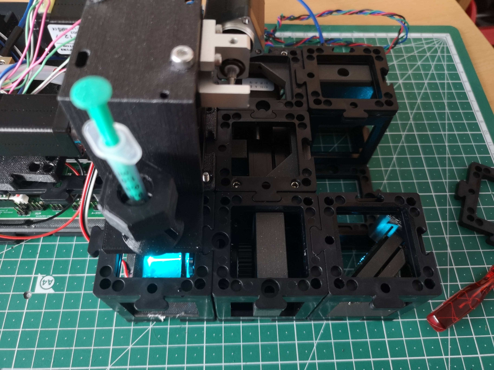

Once the cylindrical lens is back in, you can readjust the light-sheet wr.t. to the focus plane of the objective lens since they may be a slight variation after reassembly.


## Brightfield imaging

In case you want to image the sample in transmisson mode, turn on the Neopixel LED that is connected to the sample cube and optionally remove the fluorescent filter by pulling it up and store it somewhere safe (dust and scratch free!).


## Using the Fully Assembled Light-Sheet Microscope for Sample Imaging

Now that all components are meticulously aligned, the openUC2 light-sheet microscope is primed for sample imaging. Follow these steps to prepare and capture your fluorescent sample:

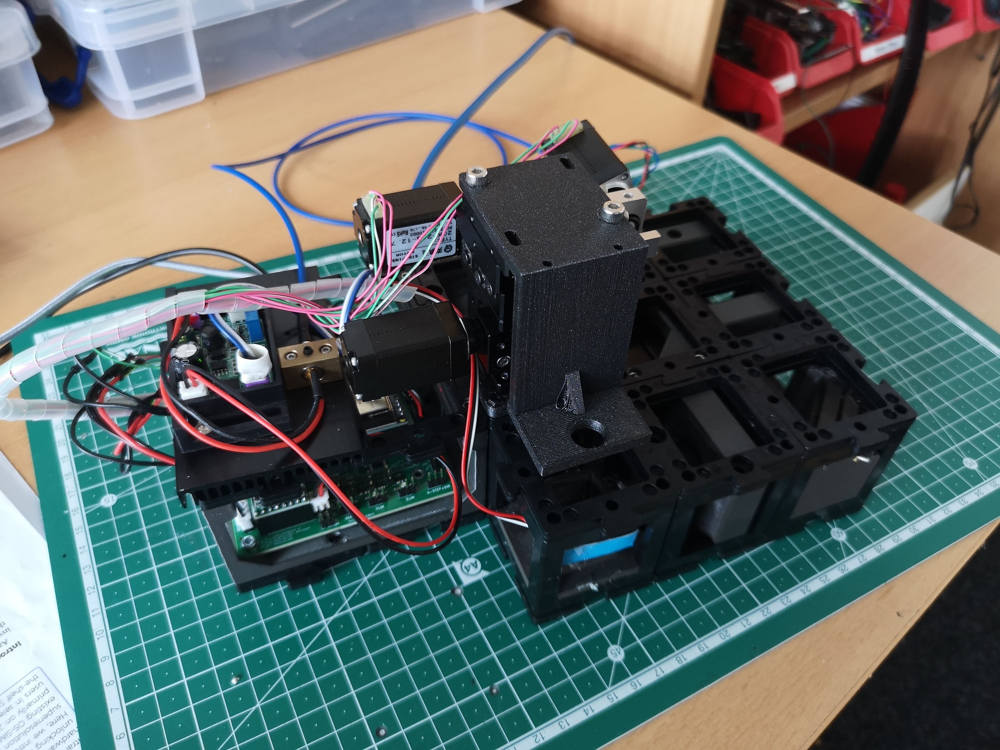

1. **Sample Preparation:**
   - Begin by preparing your fluorescent sample according to the specified protocols.
   - Carefully follow the steps outlined in the dedicated sample preparation section within this document.

2. **Assembling the Sample Holder:**
   - Loosen the nut that secures the syringe and insert the syringe into the sample holder.
   - Gradually lower the syringe so that the tip of the sample barely touches the light-sheet within the sample plane.


3. **Squeezing out the Agarose:**
   - Squeeze out the agarose gently from the syringe while observing the sample, starting with brightfield imaging.
   - Monitor the camera's image stream to ensure the sample becomes visible within the field of view.

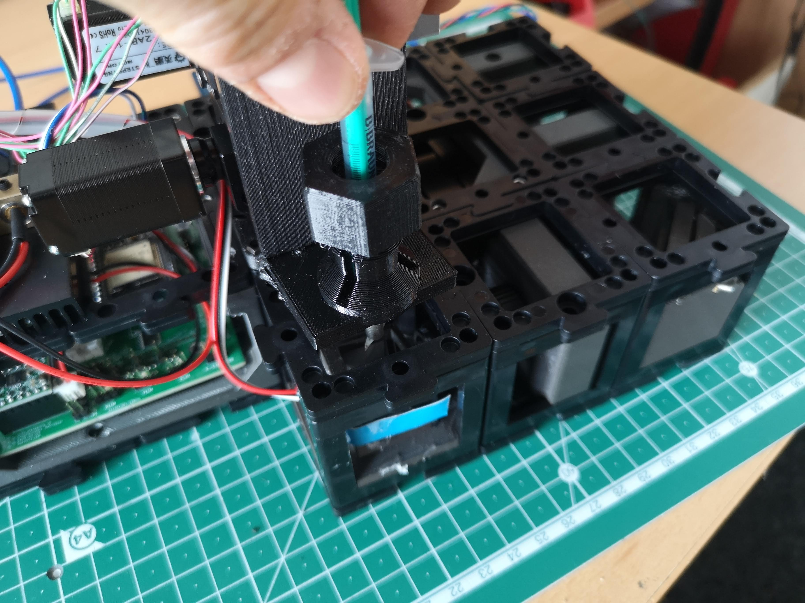

4. **Observing Brightfield Image:**
   - If the sample isn't immediately visible, confirm its positioning within the sample cube and make minor adjustments in XYZ to bring it into view on the camera screen.
   - Once visible in brightfield, deactivate the LED light source.

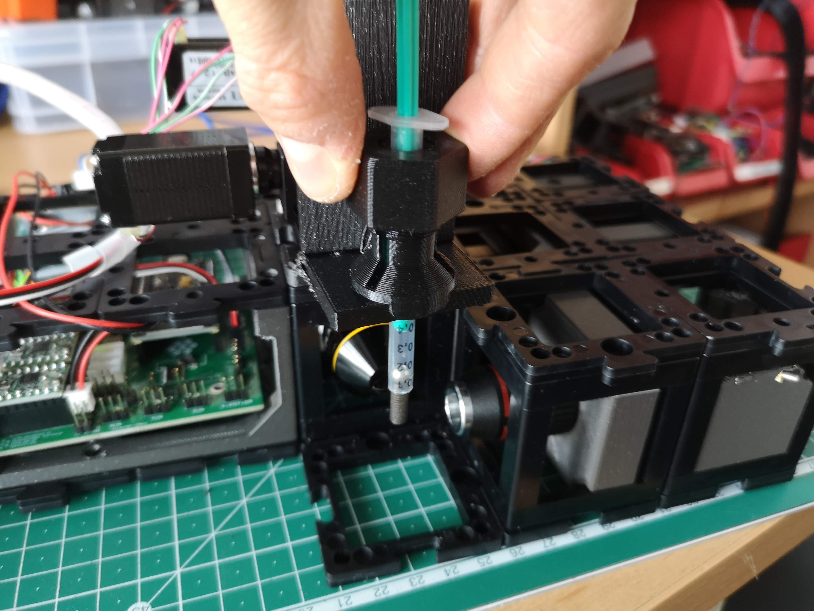

5. **Switching to Laser Illumination:**
   - Turn on the laser source, and initially, remove the fluorescent filter.
   - Adjust the imaging settings to enhance contrast and visibility, increasing intensity, exposure time, and/or camera gain until you obtain a clear, well-exposed image with minimal noise.

6. **Fine-tuning Laser Position:**
   - Using bright scattering as a guide, locate the laser's position while ensuring you have reinserted the fluorescent filter.
   - Adjust the intensity as needed.

7. **Sample Positioning:**
   - Manipulate the sample's position in XYZ space to center it on a region of interest.

8. **ImSwitch Scan and Reconstruction:**
   - Utilize ImSwitch software's scan and reconstruction plugin to perform scans of your sample.
   - The specific scan and reconstruction process details are provided in the ImSwitch documentation.

This completes the procedure for imaging your fluorescent sample using the fully assembled openUC2 light-sheet microscope. With careful preparation and precise adjustments, you can capture high-quality volumetric images that offer valuable insights into the structure and behavior of your sample. Your engagement with the microscope's capabilities contributes to ongoing advancements in microscopic research and exploration.


## ImSwitch data acquisition and Reconstruction

We assume the system is running and you were able to install ImSwitch on your computer. The configuration `JSON`file that describes the light-sheet system can be found further down this document. A tutorial on how to install our ImSwitch Version (SRC: https://github.com/openUC2/ImSwitch/) can be either found in the imSwitch repository or in the ImSwitch section in this wiki.

<iframe width="560" height="315" src="https://www.youtube.com/embed/N00-kKrRXX4" title="YouTube video player" frameborder="0" allow="accelerometer; autoplay; clipboard-write; encrypted-media; gyroscope; picture-in-picture; web-share" allowfullscreen></iframe>


## Mount the sample on a metal tip

Glue the sample on an M5 set screw using super glue or blutek (non-safe, sample can fall off). Insects offer a great level of fluorescent signal due to autofluorescence and act as nice training samples that can simply hang down using this method

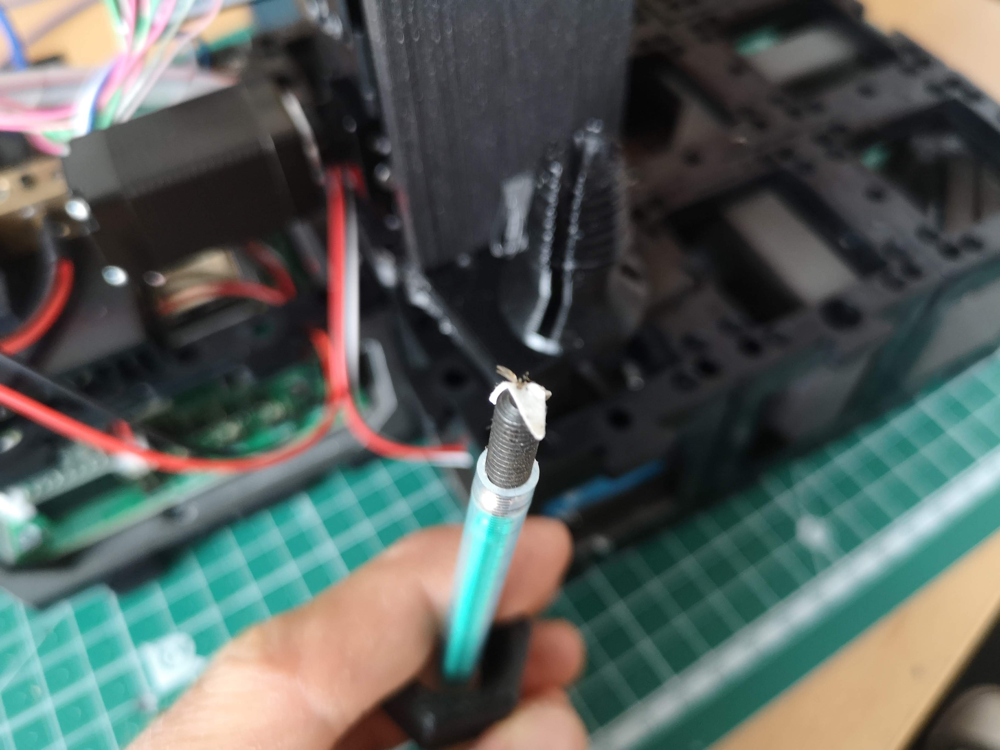


## Sample preparation á la agarose-in-syringe method

[SRC](https://hcbi.fas.harvard.edu/files/lightsheetz1_sample-preparation_zeiss.pdf)
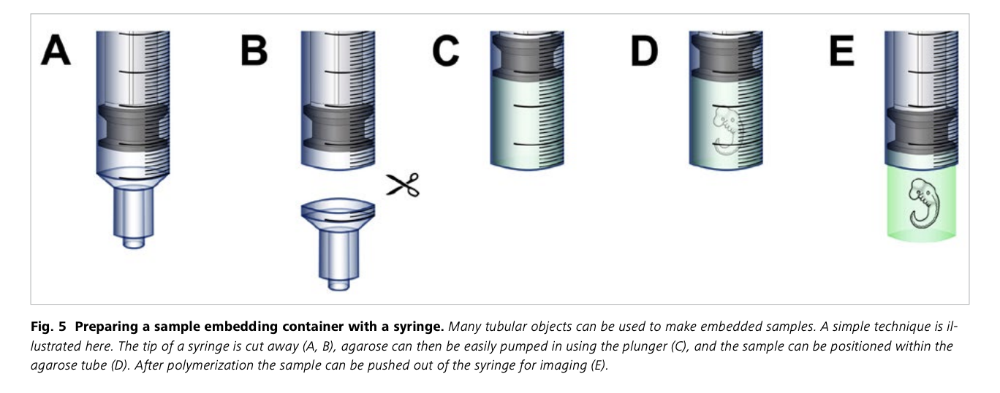


**Sample Preparation Protocol for openUC2 Light-Sheet Microscope Imaging: Fluorescently Labeled Zebrafish**

This simplified protocol outlines the steps to prepare a fluorescently labeled zebrafish sample for imaging using the openUC2 light-sheet microscope. This method involves embedding the sample in an agarose cylinder for stable imaging in an aqueous environment. the "aquarium" or water-filled sample chamber is used to do refractive index matching as the sample would scatter too much light otherwise.

**Materials Required:**
- 1.5% Agar
- Glass capillary
- Zebrafish embryo (some other volumetric, mostly clear sample that can be excited at 488nm)
- Sample medium
- Falcon tube or small beaker
- syringe or FEP tube (optional, for increased stability)

**Procedure:**

**Mounting in Free-Hanging Agarose Cylinder:**

0. Take the syringe and cut away the tip
1. Melt 1.5% agar at 70ºC and maintain it at 37ºC.
2. Insert the plunger into the syringe capillary, ensuring the white end barely protrudes and suck in enough agarose
3. Gently place the zebrafish embryo into the already solidified agarose, minimizing the water content.
4. Pull the plunger to draw up about 3cm (1 inch) of melted agarose.
5. Carefully position the sample close to the capillary's end.
6. Allow the agarose to set for 1-2 minutes.
7. When ready to image, gently push the plunger down to extrude the agarose cylinder with the sample, placing it just outside the capillary for imaging.


## Further tweaks for the system

These steps are not necessary, but help you to customize the microscope to better match your sample configuration.

- Further information can be found in the Zeiss Z1 sample prepration protocol: https://hcbi.fas.harvard.edu/files/lightsheetz1_sample-preparation_zeiss.pdf
- or here: https://huiskenlab.com/sample-mounting/


### Remove the xyz stage from the top

In case you want to do maintenance on the microscope, the xyz stage can easily be removed by releasing the M3x55mm screws from the bottom part. Therfore, remove the puzzle piece that has be mounted below the objective lens and release the 3 screws that mount the stage plate to the uppoer part of the microscope. You can now release the stage. In order to move it back on, do the reverse process.


### Swap the sample mounting plate

In principle the XYZ stage can mount any sample geometry. We wanted to start with something and adapted the common syringe mount. Only two screws from below have to be released in order to swap the sample mount plate:

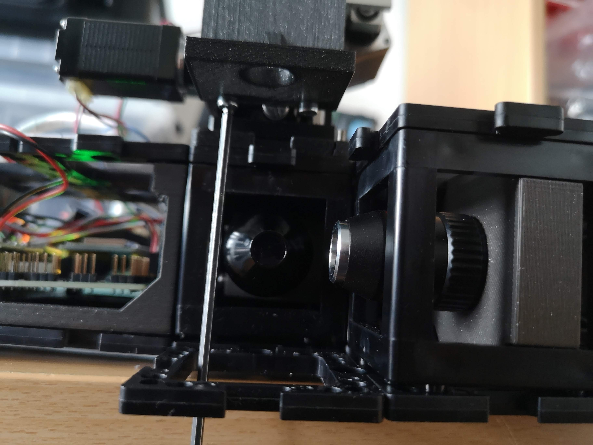

This part can be customized to adapt e.g. conventional sample slides

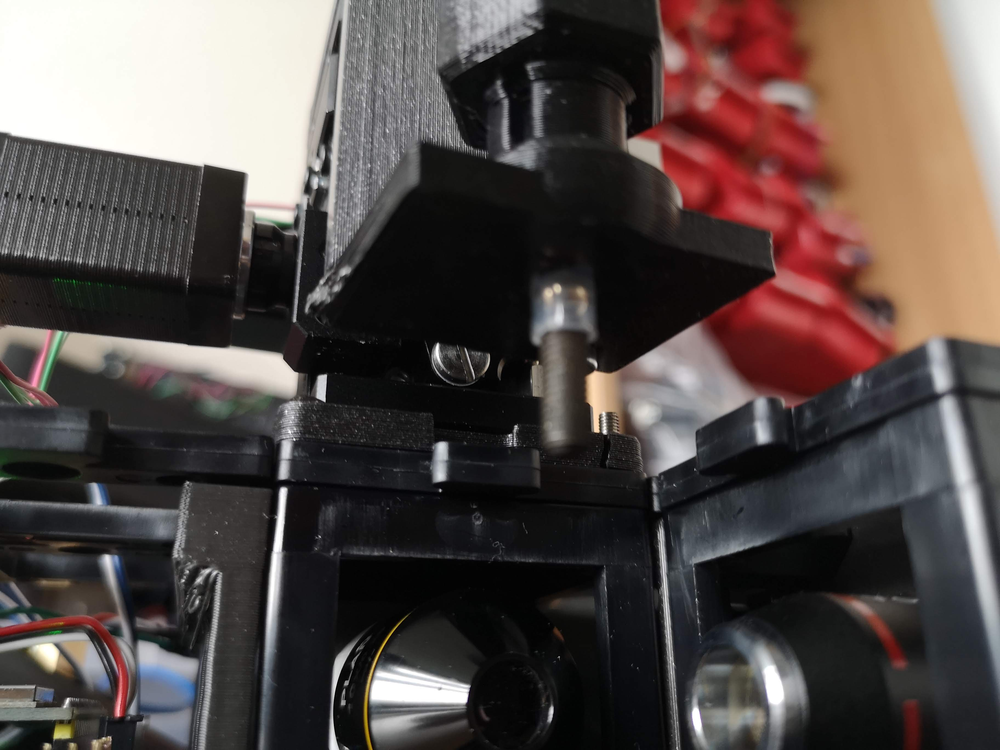


## ImSwitch configuration for the ligth-sheet

```json
{
  "positioners": {
    "ESP32Stage": {
      "managerName": "ESP32StageManager",
      "managerProperties": {
        "rs232device": "ESP32",
        "enableauto": 0,
        "isEnable": 1
      },
      "axes": [
        "X",
        "Y",
        "Z",
        "A"
      ],
      "forScanning": true,
      "forPositioning": true
    }
  },
  "rs232devices": {
    "ESP32": {
      "managerName": "ESP32Manager",
      "managerProperties": {
        "host_": "192.168.43.129",
        "serialport_": "COM3",
        "serialport": "/dev/cu.usbserial-A50285BI"
      }
    }
  },
  "lasers": {
    "488 Laser": {
      "analogChannel": null,
      "digitalLine": null,
      "managerName": "ESP32LEDLaserManager",
      "managerProperties": {
        "rs232device": "ESP32",
        "channel_index":1,
        "filter_change": false,
        "laser_despeckle_period": 10,
        "laser_despeckle_amplitude": 0
      },
      "wavelength": 488,
      "valueRangeMin": 0,
      "valueRangeMax": 1024
    },
    "LED Matrix": {
      "analogChannel": null,
      "digitalLine": null,
      "managerName": "ESP32LEDLaserManager",
      "managerProperties": {
        "rs232device": "ESP32",
        "channel_index": "LED",
        "filter_change": false,
        "filter_axis": 3,
        "filter_position": 32000,
        "filter_position_init": -0
      },
      "wavelength": 635,
      "valueRangeMin": 0,
      "valueRangeMax": 255
    }
  },
  "detectors": {
    "WidefieldCamera": {
      "ExtPackage": "imswitch_det_webcam",
      "analogChannel": null,
      "digitalLine": null,
      "managerName": "GXPIPYManager",
      "managerProperties": {
        "cameraListIndex": 1,
        "gxipycam": {
          "exposure": 20,
          "gain": 0,
          "blacklevel": 10,
          "image_width": 1000,
          "image_height": 1000
        }
      },
      "forAcquisition": true,
      "forFocusLock": true
    }
    },
  "rois": {
    "Full chip": {
      "x": 600,
      "y": 600,
      "w": 1200,
      "h": 1200
    }
  },
  "LEDMatrixs": {
    "ESP32 LEDMatrix": {
      "analogChannel": null,
      "digitalLine": null,
      "managerName": "ESP32LEDMatrixManager",
      "managerProperties": {
        "rs232device": "ESP32",
        "Nx": 4,
        "Ny": 4
      },
      "wavelength": 488,
      "valueRangeMin": 0,
      "valueRangeMax": 32768
    }
  },
  "autofocus": {
    "camera": "WidefieldCamera",
    "positioner": "ESP32Stage",
    "updateFreq": 10,
    "frameCropx": 780,
    "frameCropy": 400,
    "frameCropw": 500,
    "frameCroph": 100
  },
  "uc2Config": {
    "defaultConfig": "pindefWemos.json",
    "defaultConfig2": "pindefUC2Standalon2.json",
    "defaultConfig1": "pindefUC2Standalon.json"
  },
  "mct": {
    "monitorIdx": 2,
    "width": 1080,
    "height": 1920,
    "wavelength": 0,
    "pixelSize": 0,
    "angleMount": 0,
    "patternsDirWin": "C:\\Users\\wanghaoran\\Documents\\ImSwitchConfig\\imcontrol_slm\\488\\",
    "patternsDir": "/users/bene/ImSwitchConfig/imcontrol_sim/488"
  },
  "dpc": {
    "wavelength": 0.53,
    "pixelsize": 0.2,
    "NA":0.3,
    "NAi": 0.3,
    "n": 1.0,
    "rotations": [0, 180, 90, 270]
  },
  "webrtc":{},
  "PixelCalibration": {},
  "availableWidgets": [
    "Settings",
    "Positioner",
    "View",
    "Recording",
    "Image",
    "Laser",
    "UC2Config",
    "Joystick",
    "Lightsheet",
    "LEDMatrix"
  ],
  "nonAvailableWidgets":[
    "STORMRecon",
    "LEDMatrix",
    "MCT",

    "ImSwitchServer",
    "PixelCalibration",
    "Hypha",
    "FocusLock",
    "HistoScan",

    "FocusLock"]
}
```
