## Workshop Manual: Building a Michelson Interferometer using UC2

In this workshop, we will construct a Michelson Interferometer using the UC2 modular microscope toolbox. The Michelson Interferometer is a device that measures the interference properties of light. We will treat light as a wave, with a very high frequency, and use it to perform interesting experiments.

### Materials Needed

1. Green Laser Pointer with a relatively high temporal coherence.
2. Lenses for beam expansion.
3. Beam splitter plate or cube with a partially reflective mirror coating.
4. Three mirrors.
5. Screen or camera sensor (e.g., ESP32 camera module) with USB cable.
6. UC2 Modular Microscope Toolbox (cubes, puzzle pieces, and holders).

### Theory of Operation

A Michelson Interferometer splits a laser beam into two equal parts using a beam splitter. The two beams are then reflected by mirrors and recombined to interfere with each other. When the paths of the two beams are equal, they constructively interfere, resulting in a bright output. However, if one path is shifted by 1/4 of the wavelength, the beams destructively interfere, resulting in a dark output.
Certainly! Let's delve into more theoretical background about interference and how the Michelson Interferometer was historically used to measure the speed of light.

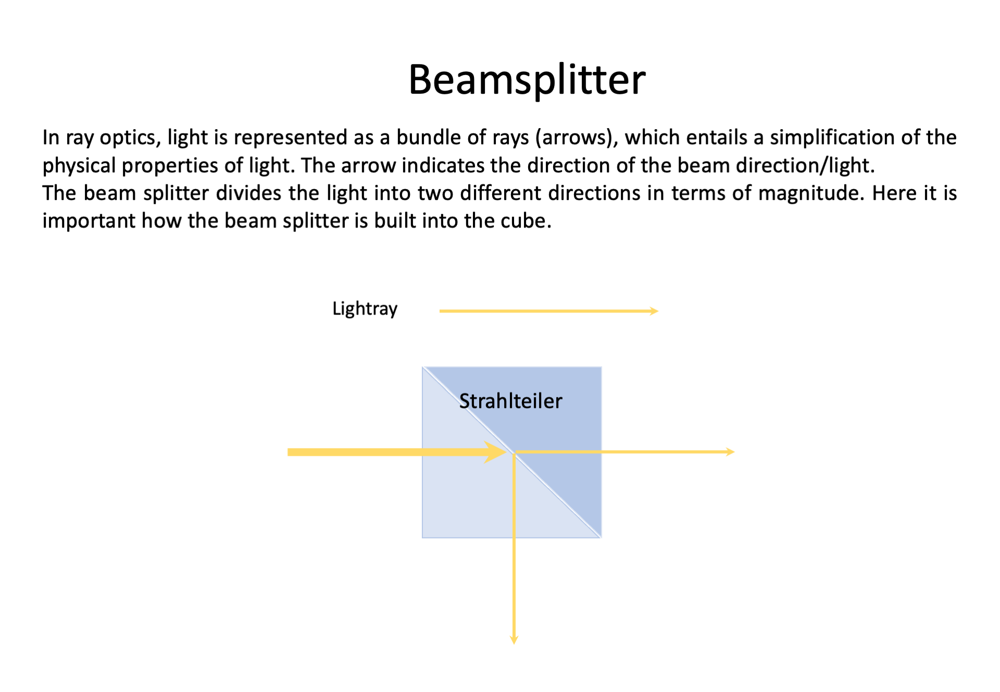

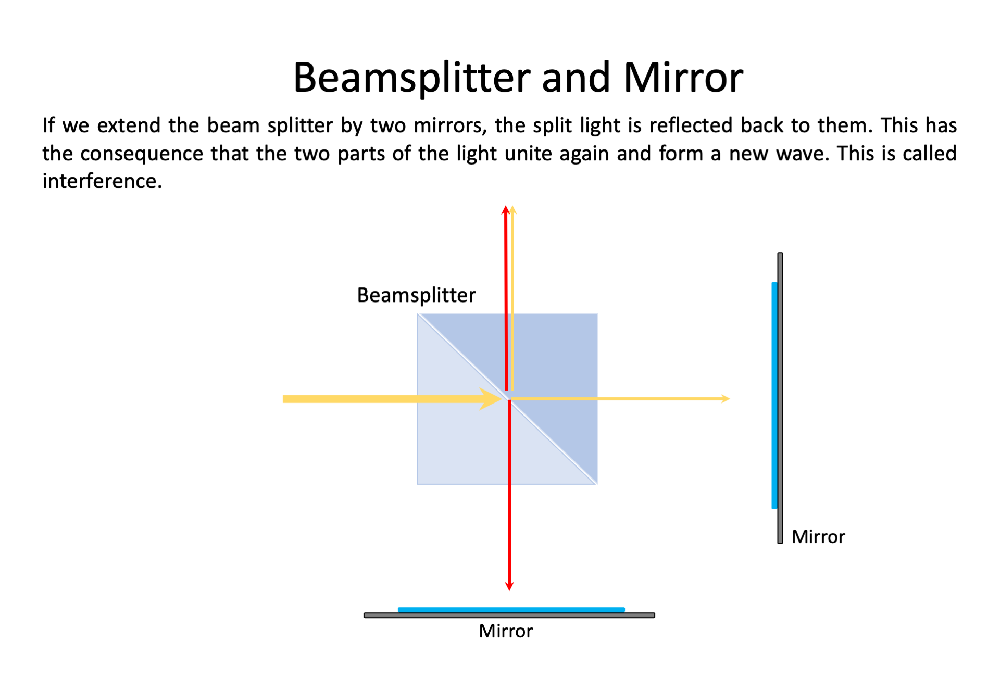

## Theoretical Background: Interference

Interference is a phenomenon that occurs when two or more waves overlap in space and combine their amplitudes. When the waves are in-phase (their crests and troughs align), they constructively interfere, resulting in a larger amplitude. On the other hand, if they are out of phase (their crests and troughs are misaligned), they destructively interfere, resulting in a smaller or zero amplitude. Interference is a fundamental concept in wave physics and plays a crucial role in understanding the behavior of light.

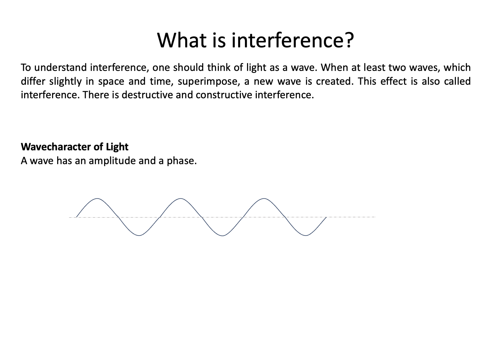

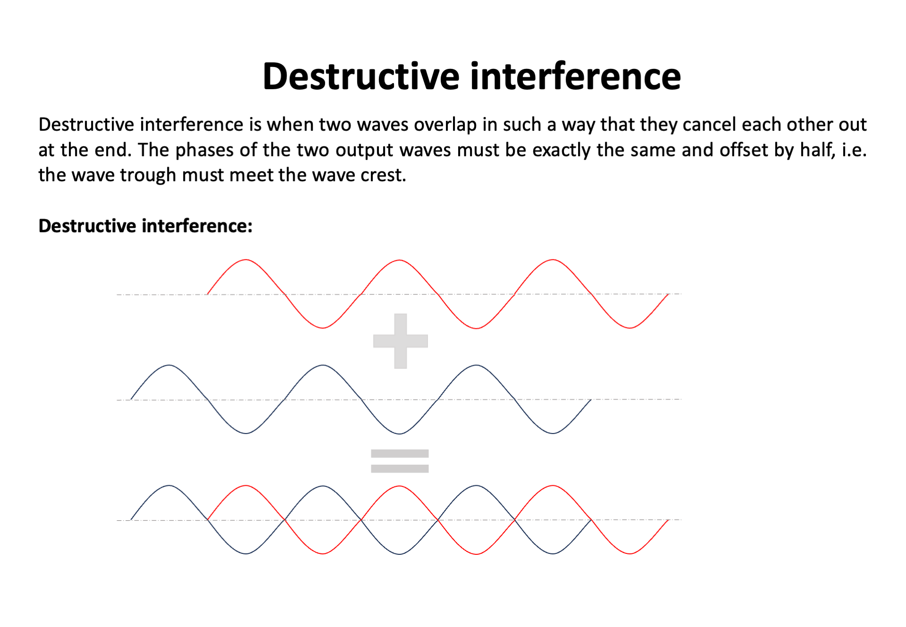

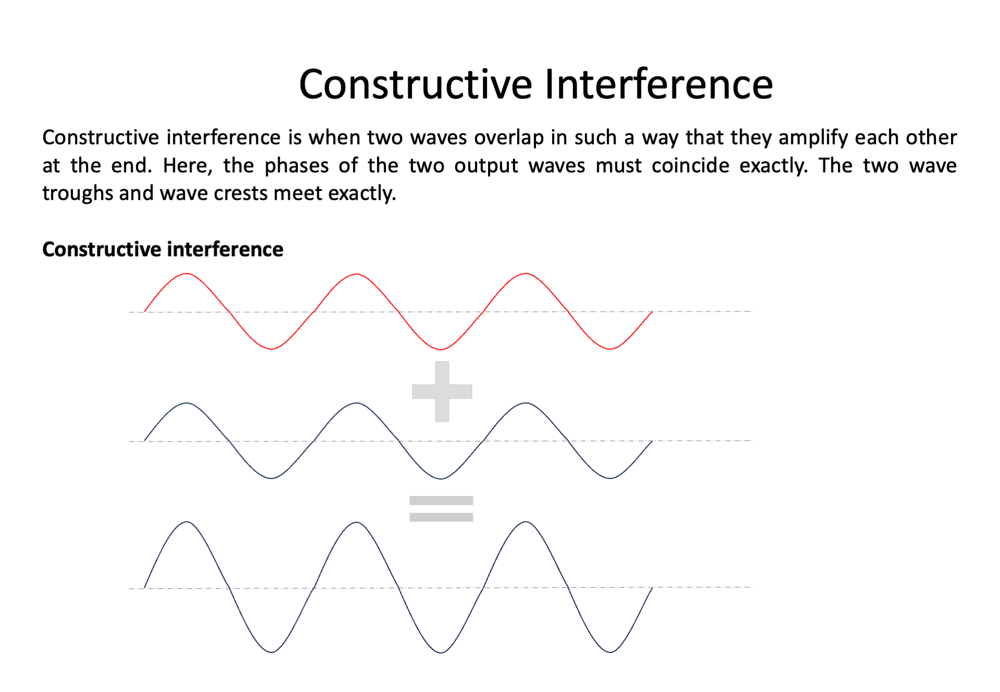

## Michelson Interferometer and Measurement of the Speed of Light

The Michelson Interferometer, invented by Albert A. Michelson in the late 19th century, is a classic optical device that exploits the principles of interference to measure various optical properties, including the speed of light.

In the Michelson Interferometer setup, a light beam is split into two equal parts using a beam splitter. One part is directed towards a stationary mirror (the reference mirror) while the other part is directed towards a movable mirror (the sample mirror). The two beams are then reflected back towards the beam splitter, and they recombine. Depending on the path difference between the two beams, they may interfere constructively or destructively.

By moving the sample mirror, the path difference between the two beams changes. When the path difference corresponds to an integral number of wavelengths (constructive interference), the interference pattern exhibits bright fringes. Conversely, when the path difference corresponds to a half-integral number of wavelengths (destructive interference), the pattern exhibits dark fringes.

The key to measuring the speed of light with the Michelson Interferometer lies in precisely measuring the movement of the sample mirror. As the mirror is displaced, the fringe pattern shifts, and by measuring this shift, we can determine the change in path difference and, consequently, the speed of light.

Michelson used this interferometer in an elegant experiment to measure the speed of light by comparing the time it took for light to travel in two perpendicular directions. This famous experiment was performed in 1879 and yielded a remarkably accurate value for the speed of light.

The Michelson Interferometer remains an essential tool in modern optics and has found applications in diverse fields, including astronomy, spectroscopy, and interferometric microscopy.

Interference is a fundamental concept in wave physics, and the Michelson Interferometer is a classic optical device that exploits this phenomenon to make precise measurements. By understanding the principles of interference and the working of the Michelson Interferometer, we gain valuable insights into the nature of light and its behavior in different optical setups. It stands as a testament to the ingenuity of scientific instruments and continues to play a significant role in advancing our understanding of the physical world.

## Tutorial: Michelson Interferometer

### Materials needed:

- Laser diode
- Hikrobot Camera (MV-CE060-10UC) with USB cable ([Hikrobot Camera Software installation](Camera_Software_tutorial.md))
- Stage with gear with mirror
- Three kinematic mirrors (in cubes)
- Beam splitter in cube
- Sample holder (in cube)
- One empty cube
- 16 base plates
- Screen
- Pinhole in cube
- Screwdriver to adjust alignment (1,5x60)

### Diagram:

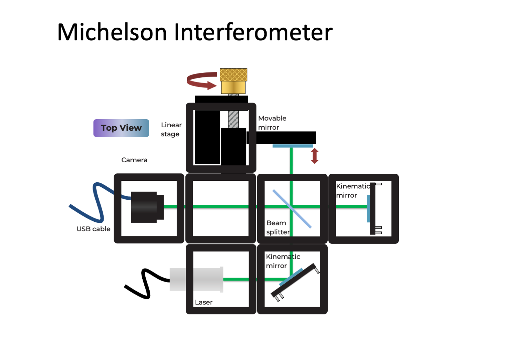

### Instructions for assembling the Michelson's Interferometer:

**Step 1: Build a four base plate**

Build a four base plate as shown. This will be used to connect the laser diode, pinhole, the beamsplitter, and an empty cube. Add the base plates to fix them.

*Note: At this point the laser diode should be turned off the whole time. Don't look at the laser directly. Always use screens to look for the laser light.*

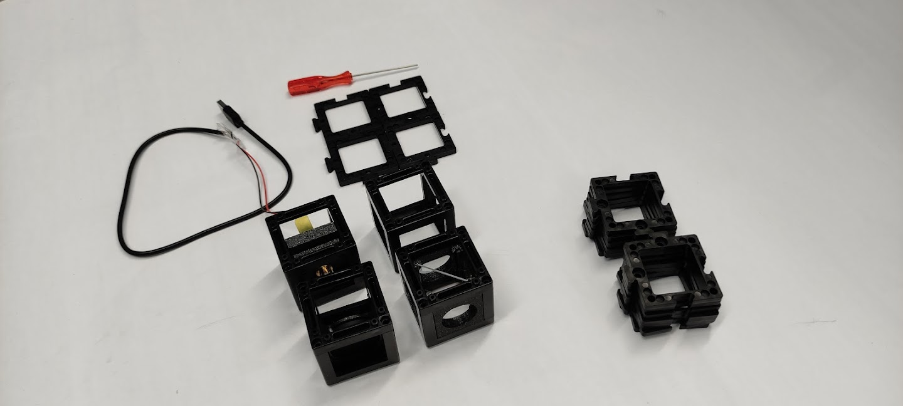
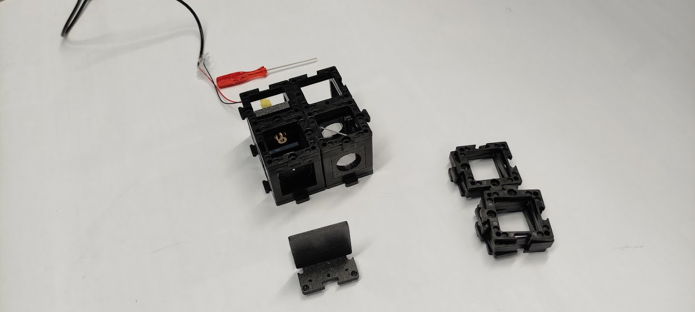

**Step 2: Place the pinhole**

Place the pinhole such that it is as far as possible to the laser diode.

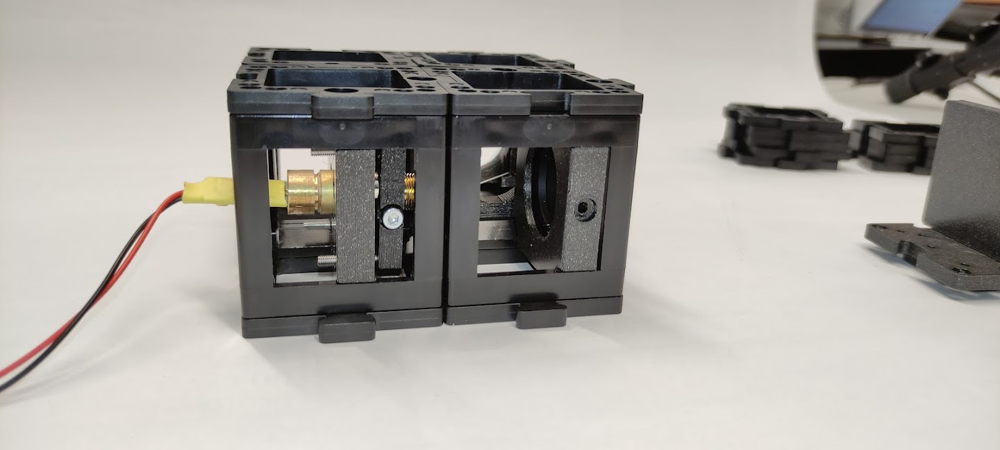

**Step 3: Close the diaphragm**

Close the diaphragm as much as possible to end up with a small hole.

**Step 4: Place the screen and align the laser**

Place the screen after the pinhole and turn the laser on. The alignment is most likely off. So to align the laser you should use the screwdriver and adjust the laser mount screws so that the beam is centered on the pinhole. Turn the laser off.

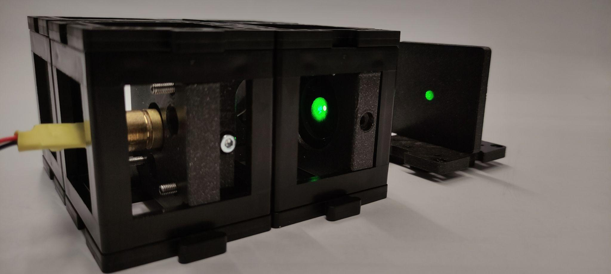

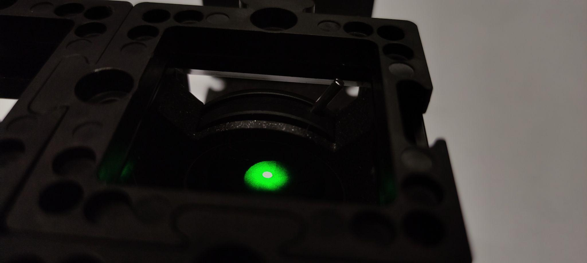

**Step 5: Replace the pinhole with a kinematic mirror**

Without touching the screws of the laser, remove the pinhole from the group of cubes and add a kinematic mirror instead.

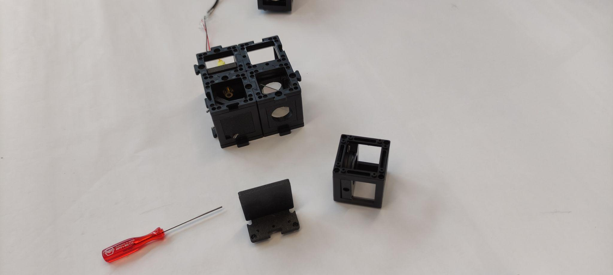
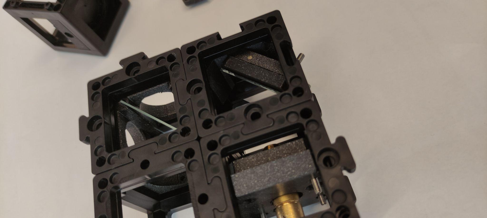

**Step 6: Align the beam with the pinhole**

Using the top and bottom base plates, place the pinhole after the beamsplitter connecting the pinhole and the kinematic mirror in a straight line. Place the screen after the pinhole, turn the laser on and align the beam to the center of the pinhole as shown. Turn the laser off.

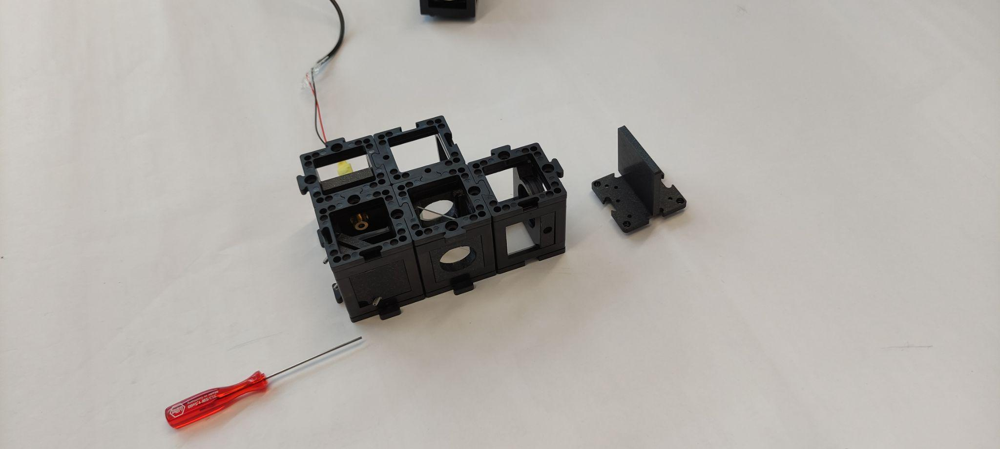
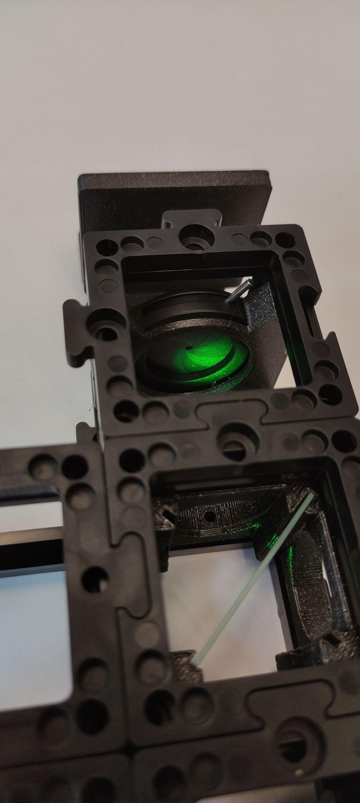

**Step 7: Set the Michelson interferometer arms**

Remove the pinhole and set other base plates as shown. These are the variable and reference arms of the Michelson interferometer. Place the reference and movable mirrors as shown. Place the pinhole in the detection spot. Fix everything with base plates.

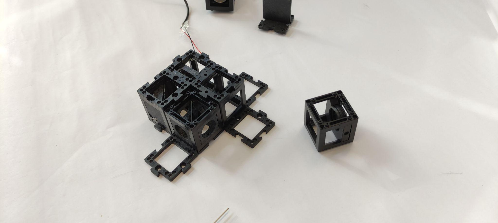
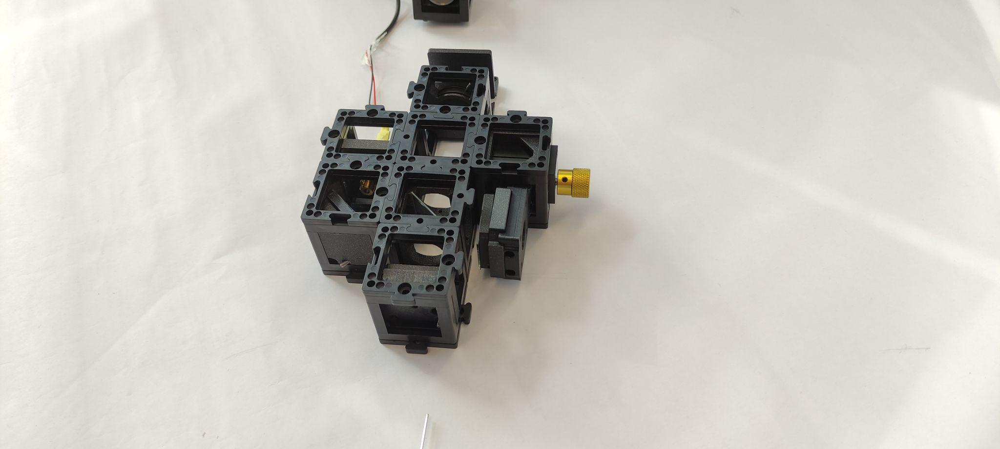

**Step 8: Align and observe the interference**

Place the screen after the pinhole, turn the laser on. You will see two beam spots, one from each mirror. Adjust the movable mirror angles with the screwdriver so that you can see an improvement in brightness of one of the spots and look for the maximum.

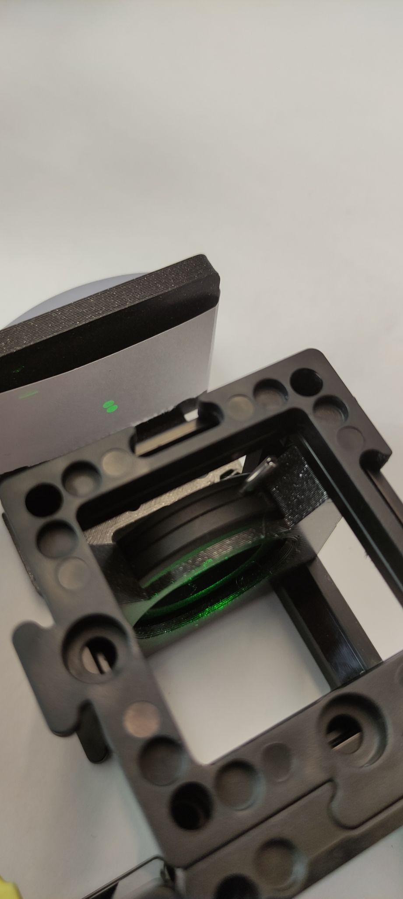
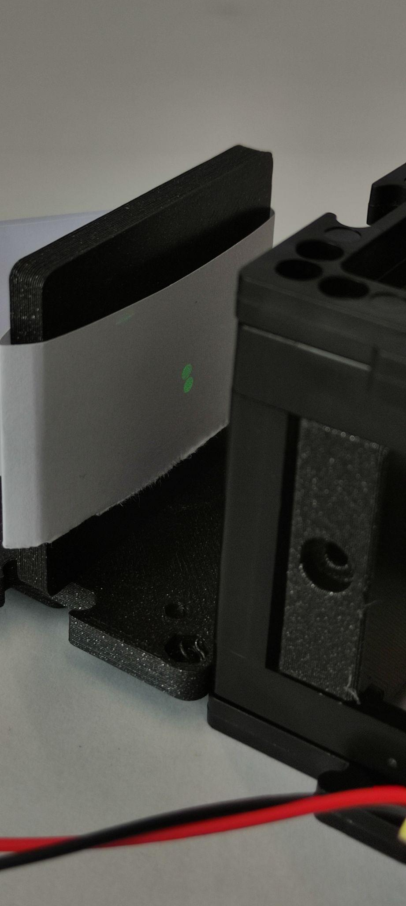

**Step 9: Adjust the reference mirror**

Adjust the screws of the reference mirror so that the two beams overlap as much as possible.

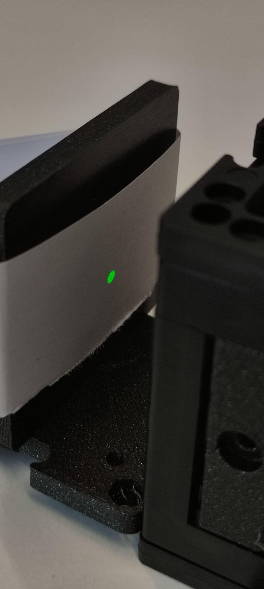

**Step 10: Observe the interference pattern**

Remove the pinhole and place the screen only. You will see two extended beams. Adjust the reference mirror screws to overlap the beams perfectly. You will see the interference pattern emerging. Then try to center the pattern on the screen. Turn the laser off.

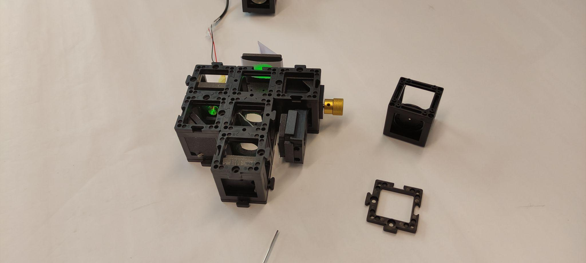

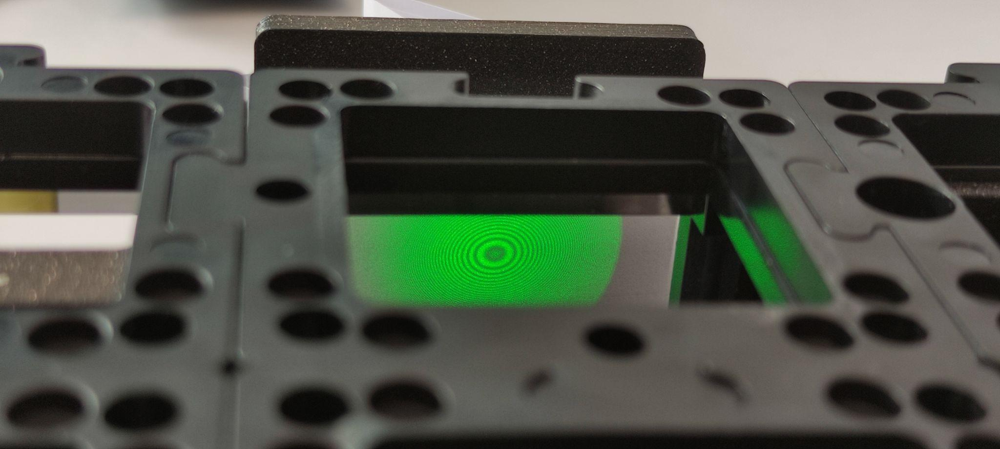

**Step 11: Set up the camera**

Place the camera and fix it with the base plates. Connect it to the computer and open the MV Software. To check the MVS tutorial click ([here](Camera_Software_tutorial.md)).

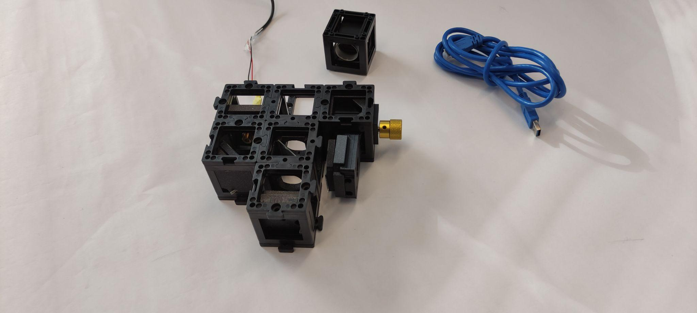
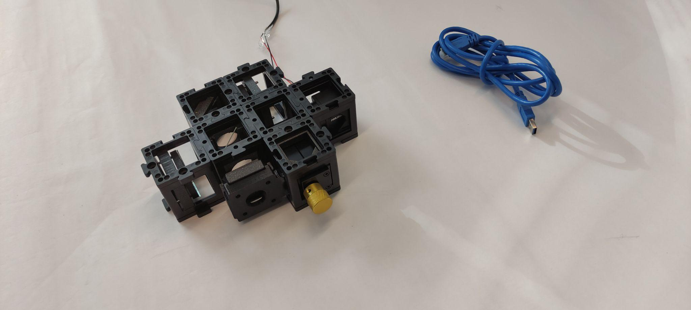

**Step 12: Adjust the camera exposure**

Adjust the exposure time of the camera. You should see a fringe pattern. Try to adjust the reference mirror screws finely to bring the center of the interference pattern to the center of the camera.

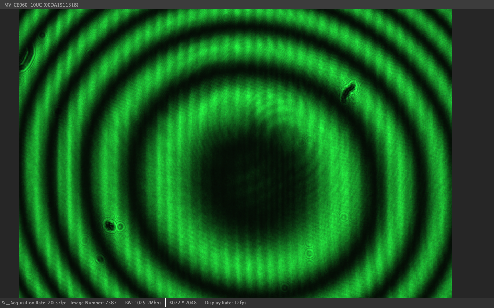

## Experimental Data

This is the fully assembled UC2 interferometer with a green laser diode, a camera representing a scree and to digitize the inteference, a beamsplitter, a kinematic mirror and a mirror that can be translated along Z.

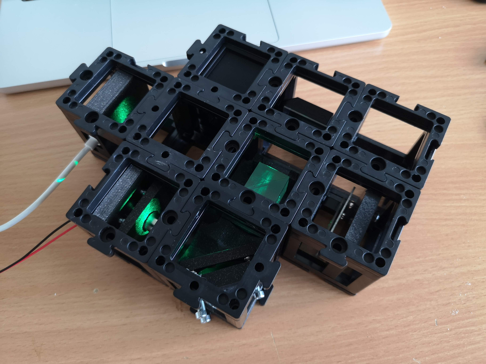

If you bring the two beams on top of each other, you will be able to observe the interference pattern, which in case of one beam exactly overlaying the other will be a ring pattern. These rings are also called Newton rings and come from the fact that we interfere two divergent beams, leading to a super position of two spherical caps/waves.

Using the ESP32 camera, we can quantify the motion of the beams and e.g. measure distances or angles.

### Conclusion

Congratulations! You have successfully built a Michelson Interferometer using the UC2 modular microscope toolbox. This device allows you to explore the interference properties of light and perform fascinating experiments. As you move one of the arms, you will observe constructive and destructive interference patterns on the camera, demonstrating the wave-like nature of light. Have fun experimenting with different setups and learning more about the wave-particle duality of light!
