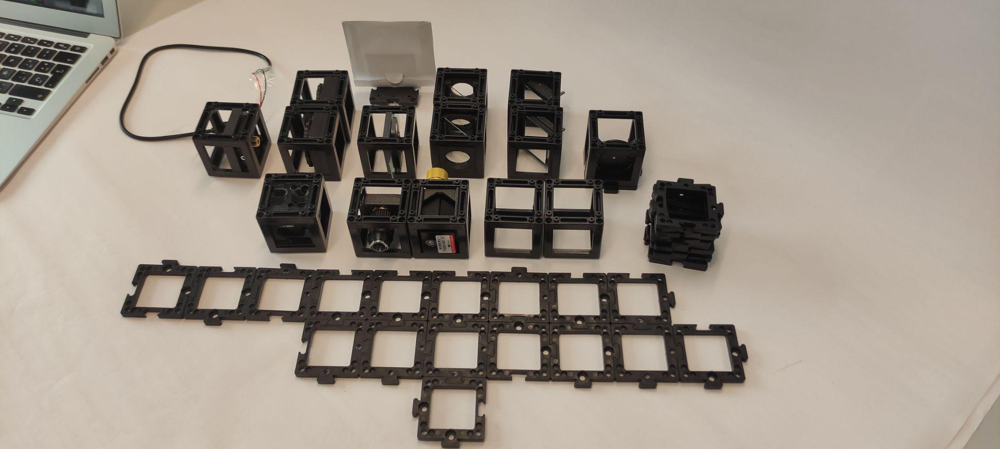
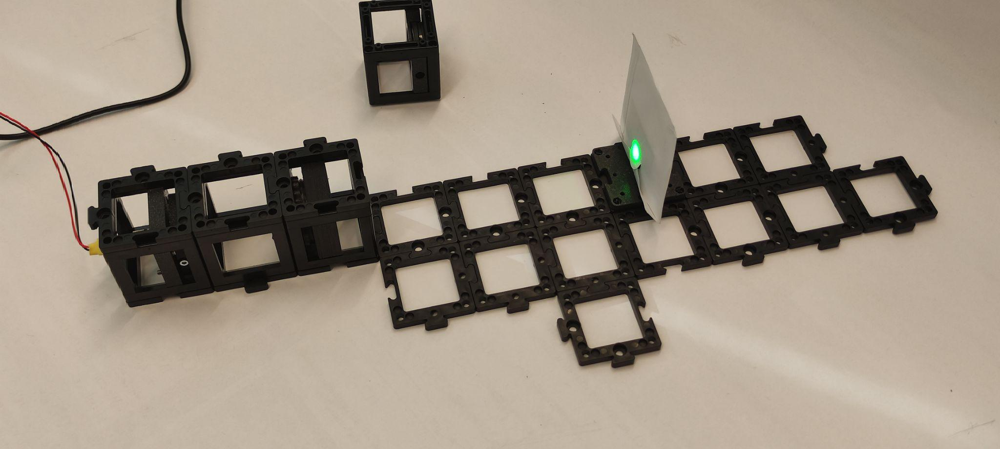
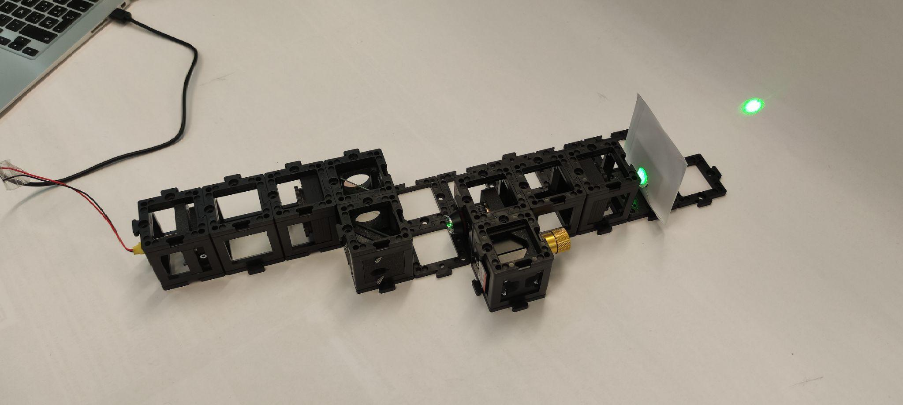
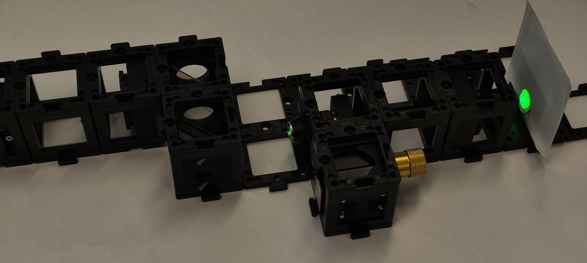
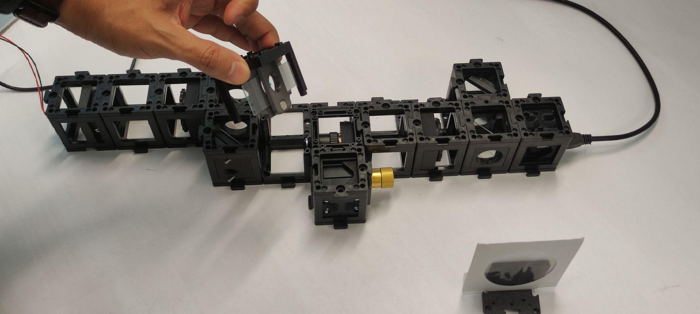
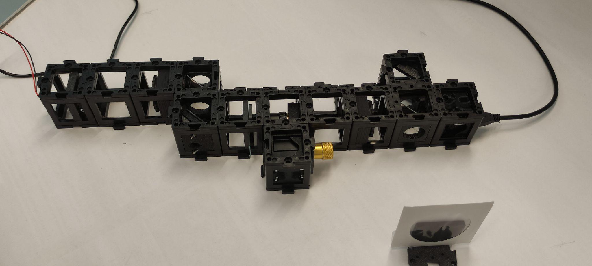
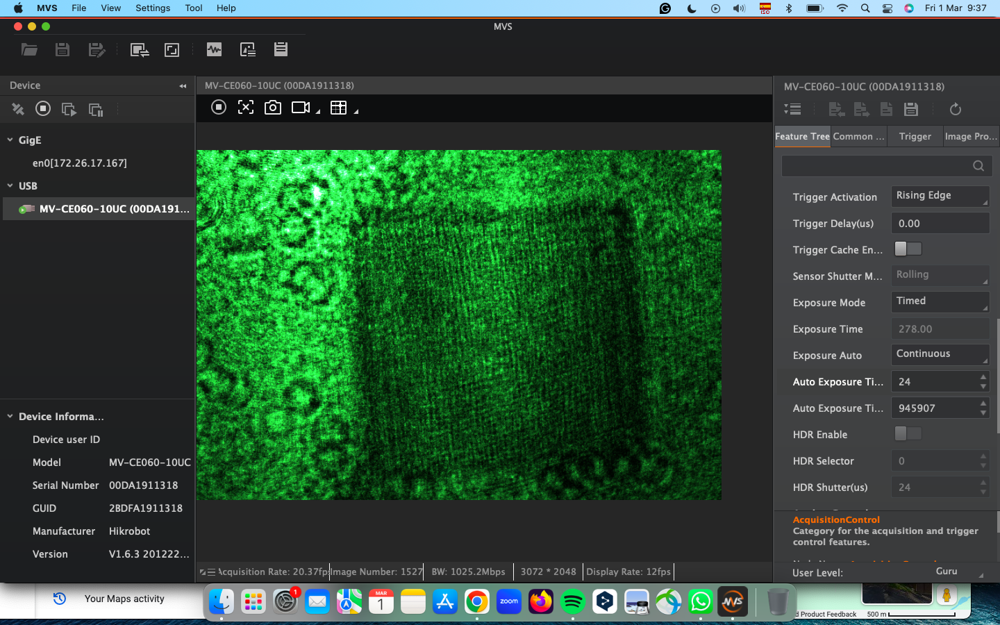

/IMAGES/---
id: MachZenderInterferometer
title: openUC2 Mach-Zehnder Interferometer
---

# The Mach-Zehnder Interferometer: Precision Microscopy Through Light Interference

## Learning Objectives

By the end of this experiment, you will be able to:
- Understand how the Mach-Zehnder interferometer differs from the Michelson design
- Explain how interference can be used for microscopic imaging
- Build and operate a Mach-Zehnder interferometer for sample analysis
- Interpret interference patterns to reveal information about transparent samples
- Appreciate applications in modern microscopy and optical testing

## Key Concepts

- **Split-beam interferometry**: Using two separate beam paths that never overlap until the final detector
- **Reference and sample arms**: One beam passes through your sample, the other serves as a comparison
- **Phase imaging**: Detecting changes in optical path length to reveal sample properties
- **Collimated light**: Parallel light rays that enable high-quality interference
- **Quantitative phase microscopy**: Measuring how samples change the phase of light

## What is a Mach-Zehnder Interferometer?

The Mach-Zehnder interferometer is like the Michelson's "younger sibling" with a key difference: instead of reflecting both beams back to interfere at the same beam splitter, it uses **two beam splitters** to create a path where the beams travel separately and only combine at the detector.

Think of it like two friends walking different routes to school and meeting at the end - you can tell which route was longer by seeing if they arrive at the same time! Similarly, this interferometer can detect if your sample slowed down or sped up the light passing through it.

### Why Choose Mach-Zehnder?

This design is perfect for examining **transparent samples** like:
- Glass slides with different thicknesses
- Water droplets  
- Biological cells
- Optical components

Unlike the Michelson interferometer that's great for precision distance measurements, the Mach-Zehnder excels at **comparing** how light behaves in different materials.

## The Physics Behind the Magic

### How Light Reveals Hidden Information

When light passes through different materials, two things can happen:
1. **Absorption**: Some light gets absorbed (makes things look darker)
2. **Phase change**: The light slows down or speeds up, changing its "timing"

Your eyes can see absorption easily, but phase changes are invisible - until we use interferometry! The Mach-Zehnder interferometer makes these invisible phase changes visible as brightness patterns.

### Understanding Phase

Imagine two identical clocks that started ticking at exactly the same time:
- If one clock runs slightly slower, after an hour they'll show different times
- The "phase difference" is how far apart their times have drifted

Light waves work the same way. When light passes through glass or water, it "runs slower" than light traveling through air. The interferometer compares these "clocks" to reveal what the light encountered on its journey.

### The Two-Beam Path Advantage

Unlike the Michelson design where both beams use the same beam splitter:
- **Reference arm**: Light travels through air (or empty space)
- **Sample arm**: Light passes through your specimen
- **Independent paths**: No risk of the beams affecting each other until the final measurement
- **Better contrast**: Cleaner separation leads to sharper interference patterns

## Understanding the Setup

### Basic Mach-Zehnder Configuration

This diagram shows the fundamental layout:
1. **Laser source** provides coherent light
2. **First beam splitter** divides the beam into two paths
3. **Reference arm** (top): Light travels through air
4. **Sample arm** (bottom): Light passes through your specimen  
5. **Second beam splitter** recombines the beams
6. **Detector** records the interference pattern

### Advanced Setup for Microscopy

For high-resolution imaging, we add:
- **Objective lens** to magnify the sample
- **Collimating optics** to create parallel light rays
- **Precise positioning systems** for the sample

## Materials and Safety

### Essential Components Checklist:
- **Laser diode** (green, ~532nm wavelength)
- **Hikrobot Camera** (MV-CE060-10UC) with USB cable
- **Small positioning stage** with gear mechanism
- **Two kinematic mirrors** in cubes for beam steering
- **Two beam splitter cubes** (this is the key difference from Michelson!)
- **Sample holder cube** for your specimens
- **Two empty cubes** for spacing and alignment
- **Multiple base plates** for building the framework
- **Screen** for initial alignment
- **Pinhole cube** for beam conditioning
- **Precision screwdriver** (1.5×60mm) for fine adjustments
- **Two 100mm converging lenses** for beam control

### Safety Reminders ⚠️
- **Laser safety**: Never look directly at the beam, always use screens
- **Keep laser OFF** during assembly unless specifically needed for alignment
- **Clean optics**: Handle lenses and mirrors carefully to avoid fingerprints
- **Stable setup**: Secure all components - even small vibrations affect the results

## Building Your Mach-Zehnder Interferometer

### Construction Strategy

Building a Mach-Zehnder interferometer requires more planning than the Michelson because we need to create two completely separate beam paths. Think of it as building two parallel "highways" for light that only connect at the beginning and end.

**Our approach:**
1. Create a stable base structure
2. Set up the laser and beam conditioning optics
3. Install the first beam splitter to create two paths
4. Build and align the reference arm
5. Build and align the sample arm  
6. Install the second beam splitter to recombine beams
7. Set up detection and optimize the interference pattern

### Step-by-Step Assembly

#### Step 1: Foundation and Base Structure
**Goal**: Create a stable platform for precise optical alignment.

Build the base plate configuration as shown. Remember: **Keep the laser OFF** throughout assembly unless specifically instructed otherwise.

**Why stability matters**: The Mach-Zehnder interferometer has a longer optical path than the Michelson, making it even more sensitive to vibrations and air currents.

#### Step 2: Laser Beam Preparation
**Goal**: Create a clean, collimated light source.

1. Position the laser diode, empty cube, and 100mm lens in a straight line
2. Place the pinhole exactly two cube units from the lens
3. Position the screen after the pinhole
4. **Turn laser ON** for alignment
5. Use the precision screwdriver to center the beam through the pinhole
6. **Turn laser OFF** when alignment is complete

**Physics insight**: The lens collimates (makes parallel) the diverging laser beam. The pinhole acts as a spatial filter, cleaning up beam imperfections.

#### Step 3: Verify Beam Collimation
**Goal**: Ensure your light beam stays the same size over distance.

1. **Turn laser ON**
2. Move the screen to different distances from the lens
3. Observe the beam diameter - it should stay roughly constant
4. If the beam grows or shrinks significantly, adjust the laser-to-lens distance
5. **Turn laser OFF** when satisfied

**What you're checking**: Proper collimation is crucial for clean interference. Diverging or converging beams create messy patterns.

#### Step 4: Install the First Beam Splitter and Mirror
**Goal**: Create the two separate beam paths.

1. Position the beam splitter and kinematic mirror as shown
2. Place the pinhole two cube units from the mirror
3. Position the screen behind the pinhole  
4. **Turn laser ON**
5. Adjust the kinematic mirror using screws until the beam passes cleanly through the pinhole
6. **Turn laser OFF**

**Milestone achievement**: You now have one complete beam path! The second path will branch off from the beam splitter.

#### Step 5: Add Microscope Optics (Sample Arm)
**Goal**: Create a microscopy system in one of the beam paths.

1. Install the microscope objective in the sample arm path
2. Add an empty cube for spacing
3. Position the 100mm lens after the objective
4. Adjust the spacing between objective and lens to achieve beam collimation
5. **Turn laser ON** and test collimation by moving the screen
6. Fine-tune the distance until the beam stays the same size
7. **Turn laser OFF**

**What you're building**: This creates a telescopic system that magnifies your sample while keeping the beam collimated for good interference.

#### Step 6: Complete the Interferometer Setup
**Goal**: Install sample positioning and the second beam splitter.

1. Position the camera in the sample arm as shown
2. Place the screen in the reference arm
3. Install the sample holder using half-cubes to avoid collision with the objective
4. **Turn laser ON**
5. Use the screen to align both beams using the reference mirror screws
6. Ensure both beams are traveling parallel paths

**Critical alignment**: Both beams must be perfectly aligned before they can interfere properly.

#### Step 7: Achieve Interference and Optimize
**Goal**: Create and optimize the interference pattern.

1. Connect the camera to your computer and open the camera software
2. **Block the reference beam** temporarily (use a piece of paper)
3. Position your sample (like a coverslip) so it's visible in the camera's field of view
4. **Unblock the reference beam** - you should now see interference!
5. Zoom into the camera image to clearly see the fringe pattern
6. Fine-tune the reference mirror screws to adjust the fringe spacing and orientation

**The moment of success**: When you see clear, stable fringes across your sample, you've built a working scientific instrument!

### Understanding Your Results

#### Interpreting the Fringe Pattern

The fringes you see aren't just pretty patterns - they contain scientific information:

- **Straight fringes**: Indicate good alignment and uniform optical path difference
- **Curved fringes**: May indicate optical aberrations or misalignment  
- **Fringe spacing**: Related to the angle between the two beams
- **Fringe shifts**: Show where your sample changes the optical path length

#### Quantitative Analysis: Phase Unwrapping

For advanced analysis, you can process your interference data to create quantitative maps of your sample's optical properties:

**What phase unwrapping reveals**: This technique converts the fringe pattern into a map showing exactly how much your sample slowed down the light at each point. Different materials and thicknesses create different phase delays!

## Advanced Experiments and Modifications

### Real-World Improvements

Professional research often requires modifications to the basic setup. Here are some enhancements you can try:

#### Linear Stage Addition
Adding a motorized linear stage for the sample enables:
- **Automated scanning**: Move samples systematically for complete maps
- **Reproducible positioning**: Return to exact locations for repeated measurements  
- **Dynamic studies**: Watch how samples change over time

#### Software Integration with ImSwitch
Using the ImSwitch interface provides:
- **Real-time FFT analysis**: See the frequency content of your fringes instantly
- **Automated optimization**: Let software find the best fringe contrast
- **Data logging**: Record and analyze interference data systematically

The goal is to position the first-order interference fringe optimally for phase unwrapping algorithms that can extract quantitative optical information.

### Sample Applications

#### Measuring Transparent Objects
Try these samples to see different types of interference:
- **Glass coverslips**: Different thicknesses create different fringe shifts
- **Water droplets**: Surface tension creates lenses with measurable optical power
- **Plastic wrap**: Stretching changes thickness and creates fringe movement
- **Air currents**: Density changes in air create visible interference patterns

#### Biological Specimens  
With proper sample preparation:
- **Onion skin cells**: Cell walls have different refractive indices than cytoplasm
- **Pond water microorganisms**: Living cells create dynamic interference patterns
- **Blood cells**: Different cell types show distinct optical signatures

## Troubleshooting Guide

### Common Problems and Solutions

**Problem: No interference pattern visible**
- **Check beam alignment**: Both beams must overlap at the detector
- **Verify beam splitter ratios**: Both arms should have similar brightness
- **Confirm coherence**: Ensure the path length difference isn't too large

**Problem: Fringes are too close together or too far apart**
- **Adjust beam angle**: Change the reference mirror alignment slightly
- **Check beam size**: Ensure both beams are similar diameters when they overlap
- **Verify collimation**: Poorly collimated beams create irregular fringe spacing

**Problem: Pattern is unstable or moving**
- **Reduce vibrations**: Ensure the table and setup are mechanically stable
- **Block air currents**: Cover the setup or work in a draft-free environment
- **Check component security**: Tighten all base plates and connections

**Problem: Poor fringe contrast**
- **Balance beam intensities**: Adjust mirrors to equalize the two beam brightnesses
- **Clean optics**: Dust or fingerprints reduce contrast significantly
- **Check polarization**: Some beam splitters are polarization-sensitive

## Real-World Applications

### Modern Microscopy Techniques

Your Mach-Zehnder interferometer demonstrates principles used in:

**Quantitative Phase Imaging (QPI)**:
- Medical diagnostics: Analyzing blood cells without staining
- Materials science: Measuring thin film thicknesses
- Quality control: Detecting defects in transparent materials

**Digital Holographic Microscopy**:
- 3D imaging: Reconstructing three-dimensional sample structures
- Live cell imaging: Studying biological processes in real-time
- Particle tracking: Following microscopic objects through space

### Industrial Applications

**Precision Manufacturing**:
- **Semiconductor industry**: Measuring etching depths in chip fabrication
- **Optical industry**: Testing lens quality and surface precision
- **Aerospace**: Analyzing material stress using interference patterns

**Scientific Research**:
- **Fluid dynamics**: Visualizing airflow and turbulence
- **Materials testing**: Studying how materials deform under stress
- **Atmospheric science**: Measuring air density variations

## Phase Unwrapping: From Fringes to Measurements

### Understanding the Final Result

This processed image shows the power of interferometry - what started as alternating bright and dark fringes has been converted into a quantitative map showing:

- **Thickness variations**: Different colors represent different optical path lengths
- **Material properties**: Areas with different refractive indices show distinct colors
- **Surface topography**: Height variations create characteristic patterns

### The Mathematics Behind the Magic

The phase unwrapping process:
1. **Fringe detection**: Computer algorithms identify bright and dark regions
2. **Phase calculation**: Each fringe corresponds to 2π phase change
3. **Unwrapping**: Software "unfolds" the wrapped phase to create continuous values
4. **Calibration**: Convert phase values to physical measurements (thickness, refractive index)

## Your Scientific Achievement

### What You've Accomplished

Congratulations! You've built a precision optical instrument capable of:
✅ **Nanometer-scale measurements**: Detecting changes smaller than 1/1000th the width of human hair
✅ **Non-invasive imaging**: Examining samples without damaging them
✅ **Quantitative analysis**: Converting light patterns into numerical data
✅ **Real-time observation**: Watching dynamic processes as they happen

### Skills You've Developed

- **Precision optics**: Alignment techniques used in research laboratories
- **Digital signal processing**: Understanding how software analyzes interference data
- **Scientific methodology**: Systematic approach to building and testing instruments
- **Problem-solving**: Troubleshooting complex optical systems

### Looking Ahead

The principles you've mastered are actively used in:
- **Advanced manufacturing**: Quality control in high-tech industries
- **Medical diagnostics**: Non-invasive imaging technologies
- **Scientific research**: Tools for studying materials and biological systems
- **Space technology**: Precision measurements for astronomy and navigation

**You're now equipped with knowledge that bridges classical physics and cutting-edge technology!** 🔬✨
