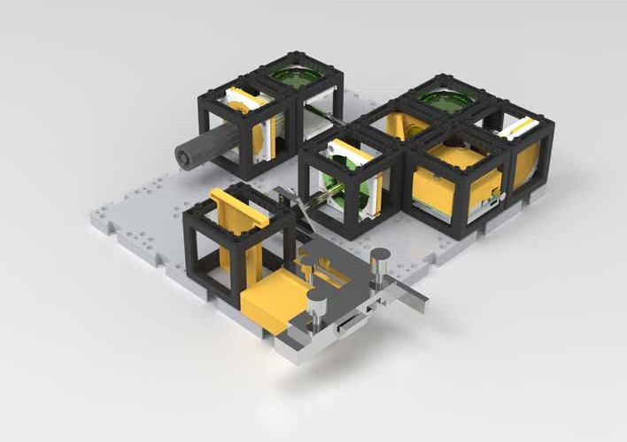
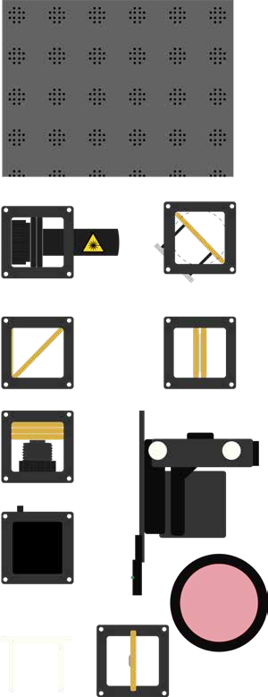
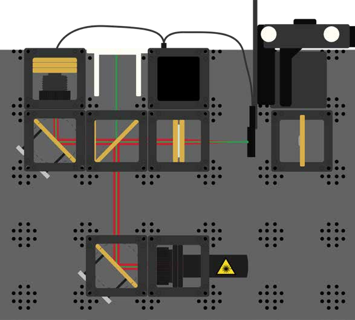

# ODMR - Optically Detected Magnetic Resonance

## Learning Objectives

By completing this experiment, you will be able to:
- **Understand quantum spin states** and how they differ from classical physics
- **Explain magnetic resonance** as a quantum mechanical phenomenon
- **Demonstrate optical detection** of quantum states in solid materials
- **Connect quantum physics** to real-world applications in computing and sensing
- **Experience room-temperature quantum systems** that don't require extreme conditions

## Introduction: Entering the Quantum World

Unlike our previous experiments that explored classical wave phenomena, **ODMR (Optically Detected Magnetic Resonance)** introduces us to **quantum mechanics** - the physics that governs the behavior of individual atoms and their components.

### What Makes This Experiment Special?

- **Room temperature quantum effects**: Most quantum experiments require extremely cold temperatures, but NV centers work at normal room temperature
- **Optical quantum control**: We can manipulate and read quantum states using ordinary laser light
- **Bridge to technology**: The same principles are used in quantum computers and ultra-sensitive medical diagnostics
- **Accessible quantum physics**: Experience quantum mechanics with equipment you can build yourself

### The Quantum-Classical Connection

**Classical vs. Quantum Behavior**:
- **Classical**: Light waves interfere (previous experiments)
- **Quantum**: Individual particles have discrete energy states
- **Bridge**: ODMR uses classical light to probe quantum states

## Background Physics: Understanding Quantum Spin

### What is "Spin"?

**Quantum spin** is a fundamental property of particles, like electrons, that has no direct classical analogy:

- **Not like spinning tops**: Particles don't actually rotate; spin is purely quantum mechanical
- **Discrete states**: Electrons can only have spin "up" or spin "down" (not in between)
- **Magnetic property**: Spin creates a tiny magnetic field
- **Measurable**: We can detect and manipulate these quantum states

### Electron Spin in Atoms

Every electron has:
1. **Charge** (-1): Creates electric fields
2. **Mass** (very small): Responds to gravitational forces  
3. **Spin** (±1/2): Creates magnetic fields

**In most materials**: Electron spins are paired up (↑↓) and cancel out
**In NV centers**: One electron spin remains unpaired and detectable

### Energy Levels and Transitions

**Quantum energy levels** are like stairs:
- **Ground state**: Lowest energy (most stable)
- **Excited states**: Higher energy (less stable)
- **Transitions**: Energy must be absorbed or emitted to change levels

**Three key energy levels in NV centers**:
1. **Ground state**: Where electrons normally reside
2. **Excited state**: Where electrons go when hit by green laser light
3. **Intermediate states**: Involved in the spin-dependent optical cycle

### Magnetic Resonance Principle

**Resonance** occurs when:
- **Frequency matches**: Microwave frequency exactly matches energy gap between spin states
- **Energy absorption**: Microwaves flip electron spins
- **Observable change**: Optical properties change when spins flip

**Mathematical relationship**: E = hf
- E: Energy difference between spin states
- h: Planck's constant (6.626 × 10⁻³⁴ J·s)
- f: Microwave frequency needed for resonance

## Critical Safety Information

### Laser Safety Protocols

⚠️ **DANGER: NEVER look directly at the laser beam**
- **Permanent eye damage** can occur instantly
- **Always wear safety glasses** when provided
- **Turn OFF laser** before any adjustments
- **Beam path control**: Ensure laser travels parallel to table surface

**Additional laser precautions**:
- Remove all **reflective jewelry** (rings, watches, bracelets)
- Clear workspace of **reflective objects** (phones, rulers, coins)
- **Mount laser securely** before turning on
- **Work methodically** - plan before acting

### Magnetic Field Safety

⚠️ **WARNING: Strong magnets present**

**Medical considerations**:
- **Inform instructor immediately** if you have any medical implants (pacemakers, insulin pumps, etc.)
- **Keep safe distance** from magnets if you have metal implants
- **Remove electronic devices** (phones, tablets, credit cards) from experiment area

**Handling precautions**:
- **Prevent finger pinching**: Magnets attract suddenly and strongly
- **Swallowing hazard**: Never allow loose magnets to be swallowed - inform instructor immediately if any magnet comes loose
- **Data storage**: Keep computer hard drives away from strong magnets

### Laboratory Equipment Safety

**Optical components**:
- **Handle carefully**: All gold-colored parts are precision optical components
- **Clean hands**: Oils and dirt degrade optical performance  
- **Gentle adjustments**: White components are for fine-tuning only
- **Systematic approach**: Make one adjustment at a time

## What is ODMR? - Detailed Explanation

### The ODMR Process Breakdown

**ODMR combines three physical processes**:

1. **"Optically"**: Uses laser light to interact with electrons
   - **Green laser excitation**: Promotes electrons to higher energy states
   - **Red fluorescence detection**: Measures light emitted when electrons return to ground state
   - **Spin-dependent cycle**: Optical properties depend on electron spin state

2. **"Detected"**: Measures changes in light intensity
   - **Photodetector**: Converts light intensity to electrical signal
   - **Signal processing**: Analyzes intensity variations
   - **Real-time monitoring**: Observes changes as experiment progresses

3. **"Magnetic Resonance"**: Uses microwaves to flip electron spins
   - **Microwave antenna**: Generates oscillating magnetic fields
   - **Resonance condition**: Frequency matches energy gap between spin states
   - **Spin manipulation**: Controls electron spin orientations

### The Complete ODMR Cycle

**Step-by-step process**:

1. **Initialization**: Green laser puts electrons in known spin state
2. **Manipulation**: Microwaves change electron spin (if frequency is correct)
3. **Detection**: Measure fluorescence intensity
4. **Analysis**: Changes in intensity reveal successful spin manipulation

**Key insight**: The amount of red fluorescence depends on the electron's spin state!

### Why is This Important?

**Magnetic field measurement**:
- **Principle**: Resonance frequency depends directly on magnetic field strength
- **Sensitivity**: Can detect incredibly weak magnetic fields
- **Applications**: Medical imaging, geological surveys, fundamental physics research

**Quantum technology foundation**:
- **Quantum computing**: Individual spin states can store quantum information (qubits)
- **Quantum sensing**: Ultra-sensitive measurement of physical quantities
- **Quantum communication**: Spin states can encode and transmit quantum information

## Equipment and Materials

### Complete Parts List

**Essential Components** (see diagram for identification):

1. **Base plate system**: Modular mounting platform
2. **Green laser diode** (532 nm): Optical excitation source
3. **45° mirrors (2x)**: Beam direction control
4. **Beam splitter with filter**: Separates excitation and detection paths
5. **Focusing lens**: Concentrates laser light on diamond
6. **Light sensor/photodetector**: Measures fluorescence intensity
7. **Electronics control box**: Microwave generation and signal processing
8. **XY-stage with NV diamond**: Precision sample positioning
9. **Observation screen**: Visual monitoring of setup
10. **Color filter (red)**: Blocks green laser, passes red fluorescence
11. **Magnet assembly**: Creates variable magnetic field

### The Heart of the Experiment: NV Diamonds

#### What are NV Centers?

**NV = Nitrogen-Vacancy**: A specific type of "defect" in diamond crystal structure

**Normal diamond structure**:
- **Pure carbon**: Each carbon atom bonded to 4 neighbors
- **Crystal lattice**: Perfect, repeating 3D pattern
- **Optically clear**: No absorption of visible light

**NV diamond structure**:
- **Nitrogen substitution**: One carbon atom replaced by nitrogen
- **Adjacent vacancy**: Missing carbon atom next to nitrogen
- **Color center**: Creates pink/red coloration
- **Quantum system**: Unpaired electron spin creates quantum states

#### Why are NV Centers Special for Quantum Physics?

**Unique properties**:

1. **Room temperature operation**: Unlike most quantum systems that require extreme cold
2. **Optical initialization**: Green laser light prepares known spin states
3. **Optical readout**: Fluorescence intensity reveals spin state
4. **Microwave control**: Spin states can be manipulated with radio waves
5. **Long coherence**: Quantum properties persist for microseconds (very long in quantum terms)
6. **Stable in solid**: Protected within diamond crystal structure

**Comparison with other quantum systems**:
- **Superconducting qubits**: Require temperatures near absolute zero
- **Trapped ions**: Need ultra-high vacuum and complex laser systems
- **Quantum dots**: Often require low temperatures and complex fabrication
- **NV centers**: Work at room temperature in ordinary air!

### Electronics and Control Systems

**Microwave generation**:
- **Frequency range**: Typically 2-3 GHz (similar to WiFi frequencies)
- **Power control**: Adjustable intensity for optimal spin manipulation
- **Timing control**: Precise pulse sequences for advanced experiments

**Detection electronics**:
- **Photodiode**: Converts fluorescence light to electrical signal
- **Amplification**: Boosts weak signals for measurement
- **Data acquisition**: Records intensity changes over time

**Safety note**: Microwave power levels are low and safe, similar to cell phone emissions.

## Step-by-Step Experimental Procedure

### Phase 1: Basic Optical Setup

#### Step 1: Construct the Optical Platform

**Objective**: Build a stable system for laser delivery and fluorescence collection

**Procedure**:
1. **Assemble the base plate configuration** as shown in the diagram
2. **Install the green laser diode** with secure mounting
3. **Position the focusing lens** to concentrate laser light on the diamond
4. **Verify beam alignment** travels parallel to table surface

**Safety reminder**: Keep laser OFF during assembly!

#### Step 2: Diamond Positioning and Focusing

**Objective**: Optimize laser excitation of the NV center

**Procedure**:
1. **Mount the NV diamond** on the XY-stage
2. **Adjust the XY-stage** to place diamond in the laser focus
3. **Turn laser ON briefly** for alignment
4. **Look through the red filter**: Diamond should glow brightly red
5. **Optimize position** for maximum fluorescence brightness

**What you should observe**:
- **Bright red glow**: Indicates successful NV center excitation
- **Focused spot**: Laser should create a small, intense spot on diamond
- **Even illumination**: No hot spots or irregular patterns

**Scientific explanation**: Green laser light excites electrons in NV centers to higher energy states. When they fall back down, they emit red fluorescence light.

### Phase 2: Fluorescence Detection Setup

#### Step 3: Complete the Detection System

**Objective**: Separate excitation light from fluorescence signal

**Procedure**:
1. **Install the beam splitter** in the optical path
2. **Position the 45° mirror** to direct fluorescence to detector
3. **Place the red color filter** before the photodetector
4. **Connect the light sensor** to the control electronics

**Key principle**: The red filter blocks green laser light but allows red fluorescence to pass through, enabling us to measure only the NV center emission.

#### Step 4: Optimize Detection Sensitivity

**Objective**: Maximize signal from NV center fluorescence

**Procedure**:
1. **Adjust the 45° mirror angle** for maximum light collection
2. **Connect to light sensor interface** on computer
3. **Monitor signal strength** in real-time
4. **Fine-tune alignment** for optimal signal-to-noise ratio

**Expected results**:
- **Strong baseline signal**: Steady fluorescence when laser is on
- **Clean signal**: Minimal noise and fluctuations  
- **Responsive**: Signal should change when diamond position changes

### Phase 3: Magnetic Resonance Implementation

#### Step 5: Add Microwave Control

**Objective**: Enable manipulation of electron spin states

**Procedure**:
1. **Connect the microwave antenna** to the control box
2. **Position the antenna** close to (but not touching) the diamond
3. **Install the magnet assembly** in the cube system
4. **Verify microwave safety**: Ensure proper shielding and low power

**Understanding the setup**: 
- **Microwave antenna**: Generates oscillating magnetic fields at specific frequencies
- **Static magnet**: Creates a constant magnetic field that sets the energy gap between spin states
- **Frequency matching**: Only when microwave frequency exactly matches the energy gap will resonance occur

#### Step 6: Observe Magnetic Field Effects

**Objective**: Detect changes in fluorescence due to magnetic field variations

**Procedure**:
1. **Establish baseline**: Record fluorescence intensity with magnet in fixed position
2. **Move the magnet**: Change magnetic field strength by repositioning magnet
3. **Observe intensity changes**: Look for variations in detected fluorescence
4. **Document observations**: Note relationship between magnet position and signal

**What to expect**:
- **Signal variations**: Fluorescence intensity should change as magnetic field changes
- **Non-linear relationship**: Small magnet movements may cause large signal changes
- **Reproducible effects**: Same magnet positions should give same results

**Physical explanation**: Changing magnetic field alters the energy gap between spin states, affecting the resonance condition and the optical properties of the NV center.

### Phase 4: Magnetic Resonance Detection

#### Step 7: Perform ODMR Measurements

**Objective**: Demonstrate true magnetic resonance by sweeping microwave frequency

**Advanced procedure** (if equipment supports):
1. **Set fixed magnetic field**: Position magnet at chosen location
2. **Sweep microwave frequency**: Slowly change frequency while monitoring fluorescence
3. **Look for resonance dips**: Fluorescence should decrease at specific frequencies
4. **Record frequency**: Note the frequency where minimum fluorescence occurs
5. **Repeat with different magnetic fields**: Move magnet and repeat frequency sweep

**Expected results**:
- **Resonance peaks**: Sharp dips in fluorescence at specific frequencies
- **Frequency dependence**: Resonance frequency changes with magnetic field strength
- **Reproducible**: Same conditions should give same resonance frequencies

**Simplified demonstration** (basic equipment):
1. **Set microwave to known frequency**: Use frequency known to be near resonance
2. **Turn microwaves ON and OFF**: Observe fluorescence with and without microwaves
3. **Look for intensity changes**: Compare fluorescence levels
4. **Adjust magnetic field**: Change field strength and repeat

## Understanding Your Results

### Interpreting ODMR Signals

**Normal fluorescence** (no microwaves):
- **Steady intensity**: Baseline fluorescence from NV centers
- **Green excitation**: Electrons excited to higher states
- **Red emission**: Electrons return to ground state via fluorescent pathway

**During magnetic resonance** (correct microwave frequency):
- **Reduced fluorescence**: Some electrons take non-fluorescent pathway back to ground
- **Spin state dependence**: Different spin states have different optical properties
- **Quantifiable effect**: Can measure exact intensity reduction

### Connecting Observations to Theory

**Energy level diagram interpretation**:
- **Ground state splitting**: Magnetic field creates energy difference between spin states
- **Microwave matching**: When microwave photon energy equals splitting, resonance occurs
- **Optical cycle changes**: Resonance alters the balance of fluorescent vs. non-fluorescent decay paths

**Mathematical relationship**:
E = hf = gμ_B B
- E: Energy difference between spin states
- h: Planck's constant
- f: Microwave frequency at resonance  
- g: g-factor (material property ≈ 2)
- μ_B: Bohr magneton (9.274 × 10⁻²⁴ J/T)
- B: Magnetic field strength

### Real-World Applications Context

**Quantum sensing capabilities**:
- **Magnetic field measurement**: Precision better than conventional sensors
- **Spatial resolution**: Nanometer-scale magnetic field mapping
- **Sensitivity**: Can detect single nuclear spins

**Current research applications**:
- **Biological systems**: Magnetic fields in living cells
- **Materials science**: Magnetic properties of new materials
- **Fundamental physics**: Testing theories of quantum mechanics

## Current and Future Applications

### Present-Day Research Applications

**Laboratory quantum research**:
- **Quantum state preparation**: Creating known quantum states for experiments
- **Coherence studies**: Understanding how long quantum properties persist
- **Entanglement generation**: Creating quantum connections between particles
- **Quantum algorithm development**: Testing quantum computing protocols

**ODMR measurement prototypes**:
- **Magnetometry**: Ultra-sensitive magnetic field measurement
- **Thermometry**: Temperature sensing with nanometer resolution
- **pH sensing**: Chemical environment monitoring in biological systems
- **Pressure sensing**: Mechanical stress measurement in materials

**Current limitations**:
- **Research stage**: Most applications still in laboratory development
- **Specialized equipment**: Requires sophisticated control electronics
- **Cost**: Expensive compared to conventional sensors
- **Complexity**: Needs trained operators for optimal performance

### Future Technology Potential

#### Quantum Computing Applications

**Qubits (Quantum bits)**:
- **Classical bits**: Store 0 OR 1
- **Quantum bits**: Store 0 AND 1 simultaneously (superposition)
- **NV centers**: Each electron spin can serve as a stable qubit
- **Room temperature advantage**: Most quantum computers require extreme cooling

**Quantum computing challenges**:
- **Decoherence**: Quantum states are fragile and easily disrupted
- **Error rates**: Current quantum operations are prone to errors
- **Scalability**: Building large quantum computers is extremely difficult
- **NV advantage**: Relatively stable quantum states in practical conditions

#### Medical and Biological Sensing

**Cellular-level sensing**:
- **Inside living cells**: NV diamonds could monitor cellular processes without damage
- **Real-time monitoring**: Track cellular changes during disease progression
- **Drug development**: Test how medications affect cellular function
- **Early disease detection**: Identify problems before symptoms appear

**Medical imaging enhancement**:
- **MRI sensitivity**: Improve magnetic resonance imaging resolution
- **Contrast agents**: NV diamonds as biocompatible imaging enhancers
- **Targeted imaging**: Specific targeting of diseased tissue
- **Reduced side effects**: Potentially safer than current contrast agents

#### Industrial and Scientific Applications

**Precision manufacturing**:
- **Quality control**: Detect microscopic defects in materials
- **Surface analysis**: Measure surface properties with unprecedented precision
- **Stress monitoring**: Real-time monitoring of mechanical stress in structures
- **Materials development**: Characterize new materials at the atomic level

**Fundamental physics research**:
- **Testing quantum mechanics**: Verify predictions of quantum theory
- **Dark matter detection**: Search for exotic particles
- **Gravitational effects**: Study gravity at the quantum level
- **Cosmological studies**: Understanding the fundamental nature of space and time

## The QuantumMiniLabs Project Context

### Educational Innovation Mission

**Breaking down barriers**:
- **Cost accessibility**: Traditional quantum experiments cost hundreds of thousands of dollars
- **Educational scale**: Making quantum physics accessible to high school students
- **Hands-on learning**: Direct experience rather than theoretical study only
- **Inspiring careers**: Encouraging students to pursue quantum science and technology

**Project goals**:
- **100 educational locations**: Deploying across Germany as pilot program
- **Open-source platform**: All designs freely available for global adoption
- **Community building**: Creating network of educators and students
- **Curriculum development**: Integrating quantum education into standard physics courses

### Innovation and Global Impact

**First-of-its-kind platform**:
- **DIY quantum experiments**: First affordable platform for hands-on quantum physics
- **Second-generation quantum systems**: Using NV centers (beyond simple photon experiments)
- **Room temperature operation**: No need for expensive cooling systems
- **Modular design**: Adaptable to different educational needs and budgets

**Sustainability approach**:
- **Critical mass strategy**: Reaching enough users to ensure project continuation
- **Community development**: Users contribute improvements and new experiments
- **Educational integration**: Becoming part of standard physics education
- **Global expansion**: Extending beyond initial funding through user community

### Your Role in Quantum Education

**As a quantum physics student**, you are:
- **Pioneer**: Among the first high school students to experience quantum control
- **Future scientist**: Potentially pursuing careers in quantum technology
- **Educational tester**: Helping refine quantum education methods
- **Community member**: Part of a growing global quantum education network

## Extended Learning Activities

### Experimental Extensions

#### Investigation 1: Magnetic Field Mapping
**Objective**: Use NV center to map magnetic field distribution

**Procedure**:
1. **Fix microwave frequency**: Set to known resonance frequency
2. **Move magnet systematically**: Record fluorescence at different positions
3. **Create field map**: Plot fluorescence intensity vs. position
4. **Analyze patterns**: Understand magnetic field distribution around magnet

#### Investigation 2: Coherence Time Measurement
**Advanced procedure** (if equipment supports):
1. **Pulse sequence**: Apply microwave pulses of varying duration
2. **Monitor fluorescence**: Observe how signal changes with pulse length
3. **Find coherence time**: Determine how long quantum states persist
4. **Compare conditions**: Test different temperatures, magnetic fields

#### Investigation 3: Spin Echo Experiments
**Very advanced** (research-level):
1. **Complex pulse sequences**: Apply precisely timed microwave pulses
2. **Echo formation**: Observe quantum echoes in the fluorescence
3. **Decoherence analysis**: Study how environment affects quantum states

### Theoretical Investigations

#### Research Project 1: Historical Context
- **Quantum mechanics development**: How did scientists discover spin?
- **Nobel Prize connections**: Research prizes awarded for quantum physics
- **Technology evolution**: From discovery to practical applications

#### Research Project 2: Current Research
- **Literature review**: Read current scientific papers on NV centers
- **Research groups**: Identify leading quantum research laboratories
- **Career paths**: Investigate quantum physics career opportunities

#### Research Project 3: Future Predictions
- **Technology forecasting**: When might quantum computers become practical?
- **Societal impact**: How will quantum technology change daily life?
- **Ethical considerations**: What are the implications of quantum technology?

## Troubleshooting Guide

### Common Issues and Solutions

**Problem**: No red fluorescence visible
- **Check**: Is laser properly aligned and focused on diamond?
- **Check**: Is diamond actually in the laser beam path?
- **Solution**: Realign laser and optimize diamond positioning

**Problem**: Weak fluorescence signal
- **Check**: Is diamond high quality with good NV concentration?
- **Check**: Is focusing lens clean and properly positioned?
- **Solution**: Clean optics and optimize focus

**Problem**: No response to magnetic field changes
- **Check**: Is magnet actually changing field at diamond location?
- **Check**: Is detection system sensitive enough?
- **Solution**: Move magnet closer, improve detection sensitivity

**Problem**: Noisy or unstable signals
- **Check**: Are there vibrations affecting the setup?
- **Check**: Is electrical interference present?
- **Solution**: Isolate from vibrations, check electrical grounding

### Safety Troubleshooting

**Laser safety issues**:
- **Unexpected reflections**: Check for reflective surfaces in beam path
- **Beam direction changes**: Ensure all mounts are secure
- **Eye safety**: Always know where beam is going

**Magnetic safety issues**:
- **Unexpected attraction**: Check for hidden metal objects
- **Magnet displacement**: Ensure magnets are securely mounted
- **Electronic interference**: Keep sensitive devices away from magnets

## Assessment and Evaluation

### Conceptual Understanding Check

**Can you explain**:
1. **What makes NV centers quantum systems** rather than classical?
2. **How magnetic resonance works** in terms of energy levels?
3. **Why fluorescence intensity changes** during resonance?
4. **How this connects to quantum computing** applications?
5. **What advantages NV centers have** over other quantum systems?

### Practical Skills Assessment

**Demonstrated abilities**:
- **Safe operation**: Following laser and magnetic safety protocols
- **Systematic alignment**: Building and optimizing optical systems
- **Signal interpretation**: Understanding detector responses
- **Problem solving**: Troubleshooting experimental issues
- **Data analysis**: Interpreting fluorescence measurements

### Connection to Modern Science

**Real-world relevance**:
- **Current research**: How your experiment relates to cutting-edge science
- **Technology development**: Connection to emerging quantum technologies
- **Career preparation**: Skills relevant to quantum science careers
- **Scientific literacy**: Understanding quantum concepts in popular science

## Conclusion: Your Quantum Journey

### What You Have Accomplished

Through this ODMR experiment, you have:

- **Directly manipulated quantum states**: Used light and microwaves to control electron spins
- **Observed quantum phenomena**: Seen how quantum states affect macroscopic properties
- **Operated quantum technology**: Used the same principles as quantum computers and sensors
- **Connected theory to practice**: Linked abstract quantum concepts to tangible experiments
- **Developed technical skills**: Gained experience with precision optics and electronics

### The Significance of Your Experience

**Historical perspective**: You have experienced phenomena that were purely theoretical just a century ago and only accessible in research laboratories until recently.

**Technological perspective**: The principles you've learned are fundamental to emerging technologies that will likely transform society in your lifetime.

**Educational perspective**: You are among the first generation of students to experience quantum physics hands-on at the high school level.

### Future Opportunities

**Academic pathways**:
- **Physics programs**: Undergraduate and graduate study in quantum physics
- **Engineering programs**: Quantum engineering and related technologies  
- **Computer science**: Quantum computing algorithms and software
- **Materials science**: Quantum materials and device development

**Career possibilities**:
- **Quantum researcher**: Developing new quantum technologies
- **Quantum engineer**: Building practical quantum devices
- **Quantum software developer**: Programming quantum computers
- **Science educator**: Teaching the next generation about quantum physics

### The Broader Impact

Your experience with the QBox represents more than just a physics experiment - it's part of a global effort to:

- **Democratize quantum education**: Make advanced physics accessible to all students
- **Inspire scientific careers**: Encourage pursuit of quantum science and technology
- **Prepare for the future**: Develop quantum literacy for the coming technological revolution
- **Build scientific community**: Connect students and educators worldwide through shared quantum experiences

**Final thought**: The quantum world you've explored today will likely define much of the technology of tomorrow. By understanding these principles now, you're prepared to be not just a user of quantum technology, but a creator and innovator in the quantum age.

**Next Steps**: Consider exploring advanced quantum topics, pursuing quantum-related educational opportunities, and staying connected with the growing quantum education community!
