# Tutorial: Building a Michelson Interferometer

In this workshop, we will construct a Michelson Interferometer using the UC2 modular microscope toolbox. The Michelson Interferometer is a device that measures the interference properties of light and has been fundamental in advancing our understanding of the nature of light and space-time. We will treat light as a wave with very high frequency and use it to perform fascinating experiments that demonstrate wave optics principles.


### Materials Needed

**Optical Components:**
1. Green Laser Pointer (532 nm, minimum coherence length >10 cm)
2. Collimating lens (f = 100 mm) for beam conditioning
3. 50:50 Beam splitter cube with anti-reflection coating
4. Three kinematic mirrors with precision adjustment screws
5. Pinhole aperture (10-50 μm diameter) for spatial filtering
6. Neutral density filters (optional, for power adjustment)

**Detection Equipment:**
7. HIKrobot Camera (MV-CE060-10UC) with USB cable for quantitative measurements
8. Screen for visual alignment and pattern observation
9. Computer with MVS camera software installed

**Mechanical Components:**
10. UC2 Modular Microscope Toolbox including:
    - 8+ optical cubes with threaded inserts
    - Base plates for rigid mounting
    - Puzzle pieces for component attachment
11. Precision screwdriver set (1.5mm hex key) for alignment
12. Optical table or stable surface (vibration isolation recommended)

**Electronic Components (for motorized version):**
13. ESP32 microcontroller with firmware
14. Stepper motors for automated mirror positioning
15. Motor drivers and power supply
16. Connecting cables and breadboard

**Safety Equipment:**
17. Laser safety goggles (appropriate for 532 nm wavelength)
18. Warning signs and barriers for laser area

**TODO**: Specify exact part numbers and suppliers for all optical components, add vibration isolation requirements for optimal performance


### Diagram


*Black and white box diagram showing the Michelson Interferometer layout with components labeled for easier understanding*


### Theory of Operation

A Michelson Interferometer splits a laser beam into two equal parts using a beam splitter. The two beams are then reflected by mirrors and recombined to interfere with each other. When the paths of the two beams are equal, they constructively interfere, resulting in a bright output. However, if one path is shifted by 1/4 of the wavelength, the beams destructively interfere, resulting in a dark output.

The Michelson Interferometer operates as a two-beam interference device where coherent light is divided into reference and sample arms. The beam splitter acts as both a divider and combiner, sending half the light to each arm and then recombining the reflected beams. The interference pattern depends on the optical path difference between the two arms, making it extremely sensitive to small distance changes.

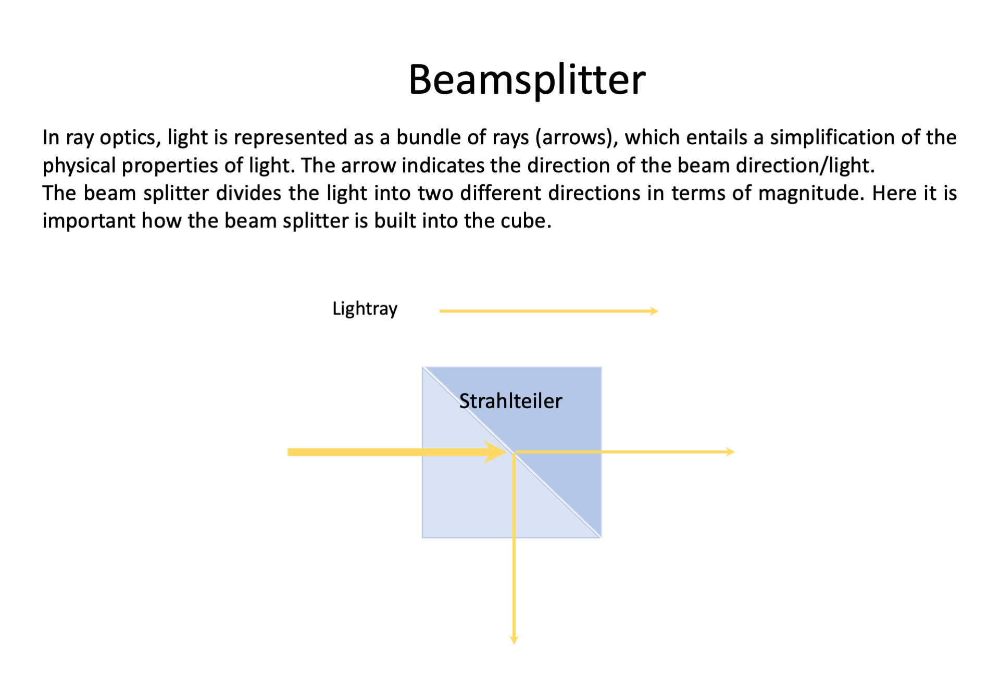


### Theoretical Background

**Interference Principles**

Interference is a phenomenon that occurs when two or more waves overlap in space and combine their amplitudes. When waves are in-phase (their crests and troughs align), they constructively interfere, resulting in a larger amplitude. When they are out of phase (their crests and troughs are misaligned), they destructively interfere, resulting in a smaller or zero amplitude. Interference is a fundamental concept in wave physics and plays a crucial role in understanding the behavior of light.

**Wave Superposition and Path Difference**

The fundamental principle underlying interferometry is the superposition of electromagnetic waves. When two coherent light beams recombine, the resulting intensity follows:

I = I₁ + I₂ + 2√(I₁I₂)cos(Δφ)

Where Δφ = (2π/λ)ΔL is the phase difference corresponding to path difference ΔL.

**Coherence Requirements**

For stable interference patterns, the light source must exhibit both spatial and temporal coherence:
- **Temporal coherence**: The wave trains must maintain phase relationships over time scales relevant to the path difference
- **Spatial coherence**: The wavefronts must be sufficiently uniform across the beam cross-section
- **Coherence length**: Lc = λ²/Δλ, where Δλ is the spectral width of the source

**Historical Context and Significance**

The Michelson Interferometer was invented by Albert Michelson in 1881 and played a crucial role in:
- **Michelson-Morley experiment (1887)**: Disproved the existence of luminiferous aether, paving the way for Einstein's special relativity
- **Precision measurement of the speed of light**: Earning Michelson the 1907 Nobel Prize in Physics
- **Definition of the meter**: Originally defined in terms of wavelengths of krypton-86 radiation using interferometric measurements

**Modern Applications and Technology**

Contemporary applications demonstrate the continued relevance of Michelson interferometry:
- **LIGO gravitational wave detectors**: Use arm lengths of 4 km to detect strain sensitivities of 10⁻²¹
- **Optical coherence tomography (OCT)**: Medical imaging with micrometer resolution
- **Fourier transform infrared spectroscopy (FTIR)**: Chemical analysis and identification
- **Surface profiling**: Nanometer-scale surface topology measurements
- **Fiber optic sensors**: Distributed sensing in civil engineering and geophysics

**TODO**: Add specific technical specifications for optimal laser coherence length and power requirements for educational setups

**Sensitivity and Measurement Principles**

The key principle behind the Michelson Interferometer is wave superposition. When two coherent light waves with the same frequency but different phases combine, the resulting intensity depends on their phase relationship:
- Constructive interference (bright fringes): Path difference = nλ (where n is an integer)
- Destructive interference (dark fringes): Path difference = (n + 1/2)λ

**Historical Significance - Michelson-Morley Experiment**

The Michelson Interferometer, invented by Albert A. Michelson in the late 19th century, is a classic optical device that exploits the principles of interference to measure various optical properties, including the speed of light. Michelson used this interferometer in the famous Michelson-Morley experiment (1887) to test the existence of the luminiferous aether, leading to fundamental insights that contributed to Einstein's theory of special relativity.


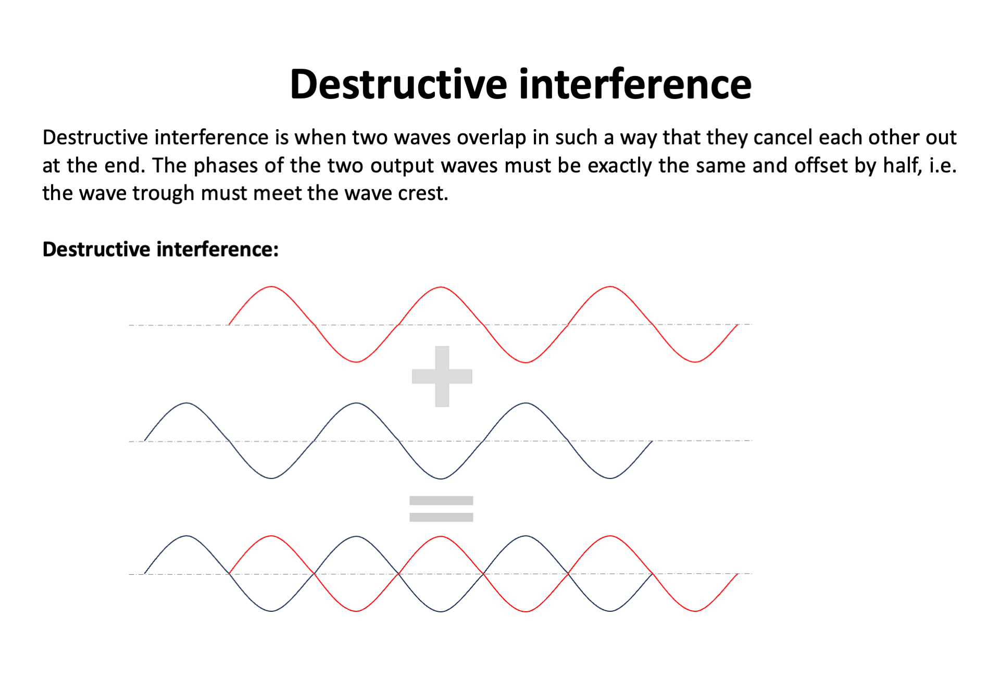


**Speed of Light Measurement**

In the Michelson Interferometer setup, a light beam is split into two equal parts using a beam splitter. One part is directed towards a stationary mirror (the reference mirror) while the other part is directed towards a movable mirror (the sample mirror). The two beams are then reflected back towards the beam splitter, and they recombine. Depending on the path difference between the two beams, they may interfere constructively or destructively.

By moving the sample mirror, the path difference between the two beams changes. When the path difference corresponds to an integral number of wavelengths (constructive interference), the interference pattern exhibits bright fringes. Conversely, when the path difference corresponds to a half-integral number of wavelengths (destructive interference), the pattern exhibits dark fringes.

The key to measuring the speed of light with the Michelson Interferometer lies in precisely measuring the movement of the sample mirror. As the mirror is displaced, the fringe pattern shifts, and by measuring this shift, we can determine the change in path difference and, consequently, the speed of light.

**Modern Applications**

The Michelson Interferometer remains an essential tool in modern optics and has found applications in diverse fields:
- **LIGO (Laser Interferometer Gravitational-Wave Observatory)**: Uses kilometer-scale Michelson interferometers to detect gravitational waves
- **Precision metrology**: Measuring distances with nanometer accuracy
- **Spectroscopy**: Fourier Transform Infrared (FTIR) spectroscopy
- **Surface profiling**: Measuring surface roughness and topography
- **Optical coherence tomography (OCT)**: Medical imaging applications


## Tutorial: Michelson Interferometer


*Image of all the components needed for the Michelson Interferometer setup*

## Step 1: Assemble the Optical Components

This guide will walk you through the assembly step by step. You can follow the process according to the functional modules or refer to the diagram above for orientation.

**⚠️ ATTENTION!**

NEVER LOOK DIRECTLY INTO THE LASER! EYE WILL BE DAMAGED DIRECTLY

NEVER SWITCH ON THE LASER WITHOUT INTENDED USE

BEAM HAS TO GO AWAY FROM ONESELF - ALWAYS!

### 1.1: Build a Four Base Plate Configuration

Build a four base plate as shown. This will be used to connect the laser diode, pinhole, the beamsplitter, and an empty cube. Add the base plates to fix them.

*Note: At this point the laser diode should be turned off the whole time. Don't look at the laser directly. Always use screens to look for the laser light.*

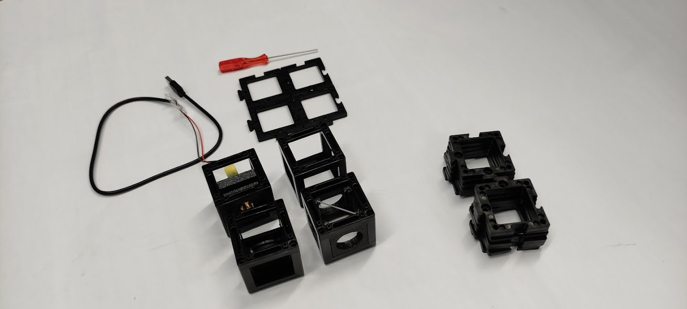
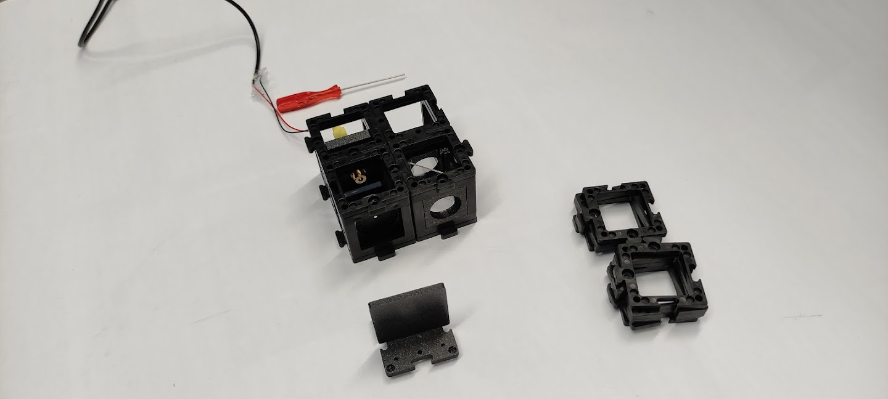

### 1.2: Place the Pinhole

Place the pinhole such that it is as far as possible from the laser diode.

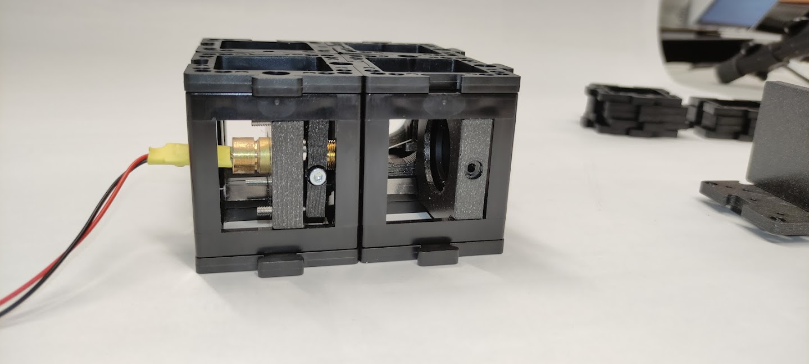

### 1.3: Close the Diaphragm

Close the diaphragm as much as possible to end up with a small hole for spatial filtering.


### 1.4: Place the Screen and Align the Laser

Place the screen after the pinhole and turn the laser on. The alignment is most likely off. To align the laser you should use the screwdriver and adjust the laser mount screws so that the beam is centered on the pinhole. Turn the laser off.

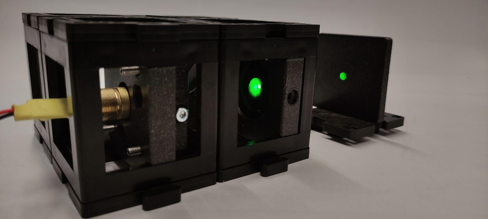

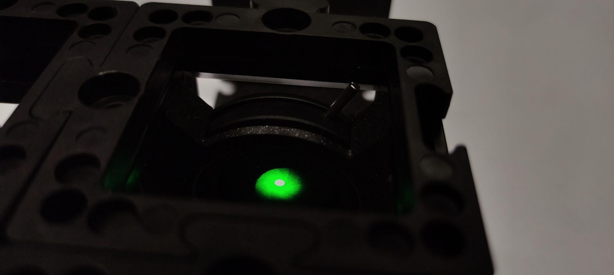

### 1.5: Replace the Pinhole with a Kinematic Mirror

Without touching the screws of the laser, remove the pinhole from the group of cubes and add a kinematic mirror instead.


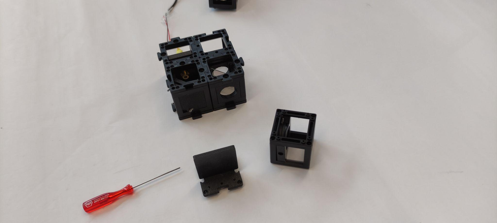


### 1.6: Align the Beam with the Pinhole

Using the top and bottom base plates, place the pinhole after the beamsplitter connecting the pinhole and the kinematic mirror in a straight line. Place the screen after the pinhole, turn the laser on and align the beam to the center of the pinhole as shown. Turn the laser off.

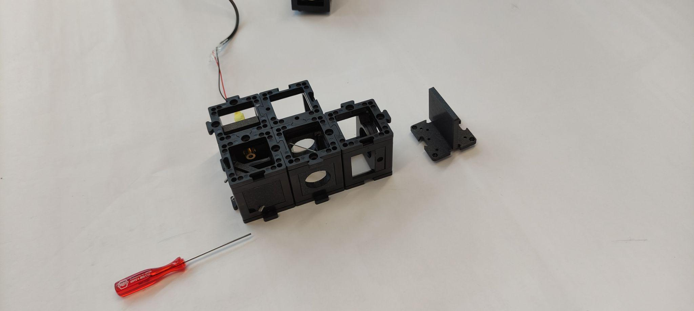
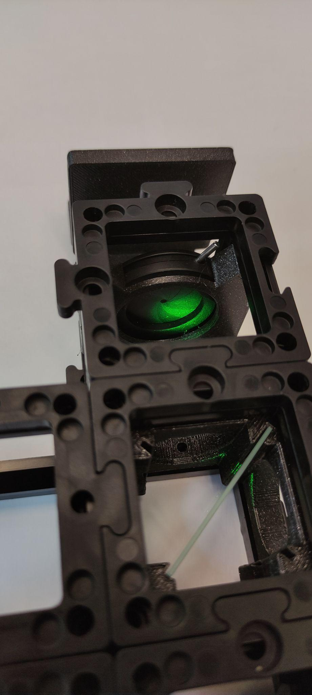


### 1.7: Set the Michelson Interferometer Arms

Remove the pinhole and set other base plates as shown. These are the variable and reference arms of the Michelson interferometer. Place the reference and movable mirrors as shown. Place the pinhole in the detection spot. Fix everything with base plates.


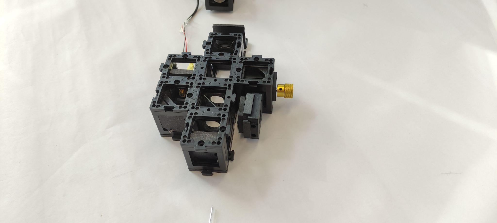

## Step 2: Electronics

### 2.1: Plug in the Electronics as Shown Below

**⚠️ Caution!**
If you need to change any of the cables or their position, always unplug the 12V power cable before doing so. Otherwise, the electronic components might get damaged!

*TODO: Add complete electronic setup image showing every wire connected correctly*

- Connect the laser diode to the Mainboard at designated port
- Connect the camera to your PC via USB
- *TODO: Add specific connection instructions for motorized components if available*

- Plug in the micro-USB at your ESP32 and connect to your PC.
- Plug in the 12V power cable.

### 2.2: Flashing the ESP32 Firmware

1. Before proceeding, ensure your ESP32 board has the latest firmware. You can download and flash the firmware via the official [openUC2 website](https://youseetoo.github.io/), selecting your version (most likely **ESP32-DEV-based UC2 standalone board V3 (beta)**), then click on the `connect` button.

The source code can be found [here](https://github.com/youseetoo/uc2-esp32).

2. Connect the ESP32 to your computer using the micro-USB cable.

3. In your Chrome browser, a dialog will prompt you to select the COM port for your ESP32, which should be shown as `CP2102 USB to UART Bridge Controller`. Once connected, you can install the latest firmware by simply clicking the "Install" button.

4. Wait until the firmware has been successfully flashed.

### 2.3: Connecting to the Web Interface

1. After flashing the firmware, go to the testing section on the same website.

2. Connect to your ESP32 board using the "Connect" button again, ensuring the correct COM port is selected.

3. Once connected, test the system by sending a simple command:

```json
{"task":"/motor_act", "motor": { "steppers": [ { "stepperid": 3, "position": -1000, "speed": 1000, "isabs": 0, "isaccel": 0} ] } }
```

This command will move the Z-axis motor by -1000 steps (1 full rotation) at a speed of 1000 steps per second. Each step corresponds to a movement of 300nm when using microstepping.

**Note:** Ensure that the command string has no line breaks.

### 2.4: Testing in the Web Interface

1. After completing the test, go back to the first tab to control the other components via buttons:
   - `Laser 1(on)` and `Laser 1(off)` control the laser diode.
   - `Motor Z(+)` and `Motor Z(-)` control the Z-stage.
   - `Motor X(+)/Y(+)/A(+)` and `Motor X(-)/Y(-)/A(-)` control the XYZ-stage.

### 2.5: Setup and Use the Camera Software

1. Connect the camera via cable to your PC.

2. For the installation process and usage of the software, follow these instructions: [Install MVS App for Camera Utilization](https://openuc2.github.io/docs/Electronics/HIKCamera/SoftwareTutorial)

## Step 3: Aligning the Michelson Interferometer

### 3.1: Align and Observe the Interference

Place the screen after the pinhole, turn the laser on. You will see two beam spots, one from each mirror. Adjust the movable mirror angles with the screwdriver so that you can see an improvement in brightness of one of the spots and look for the maximum.

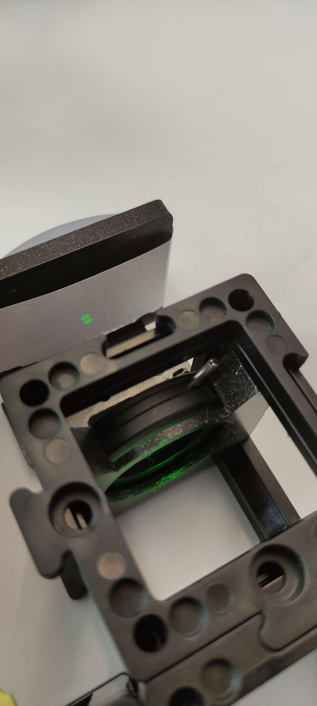
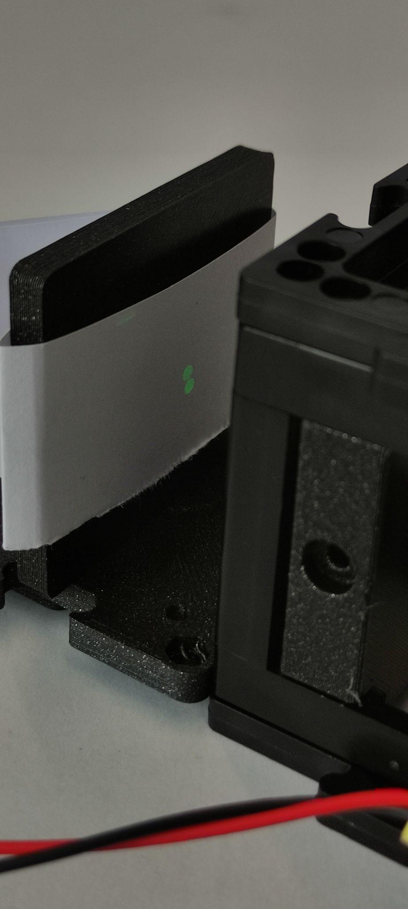


### 3.2: Adjust the Reference Mirror

Adjust the screws of the reference mirror so that the two beams overlap as much as possible.


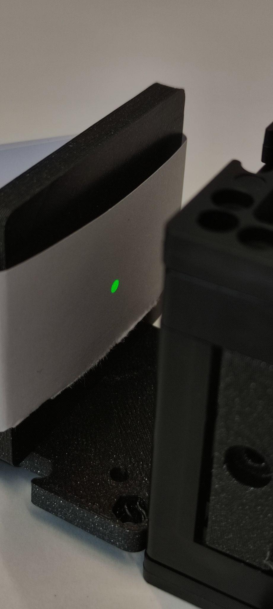

### 3.3: Observe the Interference Pattern

Remove the pinhole and place the screen only. You will see two extended beams. Adjust the reference mirror screws to overlap the beams perfectly. You will see the interference pattern emerging. Then try to center the pattern on the screen. Turn the laser off.

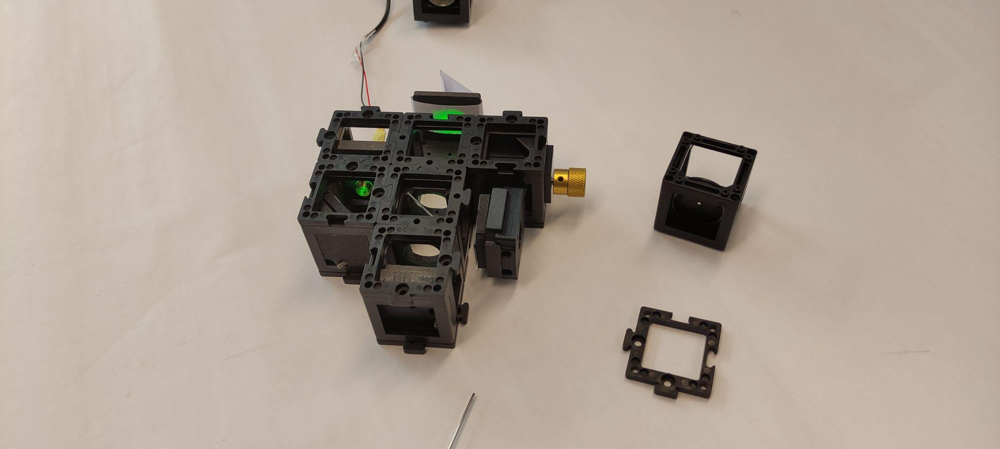

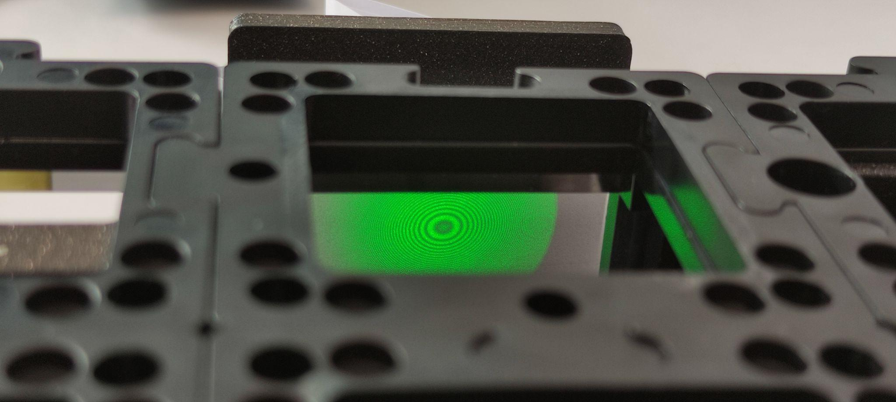

### 3.4: Set up the Camera

Place the camera and fix it with the base plates. Connect it to the computer and open the MV Software. To check the MVS tutorial click [here](Camera_Software_tutorial.md).

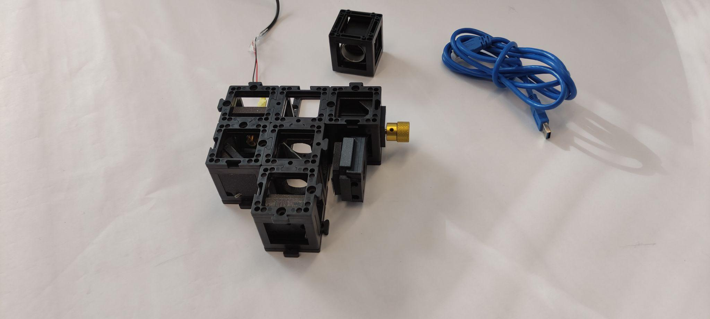
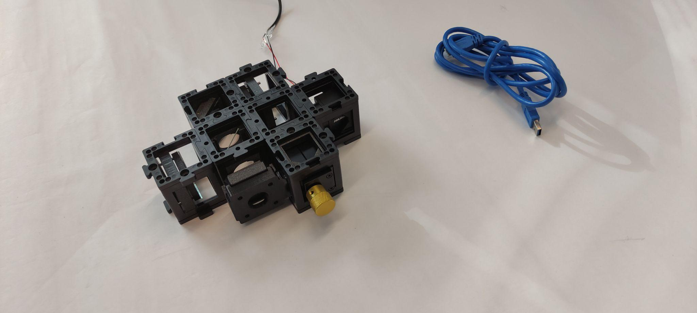


### 3.5: Adjust the Camera Exposure

Adjust the exposure time of the camera. You should see a fringe pattern. Try to adjust the reference mirror screws finely to bring the center of the interference pattern to the center of the camera.


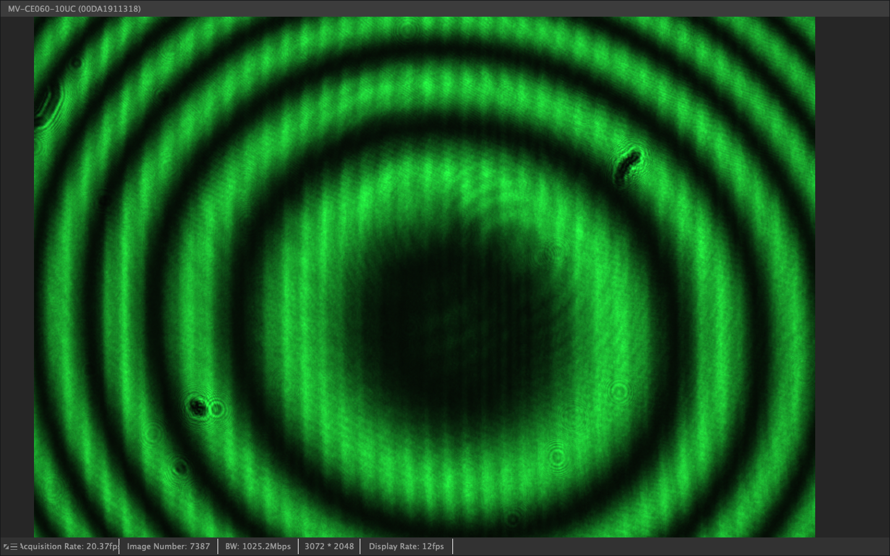

## Step 4: Install ImSwitch (optional)

#### 1. Installation process

For this, please refer to the installation instructions [here](https://openuc2.github.io/docs/ImSwitch/Quickstart).

On top of this, you can use the following `ImSwitchClient` template to remote control your microscopy using google colab or jupyter notebook. This gives some hints on the use of the API:

<a target="_blank" href="https://colab.research.google.com/drive/1W3Jcw4gFn0jtQXa3_2aCtJYJglMNGkXr?usp=sharing">
  
</a>

This makes use of the default URL hosted publicly on https://imswitch.openuc2.com/imswitch/index.html, but you can change this to the `PORT` (i.e. 8001) and `URL` (e.g. the Raspberry Pi's IP address that runs ImSwitch in docker and is in the same network as your computer).

**Your Setup is complete, now let's start the Experiments**

---
---

## Experiment 1: Basic Interference Pattern Observation

### 1.1: Observe Static Interference

Turn on the laser and observe the interference pattern on the screen or camera. Document the circular fringe pattern (Newton's rings) that results from the interference of two slightly divergent beams.

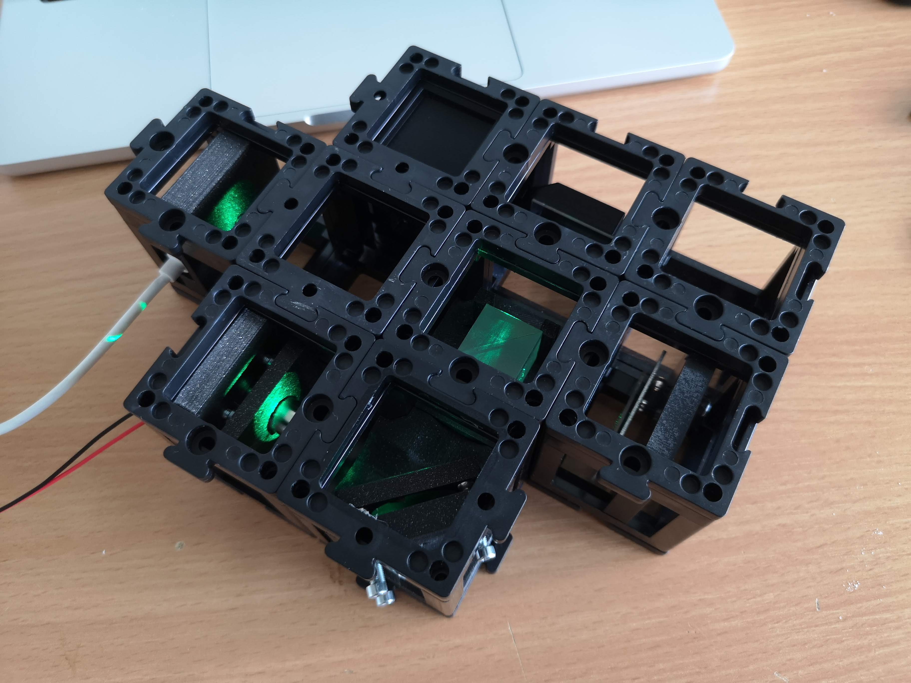

*Fully assembled UC2 interferometer with green laser diode, camera, beamsplitter, kinematic mirror and translatable mirror*

### 1.2: Record the Pattern

Using the camera, capture images of the interference pattern. Note the bright and dark fringes and their spacing.


*Newton rings interference pattern showing circular fringes from two overlapping spherical wavefronts*

## Experiment 2: Path Difference Measurement

### 2.1: Translate the Mirror

Carefully move the variable mirror using the fine adjustment screws. Observe how the fringe pattern changes as you alter the path difference.

### 2.2: Count Fringe Shifts

Count the number of bright fringes that pass a fixed point as you move the mirror. Each fringe corresponds to a path difference change of one wavelength (λ ≈ 532 nm for green light).


*Quantitative measurement using ESP32 camera to track beam motion and measure distances*

### 2.3: Calculate Distance Moved

Use the relationship: Distance moved = (Number of fringes × λ) / 2
The factor of 2 accounts for the double pass through the moving arm.

## Experiment 3: Coherence Length Measurement

### 3.1: Find Visibility Limits

Gradually increase the path difference between the two arms until the fringe visibility decreases significantly.

### 3.2: Measure Coherence Length

The coherence length is approximately equal to the path difference at which the fringe visibility drops to 1/e of its maximum value.

### 3.3: Calculate Spectral Width

Use the relationship: Coherence length = λ²/Δλ to estimate the spectral width of your laser.

---

## Safety Guidelines and Best Practices

### Laser Safety Protocol

**⚠️ CRITICAL SAFETY WARNINGS:**

1. **NEVER look directly into the laser beam or its reflections**
2. **Always wear appropriate laser safety goggles (OD 4+ for 532 nm)**
3. **Ensure all laser beams are terminated properly or contained within the experimental area**
4. **Post warning signs around the experimental setup**
5. **Keep laser power at minimum levels necessary for observation**

### General Laboratory Safety

- **Work in a controlled environment** with minimal vibrations
- **Secure all optical components** to prevent accidental displacement
- **Maintain clean optical surfaces** using appropriate cleaning materials
- **Avoid touching optical surfaces** with bare hands
- **Store components properly** when not in use

**TODO**: Add specific power level recommendations and local safety regulations compliance

---

## Troubleshooting Guide

### Common Problems and Solutions

#### Problem: No Interference Pattern Visible
**Possible Causes:**
- Misaligned beam paths
- Poor beam overlap
- Insufficient temporal or spatial coherence
- Laser power too low

**Solutions:**
1. Check beam alignment using screen at various positions
2. Ensure both beams are hitting the detector
3. Adjust mirror orientations for optimal overlap
4. Verify laser stability and coherence specifications

#### Problem: Low Fringe Visibility
**Possible Causes:**
- Unequal beam intensities
- Poor spatial beam quality
- Excessive path difference
- Vibrations affecting setup

**Solutions:**
1. Balance beam intensities using neutral density filters
2. Improve spatial filtering with smaller pinhole
3. Reduce path difference between arms
4. Isolate setup from vibrations

#### Problem: Unstable Fringe Pattern
**Possible Causes:**
- Environmental vibrations
- Air currents affecting beam paths
- Temperature fluctuations
- Loose optical mounts

**Solutions:**
1. Use vibration isolation table or heavy, stable surface
2. Enclose optical path to minimize air currents
3. Allow thermal equilibration time
4. Secure all mechanical connections

#### Problem: Difficulty in Mirror Alignment
**Possible Causes:**
- Incorrect mirror mount orientation
- Excessive adjustment sensitivity
- Poor initial beam direction

**Solutions:**
1. Start with coarse alignment using visible beam spots
2. Use systematic adjustment procedure (one axis at a time)
3. Make small, incremental adjustments
4. Use alignment aids like irises or beam viewers

**TODO**: Add specific troubleshooting procedures for electronic components and automated systems

---

## Assessment Questions

### Understanding Check

1. **Conceptual Understanding:**
   - Explain why the Michelson Interferometer is more sensitive to path changes than direct distance measurement
   - Describe the relationship between coherence length and spectral width
   - How does the visibility of fringes relate to the degree of coherence?

2. **Practical Applications:**
   - Why is spatial filtering important in interferometry?
   - How would you modify the setup to measure very small displacements?
   - What are the advantages and disadvantages compared to the Mach-Zehnder configuration?

3. **Quantitative Analysis:**
   - Calculate the theoretical sensitivity (minimum detectable path change)
   - Estimate the maximum useful path difference for your laser
   - Determine the required mechanical stability for nanometer-scale measurements

### Extension Projects

1. **Advanced Measurements:**
   - Implement computer-controlled phase stepping
   - Measure refractive index of transparent materials
   - Study temperature-dependent optical path changes

2. **Modern Applications:**
   - Research LIGO gravitational wave detection principles
   - Investigate optical coherence tomography techniques
   - Explore applications in precision manufacturing

**TODO**: Add specific calculation examples and expected numerical results for different laser types
