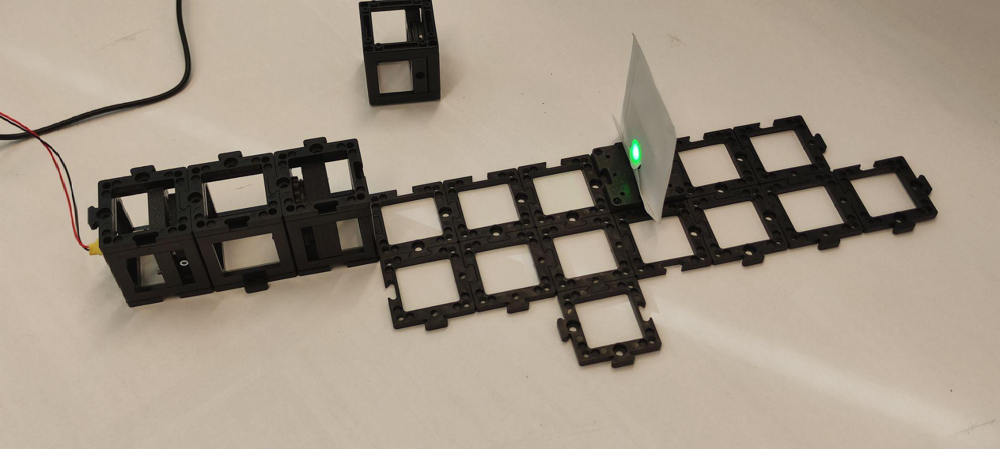
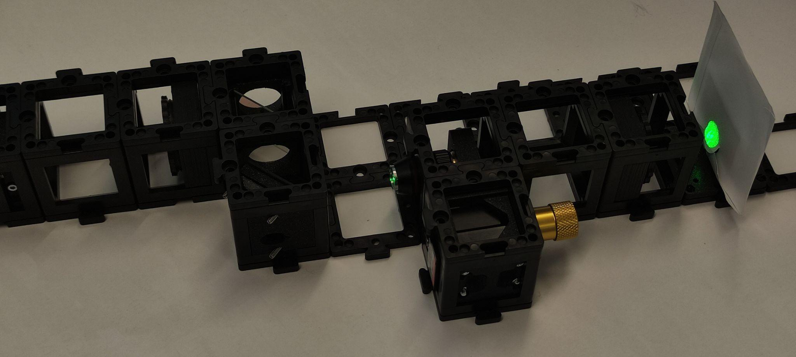
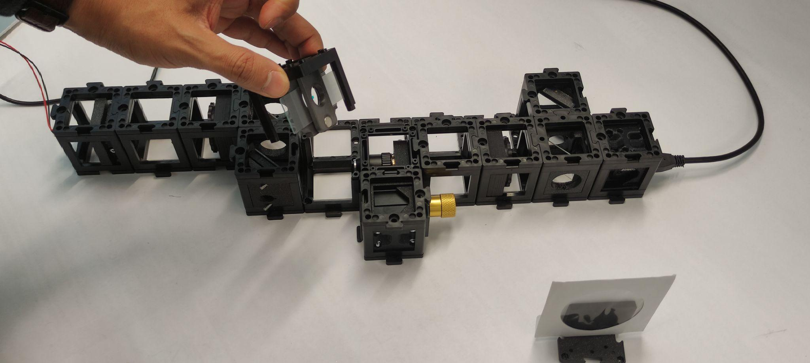
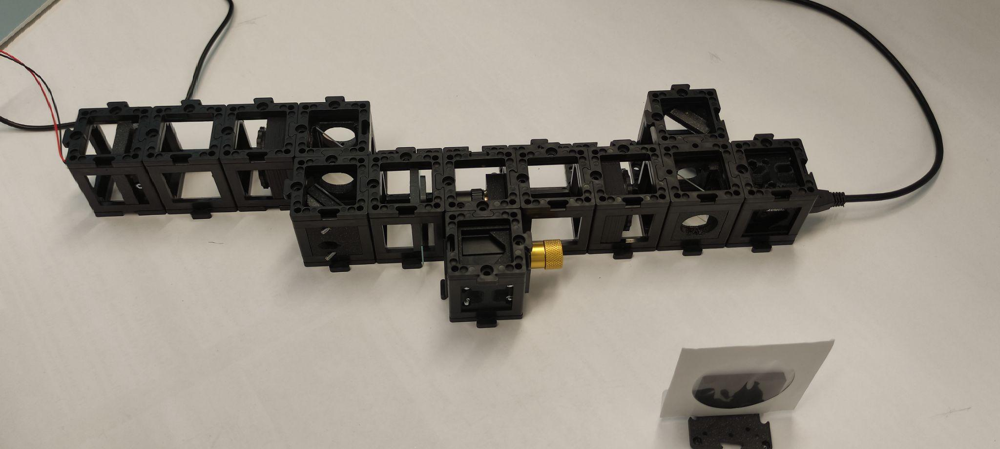
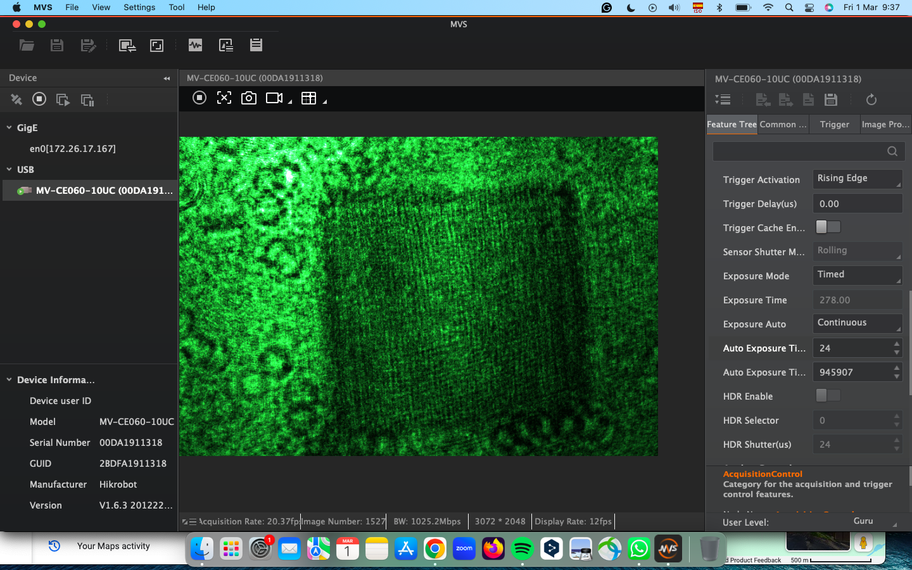

# Tutorial: Building a Mach-Zehnder Interferometer

In this workshop, we will construct a Mach-Zehnder Interferometer using the UC2 modular microscope toolbox. The Mach-Zehnder Interferometer is a powerful optical device that enables quantitative phase imaging and split-beam interferometry, making it invaluable for microscopy applications, materials science, and precision measurements.


### Materials Needed

- Laser diode (coherent light source)
- Hikrobot Camera (MV-CE060-10UC) with USB cable ([Hikrobot Camera Software installation](Camera_Software_tutorial.md))
- Small stage with gear for sample positioning
- Two kinematic mirrors (in cubes) for precise beam steering
- Two beam splitters in cube for beam division and recombination
- Sample holder (in cube) for specimen mounting
- Two empty cubes for beam path extension
- Base plates for mounting and stability
- Screen for initial alignment
- Pinhole in cube for spatial filtering
- Screwdriver to adjust alignment (1.5x60)
- Two 100 mm converging lenses for beam conditioning
- Microscope objective for high-resolution imaging


### Diagram


*Black and white box diagram showing the Mach-Zehnder Interferometer layout with components labeled for easier understanding*

### Theory of Operation

The Mach-Zehnder Interferometer splits coherent light into two separate paths (reference and sample arms) using the first beam splitter. The reference beam travels through air or a known medium, while the sample beam passes through or reflects from the specimen being studied. Both beams are then recombined at a second beam splitter, creating an interference pattern that contains information about the optical path differences introduced by the sample.

Unlike the Michelson Interferometer, the Mach-Zehnder design provides separate, independent paths for reference and sample beams, offering greater flexibility for sample insertion and manipulation. This configuration is particularly advantageous for transmission microscopy and quantitative phase imaging applications.


*Setup using an objective lens for microscopic imaging showing off-axis holography configuration*

### Theoretical Background

**Split-Beam Interferometry Principles**

The Mach-Zehnder Interferometer operates on the principle of amplitude division, where the incident beam is split into two components of approximately equal intensity. Each beam travels through different optical paths before being recombined. The resulting interference pattern depends on:

1. **Optical Path Difference (OPD)**: Δ = n₁L₁ - n₂L₂, where n is the refractive index and L is the path length
2. **Phase Difference**: δ = (2π/λ) × OPD
3. **Interference Condition**: Constructive interference occurs when δ = 2πm (m = integer)

**Quantitative Phase Imaging**

One of the most powerful applications of the Mach-Zehnder Interferometer is quantitative phase imaging, which allows measurement of:
- **Refractive index variations** in transparent samples
- **Thickness variations** in thin films and biological specimens  
- **Dynamic processes** in living cells and materials
- **Density fluctuations** in fluids and gases

**Phase Unwrapping and Data Analysis**

The interference fringes contain phase information that must be extracted through mathematical processing:
- **Fringe analysis**: Determines local phase from fringe spacing and orientation
- **Phase unwrapping**: Removes 2π ambiguities to obtain continuous phase maps
- **Quantitative measurements**: Converts phase data to physical quantities (thickness, refractive index, etc.)

**Applications in Modern Science**

Mach-Zehnder Interferometry has found extensive applications in:
- **Biomedical imaging**: Cell biology, tissue analysis, drug testing
- **Materials science**: Thin film characterization, surface analysis
- **Quality control**: Industrial inspection, defect detection
- **Fluid dynamics**: Flow visualization, density measurements
- **Telecommunications**: Fiber optic testing, optical component characterization

## Tutorial: Mach-Zehnder Interferometer

*TODO: Add image of all components laid out next to each other*

## Step 1: Assemble the Optical Components

This guide will walk you through the assembly step by step. You can follow the process according to the functional modules or refer to the diagram above for orientation.

**⚠️ ATTENTION!**

NEVER LOOK DIRECTLY INTO THE LASER! EYE WILL BE DAMAGED DIRECTLY

NEVER SWITCH ON THE LASER WITHOUT INTENDED USE

BEAM HAS TO GO AWAY FROM ONESELF - ALWAYS!

### 1.1: Build the Base Plate Configuration

Build the base plate configuration as shown. Note: At this point the laser diode should be turned off the whole time. Don't look at the laser directly. Always use screens to look for the laser light.


### 1.2: Align the Laser Diode with the Pinhole

Place the laser diode, an empty cube, and a 100 mm convergent lens in a straight line. Then, place the pinhole two cube units from the lens and place the screen after the pinhole. Turn the laser on and align it by using the screws to center the beam with the pinhole.


### 1.3: Check Beam Collimation

Check if the beam is collimated by placing the screen at different distances. The beam diameter should stay relatively the same size. If it is not the same size, this means that the distance between the laser and the lens should be adjusted. Turn the laser off.




### 1.4: Set up the Beam Splitter and Mirror

Place the beam splitter and the kinematic mirror as shown. Place the pinhole two cube units away from the mirror and the screen behind it. Turn the laser on and align the kinematic mirror using the screws. Once it's done, turn the laser off.


### 1.5: Adjust the Microscope Objective and Lens

Place the microscope objective, followed by an empty cube and the 100 mm lens. You should adjust the distance between the objective and the 100 mm lens so that the beam is collimated after going through both. Place the screen after the lens. Turn the laser on and check the collimation. Adjust the distance as necessary. Turn the laser off.





### 1.6: Setup and Alignment

Place the camera on the sample arm as shown. Put the screen on the other arm exit. Place the sample holder using one half of the cube at a time to not collide with the microscope objective.

Turn the laser on and use the screen to align both beams using the screws on the reference mirror.




## Step 2: Electronics

### 2.1: Plug in the Electronics as Shown Below

**⚠️ Caution!**
If you need to change any of the cables or their position, always unplug the 12V power cable before doing so. Otherwise, the electronic components might get damaged!

*TODO: Add complete electronic setup image showing every wire connected correctly*

- Connect the laser diode to the Mainboard at designated port
- Connect the camera to your PC via USB
- Connect motorized stage components if available
- *TODO: Add specific wiring diagram for Mach-Zehnder setup*

- Plug in the micro-USB at your ESP32 and connect to your PC.
- Plug in the 12V power cable.

### 2.2: Flashing the ESP32 Firmware

1. Before proceeding, ensure your ESP32 board has the latest firmware. You can download and flash the firmware via the official [openUC2 website](https://youseetoo.github.io/), selecting your version (most likely **ESP32-DEV-based UC2 standalone board V3 (beta)**), then click on the `connect` button.

The source code can be found [here](https://github.com/youseetoo/uc2-esp32).

2. Connect the ESP32 to your computer using the micro-USB cable.

3. In your Chrome browser, a dialog will prompt you to select the COM port for your ESP32, which should be shown as `CP2102 USB to UART Bridge Controller`. Once connected, you can install the latest firmware by simply clicking the "Install" button.

4. Wait until the firmware has been successfully flashed.

### 2.3: Connecting to the Web Interface

1. After flashing the firmware, go to the testing section on the same website.

2. Connect to your ESP32 board using the "Connect" button again, ensuring the correct COM port is selected.

3. Once connected, test the system by sending a simple command:

```json
{"task":"/motor_act", "motor": { "steppers": [ { "stepperid": 3, "position": -1000, "speed": 1000, "isabs": 0, "isaccel": 0} ] } }
```

This command will move the Z-axis motor by -1000 steps (1 full rotation) at a speed of 1000 steps per second.

**Note:** Ensure that the command string has no line breaks.

### 2.4: Testing in the Web Interface

1. After completing the test, go back to the first tab to control the other components via buttons:
   - `Laser 1(on)` and `Laser 1(off)` control the laser diode.
   - `Motor Z(+)` and `Motor Z(-)` control the Z-stage.
   - `Motor X(+)/Y(+)/A(+)` and `Motor X(-)/Y(-)/A(-)` control the XYZ-stage.

### 2.5: Setup and Use the Camera Software

1. Connect the camera via cable to your PC.

2. For the installation process and usage of the software, follow these instructions: [Install MVS App for Camera Utilization](https://openuc2.github.io/docs/Electronics/HIKCamera/SoftwareTutorial)

## Step 3: Aligning the Mach-Zehnder Interferometer

### 3.1: Connect and Adjust in the MVS App

Connect the camera to the computer and open the MVS app. Block the reference beam. Move the coverslide such that your sample enters the FoV (Field of View). Unblock the reference beam. Zoom into the image to distinguish the fringe pattern in the MVS camera display. Adjust the angles of the reference mirror using the screws to change the fringe pattern as shown.



### 3.2: Optimize Fringe Visibility

Fine-tune the alignment to achieve maximum fringe contrast. The fringe spacing and orientation can be controlled by adjusting the angle between the reference and sample beams.

### 3.3: Sample Positioning

Carefully position your sample in the sample arm. Observe how the fringe pattern changes as different parts of the sample are illuminated.

## Step 4: Install ImSwitch (optional)

#### 1. Installation process

For this, please refer to the installation instructions [here](https://openuc2.github.io/docs/ImSwitch/Quickstart).

On top of this, you can use the following `ImSwitchClient` template to remote control your microscopy using google colab or jupyter notebook. This gives some hints on the use of the API:

<a target="_blank" href="https://colab.research.google.com/drive/1W3Jcw4gFn0jtQXa3_2aCtJYJglMNGkXr?usp=sharing">
  
</a>

This makes use of the default URL hosted publicly on https://imswitch.openuc2.com/imswitch/index.html, but you can change this to the `PORT` (i.e. 8001) and `URL` (e.g. the Raspberry Pi's IP address that runs ImSwitch in docker and is in the same network as your computer).

**Your Setup is complete, now let's start the Experiments**

---
---

## Experiment 1: Basic Interferometry Setup and Alignment

### 1.1: Establish Interference Fringes

Turn on the laser and observe the interference pattern on the camera. Adjust the reference mirror to create clear, visible fringes across the field of view.

*TODO: Add image of properly aligned fringe pattern*

### 1.2: Characterize Fringe Properties

Measure and document:
- Fringe spacing and orientation
- Fringe contrast (visibility)
- Stability over time

### 1.3: Sensitivity Testing

Make small adjustments to the reference mirror and observe how the fringe pattern responds. This demonstrates the high sensitivity of interferometric measurements.

## Experiment 2: Quantitative Phase Imaging

### 2.1: Sample Preparation

Prepare transparent samples with known properties:
- Glass slides of different thicknesses
- Transparent films
- Biological specimens (if available)

### 2.2: Phase Measurement

Place samples in the sample arm and record the resulting fringe patterns. Compare with reference measurements without the sample.


*Setup modifications showing the linear stage for precise sample positioning*

### 2.3: Data Processing

Process the data using phase unwrapping algorithms. Using Lei's code or similar algorithms, the need for a linear stage for the sample has been identified. Adjusting the objective and tube lens enhances the interference, making it crucial to use the ImSwitch interface to see the FFT in real time and optimize.


*Data processing and phase unwrapping interface*

## Experiment 3: Dynamic Measurements

### 3.1: Time-Resolved Imaging

Set up continuous recording to observe dynamic processes in samples:
- Thermal effects
- Fluid flow (if applicable)
- Material changes over time

### 3.2: Analysis of Results

The final goal is to move the position of the first order interference to use Lei's algorithm (or some Phase unwrapping algorithm) to retrieve the phase. To achieve this, two images need to be acquired: a sample image and a background image (without a cover slide or a slide region with no specimen).


*Result of Phase Unwrapping showing quantitative phase map*

### 3.3: Quantitative Analysis

Convert phase measurements to physical quantities:
- Thickness variations
- Refractive index changes
- Surface roughness parameters

*TODO: Add detailed calibration procedures for quantitative measurements*

*TODO: Add troubleshooting guide for common alignment and stability issues*

*TODO: Add assessment questions covering interferometry principles and applications*

*TODO: Add advanced experimental extensions for exploring different samples and measurement techniques*
