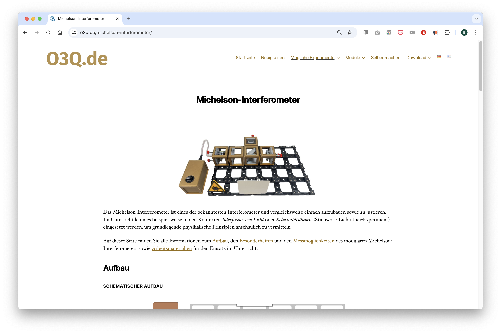
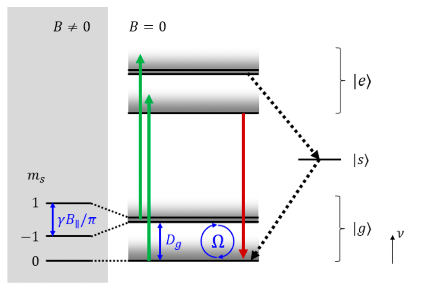

# Einführung in NV-Zentren, Elektronenspin und ODMR

:::tip
You can find additional information from our colleagues over at the University / FH Münster. They have educator's friendly documentation for the different types of **Inteferometers**, **ODMR**, etc.

You can find them here: https://o3q.de/ -> *Mögliche Experimente*
:::

## 1. Was ist ein NV-Zentrum?

Ein **NV-Zentrum** („Nitrogen-Vacancy“) ist ein **Punktdefekt** im Kristallgitter von **Diamant**, bestehend aus:

* einem **Stickstoffatom**, das ein Kohlenstoffatom ersetzt, und
* einer **benachbarten Leerstelle** (Vakanz).

In seiner **negativ geladenen Form (NV⁻)** enthält es **6 Elektronen**, die in vier Molekülorbitalen ($a_1$, $a_1'$, $e_x$, $e_y$) verteilt sind. Zwei Elektronen mit **parallel ausgerichtetem Spin** besetzen die entarteten Orbitale $e_x$ und $e_y$, was zu einem **Gesamtspin S = 1** führt.

## 2. Was ist Spin?

Der **Spin** ist eine fundamentale quantenmechanische Eigenschaft von Teilchen, vergleichbar mit einem inneren Drehimpuls. Er ist:

* **keine reale Drehung**, sondern eine quantisierte Eigenschaft mit zwei möglichen Zuständen beim Elektron:

  $$
  m_s = +\tfrac{1}{2} \quad \text{(Spin-up)}, \quad m_s = -\tfrac{1}{2} \quad \text{(Spin-down)}
  $$
* verantwortlich für:

  * das **Pauli-Prinzip**: Kein Elektron kann denselben Quantenzustand wie ein anderes besetzen.
  * die **Hund’sche Regel**: Orbitale werden zuerst mit **gleichgerichtetem Spin** einfach besetzt.

In NV-Zentren ist der Spinwert sogar $S = 1$, was drei Projektionen erlaubt: $m_s = 0, +1, -1$.

## 3. Energiezustände im NV-Zentrum

Das NV-Zentrum besitzt:

* einen **Triplett-Grundzustand** $|g⟩$,
* einen **Triplett-angeregten Zustand** $|e⟩$,
* einen **nicht-fluoreszierenden Singulett-Zwischenzustand** $|s⟩$.

Durch **Spin-Spin-Wechselwirkungen** (auch ohne Magnetfeld!) wird der Grundzustand in:

* $|g, m_s = 0⟩$ und
* $|g, m_s = ±1⟩$

aufgespalten. Die Energieaufspaltung beträgt:

$$
D_g \approx 2.87 \text{ GHz}
$$

## 4. Optisch detektierbare Magnetresonanz (ODMR)

### Grundidee

* Das NV-Zentrum wird mit **grünem Licht (532 nm)** angeregt.
* Es fluoresziert im roten Bereich (\~637–800 nm) **abhängig vom Spin-Zustand**.

### Fluoreszenzpfade

* $|e,0⟩ \rightarrow |g,0⟩$: **strahlender Übergang** → **helle Fluoreszenz**
* $|e,±1⟩ \rightarrow |s⟩ \rightarrow |g,0⟩$: **nicht-strahlend** → **dunkler**

### Mikrowellen-Anregung

* Mikrowellen mit **2.87 GHz** induzieren **Spin-Flips** zwischen $|g,0⟩$ und $|g,±1⟩$.
* Dadurch landet das Elektron in einem weniger fluoreszierenden Zustand ⇒ **Dunkelheits-Dip in der Fluoreszenz**.

### Mit externem Magnetfeld

* Ein **statisches Magnetfeld** entlang der NV-Achse verursacht einen **Zeeman-Effekt**, der $|g,+1⟩$ und $|g,-1⟩$ **weiter aufspaltet**.
* Zwei Resonanzfrequenzen entstehen ⇒ Zwei Dips im ODMR-Spektrum.

## 5. Wichtige Fragen und Antworten

### ▶ Warum spalten sich die $m_s = ±1$ Zustände?

Wegen **Nullfeldaufspaltung** durch Spin-Spin-Wechselwirkung im Kristallfeld.

### ▶ Was ist der Singulett-Zustand?

Ein **nicht-strahlender Zwischenzustand**, über den Elektronen von $|e,±1⟩$ nach $|g,0⟩$ relaxieren – **ohne Lichtemission**.

### ▶ Wie kommt das Elektron von $|g,0⟩$ nach $|g,±1⟩$?

Durch **gezielte Mikrowellenanregung** bei **2.87 GHz**, die genau der Energieaufspaltung entspricht.

## 6. ODMR-Signal – was wird gemessen?

* Das ODMR-Signal ist die **Fluoreszenzintensität als Funktion der Mikrowellenfrequenz**.
* Ohne Mikrowellen: Maximale Fluoreszenz.
* Bei Resonanz: Absinken der Fluoreszenz (Spin wird aus $m_s = 0$ „herausgeflipped“).
* Bei Magnetfeldern: Zwei Absorptionsdips statt einem.

## 7. Warum ist das wichtig?

* **Quantensensorik**: Präzise Messung von Magnetfeldern (Nanotesla-Bereich).
* **Quanteninformation**: Spinzustände dienen als **Qubits**.
* **Biophysik & Materialwissenschaft**: Sensoren für Temperatur, elektrische Felder, pH-Wert etc.

## 8. Zusammenfassung als Merksatz

:::warn
**Der Spin macht den Unterschied:**
Er strukturiert Orbitale (Pauli, Hund), teilt den Grundzustand auf (NV),
und erlaubt es, mit Licht und Mikrowellen **Quanteninformation sichtbar zu machen.**
:::

## 9. Zustände:

### 1. Nur optische Anregung (532 nm, kein Magnetfeld, keine Mikrowelle)

Der NV-Zentrum wird mit einem 532 nm Laser angeregt: Elektronen gehen vom Grundzustand ∣g⟩ in den angeregten Zustand ∣e⟩.
Dort gibt es zwei Pfade zurück:
* ∣e,0⟩→∣g,0⟩ mit starker Fluoreszenz
* ∣e,±1⟩ → nicht-strahlender Übergang über Singulett-Zustand ∣s⟩ → ∣g,0⟩ ⇒ Fluoreszenz reduziert

Ergebnis: Meiste NV-Zentren landen am Ende im ∣g,0⟩|g,0⟩∣g,0⟩. Das nennt man optisches Pumpen in den ms=0 Zustand.

### 2. Optische Anregung + Mikrowelle (2.87 GHz)

Eine Mikrowelle mit 2.87 GHz trifft genau die Energieaufspaltung zwischen ∣g,0⟩  und ∣g,±1⟩ (Nullfeldaufspaltung Dg).
Das bewirkt einen Spin-Flip:
* Elektronen werden periodisch zwischen ∣g,0⟩ ⇄ ∣g,±1⟩ hin- und hergeschaltet (Rabi-Oszillationen).

Folge: Mehr Elektronen landen in ∣e,±1⟩, die dann über den Singulett-Zustand relaxieren ⇒ Fluoreszenz wird dunkler.

### 3. Optische Anregung + Mikrowelle + äußeres Magnetfeld

Durch ein externes Magnetfeld B∥entlang der NV-Achse wird das entartete ms=±1 Niveau gesplittet (Zeeman-Effekt).
Jetzt gibt es zwei unterschiedliche Resonanzfrequenzen:
∣g,0⟩→∣g,+1⟩
∣g,0⟩→∣g,−1⟩
Mikrowellenfrequenz wird durchgestimmt → es gibt zwei Dips in der Fluoreszenz. Das ist das typische ODMR-Signal unter Magnetfeld.

