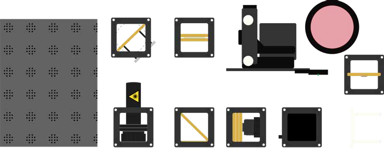

# Tutorial: Building an ODMR (Optically Detected Magnetic Resonance) Setup

In this workshop, we will construct an ODMR (Optically Detected Magnetic Resonance) system using the UC2 modular microscope toolbox and NV (Nitrogen-Vacancy) diamonds. ODMR is a quantum sensing technique that allows us to measure magnetic fields by observing changes in fluorescence from quantum systems. This experiment introduces students to quantum mechanics, spin physics, and modern sensing applications at room temperature.

*ODMR setup*

**What We Measure and Learn**

Through this experiment, students learn:
* How quantum systems can be manipulated and measured optically
* The relationship between magnetic fields and quantum spin states  
* How microwave radiation can affect electron transitions
* The principles behind confocal microscopy and fluorescence detection
* Real-world applications of quantum sensing technology

**Technical Details of the ODMR Process**

The goal of the ODMR setup is to understand how we can optically measure magnetic fields through the reduction of fluorescence in the resonance case when microwaves interact with a diamond. This effect is interesting for indirectly measuring magnetic fields precisely through optical readout.

What we specifically measure is the resonance of the defect site in a diamond with NV centers. We have small diamonds with a diameter of approximately 100 nanometers and several NV sites placed on a circuit board that serves as an antenna. We excite these with laser light of a specific wavelength. Even without applied microwaves, we can measure the fluorescence of the diamond. This means we excite the diamond with green light (532 nanometers) and can measure the emissions in the red spectrum (over 600 nanometers).

The core idea is that when we apply microwaves, we can observe the Zeeman effect by splitting the spin-flip into negative and positive components, where the reduction in fluorescence shifts symmetrically to the respective negative and positive parts relative to the positive or negative spin.

## Diagram

*diagram showing ODMR setup layout with components labeled for easier understanding*

## Materials Needed

1. Base plate for mounting components
2. Green laser diode (532 nm) for NV center excitation
3. 45° mirror for beam steering
4. Beam splitter with filter for separating excitation and fluorescence
5. Converging lens for focusing laser light
6. Light sensor (photodiode) for fluorescence detection
7. Electronics control box with microwave generation capability
8. XY-stage with NV diamond sample
9. Screen for initial alignment
10. Color filter (red) for fluorescence isolation
11. Magnet for applying external magnetic field
12. Microwave antenna for spin manipulation

*All components in the kit*

## Theory of Operation

The ODMR setup operates by using laser light to excite nitrogen-vacancy (NV) centers in diamond crystals and detecting their fluorescence. When microwave radiation at the resonant frequency (approximately 2.87 GHz) is applied, it causes transitions between quantum spin states, resulting in a measurable decrease in fluorescence intensity. This effect forms the basis for sensitive magnetic field measurements.

The system works as a quantum magnetometer by monitoring the fluorescence output while sweeping microwave frequencies. At resonance, fewer photons are emitted due to quantum spin transitions, creating characteristic dips in the fluorescence signal. External magnetic fields shift these resonance frequencies, allowing precise magnetic field measurements.

### Theoretical Background

**Quantum Spin and NV Centers**

Nitrogen-vacancy (NV) centers are point defects in diamond consisting of a nitrogen atom adjacent to a vacant lattice site. These quantum systems have unique properties that make them ideal for sensing applications:

**Electronic Structure and Spin States**
- NV centers possess a spin-1 ground state with three possible spin projections: ms = -1, 0, +1
- The ms = 0 state is separated from ms = ±1 states by approximately 2.87 GHz
- Optical excitation and relaxation cycles depend on the spin state

**Optically Detected Magnetic Resonance Principle**

The ODMR effect relies on spin-dependent fluorescence:
1. **Optical Pumping**: Green laser light (532 nm) preferentially initializes NV centers into the ms = 0 spin state
2. **Microwave Manipulation**: Resonant microwaves drive transitions between spin states
3. **Optical Readout**: Red fluorescence intensity depends on the spin state population
4. **Magnetic Sensitivity**: External magnetic fields shift resonance frequencies via the Zeeman effect

*NV Center in a diamond lattice*

**The Zeeman Effect and Magnetic Field Sensing**

When an external magnetic field is applied, the energy levels of the NV center split according to:
- E = D + γmsBz (where D ≈ 2.87 GHz, γ is the gyromagnetic ratio, and Bz is the magnetic field)
- This splitting creates two resonance peaks separated by 2γBz
- Measuring the frequency separation directly gives the magnetic field strength

**Quantum Coherence and Sensitivity**

NV centers maintain quantum coherence at room temperature, enabling:
- **Single-spin sensitivity**: Individual NV centers can be addressed optically
- **Long coherence times**: Quantum states remain stable for microseconds
- **High spatial resolution**: Nanoscale magnetic field mapping
- **Broad temperature range**: Operation from cryogenic to elevated temperatures

**Confocal Microscopy Setup**

The optical configuration follows confocal microscopy principles:
- **Excitation path**: Laser light is focused onto NV centers using a converging lens
- **Collection path**: Fluorescence is collected through the same lens (confocal configuration)
- **Spectral separation**: Dichroic beam splitter separates excitation and fluorescence wavelengths
- **Optical Detection**: A lens is collecting the emitted light and focusses it on a photodiode (Adafruit) to readout the signal

**Modern Applications and Significance**

ODMR with NV centers represents a leading quantum sensing technology with applications in:
- **Biomedical imaging**: Mapping magnetic fields in living cells and tissues
- **Materials science**: Studying magnetic domains and spin transport
- **Fundamental physics**: Testing quantum mechanics and measuring fundamental constants
- **Quantum information**: Building blocks for quantum computers and networks

### Diamond's are a physicist best friend

NV stands for Nitrogen-Vacancy, referring to a diamond with a specific "impurity," usually visible as a pink coloration.

**How Are NV Diamonds Formed?** Diamonds consist of a carbon atom lattice. In an NV diamond, one carbon atom is missing and replaced by a nitrogen atom. A vacancy is left next to the nitrogen, creating the NV center.

**What Makes NV Diamonds Special?**
- Their spin states can be manipulated and read out via laser light, magnetic fields, and microwaves
- NV centers are stable quantum systems at room temperature, making them candidates for quantum computing
- They exhibit exceptional sensitivity to magnetic fields, electric fields, and temperature
- Single NV centers can be addressed and controlled optically

---
# Tutorial: ODMR Setup

This guide will walk you through the assembly step by step. You can follow the process according to the functional modules or refer to the diagram above for orientation.

### SAFETY INSTRUCTIONS

**⚠️ ATTENTION!**

**Laser Safety:**
* The laser is only turned on when it is mounted on the base plate.
* The laser must be turned off each time it is repositioned.
* Before switching on, verify the direction of the beam. It should always run parallel to the table surface.
* Remove or cover reflective jewelry (rings, watches, bracelets).
* Remove reflective objects from the table (e.g. cases, rulers, wallets, phones).
* NEVER LOOK DIRECTLY INTO THE LASER! EYE WILL BE DAMAGED DIRECTLY
* NEVER SWITCH ON THE LASER WITHOUT INTENDED USE
* BEAM HAS TO GO AWAY FROM ONESELF - ALWAYS!

**Magnet Safety:**
* Individuals with implants must inform the supervisor. Special precautions may be necessary.
* Keep devices like phones, tablets, computers, and credit cards away from the experiment.
* Loose magnets must never be swallowed. Inform the instructor immediately if a magnet comes loose.

## Step 1: Assemble the Optical Components

## 1.1 Setting up the ODMR setup with images
Build the setup as shown in the photos. This creates a confocal microscopy configuration optimized for ODMR measurements. This is the basic configuration where the laser is focused on the diamond and then the fluorescence signal is going back to the detector.

This is a suggested step-by-step guide on how to build the ODMR setup. You can do it the way you like. Things like the xy stage and the baseplate may be upgraded in your version. This does not affect the function or the result.

*The Box in its complete form*

*Open the box*

*All the components for experiments like interferomenter, polarization, etc.*

*Let'S start by putting the 532nm laser on the grid like that, where the laser points to the right hand side. Don't turn it on yet.*

*Add the 45° kinematic mirror mount -in case it's 90°, you can open it and change its orientation*

*Add the dichroic mirror mountso that the reflecting green-ish filter reflects it to the left hand side*

*You can try the setup by turning on the laser - DON'T LOOK INTO IT!*

*Add the f=40mm lens and observe where it focusses*

*You can follow the focus with the white card*

*Add the xyz stage with the diamond attached. Adjust it such that the black spat aka the Dimaond is roughly placed in the focus of the laser. In the picture the Magnet is already placed behind the Diamonds. You can do this, but you have to remove it later, so you can also skip this for now.*

*Add the photo diode after the dichroic mirror. Ensure that the lens faces the red filter that blocks the excitation light*

*connect the I2C cable (stemma) to the ODMR board that produces the high frequency oscillation necessary to excite the diamond*

*Add a puzzle layer on top to fix everything in place*

*Adjust the diamonds w.r.t. the laser focus in X/Y/Z to ensure we are hitting the diamond in the focus of the green laser light. This requires some testing and training. Adjust the XY-stage to place the diamond in the focus of the lens. The diamond should glow brightly when viewed through the red filter, indicating efficient excitation of the NV centers. The spot on the diamond should be smallest. This is achieved when the distance between the lens and the diamond PCB matches the focal length of the lens (40mm).*

*Identify the fluorescence signal with the red auxillary filter*

*Adjust the diamond in Y (this mechanism may have changed in your version)*

*Closeup: Identify the fluorescence signal with the red auxillary filter*

*Move the diamond and monitor the fluorescence signal until it becomes brightes while moving the diamond in X/Y/Z*

## Step 2: Electronics

### 2.1: Plug in the Electronics as Shown Below

*Complete electronic setup image showing every wire connected correctly for ODMR: The photodiode connects to the ESP32s3 board via the I2C Stemma cable and the antenna connects to the board via the SMA cable*

- the laser diode has its own battery, so you can use the switch in the rear
- Connect the photodiode to the I2C input port at the control box, if not already done
- Connect the microwave antenna to the control box
- Connect the XY-stage motors if available

### 2.2: Flashing the ESP32 Firmware

1. Connect the ESP32 in the control box to your computer using the USB-C cable.

2. Eensure your ESP32 board has the latest firmware. You can download and flash the firmware via the official [openUC2 website](https://youseetoo.github.io/) in the **Chrome** browser, selecting your version (most likely **ESP32C3 ODMR Quantum Mini Labs)**), then click on the `connect` button.

  The source code can be found [here](https://github.com/openUC2/TechnicalDocs-openUC2-QBox/tree/main/Production_Files/Software/ODMR_Server).

3. In your Chrome browser, a dialog will prompt you to select the COM port for your ESP32, which should be shown as `CP2102 USB to UART Bridge Controller` or alike. Once connected, you can install the latest firmware by simply clicking the "Install" button.

4. Wait until the firmware has been successfully flashed.

  <iframe
    style={{position: 'absolute', top: 0, left: 0, width: '100%', height: '100%'}}
    src="https://www.youtube.com/embed/rGLcOb0IWbg?si=rmYORgaFhbwyFtMG"
    title="YouTube video player"
    frameBorder="0"
    allow="accelerometer; autoplay; clipboard-write; encrypted-media; gyroscope; picture-in-picture"
    allowFullScreen
  />

### 2.3: Connecting to the Web Interface

After flashing the firmware - unplug and replug the ESP and go to https://youseetoo.github.io/odmr and connect to the board via Web Serial (once on the website go to ` Messung( Webserial)`).

Aternatively, you can wait until the device creates its own Wi-Fi network.
- Click on the Wi-Fi / network icon in the bottom right corner of your screen (where you normally select your Wi-Fi).
- After a few seconds, a new network called something like `ODMR-XXXX` should appear in the list.
- Select this network to connect to the device.
- Once connected, open your browser and go to http://192.168.4.1
- Once on the website go to ` Messung(Device)`).

### 2.4: Testing in the Web Interface

1. Control the various components via the web interface:

   - Monitor photodiode signal levels
   - Test microwave output (frequency sweeps)

When starting an acquisition, you should see the frequency go through the min/max values by step increments. The graph shows the red light intensitiy as a function of frequency. The Minima indicate spin flips.

*ODMR Electronics: fluorescence response with spin flip*

## Step 3: Optimize the ODMR Setup
now that the electronics is working you can finetune your setup for maximum fluorescence signal and best signal-to-noise ratio by adjusting:
- Laser focus on the diamond
- Collection efficiency of fluorescence
- Microwave coupling to the NV centers

Ensure the laser beam is aligned with the optical axis of the "Confocal" microscope. The laser should be focused on the diamond surface, creating a small, bright spot. **Use the smartphone trick described in the video below.**

  <iframe
    style={{position: 'absolute', top: 0, left: 0, width: '100%', height: '100%'}}
    src="https://www.youtube.com/embed/8tJhlHfuvL0?si=ohXf12IAvCqg6zOh"
    title="YouTube video player"
    frameBorder="0"
    allow="accelerometer; autoplay; clipboard-write; encrypted-media; gyroscope; picture-in-picture"
    allowFullScreen
  />

---
## Experiment 1: Basic ODMR Signal Detection

### 1.1: Establish Baseline Fluorescence

Turn on the laser and measure the baseline fluorescence signal from the NV centers without microwave excitation. Record the signal level and stability.

### 1.2: Apply Microwave Radiation

Turn on the microwave source and sweep through frequencies around 2.87 GHz while monitoring the fluorescence intensity.

### 1.3: Observe ODMR Dip

Look for the characteristic dip in fluorescence at the resonance frequency. This indicates successful spin manipulation of the NV centers.

---

## Experiment 2: Magnetic Field Measurement

### 2.1: Zero-Field Measurement

Record the ODMR spectrum without the external magnet to establish the zero-field splitting.

### 2.2: Apply External Magnetic Field

Install the magnet cube in the setup. The magnet provides an external magnetic field that will split the ODMR resonance lines.  

### 2.3: Analyze Zeeman Splitting

Observe any intensity changes when changing the magnet's position. This demonstrates the magnetic field dependence of the NV center fluorescence.

 The higher the b-field the more the split is visible. The following screenshot shows the system without the magnet - however, it appears that there is already some splitting happening. This may be due to the "bad" quality (i.e. orientation/stress inside )of the diamond. We don't fully understand this effect yet.

 Position the magnet at various distances from the diamond and record how the ODMR spectrum changes.

*Image without magnet*

Once you insert the magnet, you can see that the two levels are seperated further apart:

*Image with magnet*

---

## Experiment 3: Advanced ODMR Techniques

### 3.1: Pulsed ODMR Measurements (coming soon as Coherent Control)

### 3.2: Spatial Mapping (coming soon)

### 3.3: Temperature Dependence (coming soon)

---

# The QuantumMiniLabs Project

The QuantumMiniLabs project is developing an open-source ecosystem that enables low-cost, scalable, modular, and repairable quantum tech experiments. The goal is to deploy the system at 100 educational locations across Germany.

QuantumMiniLabs offer the first affordable DIY platform for experimenting with second-generation quantum systems. NV diamonds allow for stable experiments at room temperature.
