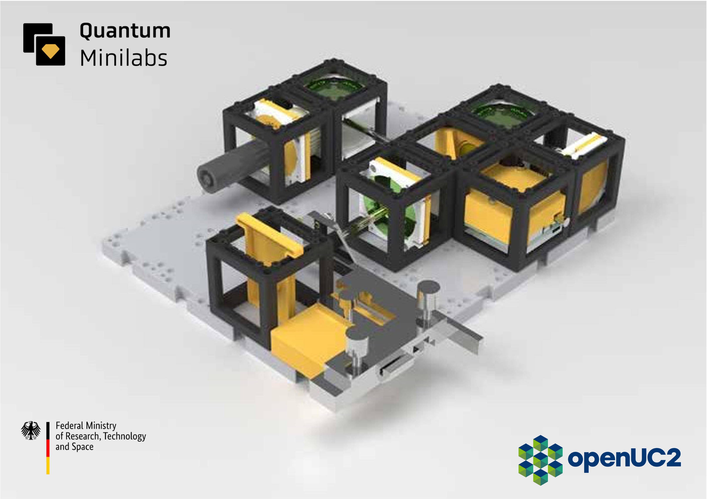
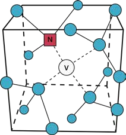
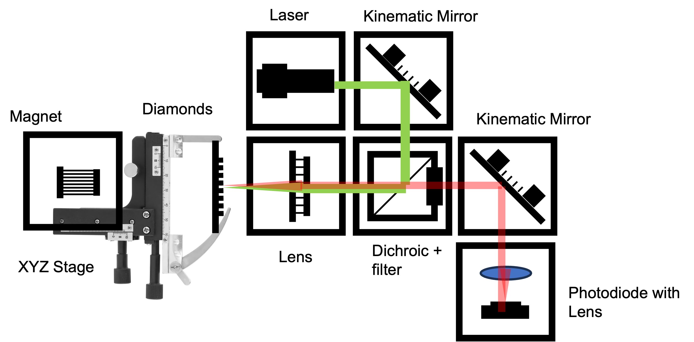
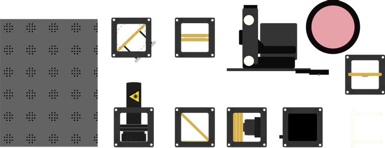
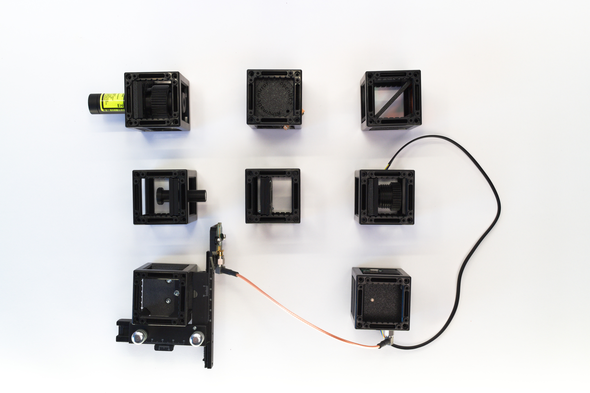
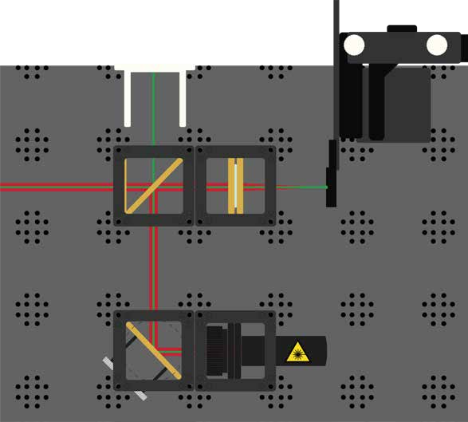
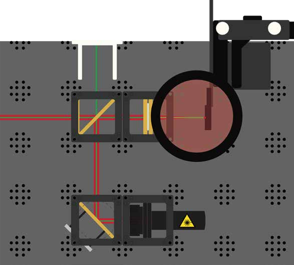
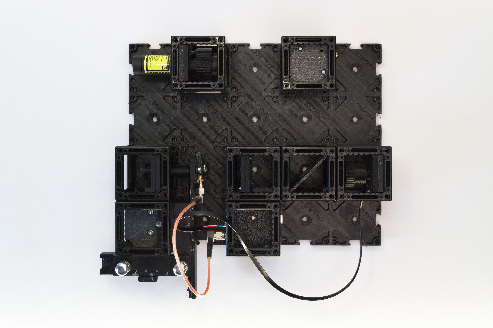
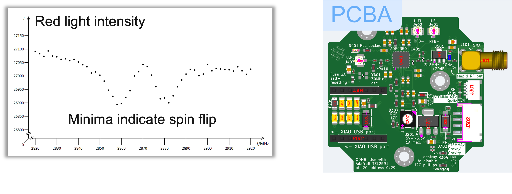
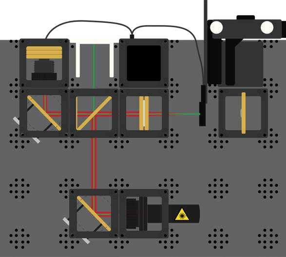

# Anleitung: Aufbau eines ODMR‑Setups (Optisch Detektierte Magnetresonanz)

In diesem Workshop bauen wir ein ODMR‑System (Optisch Detektierte Magnetresonanz) mit dem UC2‑modularen Mikroskop‑Werkzeugkasten und NV‑Diamanten auf. ODMR ist eine Quantensensorik-Technik, mit der wir Magnetfelder messen, indem wir Änderungen der Fluoreszenz von Quantensystemen beobachten. Dieses Experiment führt Studierende in Quantenmechanik, Spin‑Physik und moderne Sensortechniken bei Raumtemperatur ein.

*3D‑Rendering des openUC2‑ODMR‑Setups*

### Funktionsprinzip

Das ODMR‑Setup funktioniert, indem Laserlicht verwendet wird, um Stickstoff‑Vakanzen (NV‑Zentren) in Diamantkristallen anzuregen und deren Fluoreszenz zu detektieren. Wenn Mikrowellen bei der Resonanzfrequenz (ca. 2,87 GHz) angelegt werden, bewirken sie Übergänge zwischen quantenmechanischen Spin‑Zuständen, was zu einer messbaren Abnahme der Fluoreszenzintensität führt. Dieser Effekt bildet die Grundlage für hochsensible Magnetfeldmessungen.

Das System arbeitet als Quantenmagnetometer, indem es die Fluoreszenz bei variierenden Mikrowellenfrequenzen überwacht. In der Resonanz werden weniger Photonen emittiert, da Spin‑Übergänge stattfinden, was charakteristische Dips im Fluoreszenzsignal erzeugt. Externe Magnetfelder verschieben diese Resonanzfrequenzen, was eine präzise Bestimmung der Magnetfeldstärke ermöglicht.

### Theoretischer Hintergrund

**Quanten‑Spin und NV‑Zentren**
Stickstoff‑Vakanzen (NV‑Zentren) sind Punktdefekte in Diamant, bestehend aus einem Stickstoffatom neben einer leeren Gitterstelle. Diese Quantensysteme weisen einzigartige Eigenschaften auf, die sie ideal für Sensorik machen:

**Elektronische Struktur und Spin‑Zustände**

* NV‑Zentren besitzen einen Spin‑1‑Grundzustand mit drei Projektionen: mₛ = –1, 0, +1
* Der mₛ = 0‑Zustand ist um ca. 2,87 GHz von den mₛ = ±1‑Zuständen getrennt
* Anregungs‑ und Relaxationszyklen sind spinabhängig

**Prinzip der Optisch Detektierten Magnetresonanz**

1. **Optisches Pumpen**: Grünes Laserlicht (532 nm) initialisiert NV‑Zentren bevorzugt in den mₛ = 0‑Zustand
2. **Mikrowellenmanipulation**: Resonante Mikrowellen treiben Übergänge zwischen den Spin‑Zuständen
3. **Optische Auslese**: Die Intensität der roten Fluoreszenz hängt von der Spin‑Zustandsverteilung ab
4. **Magnetempfindlichkeit**: Externe Magnetfelder verschieben Resonanzfrequenzen über den Zeeman‑Effekt

*NV‑Zentrum im Diamantgitter*

**Zeeman‑Effekt und Magnetfeldmessung**
Bei Anlegen eines externen Magnetfelds spalten sich die Energie­niveaus gemäß:
E = D + γ mₛ B\_z (wobei D ≈ 2,87 GHz, γ das gyromagnetische Verhältnis und B\_z das Magnetfeld ist)
Diese Aufspaltung erzeugt zwei Resonanzpeaks, getrennt um 2γB\_z. Die Frequenzdifferenz liefert direkt die Magnetfeldstärke.

**Quantenkohärenz und Empfindlichkeit**
NV‑Zentren behalten Quantenkohärenz bei Raumtemperatur, was ermöglicht:

* **Einzelspin‑Empfindlichkeit**: Optische Adressierung einzelner NV‑Zentren
* **Lange Kohärenzzeiten**: Zustände bleiben Mikrosekunden stabil
* **Hohe räumliche Auflösung**: Magnetfeldkartierung im Nanobereich
* **Breiter Temperaturbereich**: Betrieb von Kryo‑ bis erhöhten Temperaturen

**Konfokales Mikroskopie‑Setup**
Die Optik folgt konfokalen Prinzipien:

* **Anregungsweg**: Laserstrahl wird mit einer Konvexlinse auf NV‑Zentren fokussiert
* **Detektionsweg**: Fluoreszenz wird durch die gleiche Linse gesammelt (konfokale Anordnung)
* **Spektrale Trennung**: Dichroitischer Strahlteiler trennt Anregungs‑ und Fluoreszenzwellenlängen
* **Optische Detektion**: Ein Fokus‑Objektiv leitet das Licht auf eine Photodiode (Adafruit) zur Signal­auslese

**Moderne Anwendungen und Bedeutung**
ODMR mit NV‑Zentren ist eine führende Quantensensorik‑Technologie mit Anwendungen in:

* **Biomedizinischer Bildgebung**: Magnetfeldmapping in lebenden Zellen und Geweben
* **Materialwissenschaft**: Untersuchung magnetischer Domänen und Spin‑Transport
* **Fundamentaler Physik**: Tests der Quantenmechanik und Messung physikalischer Konstanten
* **Quanteninformation**: Bausteine für Quantencomputer und -netzwerke

### Diagramm

*Schema des ODMR‑Aufbaus mit beschrifteten Komponenten*

### Diamanten sind des Physikers bester Freund

NV steht für Nitrogen‑Vacancy, d. h. ein Diamant mit einem spezifischen „Verunreinigungs“-Defekt, oft sichtbar als rosa Färbung.

**Wie entstehen NV‑Diamanten?**
Diamanten bestehen aus einem Kohlenstoffgitter. In einem NV‑Diamanten fehlt ein Kohlenstoffatom und wird durch ein Stickstoffatom ersetzt. Dabei entsteht eine benachbarte Vakanz – das NV‑Zentrum.

**Was macht NV‑Diamanten besonders?**

* Spin‑Zustände sind mit Laserlicht, Magnetfeldern und Mikrowellen manipulierbar und auslesbar
* NV‑Zentren sind stabile Quantensysteme bei Raumtemperatur, geeignet für Quantencomputer
* Außerordentliche Empfindlichkeit gegenüber Magnetfeldern, elektrischen Feldern und Temperatur
* Einzelne NV‑Zentren sind optisch adressierbar und steuerbar

## Anleitung: ODMR‑Aufbau

### Benötigte Materialien

1. Grundplatte zur Montage
2. Grüner Laserdiode (532 nm) zur NV‑Anregung
3. Zwei 45°‑Spiegel zur Strahllenkung
4. Strahlteiler mit Filter für Anregung und Fluoreszenz
5. Konvexlinse zum Fokussieren des Lasers
6. Lichtsensor (Photodiode) zur Fluoreszenzdetektion
7. Elektronik‑Steuerbox mit Mikrowellengenerator
8. XY‑Stage mit NV‑Diamantprobe
9. Schirm für erste Justage
10. Farbfilter (rot) zur Fluoreszenzisolation
11. Magnet zur Erzeugung des externen Magnetfelds
12. Mikrowellenantenne zur Spinmanipulation

*Alle Komponenten im Kit*

## Schritt 1: Optik montieren

Anleitung zum schrittweisen Aufbau. Folgen Sie dem Funktionsmodul oder nutzen Sie das obige Diagramm zur Orientierung.

### SICHERHEITSHINWEISE

**⚠️ Achtung!**

**Lasersicherheit:**

* Laser nur einschalten, wenn er fest montiert ist.
* Vor jedem Umbau ausschalten.
* Strahlrichtung prüfen – immer parallel zur Tischoberfläche.
* Reflektierende Schmuckstücke entfernen.
* Reflektierende Objekte vom Tisch entfernen.
* NICHT IN DEN LASER BLICKEN! AUGENSCHÄDEN!
* NIEMALS LASER UNBEABSICHTIGT EINSCHALTEN.
* STRAHL MUSS VON SICH WEG FÜHREN – IMMER!

**Magnetsicherheit:**

* Personen mit Implantaten informieren.
* Elektronische Geräte (Handys, Karten) fernhalten.
* Lose Magnete nicht verschlucken – sofort Lehrperson informieren.

**Optik‑Cubes:**

* Alle goldfarbenen Teile sind funktional. (Hinweis: Farbe kann variieren; oft schwarz für Lasersicherheit.)

### 1.1: Grundoptik aufbauen

Montieren Sie die Komponenten wie im Diagramm gezeigt. Dies ergibt eine konfokale Konfiguration für ODMR‑Messungen: Laser fokussiert auf den Diamanten, Fluoreszenz zurück zur Photodiode über den dichroitischen Strahlteiler.

*Beamsplitter‑Aufbau mit openUC2‑Komponenten auf Rasterplatte*

### 1.2: Laser‑Justage

Richten Sie den Laser so aus, dass er die Linse zentriert trifft. Ein scharfer, heller Punkt sollte mit Schutzfilter sichtbar sein.

### 1.3: Diamantpositionierung

Positionieren Sie die Diamantprobe auf dem XY‑Stage im Brennpunkt der Linse. Durch den roten Filter sollte der Diamant hell leuchten, wenn die Fokuseinstellung (40 mm) korrekt ist.

### 1.4: Detektionsweg vervollständigen

Vervollständigen Sie die Detektionsoptik wie gezeigt. Richten Sie den 45°‑Spiegel so aus, dass maximal viel Fluoreszenz auf die Photodiode trifft.

## Schritt 2: Elektronik

### 2.1: Elektronik anschließen

**⚠️ Vorsicht!** Vor Kabeländerungen stets die 12 V‑Stromversorgung trennen, um Schäden zu vermeiden.

*Elektronik‑Setup: Photodiode an ESP32S3 via I2C, Antenne an Steuerbox via SMA*

* Laserdiode mit eigenem Akku, Schalter an Rückseite verwenden
* Photodiode an I2C‑Port anschließen
* Mikrowellenantenne an Steuerbox anschließen
* XY‑Stage‑Motoren verbinden (falls verfügbar)
* ESP32 per USB‑C an PC anschließen

### 2.2: ESP32‑Firmware flashen

1. Laden Sie die aktuelle Firmware von der offiziellen openUC2‑Website herunter. Wählen Sie „ESP32C3 ODMR Quantum Mini Labs“.
2. Verbinden Sie den ESP32 per USB‑C mit dem PC.
3. Im Chrome‑Dialog COM‑Port auswählen („CP2102 USB to UART Bridge Controller“). Klick auf „Install“.
4. Warten, bis das Flashen abgeschlossen ist.

### 2.3: Web‑Interface verbinden

Nach Firmware‑Update ESP32 aus- und wieder einstecken. Ein WLAN‑Hotspot „ODMR‑XXXX“ erscheint. Verbinden Sie sich damit und öffnen Sie [http://192.168.4.1](http://192.168.4.1)

Alternativ über [https://youseetoo.github.io/odmr](https://youseetoo.github.io/odmr) per Web‑Serial verbinden.

### 2.4: Test im Web‑Interface

1. Komponentensteuerung im Browser:

   * Photodioden‑Signal überwachen
   * Mikrowellen‑Sweep testen
2. Bei Messstart sollten die Frequenzen in Schritten durchlaufen.

*ODMR‑Elektronik und Fluoreszenzantwort*

## Schritt 3: Alignierung des ODMR‑Setups

### 3.1: Mikrowellen‑Integration

Antenne an Steuerbox anschließen und in Nähe der Diamantprobe positionieren.

Magnetwürfel installieren, um externes Feld zu erzeugen und Resonanzlinien zu spalten.

### 3.2: Signaloptimierung

Beobachten Sie Intensitätsänderungen beim Verschieben des Magneten – demonstriert das Magnetfeldabhängigkeitsverhalten.

### 3.3: Feineinstellung

Optimieren Sie:

* Laserfokus auf Diamant
* Fluoreszenz‑Sammlung
* Mikrowellenkopplung an NV‑Zentren

### 3.4: Laser ausrichten

Stellen Sie sicher, dass der Laserstrahl auf die optische Achse des "Konfokal"-mikroskops ausgerichtet ist. Der Laser sollte auf die Diamantoberfläche fokussiert sein und einen kleinen, hellen Punkt erzeugen. **Nutze für die korrekte Fokussierung den Smartphone Trick der im folgenden Video beschrieben wird**

  <iframe
    style={{position: 'absolute', top: 0, left: 0, width: '100%', height: '100%'}}
    src="https://www.youtube.com/embed/8tJhlHfuvL0?si=ohXf12IAvCqg6zOh"
    title="YouTube video player"
    frameBorder="0"
    allow="accelerometer; autoplay; clipboard-write; encrypted-media; gyroscope; picture-in-picture"
    allowFullScreen
  />

## Experiment 1: Grundlegende ODMR‑Signal‑Detektion

### 1.1: Baseline‑Fluoreszenz

Laser einschalten, Fluoreszenz ohne Mikrowellen messen. Signalstärke und Stabilität aufzeichnen.

### 1.2: Mikrowellen anlegen

Mikrowellen einschalten und um 2,87 GHz sweepen, während Fluoreszenz überwacht wird.

### 1.3: ODMR‑Dip beobachten

Charakteristischen Fluoreszenzdip bei Resonanzfrequenz identifizieren – erfolgreicher Spin‑Manipulation-Indikator.

## Experiment 2: Magnetfeldmessung

### 2.1: Nullfeld‑Messung

ODMR‑Spektrum ohne externen Magnet aufzeichnen (Nullfeldaufspaltung).

### 2.2: Externes Magnetfeld

Magnet in verschiedenen Abständen positionieren und Spektren aufnehmen.

### 2.3: Zeeman‑Aufspaltung analysieren

Einzelne ODMR‑Linie splittert in zwei Linien bei steigendem Magnetfeld. Frequenzdifferenz zur Berechnung des Magnetfelds nutzen.

## Experiment 3: Erweiterte ODMR‑Techniken

### 3.1: Gepulste ODMR‑Messungen (bald: Kohärenzsteuerung)

*TODO: Anleitung für gepulste Techniken, wenn Hardware verfügbar*

### 3.2: Räumliche Kartierung

XY‑Stage verwenden, um ODMR‑Signale über die Diamantprobe zu kartieren und räumliche Variationen sichtbar zu machen.

### 3.3: Temperaturabhängigkeit

*TODO: Anleitung für temperaturabhängige Messungen, falls anwendbar*

**Was wir messen und lernen**

* Optische Manipulation und Messung quantenmechanischer Systeme
* Beziehung zwischen Magnetfeld und Spin‑Zuständen
* Einfluss von Mikrowellen auf Elektronenübergänge
* Prinzipien konfokaler Mikroskopie und Fluoreszenzdetektion
* Anwendungen von Quantensensorik

**Technische Details des ODMR‑Prozesses**
Ziel ist die optische Magnetfeldmessung durch Fluoreszenzreduktion bei Resonanz. Wir nutzen \~100 nm Diamanten­partikel mit NV‑Zentren auf einer PCB‑Antenne. Laseranregung (532 nm) erzeugt Fluoreszenz über 600 nm. Mikrowellen induzieren Zeeman‑Aufspaltung, sichtbar als symmetrische Dips.

**Moderne Anwendungen**

* Quantensensoren für Temperatur, Magnetfelder, pH‑Werte in Zellen
* Ergänzung zu NMR/MRT
* Kontrollierbare Qubits für Quantencomputer

**QuantumMiniLabs‑Projekt**
Ein Open‑Source‑Ökosystem für kostengünstige, modulare Quantenexperimente. Ziel: 100 Bildungsstandorte in Deutschland ausstatten.

QuantumMiniLabs bieten die erste erschwingliche DIY‑Plattform für Experimente mit Quantensystemen der zweiten Generation. NV‑Diamanten ermöglichen stabile Experimente bei Raumtemperatur.
