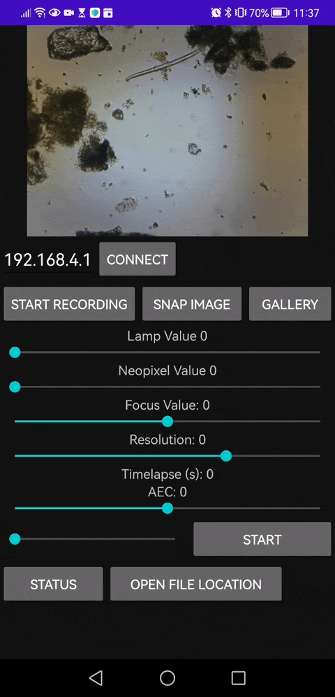

# openUC2 Xiao AI Microscope Android APP

Welcome to the Android APP for the openUC2 Xiao microscope user guide! This app is designed to work with the ESP32s3 camera, and it enables streaming, downloading, and managing images and videos directly on your Android phone. Here's everything you need to know.

*This is our Android APP that enables you to save video files as well*

## Table of Contents
- [Features](#features)
- [Installation](#installation)
- [Usage](#usage)
  - [Streaming](#streaming)
  - [Downloading Images and Videos](#downloading-images-and-videos)
  - [Adjusting Resolution](#adjusting-resolution)
  - [Viewing Gallery](#viewing-gallery)
- [Troubleshooting](#troubleshooting)
- [Contribute](#contribute)

## Features
- **Real-time streaming**: View live images from your microscope.
- **Download capability**: Save images and videos directly to your Android phone.
- **Adjustable stream resolution**: Customize the resolution for optimal viewing.
- **Image Gallery**: Browse acquired images in a user-friendly gallery.
- **Open-source**: Modify or contribute [here](https://github.com/Matchboxscope/Anglerfish-APP).
- **Latest releases**: Always stay up to date from [releases](https://github.com/Matchboxscope/Anglerfish-APP/releases/).

## Installation
- Download the latest APK from [here](https://github.com/Matchboxscope/Anglerfish-APP/releases/).
- Allow external sources in your phone's settings to install the app.
- Open the downloaded APK and follow the prompts to install.
- Launch the app, and enter the IP address of your espressoscope.
  - If you're using ESP32 as an access point, enter `192.168.4.1`.
  - If you don't know the IP address, use an app like Fing to search for devices on the same local network.

  <iframe 
    style={{position: 'absolute', top: 0, left: 0, width: '100%', height: '100%'}}
    src="https://www.youtube.com/embed/mT6dtuJ9OTM" 
    title="YouTube video player" 
    frameBorder="0" 
    allow="accelerometer; autoplay; clipboard-write; encrypted-media; gyroscope; picture-in-picture" 
    allowFullScreen
  />

## Usage

### Streaming
1. Open the Anglerfish APP.
2. Connect to the espressoscope.
3. View the real-time stream from your microscope.

### Downloading Images and Videos
1. Tap on the image or video you want to download.
2. Choose the destination folder on your phone.
3. Confirm the download.

### Adjusting Resolution
1. Go to the settings within the app.
2. Select the preferred stream resolution.
3. Confirm the changes.

### Viewing Gallery
1. Navigate to the gallery within the app.
2. Browse and manage your downloaded images and videos.

## Troubleshooting
If you encounter any problems, please file an issue in our [GitHub repository](https://github.com/Matchboxscope/Anglerfish-APP/issues). Provide a detailed description of the problem to help us resolve it efficiently.

## Contribute
The Anglerfish APP is open source, and we welcome contributions! Check out our [GitHub repository](https://github.com/Matchboxscope/Anglerfish-APP) for more information on how to contribute, report issues, or suggest new features.

Thank you for using Anglerfish APP, and happy exploring!
