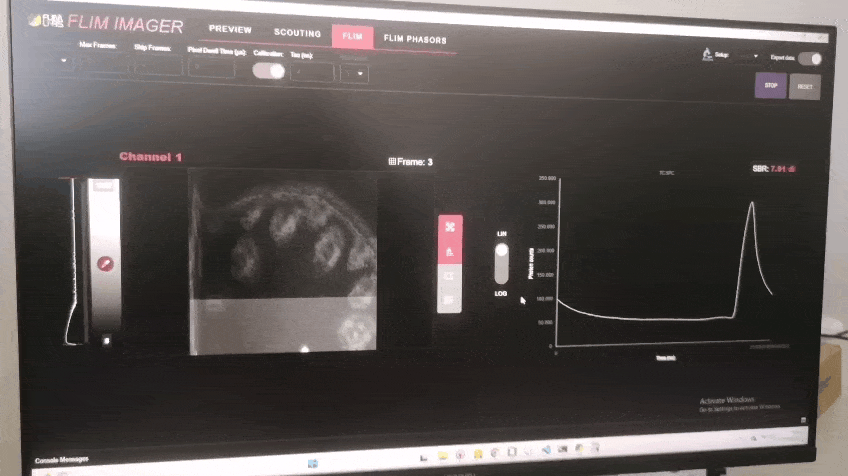
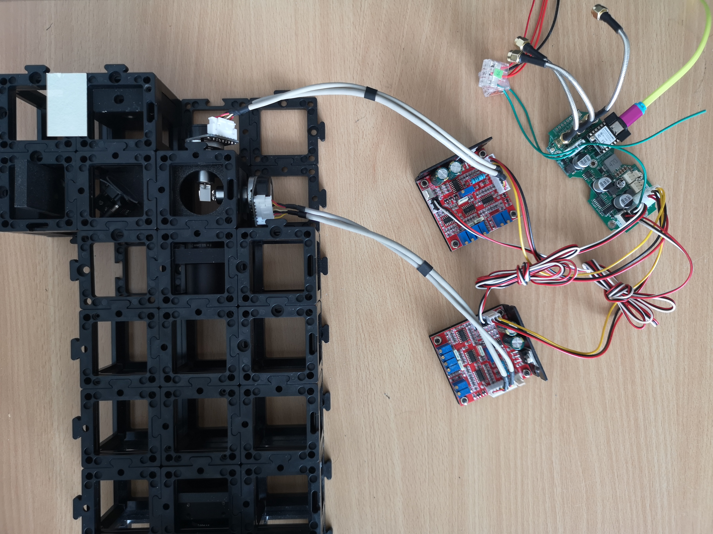

mAIkroscope Galvo Interface Board – **Extended Hardware & Firmware Documentation**
Rev A – 26 May 2025


### 1  Purpose & Key Features

* Dual-axis galvo driver interface for UC2 microscopes.
* Seeed XIAO ESP32-S3 MCU handles scan synthesis and trigger generation.
* On-board 12-bit SPI DAC (MCP4822) creates ±10 V differential XY signals for low-cost Chinese galvo drivers.
* Three independent 50 Ω trigger outputs (pixel, line, frame).
* CAN 2.0B bus for remote control via UC2-CAN protocol.
* Integrated ±12 V/3.3 V/5 V analog rails, 2 A output budget for external driver modules.&#x20;

This is a scan using the Flimlabs.com software, their detector and their pulsed lasers. This is a 512x512 pixel^2 area




### 2  System Architecture

```
ESP32-S3  ↔  SPI  ↔  MCP4822  →  LM324 diff amps  →  SMA L± / R±
            │              │                     ├─ pixel/line/frame triggers
            │              │                     └─ U.FL laser blanking
            └─ TWAI CAN bus → SN65HVD230 → JST-XH backbone
```

* **Two-phase DAC update:** write 12-bit sample into DAC register (CS low), then pulse **LDAC** to latch both channels simultaneously; saves one SPI transaction per point.&#x20;


### 3  Electrical Specifications

| Parameter              | Value                            | Comment                              |   |
| - | -- |  | - |
| Backbone input         | 12 V ±5 %                        | via J1001-1                          |   |
| Board self-consumption | ≈ 50 mA                          | excludes external galvo drivers      |   |
| Galvo supply pass-thru | ±12 V, 2 A max                   | J1004/J1007/J1008                    |   |
| DAC resolution / range | 12 bit, 0 – 3.3V at 4096 steps               | converted to ±10 V diff              |   |
| Output bandwidth       | ≈ 25 kHz (-3 dB)                 | limited by LM324 stage               |   |
| Trigger level          | 3.3 V CMOS, 50 Ω back-terminated | SMA J1009-J1011                      |   |
| CAN bus                | ISO11898-2, 1 Mbit/s default     | 120 Ω terminator selectable (JP2001) |   |




### 4  Connectors & Pinouts (summary)

* **Power + CAN (J1001, JST-XH-4):**  GND, +12 V,  CAN\_H - CAN\_L
* **Galvo power out (J1004 big Molex 3.96 mm, J1007/J1008 KF2510):**  ±12 V, GND – pin order matches driver boards.
* **Differential XY (J1005/J1006, SMA-3):**  L+, L-, GND and R+, R-, GND.
* **Triggers (SMA-2):**  Pixel (J1009), Line (J1010), Frame (J1011).
* **Laser blanking (J10001, U.FL):** single-ended 50 Ω.
* **XIAO headers (J1002/J1003):** break out all ESP32-S3 I/O; see GPIO map in §7.&#x20;


### 5  Analog Signal Chain

1. **MCP4822-E/SN** generates 0-3.3 V (12-bit).
2. **Gain/offset network (LM324)** maps 0 V→0 V, ±2.048 V→±10 V.
3. Second LM324 stage inverts each leg, giving true differential L± and R±.
4. Outputs drive ≥ 20 mA into the 10 kΩ inputs of typical galvo amps.
5. LC filters on ±12 VA rails set 50 Hz cutoff to suppress switching noise.&#x20;


### 6  Power Subsystem

* **TPS5430 buck:** 12 V → 3.3 V @ 0.8 A for MCU/CAN.
* **TPS5430 inverting buck-boost:** 12 V → −12 V @ 1.5 A for op-amps.
* **78L05 linear:** 5 V A for DAC/reference.
* All rails filtered by π-LC networks; testpoints TP400x provided for bring-up.&#x20;


### 7  Firmware Overview

```cpp
// Default pin mapping (Arduino style) on XIAO systems
#define PIN_DAC_CS       8   // J1003-10 / GPIO8
#define PIN_DAC_SCK      7   // J1003-9 / GPIO7
#define PIN_DAC_SDI      9   // J1003-11 / GPIO9
#define PIN_DAC_LDAC     6   // J1002-6 / GPIO6
#define PIN_TRIG_PIXEL   2   // GPIO2
#define PIN_TRIG_LINE    3   // GPIO3
#define PIN_TRIG_FRAME   4   // GPIO4
#define PIN_CAN_TX       5   // GPIO5
#define PIN_CAN_RX       44  // GPIO44
#define PIN_LASER        43  // GPIO43
#define PIN_PUSHBUTTON   1   // GPIO1 (enable internal pull-up)
```

* **Loop structure:**

  ```text
  for each Y line:
      for each X pixel:
          write X,Y to DAC; assert TRIG_PIXEL
      assert TRIG_LINE
  assert TRIG_FRAME
  ```
* **Coordinate depth:** 12 bit full-scale → map image size (e.g. 512 × 512) by `coord = (pixel * 4095) / (size-1)`.
* **PlatformIO project:** clone `openUC2/galvo-interface-fw`, select `env:xiao_esp32s3`, build & upload via USB-C.
* **UC2-CAN commands:**
*Coming soon*


### 8  Typical Operating Procedure

1. Feed 12 V from microscope backbone into J1001-1 (CAN connecotr); connect CAN (optional), you can supply 12v/GND via the JST 4 Pin sconnector.
2. Connect each galvo driver board with 3-pin power and SMA signal leads.
3. Flash firmware; set parameters in firmware for min/max pixel and stepsize as well as pixel dwell time
4. Monitor pixel trigger on oscilloscope
5. Tune galvo PID on driver boards for minimal overshoot

### 9 iBOM

<iframe width="100%" style={{"aspect-ratio": "16 / 9"}} src="https://openuc2.github.io/kicad/ibom-galvo.html" title="iBOM" frameborder="0" allow="accelerometer; autoplay; clipboard-write; encrypted-media; gyroscope; picture-in-picture; web-share" referrerpolicy="strict-origin-when-cross-origin" allowfullscreen></iframe>


### 10  Firmware Architecture (openUC2-LaserScanner)

You can find the files here https://github.com/openUC2/openUC2-LaserScanner/blob/main/src/main.cpp

The UC2-ESP Firmware also has the CAN-enabled version of it in its code base here: https://github.com/youseetoo/uc2-esp32/blob/main/main/src/scanner/GalvoController.cpp

:::warn
Sometimes the XIAO cannot be flashed immediately, for this you have to press boot and reset while firmware is flashed - or erase the firmware first using this tool: https://espressif.github.io/esptool-js/
:::


| Layer                   | Key files                 | Function                                                                                                                                                                                               |
| ----------------------- | ------------------------- | ------------------------------------------------------------------------------------------------------------------------------------------------------------------------------------------------------ |
| **Application**         | `src/main.cpp`            | Instantiates `SPIRenderer`, updates parameters in a `while(1)` loop, and calls `start()`; disables the watchdog and raises log level to warn for GPIO. ([GitHub][1])                                   |
| **Render Engine**       | `src/SPIRenderer.{h,cpp}` | Converts image geometry into DAC samples, handles SPI transfers, and asserts pixel/line/frame triggers with single–cycle GPIO writes. Implements `setParameters()`, `draw()`, `start()`. ([GitHub][2]) |
| **Board-select macros** | same header               | `IS_XIAO`, `IS_XIAO_UC2GALVOBOARD` choose the correct pin map at compile time. ([GitHub][3])                                                                                                           |
| **Build system**        | `platformio.ini`          | Two build environments: **esp32dev** (generic) and **UC2\_3\_Xiao** (Seeed XIAO ESP32-S3). Both use ESP-IDF with Arduino component; UART at 921 kbit s⁻¹. ([GitHub][4])                                |

#### 11.1  File structure

```
openUC2-LaserScanner
├── src/                 # C++ sources
│   ├── main.cpp         # app_main() entry point
│   ├── SPIRenderer.cpp  # raster engine
│   └── SPIRenderer.h
├── include/             # (optional) extra headers
├── lib/                 # third-party libs, e.g. UC2-CAN
├── python/              # helper scripts (ILDA, LUT generation)
├── KICAD/               # electrical design
├── platformio.ini       # build targets
└── sdkconfig.*          # pre-tuned IDF configs
```

#### 11.2  Build flow (PlatformIO)

1. Select **UC2\_3\_Xiao**  in *platformio.ini*.
2. `pio run` → ESP-IDF CMake → compile + link with Arduino component.
3. `pio run -t upload` flashes over USB-CDC (921 kbit s⁻¹).
4. Partition scheme `custom_partition_esp32s3.csv` reserves PSRAM cache and 1 MiB for OTA.

#### 11.3  Runtime tasks

| Task                          | Core affinity | Duty                                                                         |
| ----------------------------- | ------------- | ---------------------------------------------------------------------------- |
| **mainTask (app\_main)**      | core 0        | parameter sweep, calls renderer, yields 10 ms to scheduler.                  |
| **IDF idle0/1**               | core 0/1      | housekeeping (watchdog disabled for main).                                   |
| Additional tasks (*optional*) | —             | CAN listener, WebSocket, or CLI can be added; use `xTaskCreatePinnedToCore`. |

The code presently runs everything in the foreground; heavy processing (e.g. CAN command parsing) should be off-loaded to a FreeRTOS task to keep the raster loop deterministic.

#### 11.4  SPIRenderer workflow

```text
constructor()
  ├─ configure GPIO for laser, LDAC, triggers
  ├─ initialise SPI3 @20 MHz (XIAO) or HSPI (generic)
  └─ pre-compute nX, nY from (X_MIN…X_MAX)/STEP

start()
  └─ draw()

draw()
  for each frame
    assert all triggers high    ← frame start
    for X = X_MIN…X_MAX
      for Y = Y_MIN…Y_MAX
        clear triggers
        hold LDAC low
        SPI out 16-bit word to DAC-A (X)
        SPI out 16-bit word to DAC-B (Y)
        release LDAC                ← both axes latch simultaneously
        set pixel trigger, delay tPixelDwelltime µs
    issue line trigger each X-loop
  clear all triggers              ← frame end
```

* **Timing** – `esp_rom_delay_us()` delivers sub-µs waits; replace with a hardware timer ISR for dwell times <5 µs.
* **Throughput** – one SPI transaction per axis, LDAC latched once per pixel → 2 × 16 bits @ 20 MHz ≈ 1.6 µs transfer; 512×512 raster ≈ 0.42 s per frame exclusive of galvo settling.
* **Triggers** – 50 Ω back-termination; rising edge marks *start* of integration for FLIM/PMT cards.

#### 11.5  Customisation hooks

| Use case                 | Modification                                                                                                                        |
| ------------------------ | ----------------------------------------------------------------------------------------------------------------------------------- |
| **Different image size** | call `setParameters()` with new limits/step; renderer recomputes nX/nY without reallocating.                                        |
| **External control**     | add a CAN listener task that writes into a shared parameters struct guarded by a mutex; call `renderer->start()` from that task.    |
| **Scan patterns**        | replace the two nested `for` loops with a lookup table of `(x,y)` pairs (e.g. spiral, Lissajous).                                   |
| **Higher speed**         | use queued (`spi_device_queue_trans`) DMA transfers and toggle LDAC from SPI post-trans callback to overlap SPI and galvo settling. |

#### 11.6  Pin map (compile-time)

| Signal          | GPIO (UC2-Galvo) | GPIO (bare XIAO) |
| --------------- | ---------------- | ---------------- |
| **MOSI**        | 9                | 7                |
| **SCK**         | 7                | 8                |
| **CS**          | 8                | 9                |
| **LDAC**        | 6                | 6                |
| **TRIG PIXEL**  | 2                | 2                |
| **TRIG LINE**   | 3                | 3                |
| **TRIG FRAME**  | 4                | 4                |
| **LASER blank** | 43               | 43               |

Defined in `SPIRenderer.h`; switch boards via `-DIS_XIAO_UC2GALVOBOARD` or `-DIS_XIAO` build flag. ([GitHub][3])

#### 11.7  Extending the firmware

* **Finite-state machine** – wrap the renderer in a state class (IDLE, SCANNING, PAUSED).
* **Streaming points** – replace the nested loops by a ring buffer filled by CAN/UART for arbitrary point lists.
* **Persistent settings** – store last used scan parameters to NVS (`nvs_flash.h`) and recall on boot.
* **Web OTA** – enable `esp_https_ota` component and reserve second app partition (already present in `custom_partition_esp32s3.csv`).

---

[1]: https://raw.githubusercontent.com/openUC2/openUC2-LaserScanner/main/src/main.cpp "raw.githubusercontent.com"
[2]: https://raw.githubusercontent.com/openUC2/openUC2-LaserScanner/main/src/SPIRenderer.cpp "raw.githubusercontent.com"
[3]: https://raw.githubusercontent.com/openUC2/openUC2-LaserScanner/main/src/SPIRenderer.h "raw.githubusercontent.com"
[4]: https://raw.githubusercontent.com/openUC2/openUC2-LaserScanner/main/platformio.ini "raw.githubusercontent.com"
