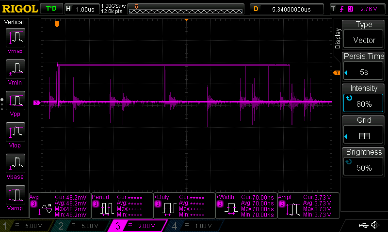
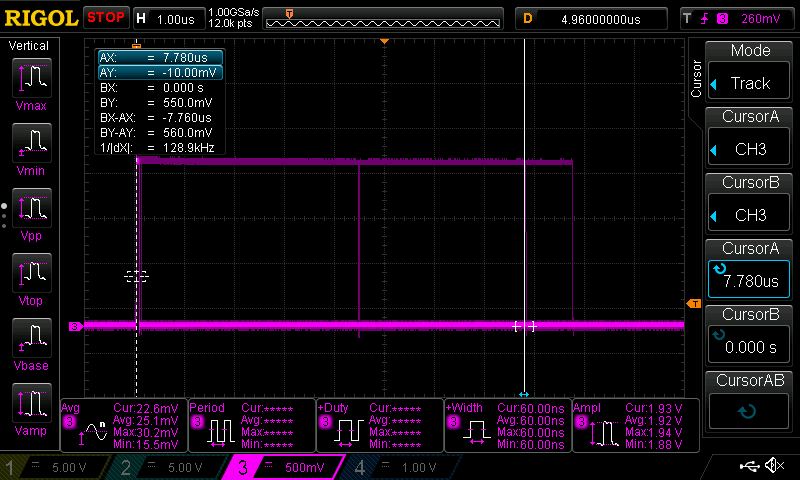

# Profiling the trigger outputs of the GalvoBox

Insigts into the trigger outputs of the GalvoBox, which are used for synchronization with external devices. The trigger outputs are labeled "FRAME", "LINE", and "PIXEL" on the PCB, and they are meant to indicate the timing of the frame, line, and pixel events in the scanning process.

The trigger outputs are driven by a buffer which sources from 3.3V, then there is a 22 Ohm resistor before the output ends up in the middle pin of the SMA connector.

Inside the sub-sheets is this:

I have a Rigol 1054Z, which doesn't have a 50 Ohms input mode for the input. It can only do 1M. If you have a fancier oscilloscope, the use as designed would be to set the inputs to 50 Ohms. I built 50 Ohm terminations in the following.

First, with the probe prong stuck into the hole of SMA F connectors of the pixel output (the one that triggers most frequently), and the ground clamped to a screw hole, with no termination (high-impedance)

DS1Z_QuickPrint6.png
Some variance of the clock duty cycle (persist time "digital phosphor" is at 5 seconds). Voltage level should be 3.3V which we see, because we apply no load by measuring with the high-impedance stock probe (1M is printed on the oscilloscope).

I desoldered one end of SMA cables, then connected the inside and outside of the coaxial together with 47 Ohm resistor, and stuck it into a toolless terminal block for BNC into the oscilloscope inputs. 

Also, the following screenshots always have it connected like this, so: 
- 1 yellow is "FRAME", 
- 2 cyan is "LINE", 
- 3 pink is "PIXEL".

With the termination, the peak voltage level is about 1.9V. It is measured underneath the graph as "Ampl" and the white cursor lines indicate between which values it measures.

The majority of pulses is 60 nanoseconds long (from trigger, white solid cursor line; to the end of the "Width" measurement in the fourth field under the graph, marked with white dashed cursor line.

I'm now manually moving the horizontal cursor to the different down-slopes that are sometimes measured (moving it by eye, using the digital phosphor persist edges where it sometimes falls down).

The first is 4.4 us from the trigger, so the width of those pulses are 4.4 us instead of 0.06 us.

Others are 4.96 us long. Sometimes there were some lines 1 us before or after that, so at 4.86 us or 5.06 us Width, but I couldn't capture those reliably.

I also measured where the respective next pulses from the triggered land. They have quite a wide distribution. I got that by manually scrubbing the trigger delay until the next pulses appear.

The first pulses appear pretty precisely 22 us after the triggered pulse. I guess these 22 us Period is the programmed behavior and if something in the microcontroller gets stuck for a few cycles, it most often shifts to 100 ns later(so 22.1 us period). But the spread of later pulses has a lot of variance and happens quite often. The image above has a persist time of only 100 ms.

With the other 2 Trigger connections connected (as shown in the photo at the top), the pulses look OK for the not-so-strict coaxial connections and termination some ways before the analog front end in the oscilloscope. You may get cleaner edges if you use the oscilloscope's 50 Ohm mode.

The width is about 62.6 ns, with +- 0.2 ns variance between yellow (field 5 below the graphs) and pink (field 3).

Here are some statistics of the width: (Field 2 pink, field 4 yellow)

Zoomed out, and triggering on the up-slope of yellow "FRAME", the frequency of the pixel clock is around 44 kHz with about 9 kHz variance (field 5) with very very low duty cycle (field 1). Cursor highlights what field 5 measures, so frequency of pink.

DS1Z_QuickPrint19.png

And, a last time I scrub the trigger delay from the yellow pulse for the next pulse on pink. The first pulses are still consistently 22 us after the trigger, with some 0.1 us later at 22.1 us (persist time is set to 10 seconds here).

