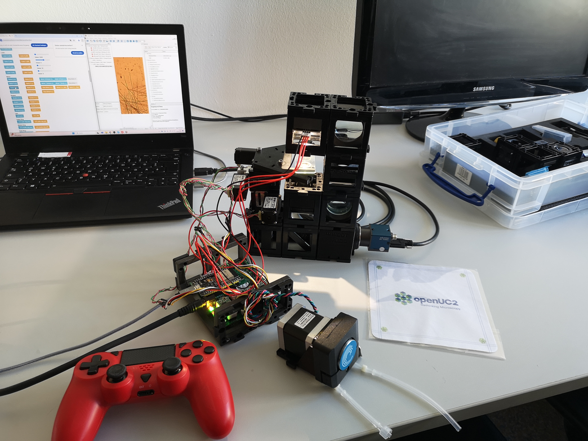
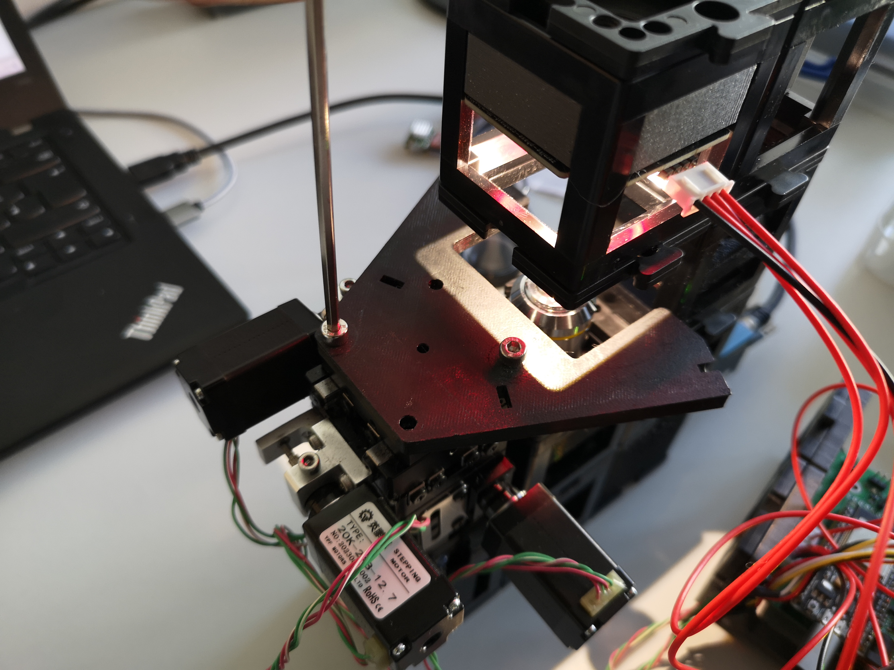
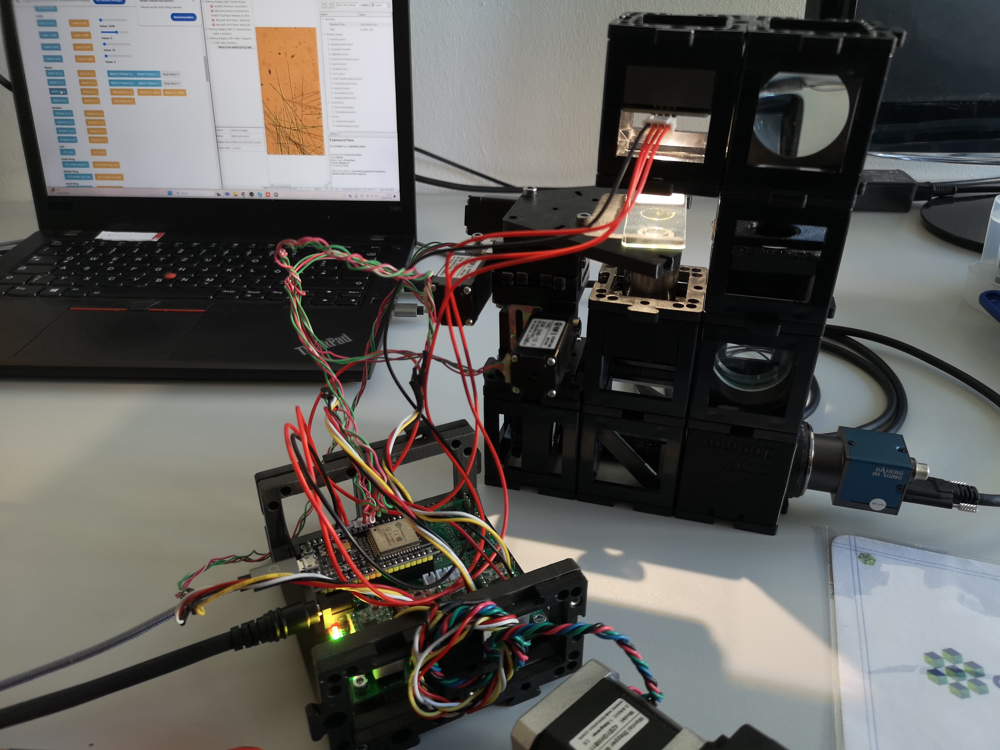
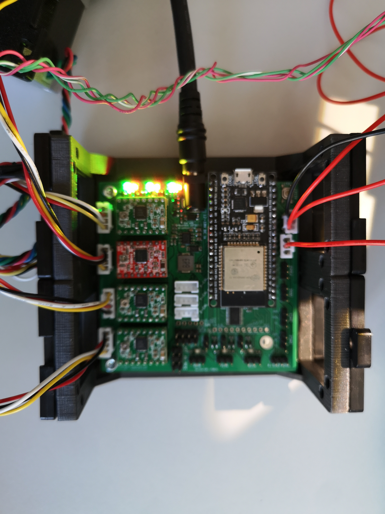

The XYZ Micrometer Stage, branded as "openUC2 XYZ Stage," is a highly accurate motion control device designed for precise manipulation in three dimensions (XYZ). The stage is primarily intended for use in microscopy applications and interferometers, where precise sample positioning is essential. It offers microstepping control with a step size of approximately 320 nanometers in all directions, enabling micron-level adjustments.

## Compatibility and Control:
The XYZ stage is compatible with the UC2e system and can be conveniently controlled through multiple methods:

1. **Webpage Interface:** Users can control the stage using the web-based interface available at `https://youseetoo.github.io/indexWebSerialTest.html`.

2. **UC2-REST Python Package:** For Python-savvy users, the UC2-REST Python package, accessible from `https://github.com/openUC2/UC2-REST/`, provides a programmatic way to manipulate the XYZ stage.

3. **ImSwitch Software:** Another option for controlling the XYZ stage is through ImSwitch, a software tool available at `https://github.com/openUC2/ImSwitch/`.

*Fully assembled XYZ stage with high precision stepper motors, designed for seamless automation in microscopy setups.*

## Key Features:
- **Mounting Flexibility:** The XYZ stage can be easily mounted on top of a cube or suspended at the side, offering flexibility in integrating it into various experimental setups.

- **Interferometer and Microscopy Applications:** This stage finds application in interferometers and light-sheet/fluorescence microscopes, where it plays a crucial role in precisely manipulating the sample in all directions.

- **Durable Construction:** Constructed entirely from metal, the XYZ stage ensures robustness and stability during delicate experiments.

- **High Precision Stepper Motors:** The stage is equipped with non-captive stepper motors, delivering exceptional precision during positioning operations.

*Image showing two XYZ stages (one motorized and one manual stage) employed in an OCT / Michelson type interferometer.*

## Setup and Integration:

To assist users in setting up and integrating the XYZ stage into their experimental configurations, a comprehensive video guide is available. This instructional video can be viewed at `https://www.youtube.com/embed/E_hhclFqx5g`.

For further information or inquiries regarding the openUC2 XYZ Micrometer Stage, interested parties can refer to the official openOCT project page at `https://github.com/openUC2/openUC2-Hackathon-openOCTRemote`. The project page contains additional details, resources, and support for utilizing the XYZ stage effectively in diverse research settings.

<iframe width="560" height="315" src="https://www.youtube.com/embed/E_hhclFqx5g" title="YouTube video player" frameborder="0" allow="accelerometer; autoplay; clipboard-write; encrypted-media; gyroscope; picture-in-picture; web-share" allowfullscreen></iframe>

## General Assembly for an inverted Microscope using the XYZ stage

This is the combination of the coreBOX, ElectroBOX and infinityBOX + xyz Stage with a perestaltic pump

**Mount the Sample Mount to the xyz stage:**

**Wire Up everything:**

- The stepper Motors can go to stepper A,..Z - the orientation determines their direction
- add 12V
- USB to your computer
- LED goes to 12V (ensure correct polarity - GND: black, 12V: red), then the two controlling wires go to PWM1 and PWM2

**Double check the wiring:**

