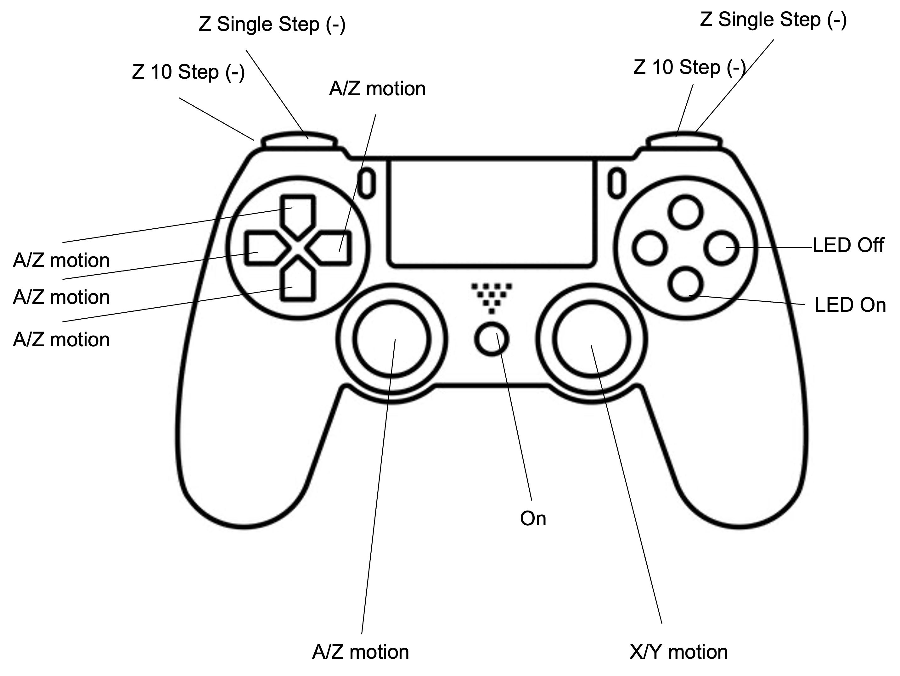
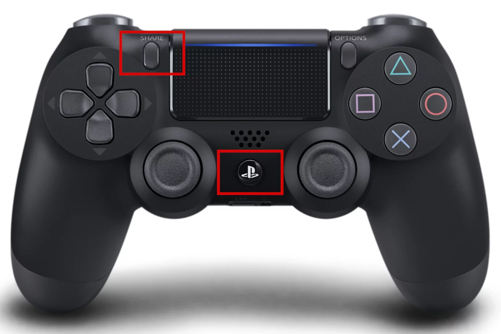

If you are using the webserial online flashing tool provided by UC2 (https://youseetoo.github.io/) to flash the firmware onto your ESP8266 or ESP32 development board, the process of connecting the PS4 controller to the UC2-ESP remains similar to the steps mentioned earlier. However, please note that the flashing tool is a separate tool for uploading firmware, and the Bluetooth communication with the PS4 controller needs to be implemented in your firmware code.


# Pinout of the different functions

The different functionalities of our PS4 controllers are mapped out like this:




| **PS4 Controller Input**       | **UC2-ESP32 Firmware Function**          | **Notes**                                                                 |
|----------------------------------|------------------------------------------|---------------------------------------------------------------------------|
| Left Analog Stick (X-axis)       | X Stage Movement                         | Moves the stage horizontally (left/right).                              |
| Left Analog Stick (Y-axis)       | Y Stage Movement                         | Moves the stage vertically (up/down).                                   |
| Right Analog Stick (Y-axis)      | Z Stage Movement (Coarse)                | Moves the stage in Z by larger increments for focusing.                 |
| Right Analog Stick (X-axis)      | Scan Speed / Fine X Adjustment           | Adjusts scan speed or offers fine adjustment in X during scanning.        |
| D-Pad Up                       | Fine Y Stage Increment                   | Increases Y-axis position in small steps.                               |
| D-Pad Down                     | Fine Y Stage Decrement                   | Decreases Y-axis position in small steps.                               |
| D-Pad Left                     | Fine X Stage Decrement                   | Decreases X-axis position in small steps.                               |
| D-Pad Right                    | Fine X Stage Increment                   | Increases X-axis position in small steps.                               |
| L1 Button                      | Decrease LED/Laser Intensity             | Lowers the brightness/intensity of the currently selected light source. |
| R1 Button                      | Increase LED/Laser Intensity             | Raises the brightness/intensity of the currently selected light source. |
| L2 Button                      | Coarse Z Stage Decrement                 | Lowers the Z-axis by a fixed number of steps (e.g., 10 steps per press).  |
| R2 Button                      | Coarse Z Stage Increment                 | Raises the Z-axis by a fixed number of steps (e.g., 10 steps per press).  |
| Square Button                  | Save Current Position                    | Saves the current stage coordinates for recall or repeat scanning.      |
| Cross (X) Button               | Start/Stop Scan                          | Toggles the scanning process on the microscope stage.                   |
| Circle Button                  | Toggle Illumination                      | Turns fluorescent lasers or LEDs on/off for illumination.               |
| Triangle Button                | Switch Fluorescent Channel               | Cycles through available fluorescent laser channels.                    |
| L3 (Left Stick Click)          | Engage Auto-Scan Mode                    | Activates a continuous auto-scanning mode for the stage.                |
| R3 (Right Stick Click)         | Enter Fine Focus Adjustment Mode         | Enables fine adjustments for Z-axis/focus control.                      |
| Options Button                 | Open Settings Menu                       | Access advanced firmware settings (e.g., stage speed, scan parameters).   |
| Share Button                   | Log/Export Scan Data                     | Initiates data logging or exports current scanning session data.        |
| PS Button                      | System Power Toggle                      | Switches the microscope system or firmware on/off.                      |
| Touchpad Button                | Reset Stage Position/Center              | Resets the stage to its default home coordinates.                       |


# Installation

**Attention** Chrome only!

Here's how the process would look like with the webserial online flashing tool:

## Step 1: Gather Required Materials
As mentioned earlier, you will need the following materials:

1. UC2-ESP development board (ESP8266 or ESP32).
2. PS4 controller.
3. Micro USB cable (for charging the PS4 controller).
4. Computer with a web browser and the webserial online flashing tool (https://youseetoo.github.io/).


## Step 2: Upload the Firmware
Use the webserial online flashing tool provided by UC2 (https://youseetoo.github.io/) to upload your custom firmware code to the UC2-ESP development board. The details of this process might vary depending on the specific tool's interface, but generally, you will need to:

1. Connect the UC2-ESP to your computer using a USB cable.
2. Open the webserial online flashing tool in your web browser.
3. Select the correct board (most likely UART-something) and COM port (which should be automatically detected by the tool).
4. Upload your custom firmware code that includes the Bluetooth communication with the PS4 controller.


## STep 3: Bring ESP into scanning mode and  Put the PS4 Controller in Pairing Mode

Go to https://youseetoo.github.io/indexWebSerialTest.html and connect to the ESP again (make sure the other tab closed the serial connection - close it or reload it); Hit the BT paring button


*Alternative:* Go to any serial monitor and paste `{"task":"/bt_scan"}`

Follow the same steps to put the PS4 controller into pairing mode by pressing and holding the "PS" button and the "Share" button on the controller simultaneously until the light on the controller starts flashing rapidly.



## Step 4: Monitor Serial Output (Optional)
As in the previous explanation, you can open the Serial Monitor in the Arduino IDE or other compatible software to monitor the UC2-ESP's output for debugging purposes.


This will be the resulting output if everything goes right
```
[397987][I][SerialProcess.cpp:50] loop(): process single task
I (398691) HIDGamePad: SCAN...
BLE: 0a:1c:6e:49:95:41, RSSI: -46, UUID: 0x0000, APPEARANCE: 0x0000, ADDR_TYPE: 'RANDOM'
BLE: b8:bc:5b:90:26:3d, RSSI: -82, UUID: 0x0000, APPEARANCE: 0x0000, ADDR_TYPE: 'PUBLIC'
BLE: 72:63:5d:ef:d7:eb, RSSI: -46, UUID: 0x0000, APPEARANCE: 0x0000, ADDR_TYPE: 'RANDOM'
BLE: f4:f9:51:e2:66:bc, RSSI: -70, UUID: 0x0000, APPEARANCE: 0x0000, ADDR_TYPE: 'PUBLIC'
BLE: 42:0b:37:00:45:b4, RSSI: -68, UUID: 0x0000, APPEARANCE: 0x0000, ADDR_TYPE: 'RANDOM'
BLE: 40:33:6a:63:f2:d4, RSSI: -45, UUID: 0x0000, APPEARANCE: 0x0000, ADDR_TYPE: 'RANDOM'
BLE: b8:bc:5b:90:26:3d, RSSI: -86, UUID: 0x0000, APPEARANCE: 0x0000, ADDR_TYPE: 'PUBLIC', NAME: '[TV] Samsung Q70 Series (55)'
BLE: 24:fc:e5:27:da:f8, RSSI: -83, UUID: 0x0000, APPEARANCE: 0x0000, ADDR_TYPE: 'PUBLIC'
BLE: 4c:e8:a0:e3:65:41, RSSI: -60, UUID: 0x0000, APPEARANCE: 0x0000, ADDR_TYPE: 'RANDOM'
BLE: 24:fc:e5:27:da:f8, RSSI: -86, UUID: 0x0000, APPEARANCE: 0x0000, ADDR_TYPE: 'PUBLIC', NAME: '[AV] Samsung Soundbar Q70R'
BLE: d2:2f:54:06:51:0b, RSSI: -60, UUID: 0x0000, APPEARANCE: 0x0000, ADDR_TYPE: 'RANDOM'
BT : 84:30:95:7f:83:c6, COD: major: PERIPHERAL, minor: 2, service: 0x001, RSSI: -44, NAME: Wireless Controller
BT : 84:30:95:7f:83:c6, COD: major: PERIPHERAL, minor: 2, service: 0x001, RSSI: -45, NAME: Wireless Controller
BT : 84:30:95:7f:83:c6, COD: major: PERIPHERAL, minor: 2, service: 0x001, RSSI: -43, NAME: Wireless Controller
BT : 84:30:95:7f:83:c6, COD: major: PERIPHERAL, minor: 2, service: 0x001, RSSI: -42, NAME: Wireless Controller
BT : 84:30:95:7f:83:c6, COD: major: PERIPHERAL, minor: 2, service: 0x001, RSSI: -43, NAME: Wireless Controller
BT : 84:30:95:7f:83:c6, COD: major: PERIPHERAL, minor: 2, service: 0x001, RSSI: -43, NAME: Wireless Controller
BT : 84:30:95:7f:83:c6, COD: major: PERIPHERAL, minor: 2, service: 0x001, RSSI: -43, NAME: Wireless Controller
BT : 84:30:95:7f:83:c6, COD: major: PERIPHERAL, minor: 2, service: 0x001, RSSI: -42, NAME: Wireless Controller
BT : 84:30:95:7f:83:c6, COD: major: PERIPHERAL, minor: 2, service: 0x001, RSSI: -43, NAME: Wireless Controller
BT : 84:30:95:7f:83:c6, COD: major: PERIPHERAL, minor: 2, service: 0x001, RSSI: -43, NAME: Wireless Controller
BT : 84:30:95:7f:83:c6, COD: major: PERIPHERAL, minor: 2, service: 0x001, RSSI: -43, NAME: Wireless Controller
BT : 84:30:95:7f:83:c6, COD: major: PERIPHERAL, minor: 2, service: 0x001, RSSI: -43, NAME: Wireless Controller
BT : 84:30:95:7f:83:c6, COD: major: PERIPHERAL, minor: 2, service: 0x001, RSSI: -42, NAME: Wireless Controller
BT : b8:bc:5b:90:26:3d, COD: major: AV, minor: 15, service: 0x060, RSSI: -87, NAME: [TV] Samsung Q70 Series (55)
BT : 84:30:95:7f:83:c6, COD: major: PERIPHERAL, minor: 2, service: 0x001, RSSI: -43, NAME: Wireless Controller
BT : 84:30:95:7f:83:c6, COD: major: PERIPHERAL, minor: 2, service: 0x001, RSSI: -43, NAME: Wireless Controller
BT : 84:30:95:7f:83:c6, COD: major: PERIPHERAL, minor: 2, service: 0x001, RSSI: -43, NAME: Wireless Controller
BT : 84:30:95:7f:83:c6, COD: major: PERIPHERAL, minor: 2, service: 0x001, RSSI: -43, NAME: Wireless Controller
BT : 84:30:95:7f:83:c6, COD: major: PERIPHERAL, minor: 2, service: 0x001, RSSI: -44, NAME: Wireless Controller
BT : 84:30:95:7f:83:c6, COD: major: PERIPHERAL, minor: 2, service: 0x001, RSSI: -43, NAME: Wireless Controller
BT : 84:30:95:7f:83:c6, COD: major: PERIPHERAL, minor: 2, service: 0x001, RSSI: -44, NAME: Wireless Controller
BT : 84:30:95:7f:83:c6, COD: major: PERIPHERAL, minor: 2, service: 0x001, RSSI: -43, NAME: Wireless Controller
BT : 84:30:95:7f:83:c6, COD: major: PERIPHERAL, minor: 2, service: 0x001, RSSI: -42, NAME: Wireless Controller
BT : 84:30:95:7f:83:c6, COD: major: PERIPHERAL, minor: 2, service: 0x001, RSSI: -43, NAME: Wireless Controller
BT : 84:30:95:7f:83:c6, COD: major: PERIPHERAL, minor: 2, service: 0x001, RSSI: -42, NAME: Wireless Controller
BT : 84:30:95:7f:83:c6, COD: major: PERIPHERAL, minor: 2, service: 0x001, RSSI: -43, NAME: Wireless Controller
BT : 84:30:95:7f:83:c6, COD: major: PERIPHERAL, minor: 2, service: 0x001, RSSI: -43, NAME: Wireless Controller
BT : 84:30:95:7f:83:c6, COD: major: PERIPHERAL, minor: 2, service: 0x001, RSSI: -45, NAME: Wireless Controller
BT : 84:30:95:7f:83:c6, COD: major: PERIPHERAL, minor: 2, service: 0x001, RSSI: -43, NAME: Wireless Controller
BT : 84:30:95:7f:83:c6, COD: major: PERIPHERAL, minor: 2, service: 0x001, RSSI: -43, NAME: Wireless Controller
BT : 84:30:95:7f:83:c6, COD: major: PERIPHERAL, minor: 2, service: 0x001, RSSI: -43, NAME: Wireless Controller
BT : 84:30:95:7f:83:c6, COD: major: PERIPHERAL, minor: 2, service: 0x001, RSSI: -43, NAME: Wireless Controller
BT : 84:30:95:7f:83:c6, COD: major: PERIPHERAL, minor: 2, service: 0x001, RSSI: -43, NAME: Wireless Controller
BT : 84:30:95:7f:83:c6, COD: major: PERIPHERAL, minor: 2, service: 0x001, RSSI: -43, NAME: Wireless Controller
BT : 84:30:95:7f:83:c6, COD: major: PERIPHERAL, minor: 2, service: 0x001, RSSI: -43, NAME: Wireless Controller
BT : 84:30:95:7f:83:c6, COD: major: PERIPHERAL, minor: 2, service: 0x001, RSSI: -43, NAME: Wireless Controller
BT : 7c:2f:80:34:51:c6, COD: major: PHONE, minor: 2, service: 0x080, RSSI: -53, NAME: SL4 professional
BT : 84:30:95:7f:83:c6, COD: major: PERIPHERAL, minor: 2, service: 0x001, RSSI: -43, NAME: Wireless Controller
BT : 84:30:95:7f:83:c6, COD: major: PERIPHERAL, minor: 2, service: 0x001, RSSI: -42, NAME: Wireless Controller
BT : 84:30:95:7f:83:c6, COD: major: PERIPHERAL, minor: 2, service: 0x001, RSSI: -43, NAME: Wireless Controller
BT : 84:30:95:7f:83:c6, COD: major: PERIPHERAL, minor: 2, service: 0x001, RSSI: -42, NAME: Wireless Controller
BT : 84:30:95:7f:83:c6, COD: major: PERIPHERAL, minor: 2, service: 0x001, RSSI: -42, NAME: Wireless Controller
BT : 84:30:95:7f:83:c6, COD: major: PERIPHERAL, minor: 2, service: 0x001, RSSI: -44, NAME: Wireless Controller
BT : 84:30:95:7f:83:c6, COD: major: PERIPHERAL, minor: 2, service: 0x001, RSSI: -44, NAME: Wireless Controller
BT : 84:30:95:7f:83:c6, COD: major: PERIPHERAL, minor: 2, service: 0x001, RSSI: -44, NAME: Wireless Controller
BT : 84:30:95:7f:83:c6, COD: major: PERIPHERAL, minor: 2, service: 0x001, RSSI: -45, NAME: Wireless Controller
BT : b8:bc:5b:90:26:3d, COD: major: AV, minor: 15, service: 0x060, RSSI: -80, NAME: [TV] Samsung Q70 Series (55)
BT : 84:30:95:7f:83:c6, COD: major: PERIPHERAL, minor: 2, service: 0x001, RSSI: -42, NAME: Wireless Controller
BT : 84:30:95:7f:83:c6, COD: major: PERIPHERAL, minor: 2, service: 0x001, RSSI: -45
BT : b8:bc:5b:90:26:3d, COD: major: AV, minor: 15, service: 0x060, RSSI: -80
BT : 84:30:95:7f:83:c6, COD: major: PERIPHERAL, minor: 2, service: 0x001, RSSI: -43, NAME: Wireless Controller
BT : 84:30:95:7f:83:c6, COD: major: PERIPHERAL, minor: 2, service: 0x001, RSSI: -43, NAME: Wireless Controller
BT : 84:30:95:7f:83:c6, COD: major: PERIPHERAL, minor: 2, service: 0x001, RSSI: -43, NAME: Wireless Controller
BT : 84:30:95:7f:83:c6, COD: major: PERIPHERAL, minor: 2, service: 0x001, RSSI: -43, NAME: Wireless Controller
BT : 84:30:95:7f:83:c6, COD: major: PERIPHERAL, minor: 2, service: 0x001, RSSI: -44, NAME: Wireless Controller
BT : 84:30:95:7f:83:c6, COD: major: PERIPHERAL, minor: 2, service: 0x001, RSSI: -43, NAME: Wireless Controller
BT : b8:bc:5b:90:26:3d, COD: major: AV, minor: 15, service: 0x060, RSSI: -82
BT : 84:30:95:7f:83:c6, COD: major: PERIPHERAL, minor: 2, service: 0x001, RSSI: -43, NAME: Wireless Controller
BT : 84:30:95:7f:83:c6, COD: major: PERIPHERAL, minor: 2, service: 0x001, RSSI: -43, NAME: Wireless Controller
BT : 84:30:95:7f:83:c6, COD: major: PERIPHERAL, minor: 2, service: 0x001, RSSI: -44, NAME: Wireless Controller
BT : 84:30:95:7f:83:c6, COD: major: PERIPHERAL, minor: 2, service: 0x001, RSSI: -43, NAME: Wireless Controller
BT : 84:30:95:7f:83:c6, COD: major: PERIPHERAL, minor: 2, service: 0x001, RSSI: -46, NAME: Wireless Controller
BT : 84:30:95:7f:83:c6, COD: major: PERIPHERAL, minor: 2, service: 0x001, RSSI: -42, NAME: Wireless Controller
BT : 84:30:95:7f:83:c6, COD: major: PERIPHERAL, minor: 2, service: 0x001, RSSI: -43, NAME: Wireless Controller
BT : 84:30:95:7f:83:c6, COD: major: PERIPHERAL, minor: 2, service: 0x001, RSSI: -43, NAME: Wireless Controller
BT : 7c:2f:80:34:51:c6, BDNAME: SL4 professional
BT : b8:bc:5b:90:26:3d, BDNAME: [TV] Samsung Q70 Series (55)
I (407539) HIDGamePad: SCAN: 1 results
  BT : 84:30:95:7f:83:c6, RSSI: -43, USAGE: GENERIC, COD: PERIPHERAL[GAMEPAD] srv 0x001, UUID16: 0x0000, NAME: Wireless Controller
I (407553) HIDGamePad: connect...
I (407557) HIDGamePad: connected...
esp_hidh_dev_open returned 1073459020
I (407565) HIDGamePad: vtaskdelete hid_demo_task
W (408159) ESP_HID_GAP: BT GAP EVENT AUTH_CMPL
I (408224) HIDGamePad: 84:30:95:7f:83:c6 OPEN:
BDA:84:30:95:7f:83:c6, Status: OK, Connected: YES, Handle: 0, Usage: GAMEPAD
Name: , Manufacturer: , Serial Number:
PID: 0x09cc, VID: 0x054c, VERSION: 0x0100
Report Map Length: 442
    VENDOR FEATURE REPORT, ID: 212, Length:  63
    VENDOR FEATURE REPORT, ID: 208, Length:  63
    VENDOR FEATURE REPORT, ID: 181, Length:  63
    VENDOR FEATURE REPORT, ID: 180, Length:  63
    VENDOR FEATURE REPORT, ID: 179, Length:  63
    VENDOR FEATURE REPORT, ID: 173, Length:  63
    VENDOR FEATURE REPORT, ID: 172, Length:  63
    VENDOR FEATURE REPORT, ID: 171, Length:  63
    VENDOR FEATURE REPORT, ID: 170, Length:  63
    VENDOR FEATURE REPORT, ID: 169, Length:  63
    VENDOR FEATURE REPORT, ID: 168, Length:  63
    VENDOR FEATURE REPORT, ID: 167, Length:  63
    VENDOR FEATURE REPORT, ID: 164, Length:  63
    VENDOR FEATURE REPORT, ID: 160, Length:  63
    VENDOR FEATURE REPORT, ID: 148, Length:  63
    VENDOR FEATURE REPORT, ID: 147, Length:  63
    VENDOR FEATURE REPORT, ID: 146, Length:  63
    VENDOR FEATURE REPORT, ID: 145, Length:  63
    VENDOR FEATURE REPORT, ID: 144, Length:  63
    VENDOR FEATURE REPORT, ID: 132, Length:  63
    VENDOR FEATURE REPORT, ID: 131, Length:  63
    VENDOR FEATURE REPORT, ID: 130, Length:  63
    VENDOR  OUTPUT REPORT, ID:  25, Length: 546
    VENDOR   INPUT REPORT, ID:  25, Length: 546
    VENDOR  OUTPUT REPORT, ID:  24, Length: 525
    VENDOR   INPUT REPORT, ID:  24, Length: 525
    VENDOR  OUTPUT REPORT, ID:  23, Length: 461
    VENDOR   INPUT REPORT, ID:  23, Length: 461
    VENDOR  OUTPUT REPORT, ID:  22, Length: 397
    VENDOR   INPUT REPORT, ID:  22, Length: 397
    VENDOR  OUTPUT REPORT, ID:  21, Length: 333
    VENDOR   INPUT REPORT, ID:  21, Length: 333
    VENDOR  OUTPUT REPORT, ID:  20, Length: 269
    VENDOR   INPUT REPORT, ID:  20, Length: 269
    VENDOR  OUTPUT REPORT, ID:  19, Length: 205
    VENDOR   INPUT REPORT, ID:  19, Length: 205
    VENDOR  OUTPUT REPORT, ID:  18, Length: 141
    VENDOR   INPUT REPORT, ID:  18, Length: 141
    VENDOR  OUTPUT REPORT, ID:  17, Length:  77
    VENDOR   INPUT REPORT, ID:  17, Length:  77
    VENDOR FEATURE REPORT, ID: 242, Length:  15
    VENDOR FEATURE REPORT, ID: 241, Length:  63
    VENDOR FEATURE REPORT, ID: 240, Length:  63
    VENDOR FEATURE REPORT, ID:   4, Length:  46
    VENDOR FEATURE REPORT, ID:   3, Length:  38
    VENDOR FEATURE REPORT, ID:   9, Length:  19
    VENDOR FEATURE REPORT, ID:   8, Length:  47
    VENDOR FEATURE REPORT, ID:   7, Length:  48
    VENDOR FEATURE REPORT, ID:   6, Length:  52
    VENDOR FEATURE REPORT, ID:   5, Length:  40
    VENDOR FEATURE REPORT, ID: 163, Length:  48
    VENDOR FEATURE REPORT, ID:   2, Length:  36
   GAMEPAD   INPUT REPORT, ID:   1, Length:   9
Turning on LAser 10000
```


## Step 5: Test the PS4 Controller
After successfully flashing the firmware, disconnect the UC2-ESP from the computer and power it using an external power source (e.g., a USB power bank). The UC2-ESP should now be ready to receive input from the PS4 controller as per the implemented functionality in your custom firmware.

## Step 6: Interact with Your Project
The PS4 controller should now be able to communicate with your UC2-ESP development board as specified in the firmware code. Depending on the implementation, you can use the PS4 controller's buttons, joysticks, and other features to control your project wirelessly.

- right joystick moves stage x/y
- left joystick moves z-focus and a-axis
- x turns led on
- o turns led off

## Conclusion
By utilizing the webserial online flashing tool provided by UC2, you can conveniently upload your custom firmware code to the UC2-ESP development board. This allows you to implement Bluetooth communication with the PS4 controller and integrate it seamlessly into your projects. Enjoy experimenting and creating with your PS4 controller and UC2-ESP!
