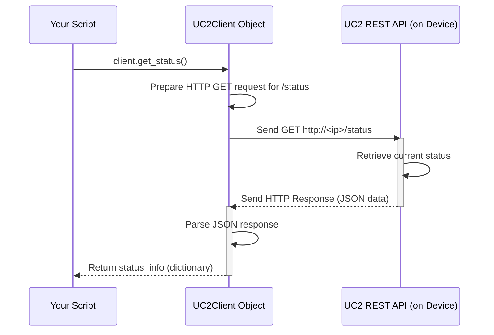

# Chapter 1: UC2Client

Welcome to the UC2-REST project! This library helps you control your UC2 (Universal Control Unit 2) setup using code. If you've ever wanted to automate experiments, take pictures remotely, or check the status of your UC2 device from a script, you're in the right place.

Imagine you have a fantastic UC2 microscope setup, but you want to check if it's ready without physically walking over to it. Maybe you want to write a simple script that pings the device and tells you its current status. How can you do that easily?

This is where the `UC2Client` comes in. Think of it as the main **remote control** for your UC2 device.

## What is `UC2Client`?

The `UC2Client` is the central piece of this library. It's like a universal remote specifically designed for your UC2 hardware's REST API (the service running on the UC2 device that listens for commands).

Why do we need it?

1.  **Simplicity:** Directly talking to web services (like the one on your UC2) involves complex details like HTTP requests, URLs, headers, and handling data formats (like JSON). The `UC2Client` hides all this complexity.
2.  **Ease of Use:** Instead of crafting complicated web requests, you just call simple methods (like pressing buttons on a remote) on the `UC2Client` object. For example, `client.get_status()` is much easier than figuring out the exact web address and command to get the status yourself.
3.  **Organization:** It provides a single, organized place for all the commands you can send to your UC2 device.

In short, `UC2Client` makes controlling your UC2 device programmatically feel natural and straightforward.

## Using `UC2Client`: Checking Device Status

Let's tackle our use case: checking the status of the UC2 device using a Python script.

**Step 1: Import `UC2Client`**

First, you need to tell Python you want to use the `UC2Client` class from the `uc2rest` library.

```python
# Import the main client class
from uc2rest import UC2Client

print("UC2Client imported successfully!")
```

This line makes the `UC2Client` "remote control" blueprint available in your script.

**Step 2: Create a `UC2Client` Instance**

Now, you need to create an actual remote control object. To do this, you need to tell it the network address (IP address) of your UC2 device.

```python
# Replace "192.168.1.100" with the actual IP address of your UC2 device
uc2_ip_address = "192.168.1.100" 

# Create the client object (our 'remote control')
client = UC2Client(ip_address=uc2_ip_address)

print(f"Client created for device at {uc2_ip_address}") 
```

Here, we create an instance of `UC2Client` and store it in the variable `client`. We pass the `ip_address` so the client knows where to send the commands.

*(Note: Managing configuration like IP addresses can sometimes be done more elegantly. We'll explore better ways to handle settings in the next chapter: [Configuration Management](02_configuration_management_.md).)*

**Step 3: Get the Status**

With our `client` (remote control) ready, we can now "press the button" to get the status. `UC2Client` provides a method for this, often named something like `get_status()`.

```python
# Use the client to ask for the device's status
try:
    status_info = client.get_status() 
    print("Successfully retrieved status:")
    print(status_info) 
except Exception as e:
    print(f"Could not get status: {e}")
    # Handle potential errors, like network issues or device being off
```

When you run `client.get_status()`, the `UC2Client` object sends a request to your UC2 device at the specified IP address. The device responds with its current status, and the `client` gives that information back to you, likely as a Python dictionary (a way to store key-value pairs).

The output might look something like this (the exact details depend on your UC2 device):

```
Successfully retrieved status:
{'device_name': 'MyUC2Microscope', 'state': 'idle', 'camera_connected': True, 'led_intensity': 50} 
```

That's it! With just a few lines of code, you used `UC2Client` to check your device's status remotely. You can use other methods on the `client` object to perform different actions, like controlling motors or capturing images.

## Under the Hood: How Does `UC2Client` Work?

You might wonder what magic happens when you call `client.get_status()`. It's not actually magic, but a series of well-defined steps handled by the `UC2Client`.

**Conceptual Steps:**

1.  **Method Call:** Your script calls a method, like `get_status()`, on the `UC2Client` object.
2.  **URL Construction:** The `UC2Client` knows the base IP address (`192.168.1.100` in our example) and the specific *path* for the status command (e.g., `/status`). It combines these to form a full URL, like `http://192.168.1.100/status`.
3.  **HTTP Request:** It prepares an HTTP request. For getting status, this is usually a `GET` request sent to the URL figured out in the previous step.
4.  **Sending:** The client sends this request over your network to the UC2 device.
5.  **Waiting:** The client waits for the UC2 device to process the request and send back a response.
6.  **Receiving Response:** The UC2 device sends back an HTTP response, typically containing the status information in a format like JSON.
7.  **Parsing:** The `UC2Client` receives this response, checks if everything went okay (e.g., no network errors), and extracts the useful data (like the status dictionary). It might also convert the data from JSON into a Python object.
8.  **Returning:** Finally, the client returns the processed data (the `status_info` dictionary) back to your script.

**Sequence Diagram:**

Here's a simplified diagram showing the interaction:



**Simplified Code Glimpse:**

Inside the `uc2rest/UC2Client.py` file, you'd find code that performs these steps. Here's a *highly simplified conceptual* example of what a part of the `get_status` method might do:

```python
# NOTE: This is a simplified conceptual example, not the exact code.
# It might live inside the UC2Client class in UC2Client.py

import requests # A popular library for making HTTP requests

class UC2Client:
    def __init__(self, ip_address):
        self.base_url = f"http://{ip_address}" 
        # ... other setup ...

    def get_status(self):
        """Gets the status from the UC2 device."""
        status_url = f"{self.base_url}/status" 
        try:
            # Use the 'requests' library to send the GET request
            response = requests.get(status_url, timeout=5) # 5 second timeout
            response.raise_for_status() # Check for HTTP errors (like 404 Not Found)
            
            # Parse the JSON data from the response
            status_data = response.json() 
            return status_data
        except requests.exceptions.RequestException as e:
            # Handle errors (network, timeout, bad response)
            print(f"Error fetching status: {e}")
            raise # Re-raise the exception or handle it appropriately
        
    # ... other methods like move_motor(), set_led(), etc. ...
```

This snippet shows how `UC2Client` might use another library (`requests`) to handle the low-level HTTP communication. It constructs the URL, sends the request, checks for errors, and parses the JSON response before returning it to you. The real code would include more robust error handling and potentially deal with things like authentication or different types of requests (like `POST` for changing settings). It might also interact with other parts of the library, like components for [Logging](03_logging_.md).

## Conclusion

Congratulations! You've taken your first step into controlling your UC2 device with code. You learned that `UC2Client` is the primary tool—your "remote control"—for interacting with the UC2 REST API. It simplifies sending commands and receiving information by hiding the complexities of web requests. You saw how to import it, create an instance with the device's IP address, and use a method like `get_status()` to retrieve information.

Now that you understand the basics of sending commands with `UC2Client`, you might be wondering about better ways to manage the configuration, like the IP address we used. In the next chapter, we'll dive into just that!

Next up: [Configuration Management](02_configuration_management_.md)

---

Generated by [AI Codebase Knowledge Builder](https://github.com/The-Pocket/Tutorial-Codebase-Knowledge)