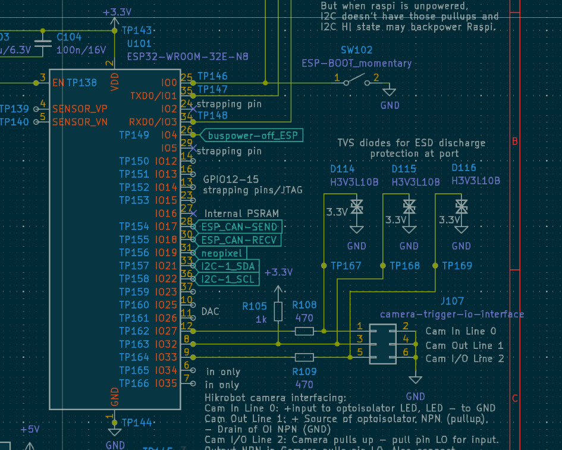

# HAT+

This is a HAT for the Raspberry Pi 5 that adapts the Raspberry pi to an esp32 that in turn talks to auxilary components like motors and illumination modules via CAN Bus and I2C (optionally).


## Pinout

This is the hat's pinout on:

```json
raspi_pinheader = {
    1: {"Pin": 1, "Function": "+3.3V"},
    2: {"Pin": 2, "Function": "+5V"},
    3: {"Pin": 3, "Function": "I2C_1_SDA (GPIO2)"},
    4: {"Pin": 4, "Function": "+5V"},
    5: {"Pin": 5, "Function": "I2C_1_SCL (GPIO3)"},
    6: {"Pin": 6, "Function": "GND"},
    7: {"Pin": 7, "Function": "GPIO4"},
    8: {"Pin": 8, "Function": "RPI_UART_TX (GPIO14)"},
    9: {"Pin": 9, "Function": "GND"},
    10: {"Pin": 10, "Function": "RPI_UART_RX (GPIO15)"},
    11: {"Pin": 11, "Function": "GPIO17"},
    12: {"Pin": 12, "Function": "GPIO18"},
    13: {"Pin": 13, "Function": "GPIO27"},
    14: {"Pin": 14, "Function": "GND"},
    15: {"Pin": 15, "Function": "GPIO22"},
    16: {"Pin": 16, "Function": "GPIO23"},
    17: {"Pin": 17, "Function": "+3.3V"},
    18: {"Pin": 18, "Function": "GPIO24"},
    19: {"Pin": 19, "Function": "CAN-ctrl_PICO (GPIO10)"},
    20: {"Pin": 20, "Function": "GND"},
    21: {"Pin": 21, "Function": "CAN-ctrl_POCI (GPIO9)"},
    22: {"Pin": 22, "Function": "GPIO25"},
    23: {"Pin": 23, "Function": "CAN-ctrl_SCK (GPIO11)"},
    24: {"Pin": 24, "Function": "CAN-ctrl_CS (GPIO8)"},
    25: {"Pin": 25, "Function": "GND"},
    26: {"Pin": 26, "Function": "EEPROM_SCL (GPIO0)"},
    27: {"Pin": 27, "Function": "EEPROM_SDA (GPIO1)"},
    28: {"Pin": 28, "Function": "Reserved"},
    29: {"Pin": 29, "Function": "GPIO5"},
    30: {"Pin": 30, "Function": "GND"},
    31: {"Pin": 31, "Function": "GPIO6"},
    32: {"Pin": 32, "Function": "GPIO12"},
    33: {"Pin": 33, "Function": "GPIO13"},
    34: {"Pin": 34, "Function": "GND"},
    35: {"Pin": 35, "Function": "GPIO19"},
    36: {"Pin": 36, "Function": "GPIO16"},
    37: {"Pin": 37, "Function": "GPIO26"},
    38: {"Pin": 38, "Function": "GPIO20"},
    39: {"Pin": 39, "Function": "GND"},
    40: {"Pin": 40, "Function": "GPIO21"},
}
```


## ESP32 CAN INterface

The HAT+ hosts an ESP32 that converts UART/Serial into CAN Control commands for the external components. The pinout is the following:

```cpp

// GPIO Pin Definitions for ESP32-S3 Xiao
#define GPIO_TXD0        0   // UART TX
#define GPIO_RXD0        1   // UART RX
#define GPIO_SENSOR_VP   2   // Sensor VP
#define GPIO_SENSOR_VN   3   // Sensor VN
#define GPIO_STRAP_PIN_4 4   // Strapping pin 4
#define GPIO_STRAP_PIN_5 5   // Strapping pin 5
#define GPIO_IO6         6
#define GPIO_IO7         7
#define GPIO_IO8         8   // NeoPixel or LEDC PWM Output
#define GPIO_IO9         9
#define GPIO_IO10       10
#define GPIO_IO11       11
#define GPIO_IO12       12   // Strapping pin / JTAG
#define GPIO_IO13       13   // Strapping pin / JTAG
#define GPIO_IO14       14   // Strapping pin / JTAG
#define GPIO_IO15       15   // Strapping pin / JTAG
#define GPIO_IO16       16   // ESP_CAN_SEND
#define GPIO_IO17       17   // ESP_CAN_RECV
#define GPIO_I2C_SDA    18   // I2C SDA
#define GPIO_I2C_SCL    19   // I2C SCL
#define GPIO_DAC        20   // DAC Pin
#define GPIO_IO21       21
#define GPIO_IO22       22
#define GPIO_IO23       23
#define GPIO_IO24       24
#define GPIO_IO25       25
#define GPIO_IO26       26
#define GPIO_IO27       27
#define GPIO_IO28       28

// Additional Connections
#define GPIO_CAM_TRIGGER_IN_0 29  // Camera Trigger Input Line 0
#define GPIO_CAM_TRIGGER_OUT_1 30 // Camera Trigger Output Line 1
#define GPIO_CAM_IO_LINE_2     31 // Camera I/O Line 2

// Default I2C Pins
#define I2C_SDA_PIN GPIO_I2C_SDA
#define I2C_SCL_PIN GPIO_I2C_SCL

// CAN Bus Pins
#define CAN_SEND_PIN GPIO_IO16
#define CAN_RECV_PIN GPIO_IO17
```




## HAT+ on Jetson


