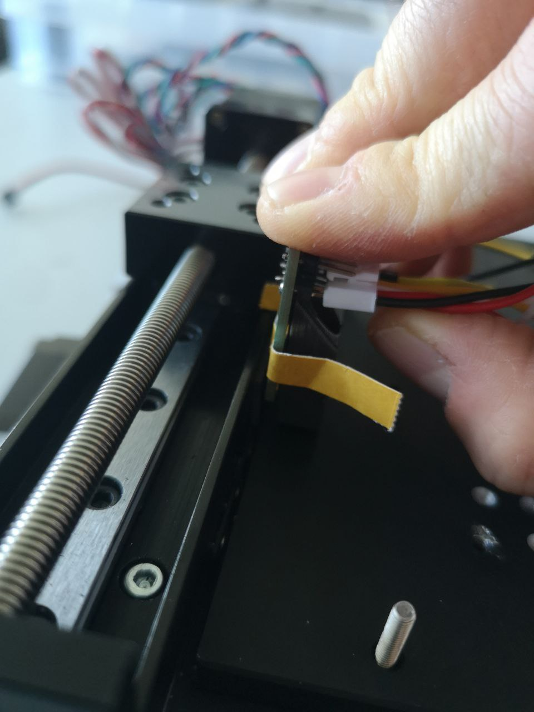
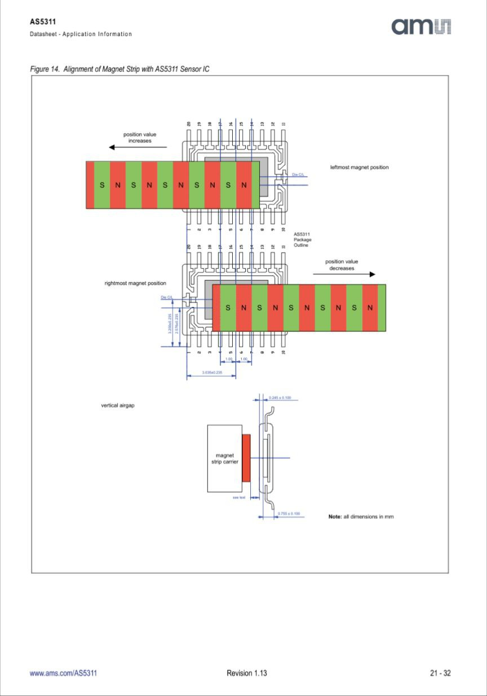

# AS 5311 linear encoder for real-time feedback loop

The relevant code can be found here:
https://github.com/youseetoo/uc2-esp32/tree/reworkBD/main/src/encoder

Please file an issue in the https://github.com/youseetoo/uc2-esp32/issues repository. Thank or visit our forum https://openuc2.discourse.group/ and ask a question. Someone may help you :).

This tutorial will guide you through integrating and utilizing the AS5311 linear encoder within the UC2-ESP firmware, focusing on implementing closed-loop feedback control for precise motor positioning. The AS5311 is a high-resolution magnetic linear encoder designed for accurately measuring linear displacement. Our application within the UC2-ESP system demonstrates its use in a feedback loop with an integrated PID controller, enhancing the precision and reliability of stepper motor-driven mechanisms.

Feedback-loop in action:



*Where to mount the hall sensor*


*Magnetic Strip*


*Reference design by AMS*


*First UC2 Prototype (more to come soon)*


### Understanding the AS5311 Encoder

The AS5311 operates based on magnetic principles, translating the movement of a magnetically encoded strip into digital signals. This encoder provides a resolution of 2mm per 1024 steps, meaning every 1024 increments in the encoder's output corresponds to a 2mm movement along the encoded strip. This high resolution enables precise control and measurement of linear motion, critical for applications requiring fine positioning accuracy.

### Incorporating AS5311 into UC2-ESP Firmware

The integration involves processing the encoder's digital output signals to determine the position and movement direction. This is accomplished by reading changes in the encoder's output pins and applying the calculated position changes to maintain a feedback loop. The feedback loop is crucial for the PID controller, which adjusts the motor's speed and direction to correct any position errors.

There are multiple interfaces to read out the actual value like PWM, digital readout and incremental mode. We have chosen the A/B incremental mode since this uses the least number of wires. We use the encoder ports on the ESP32 v3 board to ensure the usage of interrupts to count the position changes in time.

### Key Components of the Implementation

- **Encoder Event Processing:** When an encoder output pin changes state, it triggers an interrupt. The firmware then determines the movement direction (forward or backward) by comparing the states of two encoder pins and adjusts the position accordingly.
- **PID Controller Integration:** The PID controller calculates the necessary adjustments to the motor's speed based on the difference between the desired position and the current encoder position. This process involves precise tuning of the PID parameters (proportional, integral, derivative) to achieve optimal performance for specific hardware and motion requirements.
- **Serial Interface Commands:** The firmware supports several commands over the serial interface for calibration, homing, precise movement, and current position queries. These commands allow for dynamic control and adjustment of the system's behavior.

### Implementing Closed-Loop Control

1. **Calibration:** Before precise control is possible, calibrating the relationship between motor steps and physical displacement is necessary. This involves moving the motor a known number of steps and measuring the resulting displacement using the encoder.
2. **Homing:** The system can move the motor in one direction until it detects no further motion (indicating an endpoint) and then slightly retract to release any endstop engagement. This process sets a known reference point for subsequent movements.
3. **Precise Movement:** With the PID controller tuned, the system can move the motor to specific positions with high accuracy. The controller adjusts the motor speed in real-time to minimize position error, relying on continuous feedback from the encoder.

### Practical Considerations

- **PID Tuning:** Achieving the desired control performance requires careful tuning of the PID parameters, which may involve empirical testing and adjustments based on the specific characteristics of the motor and mechanical setup.
- **Calibration Accuracy:** The precision of calibration directly affects the system's overall accuracy. Ensure consistent and accurate measurements during the calibration process.

### Control Interface

To effectively manage and interact with the linear position encoder and motor driver in the UC2-ESP system, a series of JSON-formatted strings are used. These strings serve as commands through the serial interface, allowing users to perform various actions such as calibration, homing, precise movement, and querying the current position. Below is a detailed explanation of each command type and its purpose within the system.

### JSON Control Commands

#### 1. Calibration (`/linearencoder_act`, `calpos`)

The calibration command is used to determine the precise relationship between the number of steps the motor takes and the physical displacement (in millimeters) as measured by the encoder. This is essential for ensuring accurate movements.

```json
{
  "task": "/linearencoder_act",
  "calpos": {
    "steppers": [
      {
        "stepperid": 1,
        "calibsteps": -32000,
        "speed": 10000
      }
    ]
  }
}
```

- `stepperid` identifies the motor.
- `calibsteps` specifies the number of steps to move during calibration (negative for backward movement).
- `speed` defines the speed at which the motor should move during calibration.

#### 2. Homing (`/linearencoder_act`, `home`)

The homing command moves the motor in one direction until it detects no further motion (suggesting it has hit an endpoint), then moves it slightly in the opposite direction to release any endstop. This process is used to establish a known reference position.

```json
{
  "task": "/linearencoder_act",
  "home": {
    "steppers": [
      {
        "stepperid": 1,
        "endposrelease": -100,
        "speed": -40000
      }
    ]
  }
}
```

- `endposrelease` indicates the number of steps to move back to slightly release the endstop.
- `speed` determines the speed of the homing motion. Negative values indicate direction.

#### 3. Precise Movement (`/linearencoder_act`, `moveP`)

This command allows for moving the motor to a specific position with high precision, utilizing the PID controller for real-time adjustments based on encoder feedback.

```json
{
  "task": "/linearencoder_act",
  "moveP": {
    "steppers": [
      {
        "stepperid": 1,
        "position": 1000,
        "isabs": 1,
        "cp": 100,
        "ci": 0.0,
        "cd": 10
      }
    ]
  }
}
```

- `position` specifies the target position in encoder units.
- `isabs` indicates whether the position is absolute (`1`) or relative to the current position (`0`).
- `cp`, `ci`, `cd` are the PID controller parameters: proportional, integral, and derivative gains, respectively.

#### 4. Get Current Position (`/linearencoder_get`)

To query the current position of the motor as measured by the encoder, the following command is used:

```json
{
  "task": "/linearencoder_get",
  "linencoder": {
    "posval": 1,
    "id": 1
  }
}
```

- `posval` is a flag to request the position value.
- `id` identifies the encoder from which to read the position.

### Summary and Conclusion

These JSON commands form a versatile interface for controlling and querying the state of the motor and encoder in the UC2-ESP system. By sending these commands over the serial interface, users can precisely calibrate the system, perform accurate movements, and retrieve current position information, enabling high-precision control over linear motion systems.

The integration of the AS5311 linear encoder into the UC2-ESP firmware exemplifies advanced control techniques enabling precise linear motion control. Through careful implementation of encoder feedback and PID control algorithms, this system achieves high levels of accuracy and reliability, suitable for a wide range of precision motion applications.
