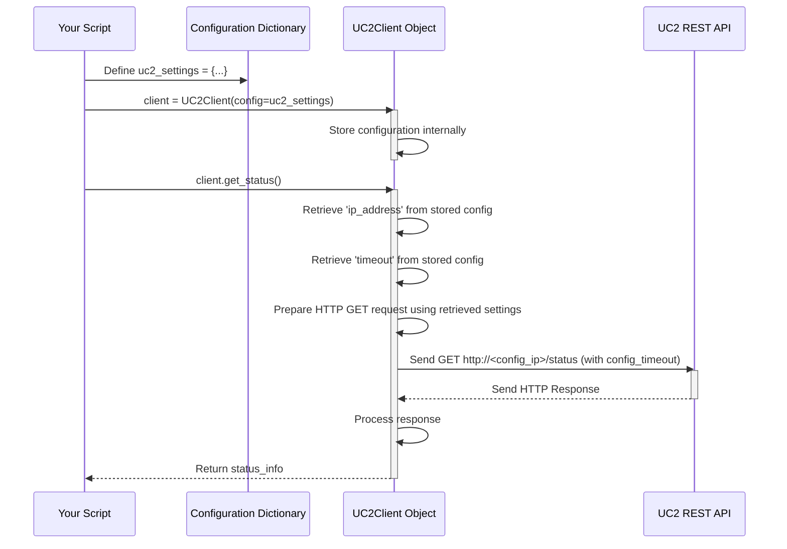

# Chapter 2: Configuration Management

In [Chapter 1: UC2Client](01_uc2client_.md), we successfully connected to our UC2 device and checked its status. Remember how we typed the IP address directly into our code?

```python
# From Chapter 1
uc2_ip_address = "192.168.1.100" # Hardcoded IP address
client = UC2Client(ip_address=uc2_ip_address)
```

This works fine for a quick test, but imagine:
*   What if your UC2 device gets a new IP address? You'd have to find and change it in your script.
*   What if you want to run the same script for multiple UC2 devices, each with its own IP?
*   What if you want to adjust other settings, like how long the script waits for a response (a "timeout")?

Changing the script every time you want to adjust a setting isn't ideal. This is where **Configuration Management** comes in handy!

## What is Configuration Management?

Think of Configuration Management like the **settings menu** in a video game or a phone app. Instead of the game developers permanently fixing the screen brightness or difficulty level inside the game's core programming, they provide a menu where *you* can change these settings easily.

Similarly, Configuration Management in `UC2-REST` provides a way to handle settings like:
*   The UC2 device's network address (IP address or URL)
*   API keys or credentials (if needed for security)
*   Timeout values (how long to wait for the device to respond)
*   Other customizable options

This allows you to change how the `UC2Client` behaves **without modifying the main Python script**. You just change the "settings menu" (the configuration).

## Using Configuration: A Better Way to Connect

Instead of passing just the IP address directly, `UC2-REST` might allow you to pass settings using a more organized approach, often using a Python dictionary.

**Step 1: Define Your Configuration**

Let's create a Python dictionary to hold our settings. A dictionary stores information as `key: value` pairs.

```python
# Define our settings in a dictionary
uc2_settings = {
    "ip_address": "192.168.1.100", # The IP of our UC2 device
    "timeout": 10                 # Wait max 10 seconds for responses
    # Add other settings here later if needed
}

print("Configuration defined:")
print(uc2_settings)
```

Here, we've stored the IP address and a new setting, `timeout`, in a dictionary called `uc2_settings`. If the IP changes, we only need to change it in this one spot!

**Step 2: Create `UC2Client` Using the Configuration**

Now, instead of giving `UC2Client` just the IP address string, let's assume it can accept our settings dictionary. (The exact way `UC2Client` accepts configuration might vary slightly, but the principle is the same).

```python
# Import the client class (if not already done)
from uc2rest import UC2Client

# Assume UC2Client can take the settings dictionary directly 
# or has a specific parameter for it. 
# Let's try passing it as a keyword argument.
# (Check the UC2-REST documentation for the exact method)
client = UC2Client(config=uc2_settings) 

print(f"Client created using configuration for device at {uc2_settings['ip_address']}") 
```

Now, the `client` object knows both the IP address *and* the timeout value, loaded from our `uc2_settings` dictionary.

*Note:* How configuration is passed (`config=uc2_settings` vs. `UC2Client(**uc2_settings)` or other methods) depends on how `UC2Client` is designed. The key idea is separating settings from the main logic. Often, libraries also support reading settings from files (like `config.yaml` or `settings.json`) or environment variables, which is even more flexible, especially for sensitive data like API keys. For now, using a dictionary keeps things simple.

**Step 3: Use the Client as Before**

You can now use the `client` object just like in Chapter 1. The difference is that it's using the settings we provided.

```python
# Use the client to get the device status
try:
    status_info = client.get_status() 
    print("Successfully retrieved status using configured settings:")
    print(status_info) 
except Exception as e:
    print(f"Could not get status: {e}")
```

The script logic (`client.get_status()`) remains the same! But now, if the UC2 device's IP changes, you only need to update the `uc2_settings` dictionary at the top of your script (or in a separate configuration file), and the rest of your code works without modification.

## Under the Hood: How Configuration is Used

When you create the `UC2Client` with configuration, what happens inside?

**Conceptual Steps:**

1.  **Initialization:** When you call `UC2Client(config=uc2_settings)`, the `UC2Client` object is created. It likely stores this configuration dictionary internally.
2.  **Method Call:** You call a method like `client.get_status()`.
3.  **Accessing Settings:** Inside the `get_status` method (or other methods), when the client needs a setting (like the IP address to build the URL, or the timeout value for the web request), it looks up that value in its stored configuration. For example, it retrieves `"192.168.1.100"` for the IP and `10` for the timeout.
4.  **Using Settings:** It uses these retrieved values to perform its task (e.g., constructing the URL `http://192.168.1.100/status` and setting the request timeout to 10 seconds).
5.  **Operation:** The rest of the process (sending the request, receiving the response) happens as described in Chapter 1, but guided by the configuration values.

**Sequence Diagram:**

This diagram shows how the configuration is used internally:



**Simplified Code Glimpse:**

Let's peek inside a *conceptual* version of `UC2Client` to see how it might store and use the configuration.

```python
# NOTE: This is a simplified conceptual example.
# It might live inside the uc2rest/UC2Client.py file

import requests 

class UC2Client:
    def __init__(self, config):
        """Initializes the client using a configuration dictionary."""
        # Store the provided configuration dictionary
        self.config = config 
        # Maybe perform some validation or setup based on config
        self.base_url = f"http://{self.config.get('ip_address', 'localhost')}" 
        self.timeout = self.config.get('timeout', 5) # Default timeout 5s if not provided
        print(f"Client initialized with base URL: {self.base_url} and timeout: {self.timeout}s")

    def get_status(self):
        """Gets the status, using configured IP and timeout."""
        status_url = f"{self.base_url}/status" 
        try:
            # Use the timeout value from the stored configuration
            response = requests.get(status_url, timeout=self.timeout) 
            response.raise_for_status() 
            status_data = response.json() 
            return status_data
        except requests.exceptions.RequestException as e:
            print(f"Error fetching status: {e}")
            # Potentially use logging here - see next chapter!
            raise 
        
    # ... other methods would also use self.config or derived values ...
```

In this example:
*   The `__init__` method takes the `config` dictionary and stores it in `self.config`. It also immediately uses `config.get(...)` to extract the `ip_address` and `timeout`, providing default values if they are missing.
*   The `get_status` method uses `self.base_url` (derived from the config's IP) and `self.timeout` (from the config) when making the web request using the `requests` library.

This shows how the configuration provided during setup guides the behavior of the client's methods later on.

## Conclusion

Well done! You've learned why hardcoding settings like IP addresses isn't flexible and how **Configuration Management** solves this. Think of it as a "settings menu" for your `UC2Client`. By defining settings (like IP address and timeouts) in a separate place (like a dictionary), you can easily change how your script connects and operates without touching the core logic. This makes your scripts more maintainable and adaptable.

You saw how to define a configuration dictionary and potentially pass it to `UC2Client` during initialization. The client then uses these settings internally when performing actions like `get_status()`.

As your scripts get more complex, knowing what's happening inside becomes important. What if an error occurs? How do you track the steps your script takes? That's where logging comes in.

Next up: [Logging](03_logging_.md)

---

Generated by [AI Codebase Knowledge Builder](https://github.com/The-Pocket/Tutorial-Codebase-Knowledge)