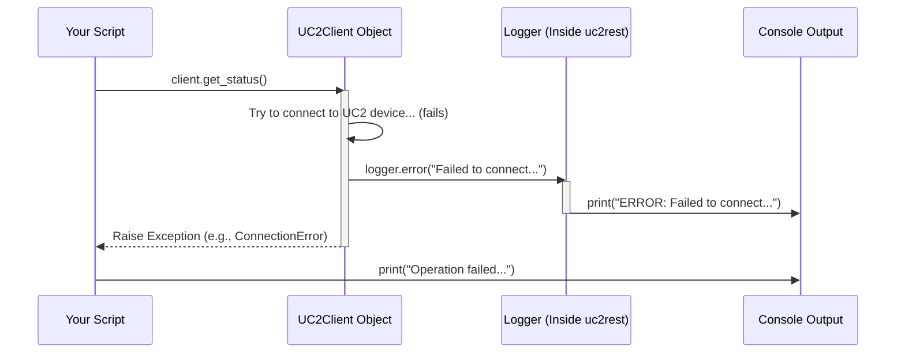

# Chapter 3: Logging

In the previous chapters, we learned about the main `UC2Client` remote control ([Chapter 1: UC2Client](01_uc2client_.md)) and how to manage settings like the IP address using [Chapter 2: Configuration Management](02_configuration_management_.md).

Now, imagine your script tries to connect to the UC2 device, but something goes wrong. Maybe the IP address was typed incorrectly in the configuration, or perhaps the device wasn't turned on. How can your script tell you what happened? Or, even if things work, how can you see the steps the `UC2Client` took behind the scenes?

This is where **Logging** comes in!

## What is Logging?

Think of logging like keeping a **diary or a logbook** for your program. Whenever something important happens—like starting an action, finishing a task, or encountering an error—the program can write a message in this logbook.

**Why is this useful?**

1.  **Debugging:** If your script crashes or doesn't behave as expected, the log messages can give you clues about what went wrong and where. It's like retracing the steps in the diary to find the problem.
2.  **Understanding:** Logs can show you the sequence of actions your program took, helping you understand its flow.
3.  **Monitoring:** For longer-running scripts, logs can provide updates on progress or status.

In `UC2-REST`, the logging system provides a way for the `UC2Client` (and potentially other parts of the library) to record information, especially about errors or details useful for developers.

Currently, the implementation is quite basic: it simply **prints these messages directly to your console** (the window where you run your Python script).

## Seeing Logging in Action

You don't usually need to write extra code in *your* script to *trigger* the basic logging provided by `UC2-REST`. It often happens automatically inside the library's functions, especially when errors occur.

Let's revisit the example from [Chapter 1: UC2Client](01_uc2client_.md), but this time, let's pretend we entered a wrong IP address in our configuration.

**Step 1: Set up Client with (Incorrect) Configuration**

```python
# Import the main client class
from uc2rest import UC2Client

# Define configuration with a non-existent IP
bad_settings = {
    "ip_address": "192.168.1.999", # This IP likely doesn't exist!
    "timeout": 3                   # Short timeout for quick failure
}

# Create the client (might print initialization logs)
# Assume it uses the configuration from Chapter 2
client = UC2Client(config=bad_settings) 
print(f"Client created trying to reach {bad_settings['ip_address']}")
```

This code sets up the `UC2Client` but points it to an invalid IP address.

**Step 2: Try to Use the Client (and trigger an error log)**

Now, let's try to get the status, which should fail. Pay attention to the output – you might see extra messages printed by the logger inside `UC2Client`.

```python
# Try to get the status - this should fail and might log an error
try:
    print("Attempting to get status...")
    status_info = client.get_status() 
    print("Successfully retrieved status:")
    print(status_info) 
except Exception as e:
    # The logging might happen *before* this message prints
    print(f"Operation failed in our script. The error was: {e}") 
```

**Example Output (Conceptual):**

When you run the script above, you might see output like this:

```
Client created trying to reach 192.168.1.999
Attempting to get status...
ERROR: Failed to connect to http://192.168.1.999/status. Reason: Connection timeout
Operation failed in our script. The error was: [Some specific connection error details] 
```

Notice the line starting with `ERROR:`? That message wasn't printed directly by *our* `print()` statements. It likely came from the **internal logger** within the `UC2Client`'s `get_status` method when it failed to connect. This automatic log message immediately tells you *why* the operation likely failed (it couldn't connect, possibly due to a timeout because the IP was wrong).

This is the power of logging: providing helpful diagnostic information without cluttering the main script logic.

## Under the Hood: How Logging Works (Simply)

In `UC2-REST`, the logging mechanism is currently straightforward. There's likely a dedicated, simple `Logger` object available internally.

**Conceptual Steps:**

1.  **Action Occurs:** A method inside `UC2Client`, like `get_status()`, performs an operation.
2.  **Event Trigger:** Something noteworthy happens—maybe an error (like a connection timeout) or just a step worth noting for debugging.
3.  **Log Call:** The `UC2Client` code calls a method on the internal `Logger` object, passing the message (e.g., `logger.error("Failed to connect...")`).
4.  **Output:** The `Logger` object takes the message and, in the current basic implementation, simply prints it to the console.

**Sequence Diagram:**

Here's how the `get_status` method might use the logger when an error occurs:



This shows that the `UC2Client` internally calls the `Logger` when needed, and the `Logger` handles the printing.

**Code Glimpse (`uc2rest/logger.py`):**

The actual code for the logger might be as simple as this (based on the provided snippet):

```python
# File: uc2rest/logger.py (Conceptual Example)

class Logger(object):
    """A very basic logger that prints messages."""
    
    def __init__(self):
        """Initializes the logger."""
        # In a real app, might configure log file, format, etc. here
        pass 

    def error(self, message):
        """Prints an error message."""
        # Simple implementation: just print to console with a prefix
        print(f"ERROR: {message}") 

    def debug(self, message):
        """Prints a debug message (for detailed tracing)."""
        # Often, debug messages are only shown if a specific setting is enabled
        # For simplicity, we just print it with a prefix
        print(f"DEBUG: {message}")

    # More methods could exist (e.g., info, warning)
```

This simple `Logger` class has:
*   An `__init__` method (which doesn't do much here).
*   An `error` method that takes a message and prints it with an "ERROR:" prefix.
*   A `debug` method that takes a message and prints it with a "DEBUG:" prefix. Debug messages are typically more detailed and might only be shown when you explicitly enable "debug mode" (though here, it just prints).

The `UC2Client` would create an instance of this `Logger` (or have one provided to it) and call `self.logger.error(...)` or `self.logger.debug(...)` internally.

## Conclusion

You've learned about **Logging** – the process of recording messages about your program's execution. It's like a diary that helps you debug problems and understand what your code is doing.

In `UC2-REST`, the current logging is basic, printing messages (especially errors) directly to the console. You saw how these messages can automatically appear when operations within the [UC2Client](01_uc2client_.md) fail, providing valuable clues without you needing to add extra print statements everywhere in your own script. We also took a brief look at the simple `Logger` class that handles this printing.

Understanding logging helps you interpret the output of your scripts and diagnose issues more effectively when working with your UC2 setup. This concludes our introductory tour of the core concepts in `UC2-REST`! You now have a basic understanding of the client, configuration, and logging. Happy automating!

---

Generated by [AI Codebase Knowledge Builder](https://github.com/The-Pocket/Tutorial-Codebase-Knowledge)