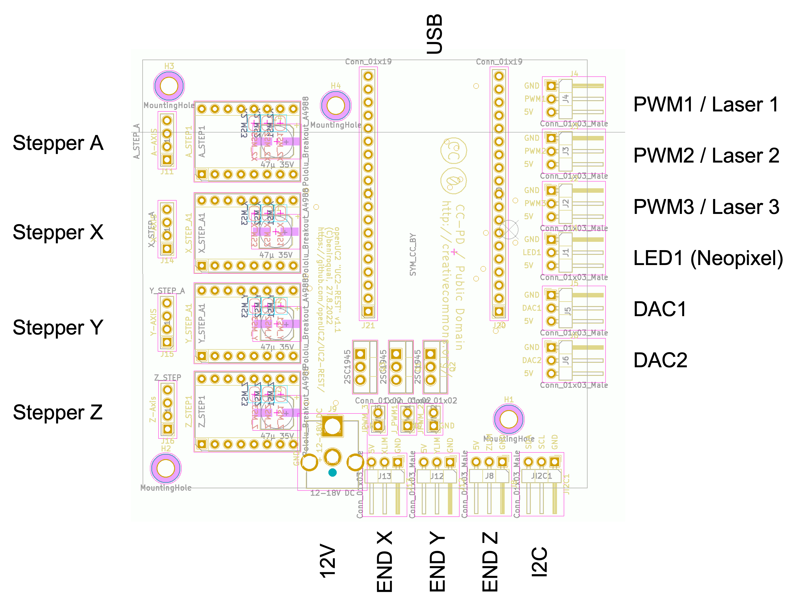
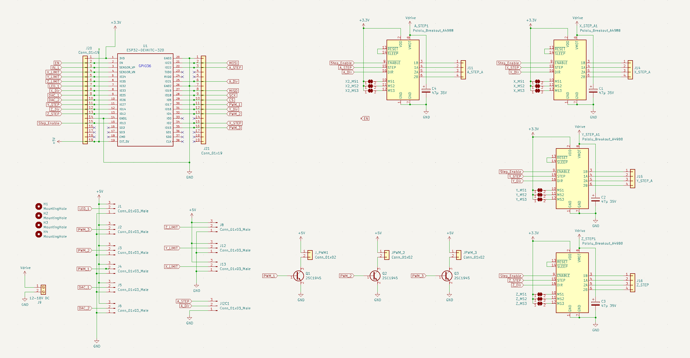

<!----------------------------------------->
## 🔌 Board layout and schematics (UC2 Standalon v2)

The board comes with 4 motor controllers (e.g. A4988 Bipolar Stepper controller), the ESP32 Dev Kit, a bunch of pins for in/outgoing connections, 3 darlington transistors (BD809) and the power distribution. It is inspired by the CNC shield and can

- run up to 4 steppers
- run multiple high power LEDs
- be controlled via PS3/PS4 Controllers
- drive Adafruits Neopixels
- trigger a Camera
- provide scanning patterns for Galvos
- control/readout external devices using I2C

We use the ESP32 in order to ensure connectivity via
- Wifi
- Bluetooth
- USB Serial (mostly used)

<!----------------------------------------->
## ⚡ Wiring
Duration:5

All connectors are coming with 2.54mm spaced male pins that can connect to JST connectors (e.g. Motors and LED Array). In case the casing is blocking it mechanically, you can remove the case. The WS2812B RGB Leds that are used for the LED Matrix should survive wrong polarity, but we recommend to not stress it. **WARNING:** It is also not recommended to drive the motor drivers without any motors attached. Make sure you have an electric load attached to the board when you power it up, otherwise the motor drivers may get damaged.

The polarity of the LED Array matters! The UC2 LED ring module comes with a JST connector where the 3 pins represent (5V, Data, GND) **RED** / Black / Black. Make sure the RED cable is connected to the 5V on the PCB.

Below you can find a rendering of the PCB that is sitting inside the 3D printed Box with all its connectors.

For those who are keen to understand the wiring, please click on the schematics below. The sources of the board will be published soon.

<!----------------------------------------->
## 💡 UC2 LED Ring
Duration:2

As for the illumination, you can use a large variation of different light sources to get your sample in the right light. But sometimes you want to have the ability to change the contrast by illuminating from oblique, only in the center, using a darkfield ring or change degree of coherence. An off-the-shelf LED Matrix is very sufficient in most cases, but it lacks the rotational symmetry. For this we have the UC2 LED Ring Module that fits directly in the Cube, has concentric rings and still offers all the degrees of freedom that the Adafruit Neopixel gives you (e.g. RGB, white, patterns..).

The 3 wires that leave the satellite board deliver 5V, Data and GND and directly connect to the UC2e via the LED pin:

