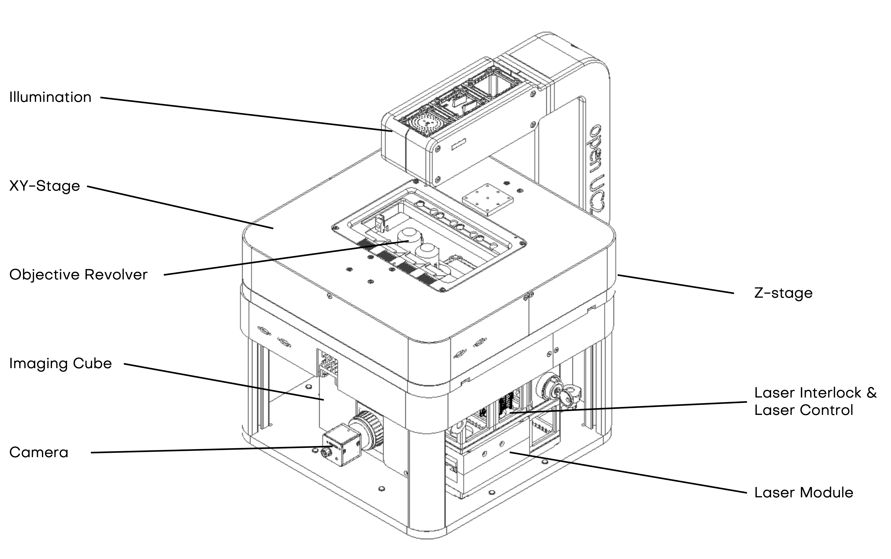
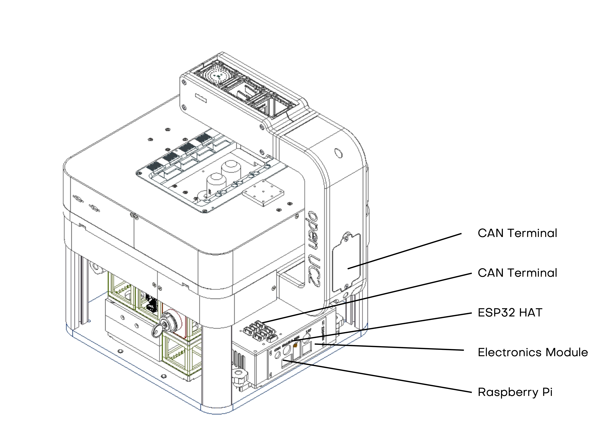
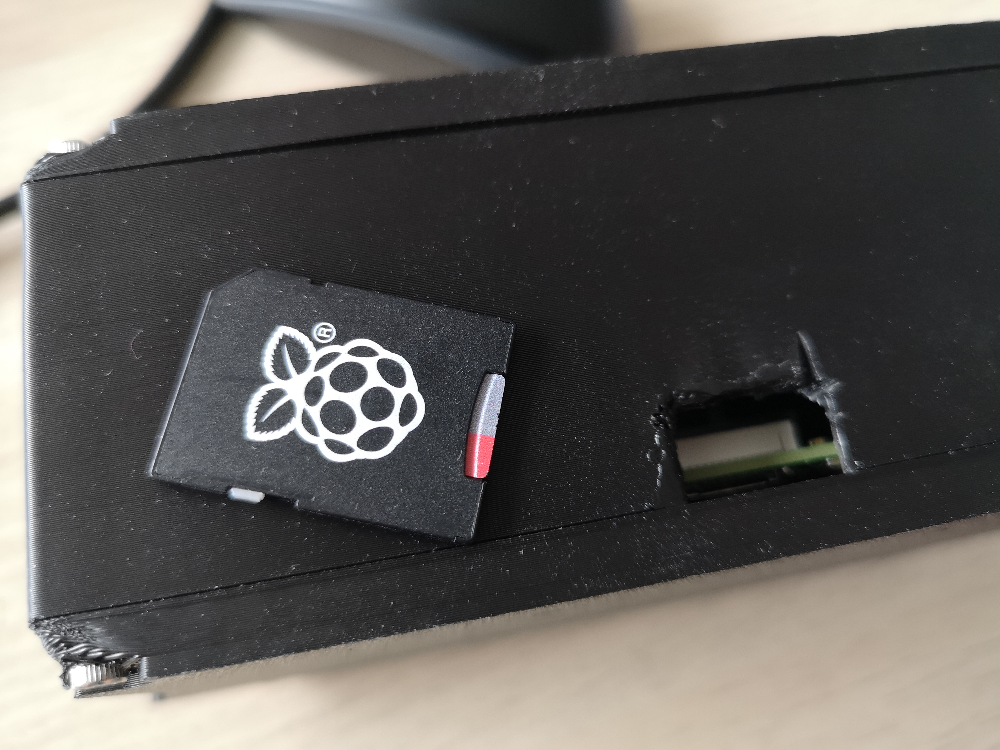
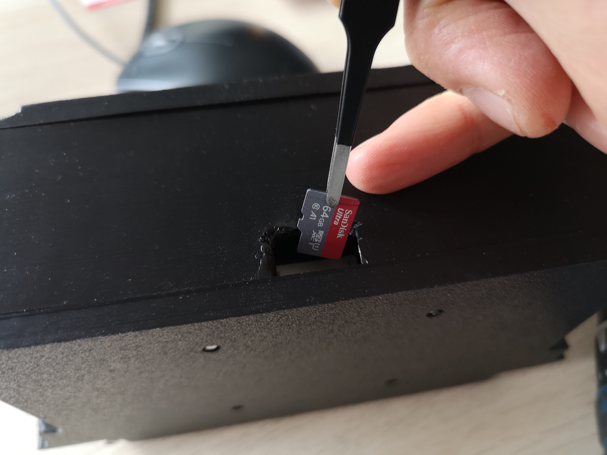

# Technical Specifications

## System Specifications

### System Overview

### Overall System Dimensions (including illumination arm)

| Parameter |  Motorized Version |
|-----------|-------------------|
| Width | 310 mm  |
| Depth | 410 mm  |
| Height | 400 mm  |
| Weight | 25 kg |

### Mechanical Specifications

#### Frame Construction
- **Material**: Anodized aluminum profiles and plates
- **Vibration Damping**: Integrated damping system (bumper feed)
- **Stage**: Integrated XYZ Stage in one mechanical design
- **Objective Revolver**: 2 Slots for multiple magnifications/resolutions 

### Optical Specifications

#### Objectives Compatibility
- **Thread**: Standard RMS (20.32 mm × 36 TPI) and M25 × 0.75; customizable
- **Magnification Range**: 2× to 100×
- **Numerical Aperture**: Up to 1.4 (oil immersion)
- **Working Distance**: 0.1 mm to 30 mm depending on objective
- **Correction**: Infinity-corrected optics (160 mm and 200 mm tube length)
- **Customization**: Bring your own microscope objective and design the adapter: XXXXX

#### Tube Lens System
- **Focal Length**: 100 mm (standard, customizable)
- **Resolution**: Diffraction limited performance
- **Field Number**: XXX

#### Condenser System
- **Type**: Koehler Illumination, LED Array using Neopixels
- **Numerical Aperture**: 0.3 - 0.5 (LED array/Darkfield)
- **Aperture Control**: Digitally using LED Ring addressing

### Illumination System

#### Transmitted Light
- **LED Illumination**:
  - White LED: 5000K, CRI >90
  - Power: 1W maximum
  - Intensity Control: 0-100% continuous via PWM and current control
  - Lifetime: >5,000 hours

#### Incident Light
- **LED Ring Light**: Adjustable segments for directional lighting
- **Fluorescence**: Modular Laser system with multiple wavelengths
  - UV: 405nm
  - Blue: 488nm
  - Green: 530nm
  - Red: 635nm

### Camera and Detection System

#### Camera Interface
- **Mount Type**: C-mount
- **Sensor Compatibility**: CMOS
- **Available Cameras:** HIK IMX179, IMX275
- **Connection**: USB 3.0
- **Trigger**: Hardware and software trigger support

#### Recommended Camera Specifications
- **Resolution**: 1920 × 1200 to 5472 × 3648 pixels
- **Pixel Size**: 2.4 μm to 6.5 μm
- **Frame Rate**: Up to 200 fps (depending on resolution)
- **Sensitivity**: >60% quantum efficiency
- **Dynamic Range**: >60 dB

### Electronic System

#### Control Electronics
- **Main Controller**: Raspberry Pi 4 or ESP32-based system
- **Communication**: CAN-BUS, USB, Ethernet, WiFi
- **I/O Interfaces**: GPIO, SPI, I2C, UART
- **Power Supply**: 24V DC, 5A (switching power supply included)

#### Motor Controllers
- **Stepper Motors**: NEMA8 (Z), Nema12 (X,Y,Objective), 200 Steps per Revolution, 1mm per revolution
- **Microstepping**: Up to 256 microsteps per step (TMC2009)
- **Position Feedback**: Magnetic  encoders (for x,y - optional)
- **Homing**: Optical limit switches

#### Sensor Integration
- **Temperature**: via I2C
- **Humidity**: via I2C
- **Focus Sensor**: optional: Astigmatism Based via CAN Bus (coming soon)

### Software Specifications

The internal Raspberry Pi 5 runs ImSwitch-OS which is a raspberry pi OS Sd card image that runs ImSwitch in a docker container. An external computer is needed to connect to this instance via Wifi. More to that later in the Operaional Manual 

Changing the SD Card can be done from the rear of the electronics box in side the FRAME. You can find the openUC2 OS in the dedicated repository and download it from ZENODO: https://github.com/openUC2/imswitch-os

 

#### Operating System Compatibility

More information about this here:  https://docs.openuc2.com/ XXX
- **Windows**: Windows 10/11 (64-bit)
- **macOS**: macOS 10.15 or later
- **Linux**: Ubuntu 20.04 LTS or later
- **Web Interface**: Modern browsers (Chrome, Firefox, Safari, Edge)

#### Software Requirements

Frontend-only:
- **RAM**: 8 GB minimum, 16 GB recommended
- **Storage**: 1 GB free space for software, additional space for images
- **Graphics**: OpenGL 3.0 compatible graphics card
- **Network**: Ethernet or WiFi for remote control

### Environmental Requirements

#### Operating Conditions
- **Temperature**: 15°C to 35°C
- **Humidity**: 30% to 80% relative humidity, non-condensing
- **Atmospheric Pressure**: 86 kPa to 106 kPa
- **Altitude**: Up to 2000 m above sea level

#### Storage Conditions
- **Temperature**: -10°C to 60°C (14°F to 140°F)
- **Humidity**: 10% to 95% relative humidity, non-condensing

#### Installation Requirements
- **Vibration**: optical table with vibration damping recommended for best performance
- **Space**: 1 m × 1.5 m minimum work area
- **Power**: 230V AC, 50/60 Hz (or 115V AC with adapter)
- **Ventilation**: Natural convection (no forced ventilation required)

## Component Specifications

### Inner Cube System

#### Cube Modules (Standard 50mm)

#### Mechanical Specifications
- **Dimensions**: 50 × 50 × 50 mm
- **Material**: ABS / injection molded
- **Precision**: ±0.1 mm dimensional accuracy
- **Interface**: Dovetail connection system
- **Mounting**: Threaded inserts M3 and M4 compatible
- **Optical Aperture**: 25mm clear aperture (configurable)

#### Electronic Components
- **Microcontrollers**: ESP32, Arduino-compatible (see https://github.com/youseetoo/uc2-esp32/)
- **Communication**: I2C, SPI, CAN-BUS
- **Power**: 12V input via CAN Bus, operational voltage 3.3V, 5V
- **Indicators**: LED status lights via Neopixel interface (on board breakout)

#### Optical Specifications
- **Aperture Diameter**: 25mm standard (custom sizes available)
- **Coating**: Anti-reflection coating on optical surfaces
- **Alignment Tolerance**: ±0.02mm lateral, ±0.01mm axial
- **Surface Quality**: 60-40 scratch-dig specification
- **Clear Aperture**: >90% of geometric aperture

### Stage System

#### XYZ Positioning System (Motorized Stage)
- **X-Y Travel Range**: 75 × 50 mm (standard), up to 120 × 90 mm (extended), stepsize: ~300nm
- **Z-Travel Range**: 8 mm, stepsize: ~300nm
- **Resolution**: 0.3 μm (motorized)
- **Accuracy**: ±XXXX μm
- **Repeatability**: ±0.5 μm
- **Speed**: 0.1 μm/s to 10 mm/s
- **Acceleration**: Programmable, up to 100 mm/s²
- **Load Capacity**: 2 kg maximum

### Focus System

#### Motorized Focus
- **Range**: 25 mm
- **Resolution**: 0.05 μm
- **Speed**: 0.1 μm/s to 5 mm/s
- **Repeatability**: ±0.1 μm
- **Autofocus**: Laser-based or image-based (optional)

## Compatibility and Standards

### Microscopy Standards
- **ISO 8038**: Optics and photonics - Microscopes
- **DIN 58887**: Microscopes - Objectives

### Communication Standards
- **CAN ISO-TP**: Controller Area Network protocol
- **USB 3.0**: Universal Serial Bus specification
- **Ethernet**: IEEE 802.3 standard
- **WiFi**: IEEE 802.11ac/ax standards

### Safety Standards
- **IEC 61010-1**: Safety requirements for electrical equipment
- **IEC 62471**: Photobiological safety of lamps and lamp systems
- **EN 55011**: Electromagnetic compatibility

## Performance Specifications

*Continue to [Installation and Setup](./04_Installation_and_Setup.md) for detailed installation procedures.*
