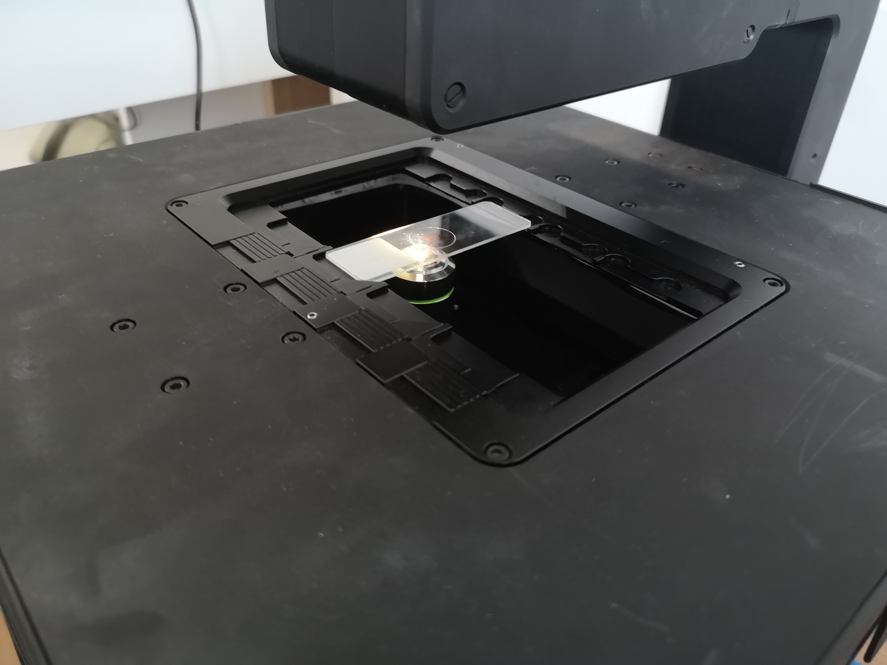
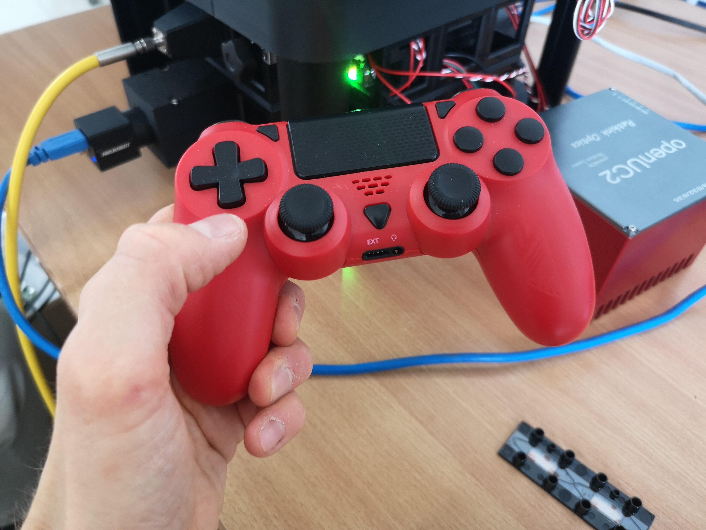
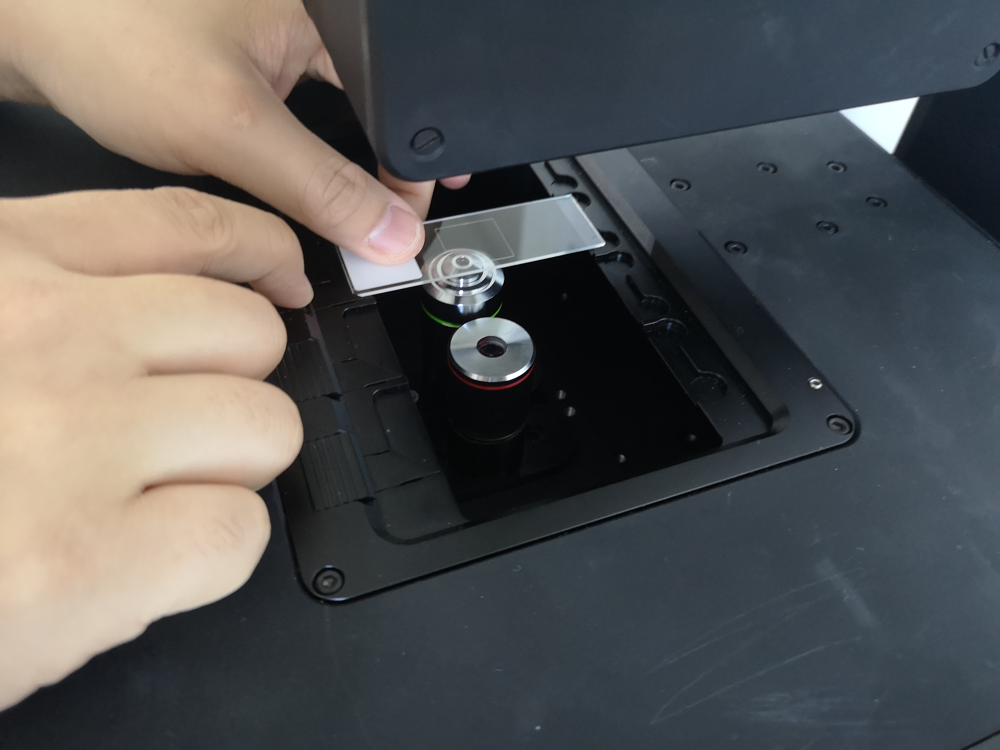
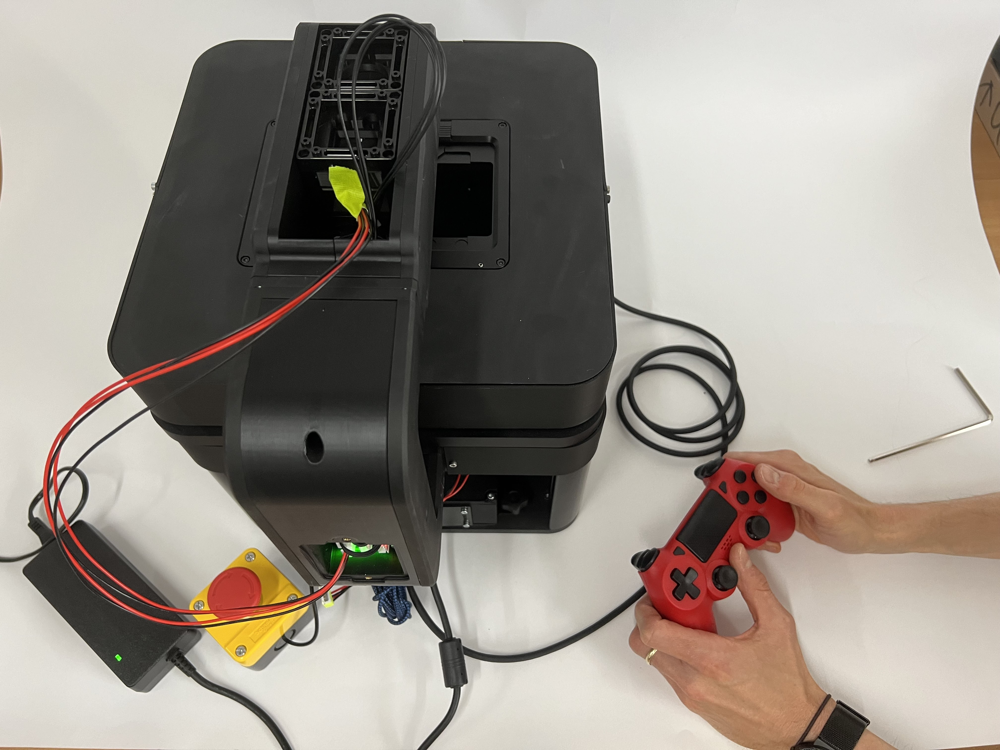
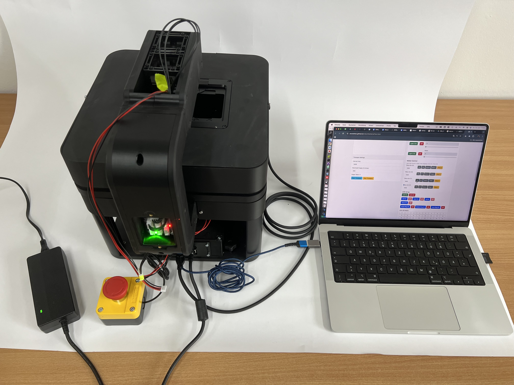
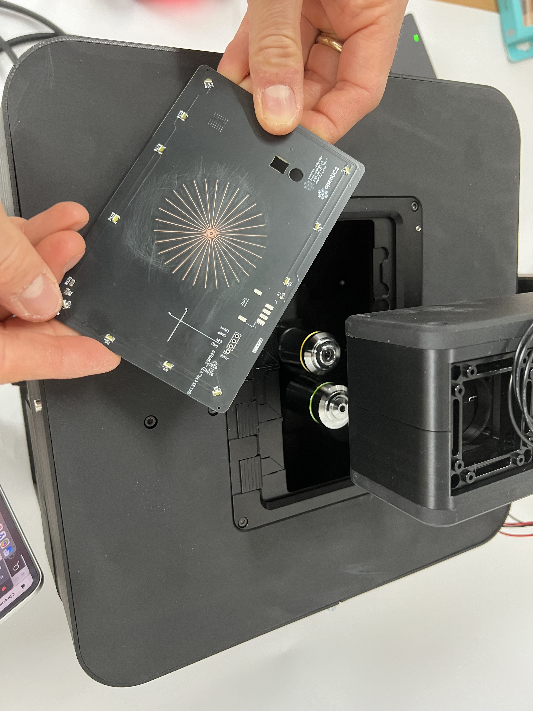

# Operation Manual

## System Startup and Shutdown

### Daily Startup Procedure

1. **Pre-Startup Checklist**:
   - [ ] Verify workspace is clean and organized
   - [ ] Check that no objects obstruct moving parts
   - [ ] Ensure adequate ventilation around electronics
   - [ ] Verify environmental conditions are within specifications

2. **Power-On Sequence**:
   ```
   ⚠️ CAUTION: Always follow proper startup sequence to avoid damage.
   ```
   - Connect 12V power supply
   - Wait for system self-test to complete (LED indicators and homing on startup)

ToDo Armin 250813: LED Indicators beschreiben, nur sichtbare für den Kunden, woran erkennt der Kunde, dass der Selftest vorbei ist und okay ist?
Was sagen die LEDs aus
LEDs Laser Modul
LEDs connector Board
LED ESP32 grün blinkend
Rote LED am Netzteil => Netzteil angeschlossen
LAN Kabel LED
   - XY axes will home and move to 0,0 position (disable by setting `homeOnStartX:0` in configuration file)
   - Start computer and ImSwitch control software
   - Allow 15-minute warm-up period for thermal stability if placed in an incubator

3. **System Initialization**:
   - Access ImSwitch from your laptop/tablet browser using the microscope's IP address or hostname with port 8001
   - Verify communication with all modules
   - Turn on live stream
   - Move to an XY position
   - Check illumination systems
   - Verify video stream is working
   - Check sample focus and begin image acquisition

### Shutdown Procedure

1. **End-of-Session Tasks**:
   - Park objectives in safe position
   - Turn off illumination systems
   - Go to settings and push the shutdown button
   - Wait approximately 30 seconds
   - Remove power plug

2. **Power-Down Sequence**:
   - Cover system if in dusty environment

## Basic Operation (FRAME System)

The FRAME system is fully motorized and operated through software interfaces. All system control is achieved through:
- **ImSwitch Web Interface**: Primary graphical user interface accessible via web browser
- **PS4 Controller**: Alternative hardware interface for manual positioning and control

**Short Introduction PS4 Controller operation**
- FRAME powered on, Self Tests and homing done, ESP32 ready
- PS4 Controller connects via bluetooth
- PS4 Controller - not connected


PS4-Controller 


Light Bar (PS4 turned off)


Light Bar PS4 Connected (red)


Light Bar PS4 charging and NOT connected (yellow)

- Press Home button for a couple of seconds (triangular button between joysticks), light bar shortly blinks and then shows steady light = succesful connection
Test X/Y/Z movement and lamp on/off according to 


(X/Y and Z Joystick testet, A not implemented, Lamp on/off tested, Z buttons not tested (needs imaging))  

Turning off PS4 => press home button for roughly 30s 
If PS4 cannot connect light bar blinks for around 15s,then turns off
If connection gets lost, light bar tunrs off after around 5s.

**Basic Microscopy Setup**

#### Sample Preparation and Loading

1. **Sample Mounting**:
   - Clean sample holder thoroughly
   - Mount sample according to type:
     - **Standard slides**: Use slide clips
     - **Petri dishes**: Use dish holder
     - **Custom samples**: Use appropriate fixtures
   - Ensure sample is secure and level








2. **Sample Positioning**:
   - Use coarse XY adjustment to center sample
   - Adjust Z-position for initial focus
   - Use fine adjustments for precise positioning

Sample positioning can be performed using either the PlayStation controller or the web GUI. The GUI provides a sample map where you can click anywhere to move the microscope to that position. Periodically, you may need to recalibrate the absolute positioning system to ensure accuracy. Use the stage center calibration tool in the web GUI to perform this calibration process.

#### Illumination Setup

The FRAME system offers multiple illumination modes:

**Transmission Illumination**: A high-powered white LED mounted above the sample provides transmission lighting with a lens system for Köhler illumination. Concentric LED rings around the main LED enable various contrast mechanisms including phase contrast, darkfield, and oblique illumination. Each RGB LED can be individually controlled to enable advanced techniques like Fourier ptychography microscopy.

**Fluorescence Illumination**: Multiple fluorescence excitation options are available from below, including laser excitation combined with dichroic filters to illuminate the sample from below.

All illumination settings are accessible through the main GUI illumination controls.

1. **Transmitted Light (Brightfield)**:
   - Turn on LED illumination
   - Adjust intensity using the LED slider in the GUI
   - Currently there are no mechanisms to center the LED - alignment assumes it is concentric with the objective lens after proper setup
   - The illumination NA is predefined by the LED lens system
   - Different numerical apertures can be achieved by turning on/off different rings of the LED matrix
 

2. **LED Matrix Illumination Setup**:
   ```
   📝 NOTE: Köhler illumination provides optimal image quality.
   ```

**LED Matrix Operation**: The LEDs arranged concentrically around the high-power LED enable various contrast mechanisms including darkfield, quantitative phase contrast, and Fourier ptychography. These can also be used for annular intensity diffraction tomography.

   ```
   ⚠️ CAUTION: Running all LEDs in bright mode consumes ~20W and generates significant heat.
   The LED array will automatically shut off if temperature exceeds 100°C.
   Do not operate all LEDs simultaneously for extended periods.
   ```

Different illumination patterns can be selected from the LED Matrix menu in the UI:

**Darkfield Mode**: Set different LED ring diameters to match numerical apertures just above the detecting objective. This eliminates direct light (zero order) through the objective lens, measuring only scattered light. This creates a dark background with bright sample features. Larger ring diameters correspond to higher numerical aperture values.

**Quantitative/Differential Phase Contrast**: Sequential activation of left/right and top/bottom LED patterns provides different information for computing sample phase relative to amplitude. This technique is useful for imaging transparent samples like unlabeled biological cells. After capturing four images, compute the differential phase contrast image by subtracting opposite sides and dividing by their sum. The system can automate this process and acquire images in sequence.

**Phase Contrast Ring**: Similar to darkfield, turn on the ring at a diameter matching the phase ring inside the objective. When the rings overlap properly, the zero order diffraction is dimmed, promoting phase variations in the sample. Proper alignment can be verified by observing the C-mount ring on the camera - you should see two concentric rings (one from the light, one from the objective). When these rings match in size and concentricity, a phase contrast image should appear.


 

### Focus Control

#### Coarse Focus
- **Range**: +/-4 mm vertical travel
- **Use**: Initial focusing and large adjustments
- **Technique**: Use smooth, controlled movements with the joystick or plus/minus buttons in the GUI
- **Safety**: Avoid contact between objective and sample - lens damage may occur!

Use the PlayStation controller's left joystick for up/down movement or the UI buttons for relative and absolute positioning.

#### Fine Focus
- **Use**: Precise focusing for high-magnification work using the rear paddles on the controller or reduced step size in the GUI
- **Technique**: Small incremental adjustments

Use the rear paddles on the PlayStation controller for precise objective lens movement or the GUI elements in the web interface for fine focus control.

### Stage Operation

#### Sample Navigation
1. **Initial Positioning**: Use coarse movements to locate area of interest
2. **Fine Positioning**: Use small adjustments for precise positioning
3. **Systematic Scanning**: Use consistent patterns for sample survey

Stage navigation can be performed using either the PlayStation controller or the web UI interface.

## Inner Cube System Operation

### Understanding the Inner Cube System

The FRAME microscope employs a unique modular cube drawer system that forms the heart of its optical configuration. The inner cube system consists of multiple cube holders that slide into the main optical frame, allowing for flexible optical path configuration.

**Note**: This section consolidates information about the inner cube system operation.

#### Cube System Components

1. **Cube Holders**: 50mm × 50mm × 50mm standardized mounting units
2. **Drawer Rails**: Precision sliding mechanisms for smooth cube insertion/removal  
3. **Optical Alignment System**: Ensures precise optical axis alignment
4. **Locking Mechanism**: Secures cubes in proper position during operation

### Inner Cube Assembly and Configuration

#### Pre-Assembly Inspection

Before installing any cube modules:

1. **Visual Inspection**:
   ```
   ⚠️ CAUTION: Handle cube modules carefully to avoid damage to optical surfaces.
   ```
   - Check cube holders for damage or debris
   - Verify drawer rails are clean and smooth
   - Inspect optical surfaces for cleanliness
   - Ensure all mounting screws are properly tightened

2. **Alignment Verification**:
   - Check that drawer rails are parallel to optical axis
   - Verify cube holder interfaces are square and clean
   - Test sliding motion without obstruction

#### Cube Installation Process

1. **Preparation**:
   - Power down the system completely
   - Ensure adequate workspace lighting
   - Have lens cleaning supplies readily available
   - Organize cube modules by intended position

2. **Installation Procedure**:
   ```
   Step 1: Open cube drawer system
   Step 2: Select appropriate cube module for position
   Step 3: Align cube with drawer guides
   Step 4: Slide cube into position until it clicks
   Step 5: Verify secure locking engagement
   Step 6: Test smooth drawer operation
   ```

3. **Position Verification**:
   - Check that cube sits flush in drawer
   - Verify optical alignment marks are aligned
   - Ensure no tilting or binding in drawer system
   - Test drawer sliding motion remains smooth

#### Standard Cube Configurations

##### Brightfield Configuration
- **Position 1**: Illumination cube (LED + condenser)
- **Position 2**: Sample holder cube  
- **Position 3**: Objective cube
- **Position 4**: Camera/detector cube

##### Fluorescence Configuration  
- **Position 1**: Excitation filter cube
- **Position 2**: Dichroic mirror cube
- **Position 3**: Emission filter cube
- **Position 4**: Detection cube

##### Phase Contrast Configuration
- **Position 1**: Phase condenser cube
- **Position 2**: Sample cube with phase rings
- **Position 3**: Phase objective cube
- **Position 4**: Camera cube

### Cube System Maintenance

#### Daily Maintenance (2 minutes)
- [ ] Visual inspection of cube alignment
- [ ] Check drawer sliding operation
- [ ] Verify secure locking of all cubes
- [ ] Clean any visible dust from cube surfaces
- [ ] Ensure the dichroic mirror is properly positioned


### Troubleshooting Common Cube System Issues

#### Cube Doesn't Slide Smoothly
**Symptoms**: Binding, sticking, or rough motion during cube insertion/removal

**Possible Causes**:
- Debris in drawer rails
- Misaligned cube holder
- Worn or damaged rail surfaces
- Improper cube orientation
- Loose screws

**Solutions**:
1. Clean drawer rails thoroughly with appropriate solvent
2. Check cube orientation and reinsert properly
3. Inspect for physical damage to rails or cube interfaces
4. Apply specified lubricant if recommended in maintenance manual

#### Optical Misalignment After Cube Installation  
**Symptoms**: Reduced image quality, vignetting, or focus issues

**Possible Causes**:
- Cube not fully seated in drawer (not reaching endstop)
- Improper cube orientation
- Damaged optical surfaces
- Contamination on optical interfaces

**Solutions**:
1. Remove and reinstall cube ensuring full seating
2. Verify cube orientation matches alignment marks
3. Clean optical surfaces using proper lens cleaning techniques
4. Check for damaged optical components requiring replacement

#### Cube Locking Mechanism Failure
**Symptoms**: Cube doesn't stay securely in position, can be easily moved

**Possible Causes**:
- Worn locking mechanism
- Debris preventing proper engagement

**Solutions**:
1. Clean locking mechanism thoroughly
2. Inspect locking interface for damage  
3. Contact technical support if mechanism repair is required (see our forum) 

### Safety Considerations for working on Inner Cube System 

```
⚠️ WARNING: Always power down system before cube manipulation
```

1. **Electrical Safety**:
   - Ensure system is completely powered off
   - Allow electronics to discharge before handling
   - Avoid touching electrical contacts on cube modules

2. **Optical Safety**:
   - Handle optical surfaces with extreme care
   - Use appropriate lens cleaning materials only
   - Never touch optical surfaces with bare hands
   - Store removed cubes in protective containers

3. **Mechanical Safety**:
   - Support cube weight properly during installation
   - Avoid forcing cubes into position
   - Check for secure locking before releasing cube
   - Keep fingers clear of drawer mechanisms

### Software Interface Overview

#### ImSwitch Control Interface

**Note**: This section provides an overview of the ImSwitch control interface. For detailed tutorials with images and videos, please refer to the current ImSwitch documentation.

The FRAME system integrates with ImSwitch software for comprehensive control:

1. **Main Interface Elements**:
   - **Live View**: Real-time camera display
   - **Stage Control**: XYZ positioning controls
   - **Illumination Control**: Light source intensity and switching
   - **Acquisition Settings**: Camera and recording parameters

**Additional Controllers**: Your custom system configuration can include various other controllers that merge different functionalities between hardware, image processing, and software, such as:

- **Autofocus Controller**: Takes a series of images while moving the stage and moves to the position with highest contrast
- **Experiment Controller**: Enables area scanning and stitching
- **Backend Controllers**: Provide functionality through the React-based web application

For up-to-date documentation, please refer to our ImSwitch documentation or repository.

2. **Navigation Panel**:
   - Position indicators with numerical readouts
   - Step size selection for movements
   - Home and limit position controls
   - Emergency stop button

**Calibration of Pixel Size by Capturing a Ruler**

The microscope does not know its physical properties, so we must calibrate the motion axes to convert from steps to millimeters and from pixels to millimeters. These values are stored in the configuration file but require initial calibration. For linear stages, this depends on hardware specifications and is already pre-configured.

When objective magnification changes, the effective pixel size changes and requires recalibration. To calibrate:
1. Take a ruler with known dimensions
2. Capture an image
3. Open the file in Fiji to measure the number of pixels for a given unit on the calibration slide
4. Calculate pixel size: divide the known distance (e.g., 1 millimeter) by the number of pixels (e.g., 1000 pixels) to get pixel size (1 micrometer in this example)

**Capturing a Large Panorama Using Multiple Tiles and Opening in Fiji**

The experiment controller has a built-in sample overview map where you can select an area using the max dome selector. This area is then scanned sequentially in XY to produce a stitched imaging result. 

#### PS4 Controller Operation

```
📝 NOTE: The FRAME system supports wireless PS4 controller for intuitive operation.
```


*PS4 controller for wireless operation. Press the connect button (middle button) and wait for the controller to connect to the microscope (will flash a few times and then glow continuously). For detailed function explanations, see: https://docs.openuc2.com/docs/Electronics/PS4-Controller/PS4-Controller/*

1. **Connection Setup**:
   - Press the connect button (middle button on controller)
   - Wait for controller to pair (LED will flash then remain steady)
   - Verify connection in system interface

2. **Control Functions**:
   - **Right Stick**: XY stage movement
   - **Left Stick**: Z-axis (focus) control (up/down)
   - **Rear Paddles**: Z-axis fine control (left/right paddles for up/down)
   - **Cross Button**: Turn on/off Laser 1/2
   - **Other Buttons**: Various system functions and shortcuts for LED ring control, photo capture

#### Web Interface Access

##### Web Serial

You can access the functions of the microscope using the serial interface. This works without any installation or the Raspberry Pi.


*Web serial interface showing device connection and control options. Use this interface to connect to the ESP32 device and test motion by moving the stage and controlling illumination remotely.*

##### Web Interface using ImSwitch

This interface is ideal for complex experiments where hardware, software, and image acquisition must work together.

```
📝 NOTE: The FRAME system includes a web-based interface for remote operation.
For more information: https://docs.openuc2.com/docs/ImSwitch/Quickstart
```

1. **Access Setup**:
   - Connect to system via browser: `http://[IP_ADDRESS]:8001`
   - Accept self-signed SSL certificate if prompted
   - Log in with user credentials

2. **Interface Features**:
   - Complete system control via web browser
   - Real-time image display
   - Parameter adjustment and automation
   - Data export and sharing capabilities


### Motorized Stage Control

#### Position Control
- **Resolution**: 0.3 μm minimum step size
- **Speed Range**: 0.1 μm/s to 10 mm/s
- **Acceleration**: Programmable acceleration profiles
- **Accuracy**: Position repeatability within specification limits

#### Movement Commands
1. **Absolute Positioning**: Move to specific coordinates
2. **Relative Positioning**: Move by specified distance from current position
3. **Homing**: Return to defined home position
4. **Limit Setting**: Define software travel limits

 For further information please refer to: https://docs.openuc2.com/docs/Electronics/Advanced/UC2-ESP32/Setup_Buildenvironment

### Autofocus System

**This is a work-in-progress section**

#### Focus Methods

1. **Astigmatism-based Laser Focussing** (optional as a module):
   - Non-contact surface detection
   - Works with reflective samples
   - Fast response time
   - CAN-bus integration
   - IR detection
   - More information: https://github.com/openUC2/openUC2-Hackathon-BluFocus

2. **Image-Based Autofocus**:
   - Analyzes image contrast
   - Works with any sample type
   - Requires good illumination
   - Slower but more versatile
   - Implemented in the ImSwitch Software


### Illumination Control

#### LED System Control

**Note**: This section consolidates LED control information with the earlier illumination setup section.

1. **Intensity Adjustment**:
   - Software control: 0-100% intensity corresponding to PWM/TTL values from hardware
   - Real-time adjustment during imaging
   - Independent control of multiple channels
   - Automatic exposure compensation

2. **Multi-Channel Illumination** (Fluorescence):
   - Individual LED control
   - Wavelength selection
   - Filter coordination
   - Sequence programming

## Imaging and Acquisition

### Camera Operation

#### Basic Image Acquisition

**This is a work-in-progress documentation section**

1. **Live View Setup**:
   - Start camera streaming
   - Adjust exposure time and gain
   - Check for proper illumination
   - Verify focus quality

2. **Image Capture**:
   - Single image capture
   - Time-lapse sequences
   - Z-stack acquisition
   - Multi-channel imaging

#### Advanced Acquisition Modes

1. **Time-Lapse Imaging**:
   - Define acquisition intervals
   - Set total duration
   - Configure illumination timing
   - Monitor sample stability

2. **Z-Stack Acquisition**:
   - Define focus range
   - Set step size between planes
   - Configure acquisition sequence
   - Post-processing options

3. **Multi-Position Imaging**:
   - Define position list
   - Set acquisition parameters per position
   - Configure stage movement timing
   - Batch processing options

### Contrast Methods

#### Brightfield Microscopy

1. **Setup Procedure**:
   - Use white LED illumination
   - Set Köhler illumination
   - Adjust condenser aperture
   - Optimize contrast vs. resolution

2. **Optimization**:
   - Balance illumination intensity
   - Adjust aperture diaphragm
   - Check field uniformity
   - Fine-tune focus

#### Phase Contrast Microscopy

1. **Requirements**:
   - Phase contrast objectives
   - Phase rings in condenser
   - Proper alignment essential

2. **Setup Procedure**:
   - Install phase contrast condenser
   - Select matching phase ring
   - Align phase rings (centering telescope recommended)
   - Optimize aperture settings

#### Differential Phase Contrast (DPC)

1. **Requirements**:
   - Ring Led with multiple segments
   - Proper optical alignment

2. **Setup Procedure**:
   - Take images with illumination on left/right, up/down
   - compute

#### Fluorescence Microscopy

1. **Safety Considerations**:
   ```
   ☀️ WARNING: UV radiation hazard. Use appropriate eye protection. in case of lasers ensure you follow laser safety guidelines
   ```
   - follow Laser safety steps
   - Minimize any radiation that could harm you
   - Ensure proper ventilation

2. **Setup Procedure**:
   - Install appropriate filter sets (muss gleichli this is are the free installs as you have a multi and filter set
   - Select correct excitation wavelength 
   - Adjust illumination intensity
   - Optimize for signal-to-noise ratio by increasing or decreasing exposure time and gain

3. **Filter Sets**:
  country be provide laserbase exitation for the following Wrestling 

405, 488, 532, 635 nm

we plan to have led based exhortation to so please feel free to reach out to us if you need additional guidance

### Step-by-step guid for the FRAME Microscope to acquire fluorescence images

#### Walk through using multi-band fluorescence excitation in a hands-on session

<div style={{position: 'relative', paddingBottom: '56.25%', height: 0, overflow: 'hidden'}}>
  <iframe 
    style={{position: 'absolute', top: 0, left: 0, width: '100%', height: '100%'}}
    src="https://www.youtube.com/embed/WS8fe_PJkTk?si=lJT3H80CpWUPyPto" 
    title="YouTube video player" 
    frameBorder="0" 
    allow="accelerometer; autoplay; clipboard-write; encrypted-media; gyroscope; picture-in-picture" 
    allowFullScreen
  />
</div>

#### Walk through using multi-band fluorescence excitation in a hands-on session from the software perspective

<div style={{position: 'relative', paddingBottom: '56.25%', height: 0, overflow: 'hidden'}}>
  <iframe 
    style={{position: 'absolute', top: 0, left: 0, width: '100%', height: '100%'}}
    src="https://www.youtube.com/embed/AP0Lg3NQ5r4?si=lBYVk9zBTs0dbSTj" 
    title="YouTube video player" 
    frameBorder="0" 
    allow="accelerometer; autoplay; clipboard-write; encrypted-media; gyroscope; picture-in-picture" 
    allowFullScreen
  />
</div>

## Automation and Programming

### Basic Automation Scripts

#### Python Interface


##### ImSwitch-Client based

##### Jupyter notebook

##### As Controller

### Advanced Automation

#### Multi-Well Plate Imaging

*Docs Coming Soon* Inside the ImSwitch Wellplate Controller

#### Time-Lapse with Environmental Control

*Docs Coming Soon* Inside the ImSwitch Experiment Controller

## System Monitoring and Maintenance

### Performance Monitoring

#### System Health Checks

1. **Daily Checks**:
   - Verify stage positioning accuracy
   - Check focus repeatability
   - Monitor temperature stability
   - Test illumination uniformity

2. **Weekly Checks**:
   - Clean optical surfaces
   - Check mechanical adjustments
   - Verify software backups
   - Update system logs

### Preventive Maintenance

#### Daily Maintenance

1. **Optical Cleaning**:
   - Use appropriate cleaning materials
   - Clean in circular motions from center outward
   - Avoid touching optical surfaces with fingers
   - Use compressed air to remove dust

2. **Mechanical Care**:
   - Check for smooth stage movement
   - Verify focus mechanism operation
   - Clean sample holders
   - Organize workspace

#### Weekly Maintenance

1. **System Cleaning**:
   - Clean external surfaces with mild detergent
   - Vacuum air vents and cooling fans
   - Check cable connections
   - Update software if needed

2. **Calibration Verification**:
   - Check stage accuracy with calibration sample
   - Verify camera pixel calibration
   - Test autofocus repeatability
   - Document any deviations


*Sample calibration target for stage center calibration. This target helps calibrate the stage's center position. When moving to the stage center, the offset position should be X/Y=55/43mm.*

## Troubleshooting

### Common Issues and Solutions

#### Mechanical Problems

| Problem | Symptoms | Possible Causes | Solutions |
|---------|----------|-----------------|-----------|
| Stage binding | Rough movement, positioning errors | Debris, misalignment | Clean rails, check alignment |
| Focus drift | Image goes out of focus over time | Temperature changes, loose connections | Allow warm-up, check mounts |
| Vibration | Image instability | Poor isolation, external vibration | Improve isolation, check environment |

#### Optical Problems

| Problem | Symptoms | Possible Causes | Solutions |
|---------|----------|-----------------|-----------|
| Poor image quality | Blurry, low contrast | Dirty optics, misalignment | Clean lenses, check alignment |
| Uneven illumination | Dark or bright spots | Bulb misalignment, dirty condenser | Align illumination, clean optics |
| Focus problems | Cannot achieve sharp focus | Objective/sample mismatch | Check working distance, clean |

#### Software Problems

| Problem | Symptoms | Possible Causes | Solutions |
|---------|----------|-----------------|-----------|
| Communication errors | Device not responding | Driver issues, cable problems | Reinstall drivers, check cables |
| Slow performance | Laggy interface | Insufficient resources | Close other programs, add RAM |
| Acquisition failures | Camera not capturing | Configuration errors | Check camera settings |

### Error Codes and Diagnostics

#### System Error Codes

- **E001**: Stage communication timeout
- **E002**: Focus limit reached
- **E003**: Camera initialization failed
- **E004**: Illumination system fault
- **E005**: Temperature out of range

#### Diagnostic Procedures

1. **System Diagnostic Mode**:
   - Access via service menu
   - Run automated tests
   - Review diagnostic reports
   - Contact support if needed

2. **Log File Analysis**:
   - Check system logs for errors
   - Monitor performance metrics
   - Track usage patterns
   - Export logs for support

---

*Continue to [Maintenance and Troubleshooting](./06_Maintenance_and_Troubleshooting.md) for detailed maintenance procedures.*
