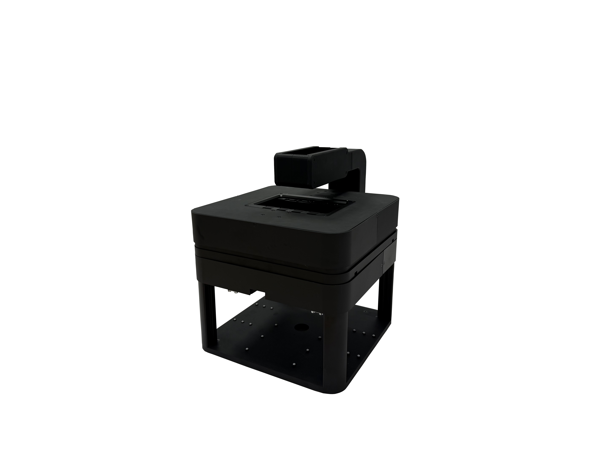

# Maintenance and Troubleshooting

## Preventive Maintenance Schedule

### Daily Maintenance Tasks

#### System Inspection (5 minutes)
- [ ] Visual inspection for loose components
- [ ] Check stage movement smoothness
- [ ] Verify illumination system operation
- [ ] Ensure workspace is clean and organized

#### Basic Cleaning
- [ ] Clean sample holders and stage surface
- [ ] Remove dust from external surfaces
- [ ] Check for cable damage or wear
- [ ] Verify all connections are secure

### Weekly Maintenance Tasks

#### Optical System Maintenance (15 minutes)

1. **Objective Lens Cleaning**:
   ```
   ⚠️ CAUTION: Use only appropriate cleaning materials to avoid damage.
   ```
   - Power off system before cleaning
   - Use lens cleaning paper and solution
   - Clean with gentle circular motions from center outward
   - Allow to air dry completely
   - Inspect for scratches or damage

2. **Condenser Cleaning**:
   - Remove condenser assembly if necessary
   - Clean all optical surfaces
   - Check aperture diaphragm operation
   - Verify centering adjustments

3. **Mirror and Prism Cleaning**:
   - Use appropriate cleaning solutions
   - Avoid touching first-surface mirrors
   - Check alignment after cleaning
   - Document any adjustments made

4. **Inner Cube System Maintenance**:
   ```
   ⚠️ CAUTION: Power off system completely before cube manipulation.
   ```
   - Remove each cube individually for inspection
   - Clean cube interfaces and optical surfaces
   - Check drawer rail alignment and smooth operation
   - Verify cube locking mechanisms function properly
   - Test cube installation/removal procedures
   - Document cube positions and configurations

#### Mechanical System Maintenance (20 minutes)

1. **Stage System**:
   - Clean stage rails and guides
   - Check for wear or damage
   - Lubricate moving parts (if specified)
   - Verify position accuracy with test sample

2. **Focus Mechanism**:
   - Check focus tension adjustment
   - Verify smooth operation throughout range
   - Clean focus scales and indicators
   - Test emergency stop functionality

3. **Frame and Mounting**:
   - Check all mounting screws for tightness
   - Verify system level and stability
   - Inspect vibration isolation
   - Clean and organize cable management

### Monthly Maintenance Tasks

#### Electronic System Maintenance (30 minutes)

1. **Control Electronics**:
   - Check cooling fans for dust buildup
   - Verify all LED indicators are functioning
   - Test communication interfaces
   - Update firmware if available

2. **Motor Systems** (Motorized versions):
   - Check motor coupling alignment
   - Verify encoder operation
   - Test limit switches
   - Check cable routing and protection

3. **Power Systems**:
   - Verify voltage levels at test points
   - Check fuse condition and ratings
   - Inspect power cables for damage
   - Test ground connections

#### Software Maintenance (15 minutes)

1. **Software Updates**:
   - Check for ImSwitch updates
   - Update device drivers
   - Backup configuration files
   - Test all software functions

2. **Data Management**:
   - Archive old image files
   - Clean temporary files
   - Backup calibration data
   - Update user documentation

#### Motor Controller Firmware Updates

```
⚠️ CAUTION: Firmware updates should only be performed when necessary.
```

The motor controllers may occasionally require firmware updates. Each axis controller can be updated individually:


*The firmware of the motor controllers may change (hopefully not at all), but if needed, individual motor firmware can be updated. The axes are labeled on the outer box (X,Y,Z,A). Connect a USB-C cable to the appropriate controller.*


*Open the page youseetoo.github.io and select the motor driver as the firmware source. If initial flashing doesn't work, erase the firmware first using https://espressif.github.io/esptool-js/ then retry the update process.*

**Update Procedure**:
1. Identify the axis requiring update (X, Y, Z, A labels on controllers)
2. Connect USB-C cable to specific motor controller
3. Access firmware update website: youseetoo.github.io
4. Select appropriate motor driver firmware
5. If update fails, erase existing firmware using ESP tool
6. Retry firmware installation
7. Test motor functionality after update
8. Document firmware version and date

### Quarterly Maintenance Tasks

#### Comprehensive System Check (60 minutes)

1. **Precision Testing**:
   - Stage positioning accuracy test
   - Focus repeatability test
   - Image quality assessment
   - Illumination uniformity check

2. **Environmental Monitoring**:
   - Temperature sensor calibration
   - Humidity sensor verification
   - Vibration analysis
   - EMI testing (if applicable)

3. **Safety System Verification**:
   - Emergency stop testing
   - Interlock system verification
   - UV safety system check
   - Electrical safety inspection

## Cleaning Procedures

### Optical Component Cleaning

#### Materials Required
- Lens cleaning paper (lint-free)
- Optical cleaning solution (isopropanol-based)
- Cotton swabs (optical grade)
- Compressed air (oil-free)
- Anti-static cleaning cloth

#### Cleaning Solutions

**Approved Cleaning Solutions**:
- Isopropanol (99% pure)
- Commercial lens cleaning solutions
- Distilled water (for water-soluble residues)

**Prohibited Materials**:
- Paper towels or tissues
- Acetone or aggressive solvents
- Abrasive cleaners
- Household cleaning products

#### Step-by-Step Cleaning Process

1. **Preparation**:
   ```
   ⚠️ WARNING: Power off system and allow cooling before cleaning.
   ```
   - Turn off all power
   - Allow system to reach room temperature
   - Gather appropriate cleaning materials
   - Work in clean, dust-free environment

2. **Dust Removal**:
   - Use compressed air to remove loose particles
   - Work from center to edges
   - Use low pressure to avoid damage
   - Never touch optical surfaces directly

3. **Cleaning Solution Application**:
   - Apply small amount of solution to cleaning paper
   - Use gentle circular motions from center outward
   - Work in overlapping spirals
   - Avoid excessive pressure

4. **Drying and Inspection**:
   - Allow natural air drying
   - Inspect under good lighting
   - Repeat if necessary
   - Document any damage found

#### Optics Cube Removal and Deep Cleaning

```
⚠️ CAUTION: Follow proper procedure to avoid damaging optical components.
```

When deeper cleaning or optical alignment is required, the inner optics cube can be removed:

1. **Preparation**:
   - Power down the system completely
   - Allow system to cool to room temperature


*Disconnect the USB3 cable from the camera before removing the optics cube.*

2. **Removal Process**:


*Unscrew the securing capped screws that fix the optics cube in the FRAME.*


*Pull out the entire optics assembly. There is a linear rail that helps you move it in/out precisely.*

3. **Safe Storage and Cleaning**:


*Make sure you store the cube safely somewhere. In this configuration you can clean the optics with compressed air and perform detailed optical maintenance.*

4. **Reinstallation**:
   - Reverse the removal procedure
   - Ensure proper alignment with linear rail
   - Reconnect all cables securely
   - Test system functionality after reassembly

### Mechanical Component Maintenance

#### Stage System Cleaning

1. **Stage Rails**:
   - Remove accumulated debris
   - Clean with appropriate solvent
   - Check for wear or scoring
   - Apply specified lubricant if needed

2. **Sample Holders**:
   - Remove biological residues
   - Clean with mild detergent
   - Rinse with distilled water
   - Dry completely before use

#### Focus Mechanism Maintenance

1. **Focus Scales**:
   - Clean graduations with soft brush
   - Remove any built-up debris
   - Check scale accuracy
   - Verify pointer alignment

2. **Adjustment Knobs**:
   - Clean grip surfaces
   - Check for smooth operation
   - Verify tension adjustments
   - Test throughout full range

## Calibration Procedures

### Stage Calibration

#### Position Accuracy Calibration

1. **Equipment Required**:
   - Calibrated stage micrometer
   - High-resolution camera
   - Stable lighting
   - Calibration software

2. **Procedure**:
   ```
   📝 NOTE: Perform calibration at operating temperature.
   ```
   - Install stage micrometer
   - Home all axes
   - Measure known distances
   - Calculate scaling factors
   - Update software parameters

3. **Acceptance Criteria**:
   - X-axis accuracy: ±2 μm over 50 mm
   - Y-axis accuracy: ±2 μm over 75 mm
   - Repeatability: ±0.5 μm

#### Angular Calibration

1. **Equipment Required**:
   - Precision angle standard
   - Rotary stage (if applicable)
   - Angular measurement software

2. **Procedure**:
   - Mount angle standard
   - Measure known angles
   - Check linearity
   - Update calibration tables

### Focus System Calibration

#### Manual Focus Calibration

1. **Scale Verification**:
   - Use precision gauge blocks
   - Measure focus travel
   - Check scale linearity
   - Adjust scale if necessary

2. **Repeatability Test**:
   - Return to reference position multiple times
   - Measure deviation
   - Document results
   - Adjust if outside specifications

#### Motorized Focus Calibration

1. **Encoder Calibration**:
   - Home focus system
   - Move to known positions
   - Verify encoder counts
   - Update position tables

2. **Backlash Compensation**:
   - Measure backlash in both directions
   - Set software compensation
   - Verify improvement
   - Document settings

### Camera System Calibration

#### Pixel Size Calibration

1. **Equipment Required**:
   - Calibrated micrometer slide
   - Stable illumination
   - Image analysis software

2. **Procedure**:
   - Capture image of micrometer
   - Measure pixel distance between graduations
   - Calculate pixels per micrometer
   - Update software settings

3. **Verification**:
   - Measure multiple distances
   - Check consistency
   - Document calibration factor
   - Verify at different magnifications

#### Camera Linearity

1. **Intensity Linearity**:
   - Use calibrated neutral density filters
   - Measure response at different intensities
   - Check for linearity
   - Document response curve

2. **Geometric Distortion**:
   - Image grid pattern
   - Measure distortion across field
   - Generate correction map
   - Apply in software

## Troubleshooting Guide

### Systematic Troubleshooting Approach

#### Problem Identification

1. **Symptom Documentation**:
   - Describe problem precisely
   - Note when problem occurs
   - Document error messages
   - Record environmental conditions

2. **Problem Categorization**:
   - Mechanical issues
   - Optical problems
   - Electronic failures
   - Software errors

#### Diagnostic Tools

1. **Hardware Diagnostics**:
   - Built-in system diagnostics
   - External test equipment
   - Calibration standards
   - Measurement devices

2. **Software Diagnostics**:
   - System log files
   - Error reporting tools
   - Performance monitors
   - Network diagnostics

### Common Problems and Solutions

#### Mechanical Issues

**Problem: Stage Movement Issues**

*Symptoms*: Jerky movement, positioning errors, binding

*Diagnostic Steps*:
1. Check for debris on rails
2. Verify motor connections
3. Test limit switches
4. Check encoder operation

*Solutions*:
- Clean stage rails and guides
- Adjust motor driver current
- Replace damaged cables
- Realign mechanical components

**Problem: Focus Drift**

*Symptoms*: Image slowly goes out of focus

*Diagnostic Steps*:
1. Monitor temperature stability
2. Check mechanical connections
3. Verify objective mounting
4. Test focus repeatability

*Solutions*:
- Allow longer warm-up time
- Tighten mounting screws
- Improve environmental control
- Replace worn components

#### Optical Issues

**Problem: Poor Image Quality**

*Symptoms*: Blurry images, low contrast, artifacts

*Diagnostic Steps*:
1. Check objective cleanliness
2. Verify illumination alignment
3. Test with known good sample
4. Check camera focus

*Solutions*:
- Clean optical components
- Realign illumination system
- Adjust condenser settings
- Recalibrate camera focus

**Problem: Uneven Illumination**

*Symptoms*: Bright or dark areas in image

*Diagnostic Steps*:
1. Check LED alignment
2. Verify condenser position
3. Test with different samples
4. Measure illumination profile

*Solutions*:
- Realign LED system
- Adjust condenser height
- Clean condenser lens
- Replace faulty LEDs

#### Electronic Problems

**Problem: Communication Errors**

*Symptoms*: Device not responding, timeout errors

*Diagnostic Steps*:
1. Check cable connections
2. Verify device addresses
3. Test communication protocol
4. Check network settings

*Solutions*:
- Reseat cables
- Reconfigure device addresses
- Update drivers
- Reset network settings

**Problem: Motor Control Issues**

*Symptoms*: Motors not moving, erratic movement

*Diagnostic Steps*:
1. Check motor power supply
2. Verify driver settings
3. Test motor cables
4. Check control signals

*Solutions*:
- Replace power supply
- Adjust driver parameters
- Replace damaged cables
- Reset motor controllers

#### Software Problems

**Problem: Software Crashes**

*Symptoms*: Application stops responding, error dialogs

*Diagnostic Steps*:
1. Check system resources
2. Review error logs
3. Test with minimal configuration
4. Verify software version

*Solutions*:
- Close other applications
- Update software
- Increase virtual memory
- Reinstall problematic modules

**Problem: Image Acquisition Failures**

*Symptoms*: No images captured, corrupted files

*Diagnostic Steps*:
1. Check camera connection
2. Verify disk space
3. Test camera settings
4. Check file permissions

*Solutions*:
- Reinstall camera drivers
- Free disk space
- Reset camera parameters
- Modify file permissions

## Service and Support

### When to Contact Service

#### Immediate Service Required

Contact service immediately for:
- Safety system failures
- Electrical hazards
- Mechanical damage
- Laser safety violations (if applicable)

#### Scheduled Service Recommended

Contact service for:
- Annual calibration verification
- Major component upgrades
- Performance outside specifications
- Persistent unexplained problems

### Service Preparation

#### Information to Gather

Before contacting service:
- System serial number
- Software version numbers
- Problem description
- Error messages or codes
- Recent changes to system

#### System Documentation

Prepare for service visit:
- System configuration files
- Calibration records
- Maintenance logs
- User manual and documentation

### Warranty Information

#### Warranty Coverage

Standard warranty includes:
- 1 year parts and labor
- Software updates
- Technical support
- Calibration verification

#### Warranty Limitations

Warranty void if:
- System modified without authorization
- Operated outside specifications
- Damaged by misuse
- Serviced by unauthorized personnel

### Technical Support

#### Contact Information

**Technical Support**:
- Email: support@openuc2.com
- Phone: +49 (0) XXXX XXXXXX
- Hours: 9:00 AM - 5:00 PM CET, Monday-Friday

**Emergency Support**:
- Available 24/7 for safety-related issues
- Contact through main support number

#### Online Resources

- User manual downloads
- Software updates
- FAQ database
- Video tutorials
- Community forums

### Spare Parts and Consumables

#### Common Spare Parts

| Part | Part Number | Recommended Quantity |
|------|-------------|---------------------|
| Fuses (5A, slow blow) | F001-5A | 5 pieces |
| LED modules | LED-001 | 2 pieces |
| Cable assemblies | CAB-001 | 1 set |
| Optical cleaning kit | CLEAN-001 | 1 kit |

#### Consumables

| Item | Part Number | Replacement Interval |
|------|-------------|---------------------|
| Lens cleaning paper | PAPER-001 | As needed |
| Cleaning solution | CLEAN-002 | 6 months |
| Compressed air | AIR-001 | As needed |
| Fuses | Various | As needed |

#### Ordering Information

- Parts available through openUC2 or authorized distributors
- Minimum order quantities may apply
- Express shipping available for critical parts
- Bulk discounts available for educational institutions


### Thermo Images of the Device in the incubator 

 
 
 
 
 
 
 
 


### Scanning of multiple tiles 


*Continue to [Appendix](./07_Appendix.md) for additional reference information.*

### Images from the current revision 

 
 
 
 
 
 
 
 
 
 
 
 
