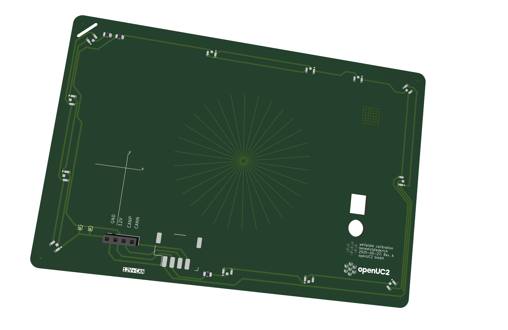
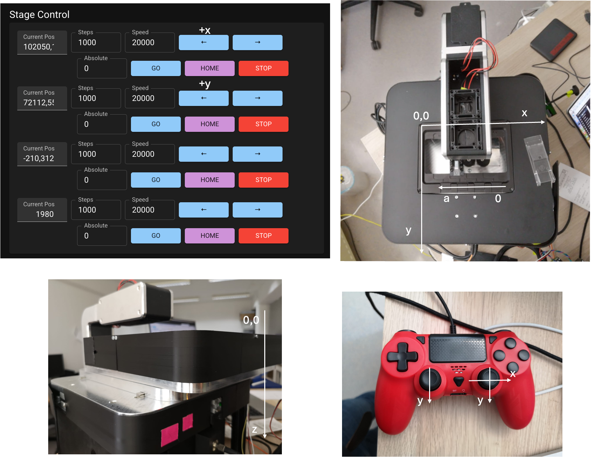

# FRAME Coordinate System and Calibration

## Stage Coordinate System

### Origin Position

The zero position of the XYZ stage corresponds to the A1 position of a standard multiwell plate. There is an offset between the virtual position displayed in ImSwitch and the actual physical position on the stage.

### Calibration Target

A calibration sample is provided to help locate the central reference point at coordinates xy = 63.5/46 mm:

*Calibration target with crosshair lines to help navigate to the center position*

The calibration target features lines that help users navigate to the center position and can also be used with fluorescence illumination.

ToDo Armin 250804: Mehr erklärungen dazu? Was sehe ich hier und warum?

[Video demonstration link](https://private-user-images.githubusercontent.com/4345528/452977251-b087b719-b484-41d8-b0e7-49d4ae4ada15.mp4?jwt=eyJhbGciOiJIUzI1NiIsInR5cCI6IkpXVCJ9.eyJpc3MiOiJnaXRodWIuY29tIiwiYXVkIjoicmF3LmdpdGh1YnVzZXJjb250ZW50LmNvbSIsImtleSI6ImtleTUiLCJleHAiOjE3NTExMTA1MzYsIm5iZiI6MTc1MTExMDIzNiwicGF0aCI6Ii80MzQ1NTI4LzQ1Mjk3NzI1MS1iMDg3YjcxOS1iNDg0LTQxZDgtYjBlNy00OWQ0YWU0YWRhMTUubXA0P1gtQW16LUFsZ29yaXRobT1BV1M0LUhNQUMtU0hBMjU2JlgtQW16LUNyZWRlbnRpYWw9QUtJQVZDT0RZTFNBNTNQUUs0WkElMkYyMDI1MDYyOCUyRnVzLWVhc3QtMSUyRnMzJTJGYXdzNF9yZXF1ZXN0JlgtQW16LURhdGU9MjAyNTA2MjhUMTEzMDM2WiZYLUFtei1FeHBpcmVzPTMwMCZYLUFtei1TaWduYXR1cmU9YjA3ZDU1NzBkYzc5NThiNDMwZGZhNzkyZmY5MTk1ZDk3N2YxMGViMDZiNWFkOGRjMWJjZDk0NjZmY2FlN2FjZSZYLUFtei1TaWduZWRIZWFkZXJzPWhvc3QifQ.wD7zmcY7i3mIm-uPqRfzKZ8akXAnvusnY2rnNYxrlNU)

### Stage Travel Range

The maximum travel range is 127 x 86 mm, suitable for multiwell plates:

*Stage coordinate system showing maximum travel range*

ToDo Armin 250804: Das linke untere Bild ist für mich schwer verständlich und ergibt auch keinen Sinn (die Objektive sind verschoben zum Strahlengang/beleuchtung)
Was soll die Aussage des Bildes sein? 

### Axis Directions

The coordinate system directions and orientations are defined as follows:

*Detailed coordinate system showing axis directions and orientations*

## Calibration Procedures

### Stage Position Calibration

1. **Load Calibration Target**: Place the provided calibration sample on the stage
2. **Navigate to Center**: Use the crosshair lines to navigate to position xy = 63.5/46 mm
3. **Record Offset**: Note the difference between displayed and actual positions
4. **Update Configuration**: Enter the offset values in the ImSwitch configuration

### Optical Alignment

For detailed optical alignment procedures, see:
- [Installation Section](../04_Installation_and_Setup.md#optical-alignment-and-calibration)
- [Operation Manual](../05_Operation_Manual.md#calibration-procedures)

## Technical Specifications

- **Coordinate Origin**: Multiwell plate position A1
- **Calibration Point**: 63.5/46 mm
- **Maximum Travel**: 127 x 86 mm
- **Resolution**: 0.3125 μm per step (configurable)
- **Repeatability**: ±2 μm (typical)
