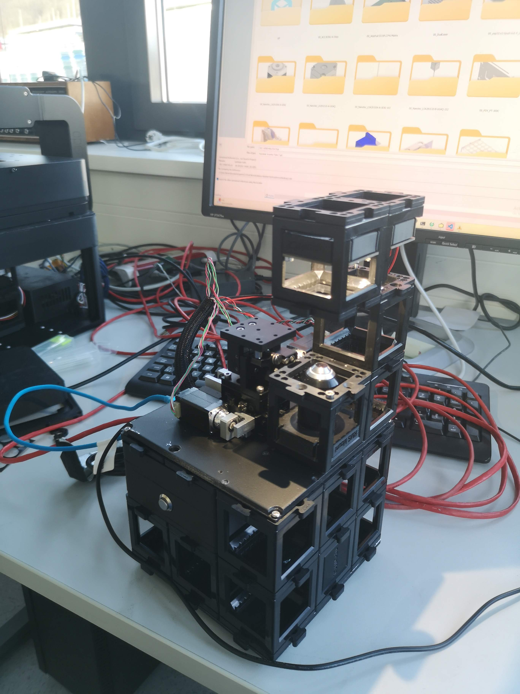
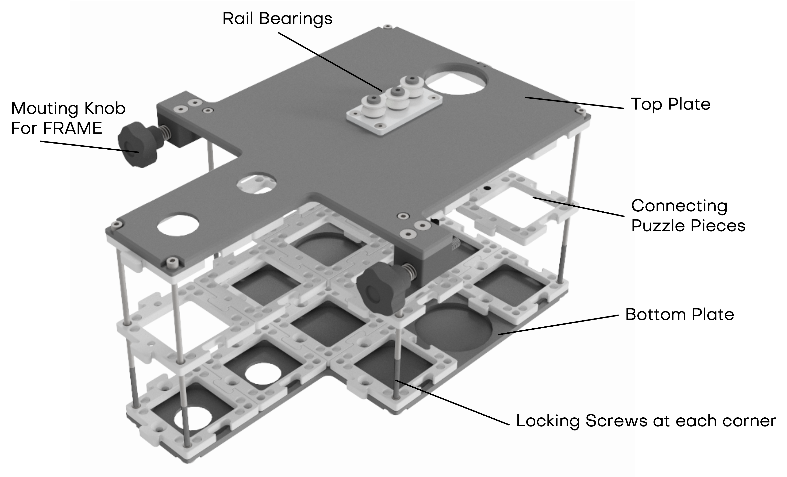
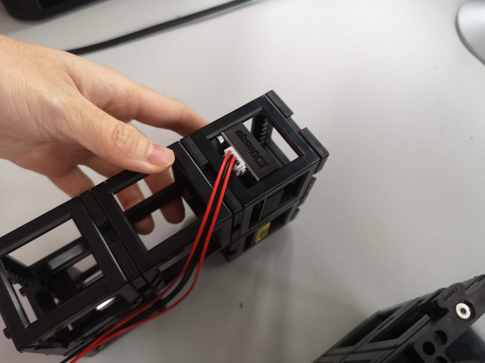
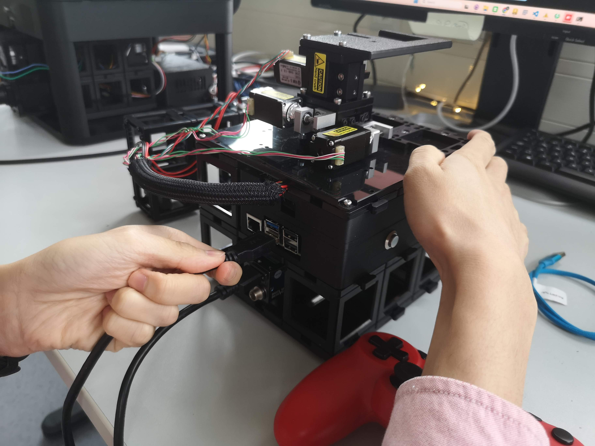
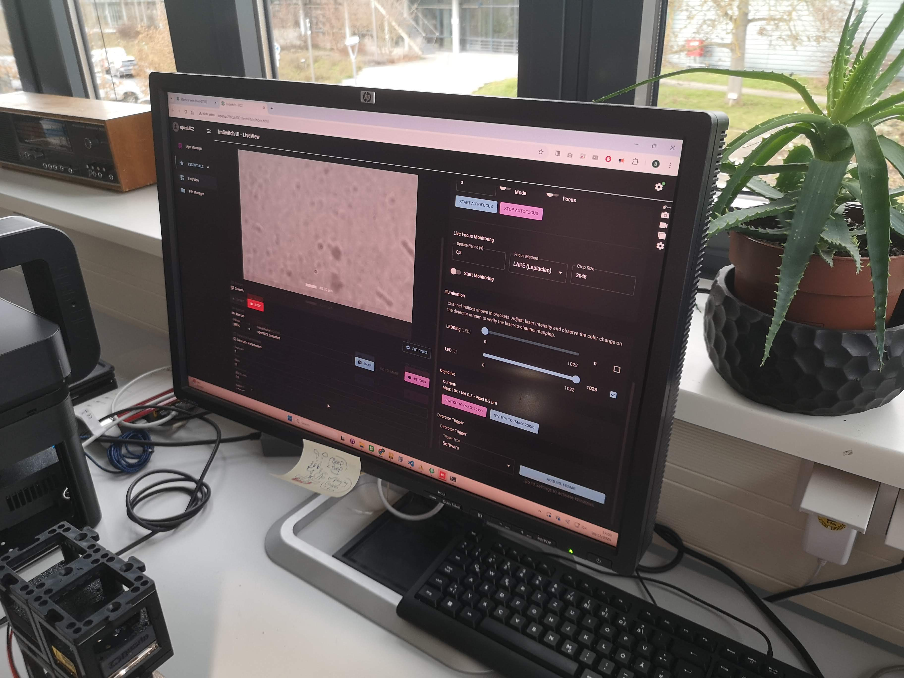
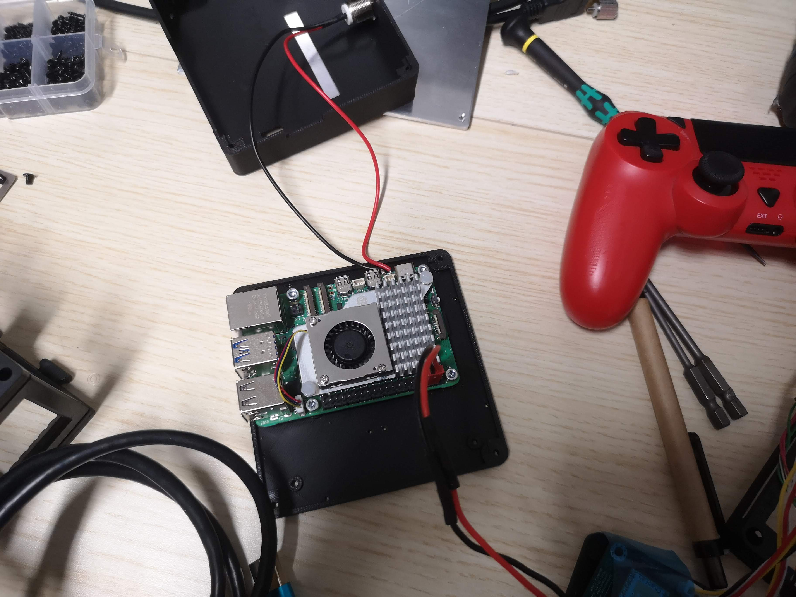
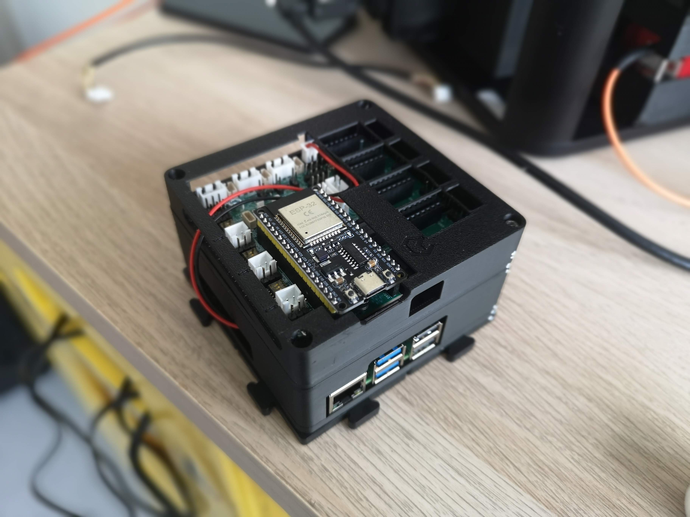

# miniFRAME - DPC Module 


## 1. Concept and System Overview

openUC2 is widely known for its modular optical building blocks. Modern microscopy systems, however, go far beyond lenses and mirrors. Using cubes they can integrate opto-electronic, mechanical, and electro-mechanical components such as:

* Motorized axes (Z, XY, XYZ)
* LEDs and lasers
* Cameras and sensors
* Controllers and synchronization electronics
* ...or anything that fits ina cube essentially :-)

The challenge is not only connecting these components, but **coordinating them in time** by means of synchronized motion, scanning routines, long-term experiments, and automated workflows (in best case in a visually appealing UI).

We decided to put the  **Raspberry Pi** as the central hub to coordinate cameras, electronics, and software workflows to make software orchestration as reproducible as possible and to offload any installation issues to something that should always work. Together with an ESP32-based UC2 controller, it enables time-synchronized microscopy experiments via ImSwitch. 


## 2. Hardware Architecture

### 2.1 Core Components

* **Raspberry Pi** (central compute & networking node)
* **UC2 ESP32 Electronics** (low-level motion control, illumination, sensor input, feedback loops )
* **Cameras**

  * USB3 industrial cameras (e.g. HIK, Daheng)
  * Raspberry Pi CSI cameras (mostly used for the holography project)
* **Motor Drivers**

  * Typically TMC2209 or similar
  * Connected directly to ESP32 UC2 board
* **Illumination**

  * LED matrices (e.g. concentric ring illumination, Neopixel arrays)
  * Lasers (optional, safety-dependent, PWM driven)


The below diagram illustrates the overall architecture of the Raspberry Pi + ESP32 UC2 system. The Raspberry Pi connects to the ESP32 board and the camera via USB, while the ESP32 controls the stepper motors and LED illumination via direct connections and CAN-bus, respectively. The ESP32 UC2 board is powered by a 12 V power and powers the Raspberry Pi via a DC-DC converter (5V, 3A output).


*openUC2 Raspberry Pi + ESP32 system overview diagram*


## 3. Mini-FRAME / Inner Cube Hardware

The **Mini-FRAME (Inner Cube)** is the removable optical engine of the FRAME microscope. It can operate:

* **Standalone**, outside the large FRAME
* **Integrated**, sliding into the FRAME rail system

The following video explains the transition between both modes:

<iframe width="560" height="315" src="https://www.youtube.com/embed/41OIpK6xs8s?si=BA6UXgL7kI0CMD54" title="YouTube video player" frameborder="0" allow="accelerometer; autoplay; clipboard-write; encrypted-media; gyroscope; picture-in-picture; web-share" referrerpolicy="strict-origin-when-cross-origin" allowfullscreen></iframe>

### Key Properties

* Fully functional microscope core
* Modular UC2 cube construction
* Compatible with FRAME optics and mechanics
* Designed for rapid prototyping and method development
* Compact footprint: ~15 cm × 15 cm × 20 cm (L×W×H)
* small xyz stage for sample positioning


## 4. Mechanical and Optical Layout

This is an examplary layout of the inner cube stack of the miniFRAME system. Depending on your application you can modify the cubes and optics as you like. This only has a brightfield layer and a second layer for all the electronics. 


*The brightfield layer contains a folding mirror and a CCTV Lens as a tube lens, set to infinity. It produces an image on the camera sensor which is mounted in a UC2 camera cube. The rest is filled with cubes and puzzle pieces to arrive at a 3x3 layout. The camera here is a daheng industrial camera with a USB3 interface.*


*The upper layer contains the electronics mentioned ealier and is also filled with cubes and puzzle pieces to arrive at a 3x3 layout.*


*The entire inner cube is "sealed" with a top and bottom plate to provide stability and a good connection to the miniFRAME structure. The top plate also mountes puzzle pieces to for example add illumination arms. The xyz stage is mounted to the top plate as well permanently for stability.*


*The device in action*


### 4.1 Structure

* Upper and lower FRAME plates
* UC2 cube stack forming the optical axis
* Permanent XYZ or Z stage mounted to the top plate
* Electronics mounted underneath the top plate


*inner cube stack for sliding into the FRAME structure; the standalone version has additional puzzle pieces on the top plate to mount illumination arms and xyz stages*

Access to electronics is possible by removing the **four outer cross-head screws** holding the top plate.

 
*The bottom part has inserts that act like conter nuts to keep the screws in place. You can untighten them by loosening the screws from the top.*


*You can use a screwdriver to carefully lift the top plate off the cube stack once all screws are removed.*

The below video explains the assembly of the inner cube stack:

<iframe width="560" height="315" src="https://www.youtube.com/embed/aI-v6xWYpiM?si=qQRwuS0wDQwfkN00" title="YouTube video player" frameborder="0" allow="accelerometer; autoplay; clipboard-write; encrypted-media; gyroscope; picture-in-picture; web-share" referrerpolicy="strict-origin-when-cross-origin" allowfullscreen></iframe>


### 4.2 Optical Axis

* Coaxial with FRAME objective axis
* Objective mounted via **RMS adapter inside a UC2 cube**
* Objectives can be exchanged freely
* Sample mounted magnetically on the motorized stage


## 5. Electronics Integration

### 5.1 Controllers and Firmware

* **ESP32-based UC2 electronics**
* Firmware:

  * UC2 v3 (USB-based)
  * UC2 v4 (CAN-bus capable, recommended for complex systems)

More information can be found in the [UC2 Electronics Documentation](../../04_Electronics/00_Quickstart.md).

Stepper motors are connected directly to the standalone board, typically using **TMC2209 drivers**. Ensure the motor current for the NEMA 11 motor is set to approximately **800 mA** (adjustable via potentiometer on the driver board). Typically this is on the far right position when turning clockwise.

### 5.2 Illumination

* LED matrix with **three concentric rings**
* CAN-bus controlled
* Enables DPC, brightfield, oblique illumination


*The DPCController App in ImSwitch enables differential phase contrast imaging by synchronizing the LED illumination with the camera acquisition. It can help you acquire sequence of images with different illumination patterns automatically and aim to reconstruct the images using DPC algorithms from Laura Waller et al.*


*The DPC illumination sequence cycles through left, right, top, and bottom LED rings to enable differential phase contrast imaging.*

### 5.4 DPC Imaging

We have created a walk-through video how you can acquire DPC images with the miniFRAME system using ImSwitch and then reconstruct it using a Jupyter notebook that runs our open-source DPC reconstruction code inspired from Laura Waller et al.

<iframe width="560" height="315" src="https://www.youtube.com/embed/G51u3CgQ8Ng?si=9V3zftmnia1tUjQM" title="YouTube video player" frameborder="0" allow="accelerometer; autoplay; clipboard-write; encrypted-media; gyroscope; picture-in-picture; web-share" referrerpolicy="strict-origin-when-cross-origin" allowfullscreen></iframe>

The result does not look as expected since the sample wasn't really thin (wellplate) and we see quiet a lot of shadows. However, the idea of the gradient becomes visible. You can tune the thykonov regularization parameter to get smoother results. 


You can find the Jupyter notebook [here](https://github.com/openUC2/imswitchclient/blob/main/examples/ImSwitch_DPC.ipynb). 

It runs on ImSwitch with 
```json
"availableWidgets": [
    "DPC", 
    "LedMatrix
  ]
```

We use the new CAN-Bus controlled LED Matrix. But it will work with the small UC2-LED equally (8x8) well. 


## 6. Camera Integration

* USB-C industrial camera mounted inside a UC2 cube (Daheng or HIK, more information in the [Camera Documentation](../../04_Electronics/02_Cameras/00_Quickstart.md))
* Optical coupling via **100mm CCTV optics** or Tube lens into an infinity-corrected path - we aim for Nyquist sampling at the sensor
* Enables widefield and computational imaging modes

You can revisite the setup in the [OpenUC2 Configurator](https://youseetoo.github.io/configurator?data=eyJtIjpbeyJpIjoibWlycm9yLTF4MSIsInAiOls1LDcsMF0sInIiOjE4MH0seyJpIjoiY3ViZS0xeDEiLCJwIjpbNCwyLDBdLCJyIjowfSx7ImkiOiJjdWJlLTF4MSIsInAiOls1LDYsMF0sInIiOjB9LHsiaSI6Im9iamVjdGl2ZS0yMHgtMXgxIiwicCI6WzUsNSwwXSwiciI6MH0seyJpIjoiY3ViZS0xeDEiLCJwIjpbNSw1LDBdLCJyIjowfSx7ImkiOiJ4eXotc3RhZ2UtY29tcGFjdC0xeDEiLCJwIjpbMyw0LDBdLCJyIjowfSx7ImkiOiJyYXNwYmVycnlwaS1jb250cm9sbGVyLTF4MSIsInAiOlszLDYsMF0sInIiOjB9LHsiaSI6ImNhbWVyYS11c2IiLCJwIjpbMyw3LDBdLCJyIjoyNzB9LHsiaSI6ImN1YmUtbGVkbWF0cml4LTF4MSIsInAiOls1LDIsMF0sInIiOjB9LHsiaSI6ImN1YmUtMXgxIiwicCI6WzMsMywwXSwiciI6MH0seyJpIjoiY3ViZS0xeDEiLCJwIjpbMywyLDBdLCJyIjowfSx7ImkiOiJjdWJlLTF4MSIsInAiOlszLDQsMF0sInIiOjB9XSwiYSI6W10sIm1ldGEiOnsibmFtZSI6Im1pbmlGUkFNRSAtIERQQyIsImF1dGhvciI6IkJlbmVkaWN0IiwiZ2l0aHViQWNjb3VudCI6ImJlbmlyb3F1YWkiLCJkZXNjcmlwdGlvbiI6IldpdGggdGhpcyB5b3Ugc2hvdWxkIGJlIGFibGUgdG8gZG8gc2luZ2xlIG1vbGVjdWxlIGxvY2FsaXphdGlvbiBtaWNyb3Njb3B5ICIsImNhdGVnb3J5IjoiTWljcm9zY29weSIsInNjcmVlbnNob3QiOiIiLCJ1YzJfdmVyaWZpZWQiOmZhbHNlLCJ2ZXJzaW9uIjoiMS4wLjAiLCJjcmVhdGVkQXQiOiIyMDI1LTA5LTI0VDExOjQxOjQwLjI3MloiLCJjb2xsZWN0aW9uIjpbIkdlbmVyYWwiXSwibm90aWZpY2F0aW9uIjoiIn19)


## 7. Setting Up the miniFRAME System

### Required Connections

* 12 V power supply → UC2 electronics power input
* USB (USB-C or Micro-USB) → Raspberry Pi ↔ ESP32
* USB3 camera cable → Raspberry Pi (blue USB port)
* CAN cable (JST connector) → LED matrix
* Optional Ethernet cable → Raspberry Pi


### First Power-Up Checklist

* All UC2 cubes mechanically secured
* Camera connected to USB3 port
* ESP32 connected via USB
* Power supply connected
* Optional Ethernet connected

After power-up, the system automatically starts and exposes a WiFi network.

### Step-by-Step Setting up the miniFRAME including the Software Onboarding 


*Component Overview: Illumination arm (LED array), inner cube stack with xyz stage, Joystick, USB cable for ESP and camera, Power supply*


*Add the CAN-bus wire to the LED ring (JST connector)*


*Add he USB Cable to the USB3 camera*


*Connect the other end of the camera cable to the blue USB3 port of the Raspberry Pi*


*Connect the USB cable from the ESP32 UC2 board to the Raspberry Pi (USB-C or Micro-USB)*


*Add the USB cable to the non-blue USB port of the Raspberry Pi (for network and power)*


*Add the Illumination Arm to the Mini-FRAME structure by placing it on the puzzle pieces*


*Add the 12V power supply to the power input*


*Press the power button on the Raspberry Pi to start the system*


*The system will start and expose a WiFi network named openUC2-XXXX-XXXX; You can connect to it using the password `youseetoo`*


*You can now access the ImSwitch web interface by opening a browser and navigating to http://openuc2.local or http://192.168.4.1 to access the admin panel and the ImSwitch instance*


## 9. Wireless Access

* SSID: `openUC2-XXXX-XXXX`
* Password: `youseetoo`

The name is derived lexicographically from the Raspberry Pi MAC address and is globally unique.


## 10. Recommended First Tests

* Connect via WiFi
* Open the web interface (see software guide, `http://openuc2.local` or `http://192.168.4.1`)
* Test:

  * Live camera feed
  * Z movement
  * LED ring switching
  * Joystick or web-based stage control


# Troubleshooting

## Raspberry PI + ESP32 UC2 Electronics


*Wiring of the Raspberry Pi and ESP32 UC2 electronics for the miniFRAME system: The power button is soldered to the power pins of the Raspberry Pi 5. The 5V for the Pi is coming from the DC-DC converter on the ESP32 UC2 board. The USB cable connects the ESP32 UC2 board to the Raspberry Pi for communication. It has to deliver enough power to drive the pi. For this short wires and larger diameter are working best.*


*Everything is mounted int he case to to follow the UC2 standard. The ESP32 UC2 board is mounted upside down to have access to the stepper motor connectors and the power input.*


*Puzzle Pieces are mounted on the bottom part of the electronics component to connect it to the miniFRAME structure.*


*This is the entire module where the ESP32 is driving the stepper motors of the xyz stage and controlling the LED illumination via CAN-bus and the Raspberry Pi is connected via USB for communication and control. ImSwitch is running on the Pi to provide the user interface and orchestrate the entire system.*
