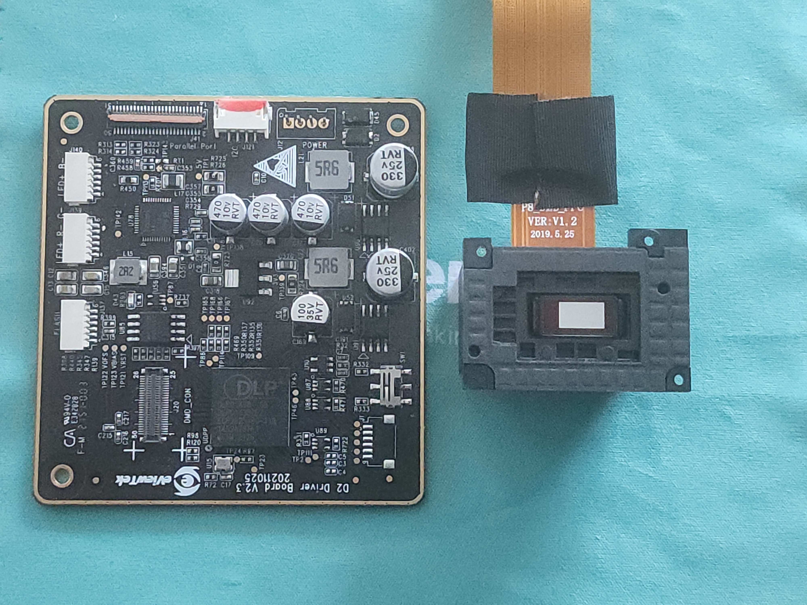
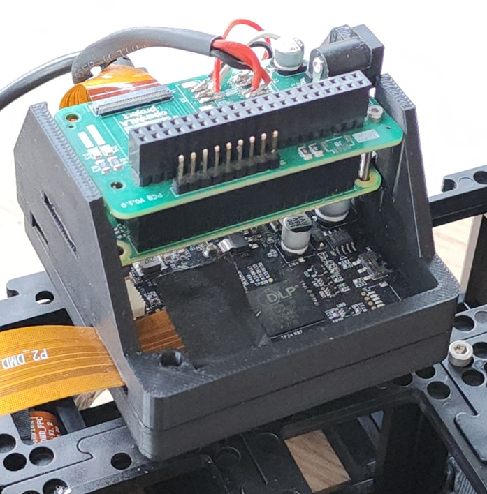
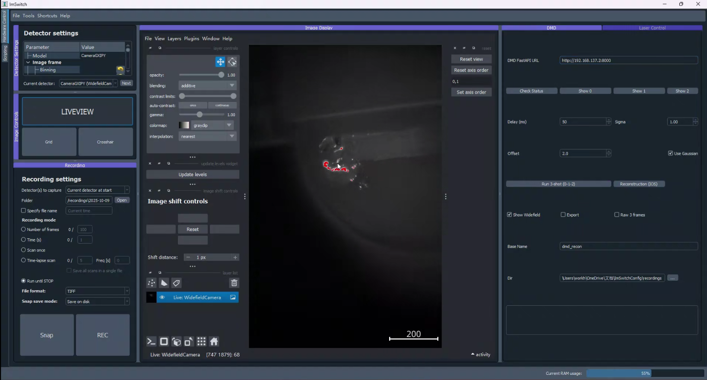

# Tutorial: Building a UC2 DMD-SIM for Optical Sectioning

In this workshop, we will guide you through building a low-cost, DMD-based structured illumination microscope (SIM) for optical sectioning. This system can be easily integrated into your existing wide-field fluorescence microscope, enabling you to achieve optical sectioning—essentially removing out-of-focus blur and improving image contrast.

*Figure 1: The two configurations built in this project. (A) Direct Projection setup where the DMD is imaged directly onto the sample. (B) 4f Interference setup using a Fourier filter to remove higher diffraction orders.*

---

## Safety Warning ⚠️

**Laser Safety**: This setup involves a 488 nm laser. Always wear appropriate safety goggles.

**DMD Diffraction**: When installing and debugging the DMD, be extremely careful with the **diffracted laser light**. The DMD acts as a grating, and the reflected light will split into multiple diffraction orders. Ensure that stray beams are properly blocked and do not enter your eyes or scatter dangerously in the room.

---

## Theory of Operation

**Structured illumination microscopy (SIM)** works by illuminating the sample with a known spatial pattern (in our case, stripes), instead of uniform light. By acquiring images with different pattern phases and combining them mathematically, you can extract information about in-focus light and suppress out-of-focus background.

In a typical OS-SIM experiment, the illumination pattern is described as a sinusoidal function. We acquire three images with phase shifts $\phi_0 = 0$, $\phi_1 = 2\pi/3$, and $\phi_2 = 4\pi/3$.

Using the **RMS reconstruction algorithm**, the optically-sectioned image is extracted:

$$I_{\text{SIM}}(x) = \sqrt{\big(I_1 - I_2\big)^2 + \big(I_2 - I_3\big)^2 + \big(I_1 - I_3\big)^2}$$

--- 
## Materials Needed

### Optical Components
*   **Laser**: 488 nm diode laser (fiber-coupled)
*   **Objective**: 10× Plan Objective (NA = 0.25)
*   **Tube Lens**: f = 100 mm
*   **Projection Lens (Direct Setup)**: f = 200 mm (Thorlabs AC254-200-A-ML)
*   **Relay Lenses (4f Setup)**: 2x f = 50 mm (Thorlabs AC254-050-A-ML)
*   **Filters**:
    *   Dichroic Mirror (45°)
    *   Emission Filter (matched to sample)
    *   Spatial Filter (pinhole/slit for 4f setup)

### Electronics & Computing
*   **DMD**: DLP300S chip + DLPC1438 controller (harvested from Anycubic Photon Ultra 3D printer)
*   **Controller**: Raspberry Pi Zero 2
*   **Interface**: Custom Bridge Board (based on OpenMLA)
*   **Power**: 12V Power Supply

### Mechanical Components
*   **OpenUC2 System**: Standard cubes and mounting plates
*   **Custom Parts**:
    *   3D-printed base plates for DMD alignment
    *   Filter holders for blocking diffraction orders

---

## Optical Setup

We designed and tested two configurations for the illumination path.

### 1. Direct Projection Configuration (Setup A)

This is the simplest approach. The DMD pattern is imaged directly onto the sample plane using a 4f imaging system formed by the projection lens and the objective.

*   **Optics**: 200 mm lens + 10× Objective.
*   **Magnification**: $M = 1/10$ (Pattern is demagnified 10×).
*   **Pros**: Compact, fewer components, easier to align.
*   **Cons**: Requires careful selection of pattern period to avoid artifacts from higher harmonics.

### 2. Fourier Filter Configuration (Setup B)

This configuration adds a 4f relay system with a spatial filter before the projection lens.

*   **Optics**: Two 50 mm lenses forming a 4f system + Spatial Filter.
*   **Function**: The spatial filter blocks unwanted higher diffraction orders (harmonics) from the binary DMD grating.
*   **Pros**: Allows more flexibility in choosing the pattern period; produces a cleaner sinusoidal pattern.
*   **Cons**: Larger footprint, harder to align, lower light efficiency due to filtering.

---

## Experimental Setup

The system is built using the OpenUC2 modular standard.

### DMD Module
The DLP300S and controller are mounted inside a UC2 cube. The mirror tilt angle is approx. $17^\circ$, requiring a specific beam angle for proper reflection.

### Electronics
The Raspberry Pi Zero 2 controls the DMD via GPIO using a custom bridge board. It uses a standard 720p@60 video timing to drive the DMD.

---

## Software

The system is controlled via **ImSwitch**. A custom plugin handles the communication with the Raspberry Pi (running a FastAPI server) to trigger patterns and acquire images.

The software automatically handles:
1.  **Pattern Generation**: Creating the binary stripe patterns.
2.  **Acquisition**: Synchronizing the camera with the pattern display.
3.  **Reconstruction**: Running the RMS algorithm in real-time to produce the sectioned image.

---

## Preliminary Results

We tested the system on a fluorescent sample (fluorescent powder on a 3D-printed part).

### Optical Sectioning Performance

Comparing the conventional wide-field image with the SIM reconstruction shows significant background rejection.

**Zoomed View:**

The SIM image (left/bottom) reveals fine surface details that are obscured by the out-of-focus haze in the wide-field image.

---

**Last Updated**: December 2025

