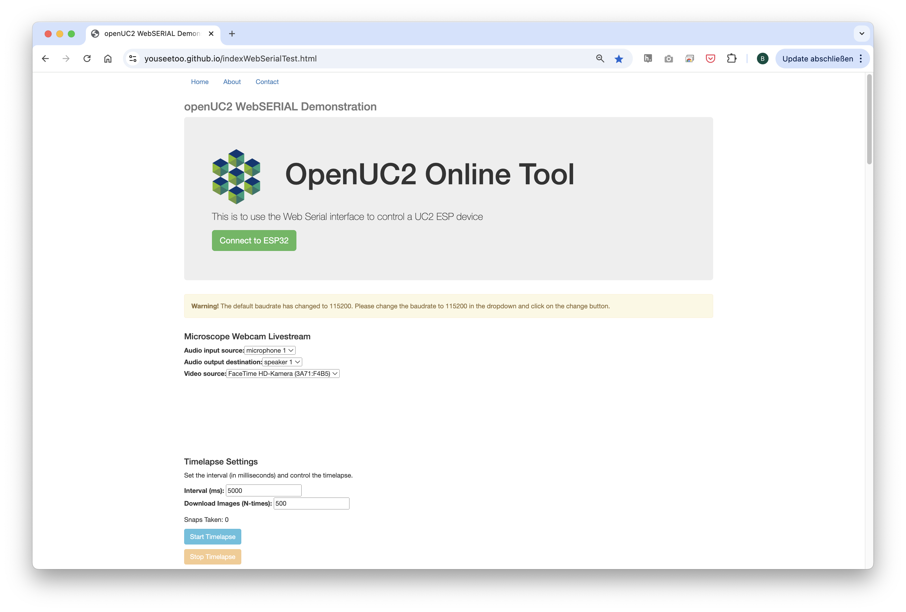
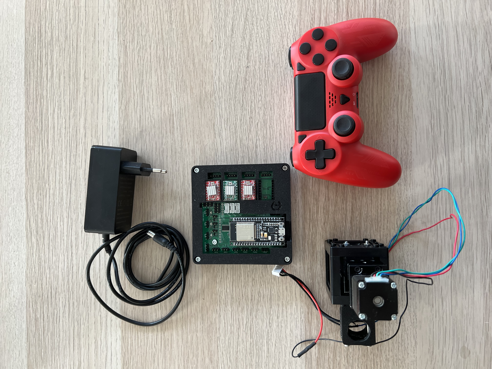
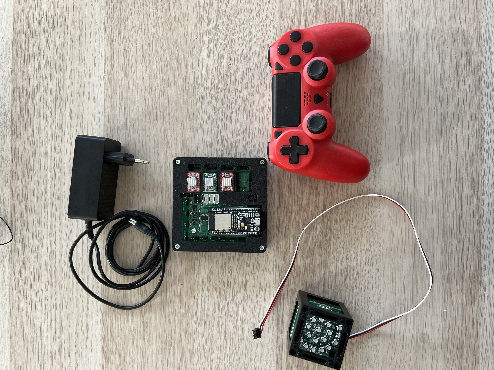

# Quickstart on controlling electronics
in this QUickstart Guide,  we’ll walk through how to control the motorized Z-stage and LED array using the web-based serial interface, as well as an PS4 controller.

### Step 1: Flashing the ESP32 Firmware
1. Before proceeding, ensure your ESP32 board has the latest firmware. You can download and flash the firmware via the official [openUC2 website](https://youseetoo.github.io/), selecting the appropriate version (currently v3 Standalone).


*Choose the ESP32 v3 board (not BETA or re-work!) and flash it (but only if you need an update)*

The source-code can be found [here](https://github.com/youseetoo/uc2-esp32)

2. Connect the ESP32 to your computer using the micro-USB cable.


3. In your Chrome browser and click on "Connect." A dialog will prompt you to select the COM port for your ESP32, which should show as `CP 20x`. Once connected, you can install the latest firmware by simply clicking the "Install" button. If nothing shows up, you can install the drivers from the following propmpt that results when you hit anywhere on the screen:


4. Wait until the firmware has been flashed successfully.

### Step 2: Connecting and Testing the Web Interface
1. After flashing the firmware, go to the testing section on the same website. You’ll find buttons to control the motor and LEDs (This can be tested with the hardware connected or with only the ESP32 connected via USB)



2. Connect to your ESP32 board using the "Connect" button again, ensuring the correct COM port is selected.


3. Once connected, test the system by sending a simple command:

```json
{"task":"/motor_act", "motor": { "steppers": [ { "stepperid": 3, "position": -1000, "speed": 1000, "isabs": 0, "isaccel": 0} ] } }
```

This command will move the Z-axis motor by -1000 steps (1 full rotation) at a speed of 1000 steps per second. Each step corresponds to a movement of 300nm when using microstepping. You’ll see the motor rotate, adjusting the focus.

> **Note:** Ensure the command string has no line breaks.

### Step 3: Hardware Setup for Testing and controlling the Z-focus Motor
1. Plug the ESP32 board into your computer via USB.
2. Connect the 12V power supply to the provided port.
3. Attach the NEMA 11 motor to the Z-motor port on the board.
4. Turn on the system and verify that the motor responds to commands.
5. The motor should move when you enter the command or hit the buttons.



**[VIDEO:] Connect Motor:**

<iframe width="700" src="https://www.youtube.com/embed/TsWAeWl2T10?si=Z3GzSg2Xhjy6u3jf" title="YouTube video player" frameborder="0" allow="accelerometer; autoplay; clipboard-write; encrypted-media; gyroscope; picture-in-picture; web-share" referrerpolicy="strict-origin-when-cross-origin" allowfullscreen></iframe>


### Step 4: Controlling the LED Array

1. Use the web interface to turn the LEDs on and off or control brightness.
2. Try adjusting the LED patterns (e.g., lighting only certain rings) using the available commands. This turns a ll red. Try to turn on individual LEDs. For this checkout the Documentation to the Command set/API [here](https://openuc2.github.io/docs/Electronics/UC2-ESP/APIDescription/INTRO)

```json
{"task":"/ledarr_act", "led":{"LEDArrMode":1, "led_array":[{"id":0, "r":0, "g":50, "b":0}]}}

```




Experiment with other colors by changing the RGB values.

**[VIDEO:] Connect LED:**

<iframe width="700" src="https://www.youtube.com/embed/l8rRLvF6X6g?si=w-AXCYUHzXj2p1m5" title="YouTube video player" frameborder="0" allow="accelerometer; autoplay; clipboard-write; encrypted-media; gyroscope; picture-in-picture; web-share" referrerpolicy="strict-origin-when-cross-origin" allowfullscreen></iframe>


This first exercise gives you a solid introduction to controlling basic components of the openUC2 system. In future tutorials, we will explore more advanced techniques, such as automated focus stacking and digital phase-contrast imaging -> for this you can have a look here  https://openuc2.github.io/docs/Toolboxes/DiscoveryPhaseMicroscopy/DPCmicroscopy

Feel free to experiment further with different motor and LED settings to familiarize yourself with the control interface. If you have question reach out to us in our forum: openuc2.discourse.group.


### Step 5: Pairing the PS4 Controller

The UC2-ESP firmware is designed to support various input devices, including the PS4 controller, making it easier to interact with the microscope. You’ve already worked with USB Serial commands, but using the PS4 controller will give you a more flexible, hands-on approach.

#### How to Pair the PS4 Controller:

For more detailed instructions on pairing, refer to the [UC2 PS4 Controller Pairing Guide](https://openuc2.github.io/docs/Electronics/PS4-Controller). But briefly:

1. First, put your PS4 controller into pairing mode by holding down the **Share** button and the **PS button** simultaneously until the light bar starts blinking.
2. Open the serial prompt in your browser (connected to the ESP32 board) or use the web interface.
3. Enter the command:

```json
{"bt_scan":1}
```
This will initiate the Bluetooth scan on the ESP32, which will detect and pair with the controller. Alternatively, you can use the **"Pair Controller"** button in the web interface.

4. Once paired, you should be able to control the motorized stage using the analog sticks on the controller and switch the LED array on/off using the buttons.


- **Move the Z-stage**: Use the **left analog stick** to move the stage up and down (adjust focus).
- **Control the LEDs**: Use the **controller buttons** to turn the LED array on/off and cycle through different illumination patterns.

This setup allows you to navigate through your sample and adjust focus without touching the hardware, which is particularly useful when working with sensitive samples or in teaching environments where ease of use is essential.
