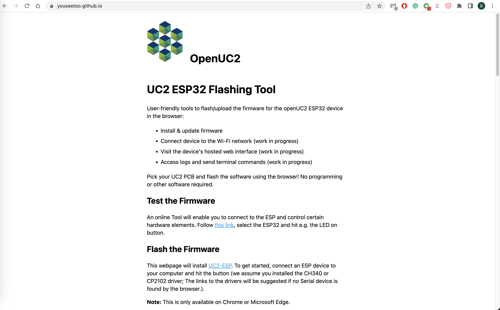
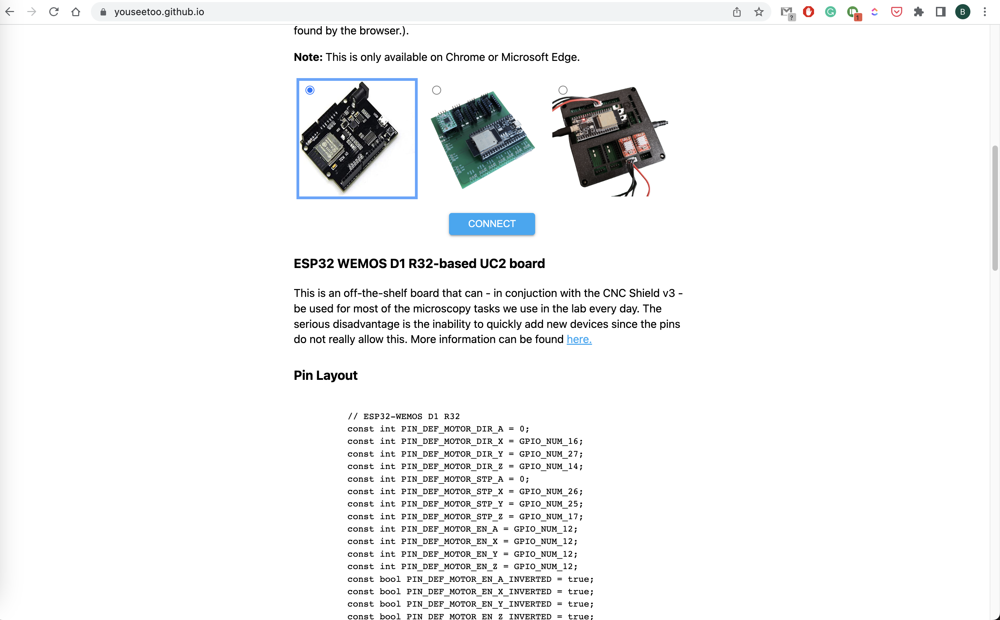
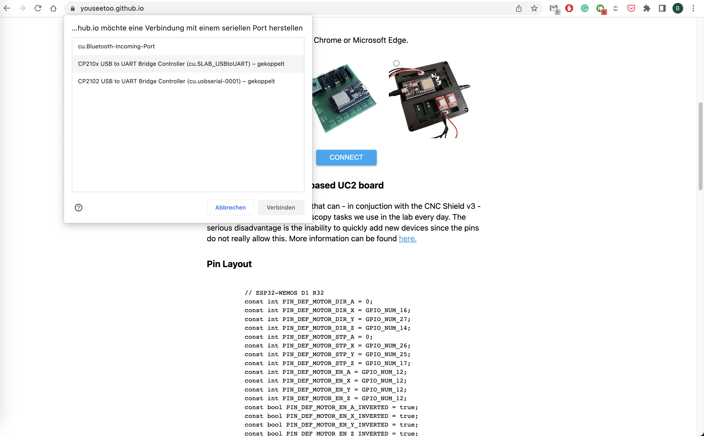
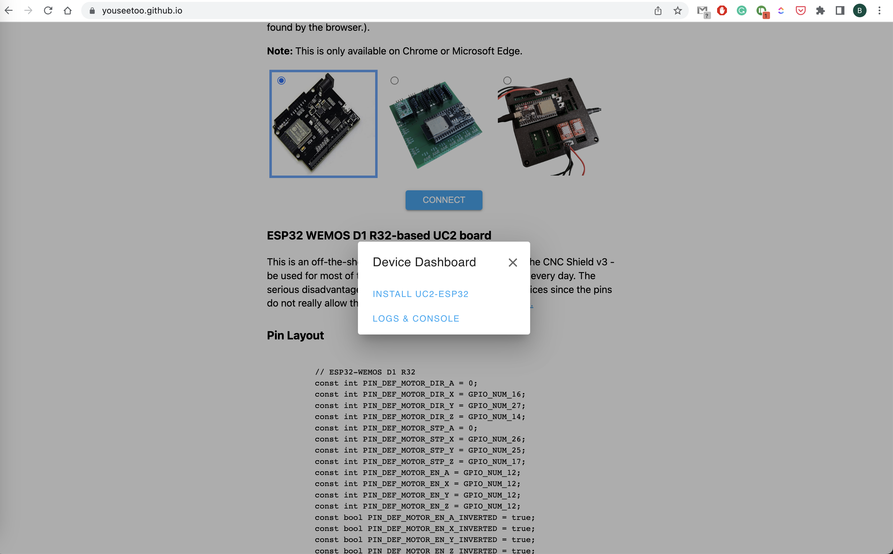
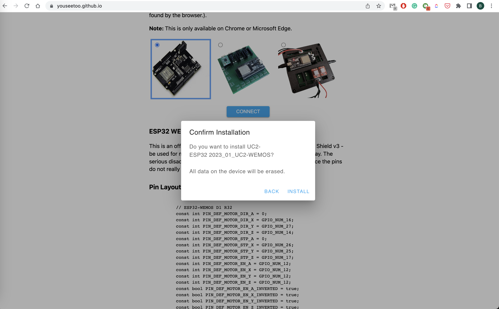
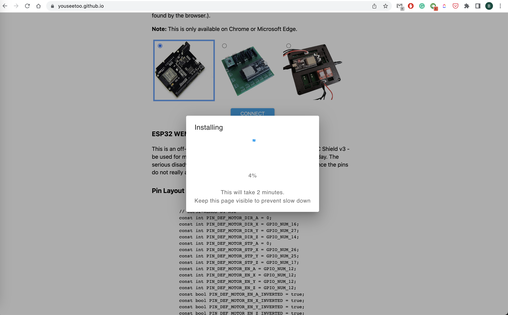
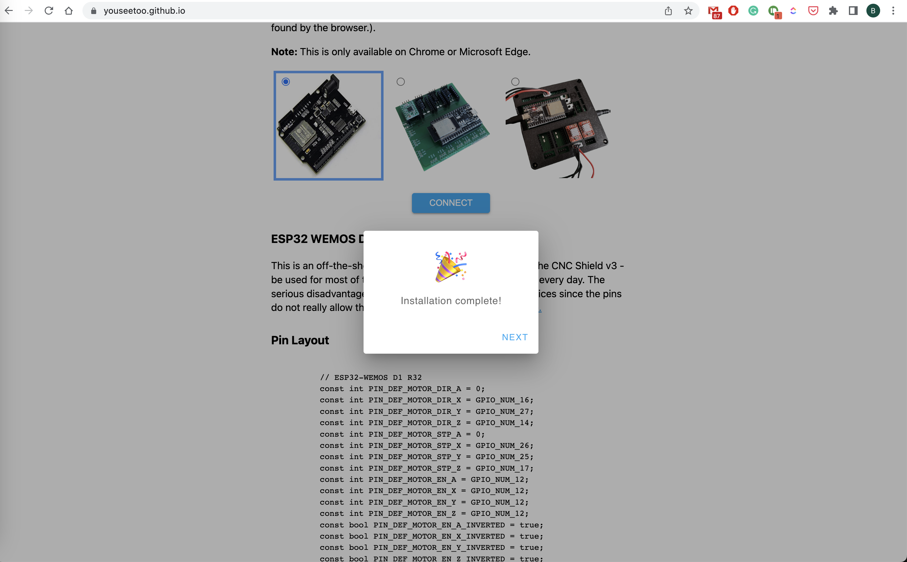
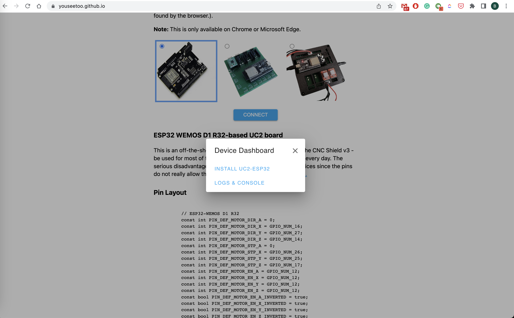
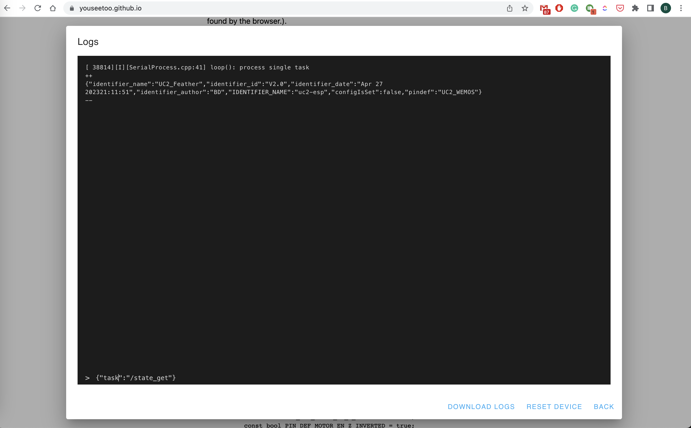
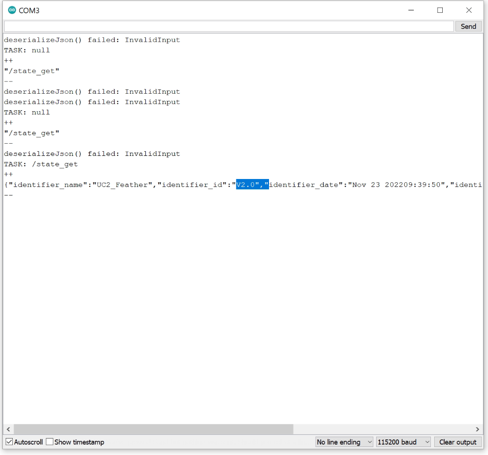

<!----------------------------------------->
## Quick Start: controlling and testing electronic Components vie Web interface
Duration:20

### Installing the driver

**Prerequirements:** We make use of the Espressif ESP32 MCU, which comes with the CH340 USB-UART interface. For this you need to install the appropriate driver.

<div class="alert-success">
<b>Installing the USB Serial Driver</b> Install the CH340 USB Serial driver is explained in more detail here: <a href="https://learn.sparkfun.com/tutorials/how-to-install-ch340-drivers/all">Sparkfun</a>
</div>


### Flash the Firmware using the Web Tool

Go to our ESP flashing tool website and do everything within the browser!!

https://youseetoo.github.io/

<iframe width="560" height="315" src="https://www.youtube.com/embed/oF9CUrRcW30r" title="YouTube video player" frameborder="0" allow="accelerometer; autoplay; clipboard-write; encrypted-media; gyroscope; picture-in-picture" allowfullscreen></iframe>

#### The process in images

Visit https://youseetoo.github.io/:


Connect the ESP32 to the computer using the USb and hit the connect button


Select the Serial port from the list of possible devices


Install the firmware


Confirm that you will erase the board


Wait until the installation script finishes


Done!


Test if everything works out by connecting to the board using the browser-based terminal


Enter `{"task":"/state_get"}` to get the compiled-state of the board



### Flashing the Firmware using Pyhton (DEPRECATED!)

For this we have prepared a quick video tutorial:

<iframe width="560" height="315" src="https://www.youtube.com/embed/F9B2ftkfaKE" title="YouTube video player" frameborder="0" allow="accelerometer; autoplay; clipboard-write; encrypted-media; gyroscope; picture-in-picture" allowfullscreen></iframe>

The steps to reproduce:

1. Install Anaconda on your computer
2. Create a new conda environemt and activate it:
```
conda create -n uc2 python=3.9 -y
conda activate uc2
```
3. install `uc2-rest` using pip: `pip install uc2-rest`
4. open python and copy/paste the following commands or run it as a python file (also found [here](https://github.com/openUC2/UC2-REST/blob/master/uc2rest/TEST/TEST_ESP32_Updater.py)):
```py
import uc2rest as uc2

# defi˘ne the serial port
serialport = "/dev/cu.SLAB_USBtoUART"
serialport = "COM3" # ATTENTION: CHANGE ACCORDINGLY
#serialport = "/dev/cu.wchusbserial110"

# optional: create an ESP32 objejct
# ESP32 = uc2.UC2Client(serialport=serialport)

# create the updater object
updater = uc2.updater(port=serialport)

updater.downloadFirmware()
print(updater.firmwarePath)
updater.flashFirmware()

# print firmwarepath


# remove firmware.bin after flashing
updater.removeFirmware()
```

Once you're done, you can open e.g. the Arduino IDE's serial monitor and check the output after typing:




## UC2-ESP Firmware for the openUC2 UC2e electronics

This repository provides the latest (`V2`) firmware that controls external hardware like Motors, LEDs, Lasers and other customized elements using an ESP32 and an adapter board. It is inspired by the [UC2-REST](https://github.com/openUC2/UC2-REST/tree/master/ESP32) firmware, but features a much more structured way of the code by dividing modules into seperated classes. A `ModuleController` ensures a proper initializiation of individual modules at runtime, which makes the entire code very modular and follows the overall UC2 principle.

Similar to the legacy UC2-REST Firmware, the microcontroller can communicate using the wired serial and the wireless WiFi protocol. Both rely on a more-less similar `REST API` that uses endpoints to address an `act, get, set` command. For example, the information about the state of the ESP can be retrieved by issuing the code:

```
{"task":"/state_get"}
```

A list of all commands that can be sent via HTTP requests and serial commands (e.g. by using the Arduino IDE-contained Serial monitor at 115200 BAUD) can be found in the [JSON API](https://github.com/youseetoo/uc2-esp32/blob/main/main/json_api_BD.txt)-file.

# Setting up the build environment

In order to build the code, you have to follow the following steps:

1. Install Visual Studio Code + the Extension called "Platform.io" => Restart Visual studio code to load PIO
2. Clone this repository including all the submodules: `git clone --recurse-submodules https://github.com/youseetoo/uc2-esp32`
3. Open the main folder in the Visual Studio Code
4. Adjust the settings in the file `platformio.ini`-file (mostly the port)
4.1. Go to Platformio Home and navigate to Devices
4.2 Copy the Device port (if connected) and insert that into the `platformio.ini`, e.g. `upload_port = /dev/cu.SLAB_USBtoUART` or `COM3`for windoof
5. Hit the `PlatformIO upload` button; The following task will be run: `platformio run --target upload`; The code is getting compiled and saved into `./.pio/build/`
5.1 The code will be uploaded. If eerything goes right the terminal says: `Leaving... Hard resetting via RTS pin...``
6. open the PlatformIO serial monitor (remember to also change the port in the `platform.io` accordingly) and check the ESP32's output (eventually hit the reset button)
7. In case you have any problems: File an issue :-)


  In order to test several commands, you can find a useful list of `json`files in this file: [main/json_api_BD.txt](main/json_api_BD.txt)


### Flashing latest version of the Firmware (DEPRECATED!)

We have multiple ways to flash the firmware, which we will describe briefly:
1. Use precompiled binaries and upload using the `esptool.py` ([Github](https://github.com/espressif/esptool))
2. Use the Arduino IDE to compile and upload the software
3. Use the Arduino IDE to upload the OTA example and upload the precompiled binary

The current firmware can be found in the [UC2-REST](https://github.com/openUC2/UC2-REST/tree/master/ESP32) repository. A Github Action builds the binaries everytime a new release is getting published. The artifacts are also pushed to the [build folder](https://github.com/openUC2/UC2-REST/tree/master/ESP32/build). This way you don't need to hassle with the Arduino IDE in order to install all libraries and dependencies. With the binaries, there are two ways to flash them on a freshly bought ESP32:

1. Using the `esptool.py` to upload it through USB
2. Flash the Arduino-OTA example, browse to the Website and upload the `.bin` file

#### Flashing the code with `esptool.py` (DEPRECATED!)

The `UC2-REST` offers a firmware flasher to help you going through the steps:

1. Download the latest firmware
2. Start opening the Port
3. Flash the Firmware

For this we prepared a jupyter notebook that you can access and run [here](https://github.com/openUC2/UC2-REST/tree/master/DOCUMENTATION/DOC_Updater.ipynb)
The full process will take around 20 minutes.

#### Flashing the code with OTA (DEPRECATED!)

For this you can flash the example code `BasicOTA.ino` that comes in the Arduino IDE under `Examples => Arduino OTA`.

Use the following code below (change SSID/Password to your Wifi that the computer uses), flash it and open the Browser to open the webpage. Upload the Binary and you'Re done!

```cpp
#include <WiFi.h>
#include <ESPmDNS.h>
#include <WiFiUdp.h>
#include <ArduinoOTA.h>

const char* ssid = "..........";
const char* password = "..........";

void setup() {
  Serial.begin(115200);
  Serial.println("Booting");
  WiFi.mode(WIFI_STA);
  WiFi.begin(ssid, password);
  while (WiFi.waitForConnectResult() != WL_CONNECTED) {
    Serial.println("Connection Failed! Rebooting...");
    delay(5000);
    ESP.restart();
  }

  ArduinoOTA
    .onStart([]() {
      String type;
      if (ArduinoOTA.getCommand() == U_FLASH)
        type = "sketch";
      else // U_SPIFFS
        type = "filesystem";

      // NOTE: if updating SPIFFS this would be the place to unmount SPIFFS using SPIFFS.end()
      Serial.println("Start updating " + type);
    })
    .onEnd([]() {
      Serial.println("\nEnd");
    })
    .onProgress([](unsigned int progress, unsigned int total) {
      Serial.printf("Progress: %u%%\r", (progress / (total / 100)));
    })
    .onError([](ota_error_t error) {
      Serial.printf("Error[%u]: ", error);
      if (error == OTA_AUTH_ERROR) Serial.println("Auth Failed");
      else if (error == OTA_BEGIN_ERROR) Serial.println("Begin Failed");
      else if (error == OTA_CONNECT_ERROR) Serial.println("Connect Failed");
      else if (error == OTA_RECEIVE_ERROR) Serial.println("Receive Failed");
      else if (error == OTA_END_ERROR) Serial.println("End Failed");
    });

  ArduinoOTA.begin();

  Serial.println("Ready");
  Serial.print("IP address: ");
  Serial.println(WiFi.localIP());
}

void loop() {
  ArduinoOTA.handle();
}
```

#### Compiling and flashing the code using the Arduino IDE

You can download/clone the **UC2-REST** repository and open the file `main.ino`, copy the libraries in the library folder into the Arduino IDE library folder under `Documents/Arduino/libraries`, compile and upload it. More information comes in the very end of this tutorial
