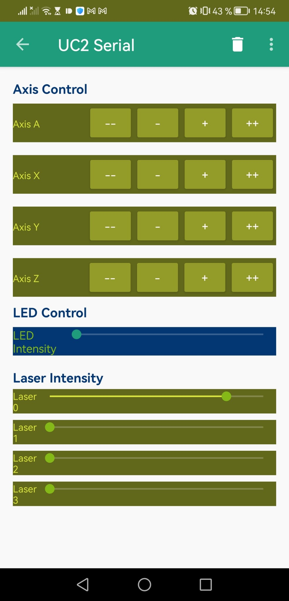

# UC2Serial Android App

The **UC2Serial** app is a control interface for managing various hardware components of a modular microscopy or optical system, specifically using serial communication protocols. The app provides intuitive controls for adjusting motor positions across multiple axes, controlling LED and laser intensities, and configuring communication settings.

:::warning
You can find the APP in the following [repository](https://github.com/openUC2/UC2Serial/)(including the release APK):
:::

## Features
- **Motor Control**: Allows precise control over the A, X, Y, and Z motor axes with coarse and fine adjustments.
- **LED Intensity Control**: Adjusts the intensity of LED lighting used in the optical setup.
- **Laser Intensity Control**: Provides control over multiple laser channels for applications requiring specific lighting conditions.
- **Serial Communication Configuration**: Configures the serial connection parameters, such as baud rate and read mode, for communication with connected hardware.

## APK File

You can download the file from the [source repository](https://github.com/openUC2/UC2Serial/releases/tag/v0.1)

## Video Tutorial

<iframe width="560" height="315" src="https://www.youtube.com/embed/rHU_FXlQ6MY?si=p7w40A2JUpLbEX_p" title="YouTube video player" frameborder="0" allow="accelerometer; autoplay; clipboard-write; encrypted-media; gyroscope; picture-in-picture; web-share" referrerpolicy="strict-origin-when-cross-origin" allowfullscreen></iframe>

## User Interface Overview
The app’s interface includes:
1. **Axis Controls (A, X, Y, Z)**: Each axis has controls for coarse and fine motor adjustments.
2. **LED Slider**: A seek bar to adjust the intensity of the LED lighting.
3. **Laser Sliders**: Three individual sliders to control the intensity of different laser channels.
4. **Serial Communication Settings**: Options to set baud rate and read mode for serial data transmission.

## Requirements
- **Android Device**: The app runs on Android devices.
- **USB or Bluetooth Connection**: Requires a serial communication link (USB or Bluetooth) to control the hardware.
- **Connected Hardware**: A compatible hardware setup that accepts serial commands for controlling motors, LEDs, and lasers.

## Setup and Configuration

### 1. Installing the App
1. Download and install the app APK on your Android device.
2. Open the app and connect your device to the compatible hardware setup (e.g., via USB or Bluetooth).

### 2. Configuring Serial Communication
1. **Baud Rate**: Select the appropriate baud rate (e.g., 9600, 115200) from the configuration screen. This should match the baud rate supported by your hardware.
2. **Read Mode**: Choose between different read modes:
   - **Event-based**: Data is received through an event callback (`SerialInputOutputManager.onNewData()`).
   - **Direct**: Data is directly read through `UsbSerialPort.read()`.

### 3. Using the Axis Controls
1. **A, X, Y, Z Axis Buttons**: Each axis section includes four buttons:
   - `--`: Large decrement for coarse adjustment in the negative direction.
   - `-`: Small decrement for fine adjustment in the negative direction.
   - `+`: Small increment for fine adjustment in the positive direction.
   - `++`: Large increment for coarse adjustment in the positive direction.

2. Tap the respective buttons to move the connected motor in the selected axis. The `MainActivity` sends specific commands based on button presses.

### 4. Adjusting LED Intensity
1. Use the **LED Intensity** slider to control the brightness of the LED lighting.
2. Slide to the right to increase intensity and to the left to decrease it.
3. Intensity values are sent via serial commands to adjust the lighting in real time.

### 5. Controlling Laser Channels
1. Each **Laser Intensity** slider controls a different laser channel.
2. Move each slider to set the desired laser intensity for each channel.
3. Laser intensity changes are sent via serial commands to the hardware, adjusting lighting conditions as needed.

## Code Overview

### Main Components
- **`MainActivity.java`**: Sets up the UI, connects to the Toolbar, and initializes the serial connection. Manages button actions and serial data exchange with hardware.
- **`ControlFragment.java`**: Houses the main controls for axis movement, LED, and laser adjustments. Sends commands for each control interaction using the `send()` method, which constructs serial commands based on user input.
- **`styles.xml`**: Defines the app’s theme, including color schemes for the ActionBar and various UI components.
- **`fragment_control.xml`**: Contains the layout for axis controls, LED intensity slider, and laser controls. Uses color themes and design specifications to provide an intuitive UI.

### Command Structure
Commands are constructed in the following format:
- **Motor Commands**: Sent with parameters specifying the axis, direction, and movement type (coarse or fine).
- **LED and Laser Commands**: Sent with intensity levels to set the lighting for each source.

### Customizing Commands
The command structure can be adapted within `getMotorControlDict()` and similar methods if specific adjustments or additional controls are required for your hardware setup.

## Troubleshooting
- **Connection Issues**: Ensure that the Android device is properly connected to the hardware and that the baud rate matches the hardware settings.
- **Axis Not Moving**: Check serial communication settings, as an incorrect baud rate or read mode can prevent commands from reaching the hardware.
- **Lighting Controls Not Responding**: Verify that the hardware is receiving commands correctly and that intensity values are within the expected range.

## Future Improvements
- **Feedback Integration**: Display real-time feedback from the hardware (e.g., motor position or light intensity levels).
- **Additional Control Options**: Add features for more advanced control over hardware components, such as rotation angles or laser modulation.
- **Customization**: Enable users to save configurations for quicker setup with different hardware.
