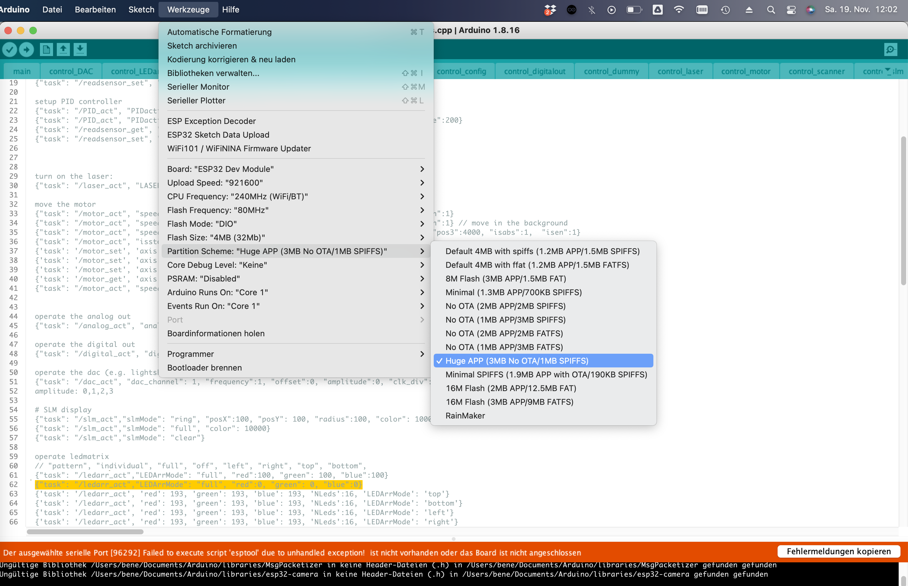

## UC2-ESP Firmware for the openUC2 UC2e electronics

:::warning
Note: We started the firmware in version **V1** in this repository: [UC2-REST](https://github.com/openUC2/UC2-REST/tree/master/ESP32) and continued development the firmware version in **V2** in another repository [UC2-ESP32](https://github.com/youseetoo/uc2-esp32/). We emphasize to use the latest firmware **V2**
:::

This repository provides the latest (`V2`) firmware that controls external hardware like Motors, LEDs, Lasers and other customized elements using an ESP32 and an adapter board. It is inspired by the [UC2-REST](https://github.com/openUC2/UC2-REST/tree/master/ESP32) firmware, but features a much more structured way of the code by dividing modules into separated classes. A `ModuleController` ensures a proper initializiation of individual modules at runtime, which makes the entire code very modular and follows the overall UC2 principle.

Similar to the legacy UC2-REST Firmware, the microcontroller can communicate using the wired serial and the wireless WiFi protocol. Both rely on a more-less similar `REST API` that uses endpoints to address an `act, get, set` command. For example, the information about the state of the ESP can be retrieved by issuing the code:

```
{"task":"/state_get"}
```

A list of all commands that can be sent via HTTP requests and serial commands (e.g. by using the Arduino IDE-contained Serial monitor at 115200 BAUD) can be found in the [RestApi.md](https://github.com/youseetoo/uc2-esp32/blob/mergeBD/RestApi.md)-file.

## Setting up the build/develpment environment

In order to build the code, you have to follow the following steps:

1. Install Visual Studio Code + the Extension called "Platform.io" => Restart Visual studio code to load PIO
2. Clone the repository including all the submodules: `git clone --recurse-submodules https://github.com/youseetoo/uc2-esp32`
3. Open the main folder in the Visual Studio Code
4. Adjust the settings in the file `platformio.ini`-file (mostly the port)
4.1. Go to Platformio Home and navigate to Devices
4.2 Copy the Device port (if connected) and insert that into the `platformio.ini`, e.g. `upload_port = /dev/cu.SLAB_USBtoUART` or `COM3` for windows
5. Hit the `PlatformIO upload` button; The following task will be run: `platformio run --target upload`; The code is getting compiled and saved into `./.pio/build/`
5.1 The code will be uploaded. If everything goes right the terminal says: `Leaving... Hard resetting via RTS pin...``
6. open the PlatformIO serial monitor (remember to also change the port in the `platform.io` accordingly) and check the ESP32's output (eventually hit the reset button)
7. In case you have any problems: File an issue :-)


In order to test several commands, you can find a useful list of `json` files in this file: [json_api_BD.txt](https://github.com/youseetoo/uc2-esp32/blob/mergeBD/main/json_api_BD.txt)


## V1: Source-code, Compiling and Binaries (Deprecated)


The current version of the firmware can be found here: https://github.com/openUC2/UC2-REST/tree/master/ESP32

Additional information on how to install and compile the board can be found in the [README](https://github.com/openUC2/UC2-REST/master/README.md)

Precompiled binaries that can be installed through ImSwitch (more information coming soon) or the `esptool.py`can be found here https://github.com/openUC2/UC2-REST/tree/master/ESP32/build

<!----------------------------------------->
## V1: Install necessary software for UC2 rest (flash and interact) (Deprecated)

Here you learn how to install the necessary software (Arduino IDE, drivers, ESP-IDF, Arduino libraries) that are necessary for the system to be working. Everything is explained in the video below.

Additional information about the UC2 electronics and UC2-REST are provided here: https://github.com/openUC2/UC2-REST

### Download and install the software:


To simplify life, we host a [dropbox folder](https://www.dropbox.com/sh/pea63wifrq3edsl/AAChzXEGA55uUt2Kjxxfk_Dka?dl=0) containing all the necessary drivers and Software pieces for this workshop. It will run on a Windows 10 64 Bit system:

<p align="left">
<a href="https://www.dropbox.com/sh/pea63wifrq3edsl/AAChzXEGA55uUt2Kjxxfk_Dka?dl=0" name="logo"></a>
</p>

### List of relevant files

*for the UC2-REST*
- **Arduino IDE:** `arduino-1.8.18-windows.exe`
- **ESP32 USB driver:** `CH341SER.exe`
- **UC2 Rest firmware:** `UC2-REST.zip`

*Alternative GitHub links that provide you with the **latest version** of the software:*

* https://github.com/openUC2/UC2-REST (=> firmware under ESP32/main; compile and flash on your ESP32 board)
* https://github.com/beniroquai/BenesArduinoLibraries (=> all libraries necessary to compile the software)
* https://learn.sparkfun.com/tutorials/how-to-install-ch340-drivers/all (=> CH340 drivers for the ESP32 board)

### Steps to install the software

0. Download all relevant files from the Dropbox folder above
1. Install the Arduino IDE (including all drivers if you are asked during the installation)
2. Install the CH340 USB Serial driver https://learn.sparkfun.com/tutorials/how-to-install-ch340-drivers/all
3. Extract `BenesArduinoLibraries-master.zip` to `/User/$USER$/Documents/Aduino/libraries`
4. Open the Arduino IDE and add the ESP32 board configuration. For this you need to add the following URL to the settings tag: `https://dl.espressif.com/dl/package_esp32_index.json, http://arduino.esp8266.com/stable/package_esp8266com_index.json`. For additional information please have a look in [this tutorial](https://randomnerdtutorials.com/installing-the-esp32-board-in-arduino-ide-windows-instructions/)
5. Once done, open the Board manager and add the `ESP32`version **2.0.3**
6. Unzip the folder `UC2-REST` and open the file `/ESP32/main/main.ino`
7. Select the board, the port and hit the compile and upload button
8. **IMPORTANT** when setting up the build + upload, make sure you add this setting for the partition scheme (and potentially all others if not already set as default):




The system accepts different hardware configurations (pins, devices, etc.). All of this is defined in the `pindef_XXXX.h`. Please have a look in the UC2-REST repository for additional information: https://github.com/openUC2/UC2-REST

### VIDEO Tutorial: Steps to install the software

<iframe width="560" height="315" src="https://www.youtube.com/embed/9doTdo5SW2E" title="YouTube video player" frameborder="0" allow="accelerometer; autoplay; clipboard-write; encrypted-media; gyroscope; picture-in-picture" allowfullscreen></iframe>
