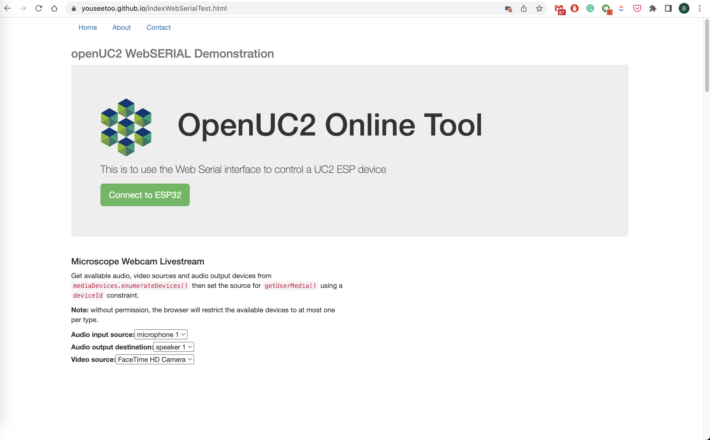
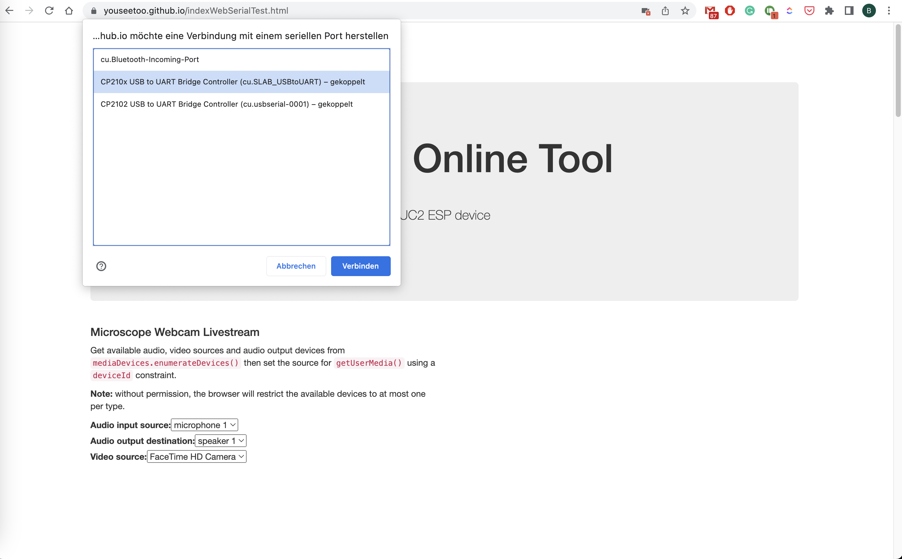
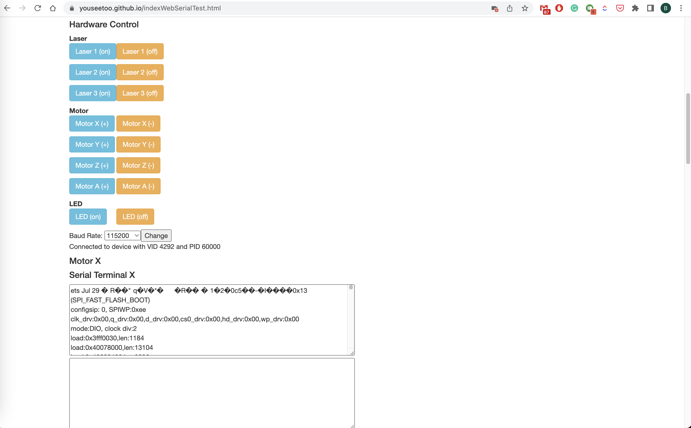

## Controlling hardware using the WebSerial Standard

The ESP32 works best by receiving commands over serial. We have a python interface that is also explained in a bit more depth in the [connect-to-the-hardware](./06_Connect_to_Hardware.md) section and can be found as a pip package here: https://pypi.org/project/UC2-REST/ and the source-code here: https://github.com/openUC2/UC2-REST/tree/master/uc2rest.

However, installing python and starting a script sometimes is a bit cumbersome. Therefore we have implemented a quick-start tool in the browser, that makes use of the new WebSerial standard. You can connect the ESP32 and easily communicate with it by first connecting to it and then sending commands back and forth. The steps are as follows:

Visit the page https://youseetoo.github.io/indexWebSerialTest.html

Connect to the board by hitting the *connect* button


Choose the device that represents your ESP32


Control Motors by hitting the button, observe the serial output or send commands on your own by entering it in the bar in the lower end


## Cheat-sheet for the different control commands

### Motors


Documentation for MOTOR API:

The MOTOR API is used for controlling the motion of steppers motors. The API consists of several commands that can be used to set up and control the motors.

### Motor Setup

To set up the motor, you need to use the "/motor_set" command. This command takes a JSON object that defines the motor configuration.

The configuration consists of an array of stepper motor objects, where each object represents a single stepper motor. The following properties are defined for each stepper motor object:

- stepperid: A unique identifier for the stepper motor. This value can be any integer.
- step: The pin number used to control the stepper motor's step signal.
- dir: The pin number used to control the stepper motor's direction signal.
- enable: The pin number used to control the stepper motor's enable signal.
- step_inverted: A boolean value indicating whether the step signal is inverted.
- dir_inverted: A boolean value indicating whether the direction signal is inverted.
- enable_inverted: A boolean value indicating whether the enable signal is inverted.
- min_pos: The minimum position value for the motor. This value can be any integer.
- max_pos: The maximum position value for the motor. This value can be any integer.

Here's an example JSON object that can be used with the "/motor_set" command:

```
{"task":"/motor_set",
    "motor":
    {
        "steppers": [
            { "stepperid": 1, "step": 26, "dir": 16, "enable": 12, "step_inverted": 0, "dir_inverted": 0, "enable_inverted": 0 , "min_pos":0, "max_pos":0},
			{ "stepperid": 2, "step": 25, "dir": 27, "enable": 12, "step_inverted": 0, "dir_inverted": 0, "enable_inverted": 0 , "min_pos":0, "max_pos":0},
			{ "stepperid": 3, "step": 17, "dir": 14, "enable": 12, "step_inverted": 0, "dir_inverted": 0, "enable_inverted": 0 , "min_pos":0, "max_pos":0},
			{ "stepperid": 0, "step": 19, "dir": 18, "enable": 12, "step_inverted": 0, "dir_inverted": 0, "enable_inverted": 0 , "min_pos":0, "max_pos":0}
        ]
    }
}
```

The "motor" property is an object that contains the "steppers" array, which defines the stepper motors. In this example, four stepper motors are defined, each with their own unique stepperid and pin assignments for the step, dir, and enable signals.

### Motor Enable/Disable

To enable or disable the stepper motors, you can use the "/motor_set" command with the "isen" property set to 1 to enable or 0 to disable the motors. Here's an example JSON object that can be used to enable the motors:

```
{"task":"/motor_set", "isen":1}
```

### Motor Movement

To move the stepper motors, you can use the "/motor_act" command. This command takes a JSON object that defines the movement configuration for the motors.

The configuration consists of an array of stepper motor objects, where each object represents a single stepper motor. The following properties are defined for each stepper motor object:

- stepperid: The unique identifier for the stepper motor that you want

### DIGITAL OUT

#### Trigger Setup

To set up a digital output pin as a trigger, use the following command:

```
{"task":"/digitalout_set", "digitaloutid":1, "digitaloutpin":4}
```

Here, `digitaloutid` specifies the ID of the digital output pin, and `digitaloutpin` specifies the physical pin number to which the output is connected.

#### Trigger Activation

To activate the trigger, use the following command:

```
{"task":"/digitalout_act", "digitalout1TriggerDelayOn":100, "digitalout1TriggerDelayOff":10, "digitalout1IsTrigger":1,  "digitalout2TriggerDelayOn":10, "digitalout2TriggerDelayOff":100, "digitalout2IsTrigger":1}
```

This command activates both `digitalout1` and `digitalout2` as triggers. The `digitalout1TriggerDelayOn` and `digitalout1TriggerDelayOff` parameters specify the time delays in milliseconds for turning the output on and off, respectively. The `digitalout2TriggerDelayOn` and `digitalout2TriggerDelayOff` parameters specify the time delays for the second output.

The `digitalout1IsTrigger` and `digitalout2IsTrigger` parameters indicate whether the outputs should be used as triggers (`1`) or not (`0`).

#### Trigger Reset

To reset the trigger, use the following command:

```
{"task":"/digitalout_act", "digitaloutistriggerreset":1}
```

This command resets all the digital outputs that are used as triggers.


### LASER

#### Laser Setup

To set up a laser, use the following command:

```
{"task": "/laser_act", "LASERid":2, "LASERpin":19}
```

Here, `LASERid` specifies the ID of the laser channel, and `LASERpin` specifies the physical pin number to which the laser is connected.

#### Laser Activation

To activate the laser, use the following command:

```
{"task": "/laser_act", "LASERid":1, "LASERval": 1024}
```

This command activates the laser on channel `1` with a power value of `1024`.

#### Laser Control

To control the laser, use the following command:

```
payload = {
    "task": path,
    "LASERid": channel,
    "LASERval": value,
    "LASERdespeckle": int(value*despeckleAmplitude),
    "LASERdespecklePeriod": int(despecklePeriod),
}
{"task": "/laser_act", "LASERid":1, "LASERval": 512, "LASERdespeckle": 10, "LASERdespecklePeriod": 100}
```

Here, `LASERid` specifies the ID of the laser channel, and `LASERval` specifies the power value for the laser. The `LASERdespeckle` parameter is an optional parameter that specifies the despeckle amplitude, and `LASERdespecklePeriod` is an optional parameter that specifies the despeckle period.

#### Laser Reading

To read the laser value, use the following command:

```
{"task": "/laser_get"}
```

This command returns the current value of the laser.

### LED ARRAY

To set up an LED array, use the following command:

```
{"task": "/ledarr_set", "led":{"ledArrPin":32, "ledArrNum":64}}
```

Here, `ledArrPin` specifies the physical pin number to which the LED array is connected, and `ledArrNum` specifies the number of LEDs in the array.
