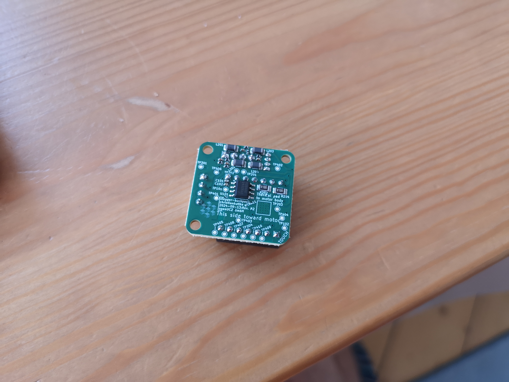
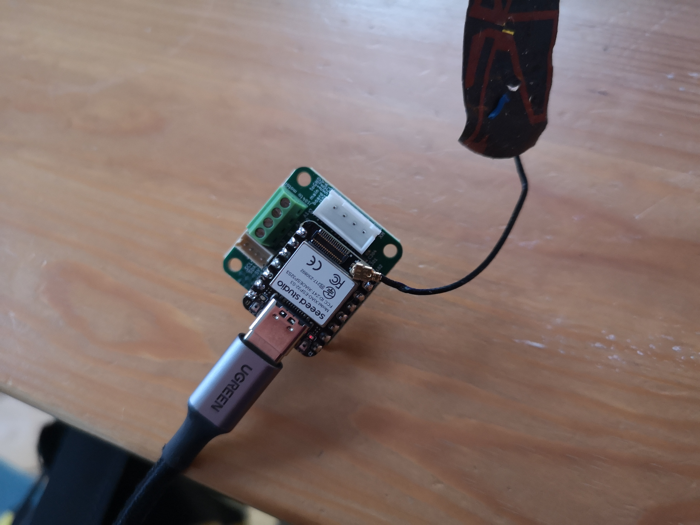
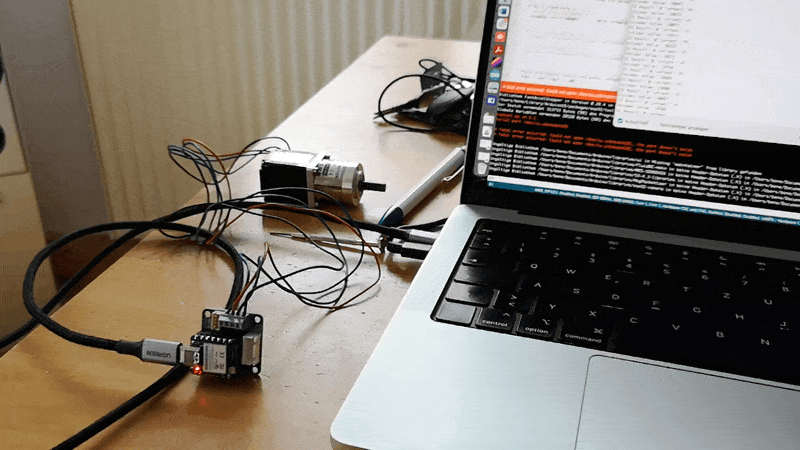
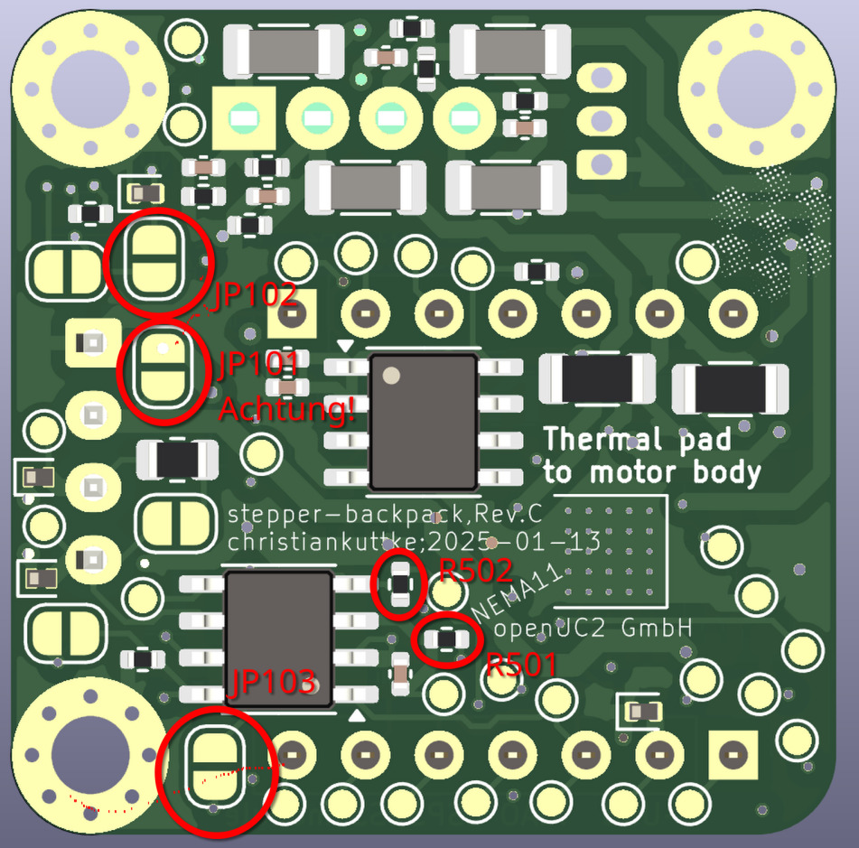

# Documentation for Stepper Motor Controller with Rotational Encoder (TMC2209 + AS5600)





## **Overview:**
This motor controller is designed to control a stepper motor using the TMC2209 driver with optional feedback from a rotational encoder (AS5600). The Xiao microcontroller handles communication and control.

## **Components:**
- **TMC2209 Stepper Driver:** Manages the stepper motor's power and movement. It offers features like StallGuard for homing without limit switches.
- **AS5600 Encoder:** A magnetic encoder that tracks the stepper motor’s rotational position. Connected via I2C, it provides high-precision feedback for motor positioning.

## **Pin Descriptions:**
- **DIR (Direction):** Controls the rotational direction of the stepper motor (Clockwise/Counter-Clockwise). Controlled via **PA02_A0_D0**.
- **STEP (Step Pulse):** Sends pulses to the motor for each step. Controlled via **PA10_A2_D2**.
- **UART (TX/RX):** The Xiao communicates with the TMC2209 driver for advanced functions such as StallGuard and diagnostics via UART on **PB08_A6_TX** and **PB09_D7_RX**.
- **I2C (SDA/SCL):** Connects the Xiao to the AS5600 encoder for feedback. I2C pins on the Xiao are **PA8_A4_D4_SDA** and **PA9_A5_D5_SCL**.

## **Power Requirements:**
- **5V Input:** The Xiao uses its internal buck converter to supply 3.3V to the other components.
- **12V Input:** Powers the motor and is regulated to 5V and 3.3V via a DC-DC converter for the motor driver and encoder.

## **Features:**
- **StallGuard Functionality:** This feature detects motor stall conditions and is useful for homing operations without mechanical limit switches.
- **I2C Encoder (AS5600):** Provides high-precision feedback on motor position, allowing for closed-loop control in certain applications.

## **Wiring:**
1. **Motor Wiring:**
   - Connect the motor windings to the respective outputs on the TMC2209.
   - Windings A (A+, A-) and B (B+, B-) are connected to **OA1**, **OA2**, **OB1**, **OB2** pins.

2. **Encoder Wiring:**
   - **SDA** (I2C Data) to **PA8_A4_D4_SDA**
   - **SCL** (I2C Clock) to **PA9_A5_D5_SCL**

3. **Power:**
   - 12V Input to **12V Pin** (via JST).
   - GND to common ground.


## Xiao Pin Connections for Motor Controller with Encoder (TMC2209)

Based on the schematic provided for the stepper motor controller (TMC2209) with Xiao, here are the pin connections between the Xiao board and different elements such as the motor controller and encoder:

## **Pinout for Xiao:**
- **PA02_A0_D0** (Pin 1): **DIR** (Direction for motor control)
- **PA4_A1_D1** (Pin 2): **MOT_DIR** (Motor direction)
- **PA10_A2_D2** (Pin 3): **STEP** (Stepper motor step control)
- **PA11_A3_D3** (Pin 4): **MOT_STEP** (Step control for motor)
- **PA8_A4_D4_SDA** (Pin 5): **I2C SDA**
- **PA9_A5_D5_SCL** (Pin 6): **I2C SCL**
- **PB08_A6_TX** (Pin 7): **TX UART** (for TMC2209 UART communication)
- **PB09_D7_RX** (Pin 8): **RX UART** (for TMC2209 UART communication)
- **PA7_A8_D8_SCK** (Pin 9): **I2C SCL (Alternative)**

## **Connections to Stepper Motor Controller (TMC2209):**
- **DIR**: Controls the direction of the stepper motor.
- **STEP**: Steps the motor in the specified direction.
- **UART_PICO**: UART communication to the TMC2209 (TX from Xiao).
- **UART_POCI**: UART communication from the TMC2209 (RX to Xiao).
- **I2C SDA / SCL**: Communication with an external encoder (such as the AS5600 rotational encoder).


## Code Example

Here’s a basic ESP32S3 code to control the TMC2209 stepper motor driver and AS5600 encoder (since AS5300 is typically a typo for AS5600, which is more common) in a feedback loop for 360° rotation in both directions. The code sets up the motor driver and encoder, reads the encoder's position, and runs the motor for a full revolution in either direction based on feedback from the encoder.

## Required Libraries:
- **TMCStepper** for communicating with the TMC2209 driver.
- **Wire** for I2C communication with the AS5600 encoder.

## Wiring:
- **EN** -> D10
- **DIR** (Direction) -> D8
- **STEP** (Step Pulse) -> D9
- **I2C SDA** -> PA8_A4_D4_SDA (Pin 5)
- **I2C SCL** -> PA9_A5_D5_SCL (Pin 6)
- **UART TX** -> PB08_A6_TX (Pin 7)
- **UART RX** -> PB09_D7_RX (Pin 8)

## In Action:




## Code:

```cpp
#include <TMCStepper.h>
#include <Wire.h>
#include <FastAccelStepper.h>  // Include the FastAccelStepper library

// TMC2209 Settings
#define STALL_VALUE     100  // StallGuard sensitivity [0..255]
#define EN_PIN           D10   // PA4_A1_D1 (Pin 2) Enable pin for motor driver
#define DIR_PIN          D8   // PA02_A0_D0 (Pin 1) Direction pin
#define STEP_PIN         D9   // PA10_A2_D2 (Pin 3) Step pin
#define SW_RX            D7   // PB09_D7_RX (Pin 8) UART RX pin for TMC2209
#define SW_TX            A6   // PB08_A6_TX (Pin 7) UART TX pin for TMC2209
#define SERIAL_PORT Serial1  // UART Serial port for TMC2209
#define DRIVER_ADDRESS 0b00  // TMC2209 driver address
#define R_SENSE 0.11f        // Current sense resistor for TMC2209
#define MOT_DIAG        D3

// UC2-ESP I2C Settings
#define SDA_PIN_UC2 D2
#define SCL_PIN_UC2 D1
// AS5311 I2C Settings
#define SDA_PIN D4          // PA8_A4_D4_SDA (Pin 5) I2C SDA
#define SCL_PIN D5           // PA9_A5_D5_SCL (Pin 6) I2C SCL
#define AS5311_ADDR 0x36     // I2C address for AS5311

// Encoder settings
#define MAX_ENCODER_VALUE 16384  // AS5311 is a 14-bit encoder (2^14 = 16384 steps per revolution)

// FastAccelStepper setup
FastAccelStepperEngine engine = FastAccelStepperEngine();  // FastAccelStepper engine instance
FastAccelStepper *stepper = NULL;  // FastAccelStepper instance

// TMC2209 instance
TMC2209Stepper driver(&SERIAL_PORT, R_SENSE, DRIVER_ADDRESS);

// Function to read AS5311 encoder value over I2C
int readEncoder() {
  Wire.beginTransmission(AS5311_ADDR);
  Wire.write(0x0C);  // Register for reading high byte of encoder position
  Wire.endTransmission();
  Wire.requestFrom(AS5311_ADDR, 2);
  int high_byte = Wire.read();
  int low_byte = Wire.read();
  int position = (high_byte << 8) | low_byte;
  return position;
}

void setup() {
  Serial.begin(115200);         // Init serial port and set baudrate
  while(!Serial);               // Wait for serial port to connect
  Serial.println("\nStart...");

  // Start Serial communication for TMC2209
  SERIAL_PORT.begin(115200);

  // Pin setup for motor control
  pinMode(EN_PIN, OUTPUT);
  digitalWrite(EN_PIN, LOW); // Enable motor driver (LOW to enable)

  // Setup TMC2209 driver
  driver.begin();               // Initiate TMC2209
  driver.toff(4);               // Enable driver with off time
  driver.blank_time(24);         // Set blank time
  driver.rms_current(400);       // Set motor current to 400mA
  driver.microsteps(16);         // Set microstepping to 16
  driver.TCOOLTHRS(0xFFFFF);     // Set threshold for switching to StealthChop
  driver.semin(5);               // Enable StallGuard with minimum threshold
  driver.semax(2);               // Set maximum StallGuard threshold
  driver.sedn(0b01);             // Set StallGuard deceleration
  driver.SGTHRS(STALL_VALUE);    // Set StallGuard sensitivity

  // Setup I2C for AS5311 encoder
  Wire.begin(SDA_PIN, SCL_PIN);  // Initialize I2C with specified pins

  // FastAccelStepper setup
  engine.init();  // Initialize the FastAccelStepper engine
  stepper = engine.stepperConnectToPin(STEP_PIN);  // Connect stepper to the STEP_PIN
  if (stepper) {
    stepper->setDirectionPin(DIR_PIN);  // Set the direction pin
    stepper->setEnablePin(EN_PIN);      // Set the enable pin
    stepper->enableOutputs();           // Enable motor outputs
    stepper->setAutoEnable(true);       // Automatically enable motor when moving
    stepper->setSpeedInHz(10000);        // Set initial speed (steps per second)
    stepper->setAcceleration(10000);      // Set acceleration in steps/second^2
  }
}

void loop() {
  static uint32_t last_time = 0;
  uint32_t ms = millis();

  // Read encoder position and use it in feedback loop
  int encoderValue = readEncoder();

  // Control motor movement based on encoder feedback
  /*
  if (encoderValue < MAX_ENCODER_VALUE / 2) {
    stepper->moveTo(1000);  // Move forward by 1000 steps
  } else if (encoderValue >= MAX_ENCODER_VALUE / 2 && encoderValue < MAX_ENCODER_VALUE) {
    stepper->moveTo(-1000); // Move backward by 1000 steps
  }*/

  // Adjust speed via serial input
  while(Serial.available() > 0) {
    int8_t read_byte = Serial.read();
    if (read_byte == '0') {
      Serial.println("Stop");
      stepper->forceStop();  // Stop the motor
    }
    else if (read_byte == '1') {
      Serial.println("Start");
      stepper->move(10000);    // Move forward by 1000 steps
    }
    /*
    else if (read_byte == '+') {
      stepper->setSpeedInHz(stepper->getSpeedInHz() + 100); // Speed up motor
    }
    else if (read_byte == '-') {
      stepper->setSpeedInHz(stepper->getSpeedInHz() - 100); // Slow down motor
    }*/
  }

  // Print StallGuard results and motor current every 100ms
  if ((ms - last_time) > 100) {
    last_time = ms;
    Serial.print("SG Result: ");
    Serial.print(driver.SG_RESULT(), DEC);  // Print StallGuard value
    Serial.print(" Current: ");
    Serial.println(driver.cs2rms(driver.cs_actual()), DEC);  // Print motor current
    Serial.print("Encoder Value: ");
    Serial.println(encoderValue);

  }
}
```

## Key Components:
1. **Setup TMC2209**: The motor driver is initialized using UART communication and the current limit is set. StealthChop mode is enabled for quieter operation.
2. **Encoder Setup (AS5600)**: Uses I2C to read the encoder’s current position. The encoder provides feedback with a 12-bit resolution (4096 steps per revolution).
3. **MoveStepper Function**: Moves the motor in a given direction (based on step count). The direction and steps are controlled using the DIR and STEP pins.
4. **Feedback Loop**: The motor moves based on encoder feedback. If the encoder position is less than 180° (half of 4096 steps), the motor moves forward; otherwise, it moves backward to maintain a 360° operation.


## Revision: CAN BUS

The updated version has several improvements:

- CAN BUS with a dedicated transreceiver
- power safety features


### The updated Pinout:


```cpp
// Pin definitions for Xiao ESP32S3
#define PIN_PA02_A0_D0     0   // Analog/Digital Pin A0/D0
#define PIN_PA04_A1_D1     1   // Analog/Digital Pin A1/D1
#define PIN_PA06_A2_D2     2   // Analog/Digital Pin A2/D2
#define PIN_PA15_A3_D3     3   // Analog/Digital Pin A3/D3
#define PIN_PA13_A4_D4_SDA 4   // I2C SDA / Analog Pin A4/D4
#define PIN_PA15_A5_D5_SCL 5   // I2C SCL / Analog Pin A5/D5
#define PIN_PA6_D6_TX      6   // UART TX Pin
#define PIN_PB09_D7_RX     7   // UART RX Pin

// Motor Control Pins
#define PIN_MOT_EN         8   // Motor Enable
#define PIN_MOT_STEP       9   // Motor Step
#define PIN_MOT_DIR        10  // Motor Direction
#define PIN_UART_PICO      11  // UART PICO

// CAN Bus Pins
#define PIN_CAN_RECV       D1  // CAN Receive
#define PIN_CAN_SEND       D2  // CAN Send

// I2C Bus (Alternate definition for clarity)
#define I2C_SDA_PIN        PIN_PA13_A4_D4_SDA
#define I2C_SCL_PIN        PIN_PA15_A5_D5_SCL

// Additional Pins
#define PIN_ENDSTOP        12  // Endstop for motor
#define PIN_MOT_DIAG       13  // Motor diagnostics
```


## Attention:


