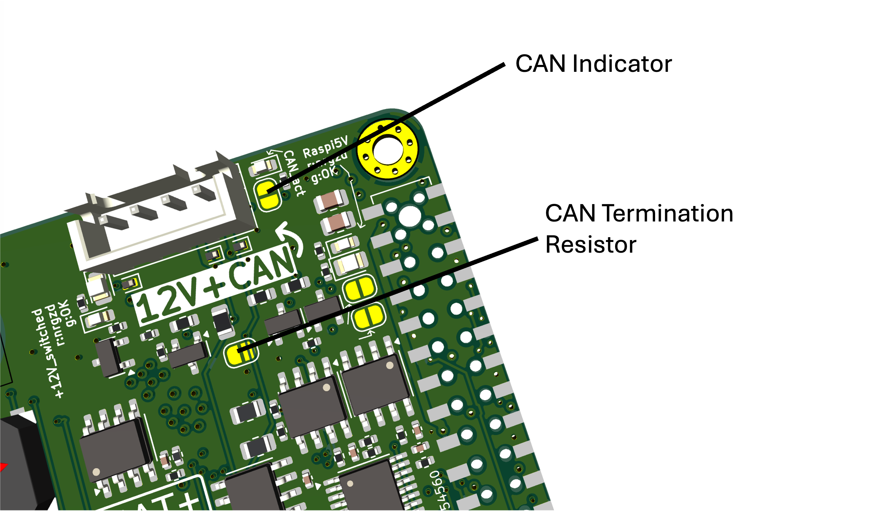

# openUC2 Raspberry Pi HAT+ (FRAME Controller)

**Technical specification, integration & bring-up guide**

## 0) Quick links (hardware, firmware, docs)

- Schematics PDF (HAT+ Rev D): `hatplus-for-raspberrypi-5.pdf`
- Schematics PDF (Panel Board): `hat-panelboard.pdf`
- Firmware config reference (ESP32, HAT Master v2): https://github.com/youseetoo/uc2-esp32/blob/main/sdkconfig.UC2_3_CAN_HAT_Master_v2
- Interactive BOM (iBOM): `ibom.html`  
  - If it lives in a subfolder in your repo, adjust the path accordingly (example: `hardware/ibom.html`).

## 0.1 Images (add these files to the repo)

Create `docs/images/` and add these PNGs (exported from the schematics PDFs):

- `docs/images/hatplus-overview.png`
- `docs/images/hatplus-power.png`
- `docs/images/hatplus-estop.png`
- `docs/images/hatplus-can.png`
- `docs/images/panelboard-overview.png`
- `docs/images/panelboard-fancontrol.png`
- `docs/images/panelboard-power.png`
- `docs/images/panelboard-camera-trigger.png`

Then these embeds will render on GitHub:


## 1) Purpose & feature summary

- HAT+ for Raspberry Pi (40-pin header) providing:
  - 12 V input -> on-board **5.1 V / 5 A** buck for Pi, plus **3.3 V** LDO for the ESP32-WROOM-32 and various sensors, E-Stop logic and interface chips.
  - Safety chain with **Emergency-STOP** (3.5 mm TRS) gating the 12 V output to the backbone. Momentary "Buspower OFF" button for quick cut.
  - **CAN bus** for distributed module control:
    - Raspi: MCP2515 SPI controller + SN65HVD230 transceiver
    - ESP32: Built-in CAN (TWAI) controller + SN65HVD230 transceiver
    - Optional 120 ohm termination and CAN activity LED by solder jumpers.
  - **ESP32-WROOM-32E** co-processor (USB-C + CP2102; also flashable via Pi UART with auto-program DTR/RTS).
  - **Sensors & I/O**:
    - INA226 current sensor (I2C addr 0x46)
    - two TMP102 temperature sensors (I2C addrs typically 0x4A and 0x4B)
    - NeoPixel header/extend, camera trigger out, fan tacho feedback, front-panel header
  - Dual **HAT+ EEPROMs** (Standard class + Power MODE1 class "5 A capable") for automatic OS configuration. (not working currently, workaround through our Raspi OS)


## 2) Electrical architecture

### 2.1 Power path (12 V in -> 5 V / 3.3 V)

- **Input**: Barrel jack J101 (5.5 mm OD / 2.5 mm ID, center-positive), protected by a **7 A resettable fuse**. Backfeed/ESD diodes protect rails and ports.
- **Buck**: TI **TPS54560** set to about **5.1 V**, rated for 5 A continuous (thermal-limited), with output network sized for step loads (design spreadsheet notes in schematic).
- **LDO**: **AMS1117-3.3** (up to 1 A) generating 3.3 V for logic/sensors from the 5 V rail.
- **Indicators & supervisors**:
  - 5 V present / OK window with MAX809 (2.93 V threshold in sensing chain) driving red/green LEDs (D401/D402). 5 V "OK" when above about 4.9 V.
  - 3.3 V and switched 12 V likewise instrumented with LEDs/supervisors for fast bring-up diagnosis.

### 2.2 High-current "bus power" switching & safety

- **Emergency-STOP chain** (TRS jack J501): tip-ring must be **normally closed** externally; opening latches OFF.
  - Sleeve supplies LED ground for the external box; power budget about 33 mA at 3.3 V.
- **Main bus power switch**: PMOS (Q602) producing `+12V_switched`
  - Gate logic is driven by `BUSPOWER_EN` and hard-gated by E-STOP and "buspower-off" lines.
  - `BUSPOWER_EN` has to be actively driven HIGH to turn on the big PMOS (see schematic note).
- **Bypasses (for troubleshooting only)**:
  - **JP601** "circumvent-buspower-switch": forces main PMOS ON (disables E-STOP, use only for lab debugging).
  - **JP201** "circumvent-power-software-switching": prevents Pi/ESP from cutting bus power via GPIO (safety-critical behavior may be altered).

## 3) Communication & control

### 3.1 Raspberry Pi interface (physical pin numbers)

- 3 (SDA1) / 5 (SCL1): I2C-1
  - Solder jumpers **JP101/JP102** can bridge Pi I2C to the board's shared I2C net (and to the ESP32 I2C if you close the bridge).
- 8 (GPIO14 TXD) / 10 (GPIO15 RXD): UART to ESP32 (paralleled with CP2102).
- 11 / 36: handshake lines used for ESP32 auto-program (via CP2102 wiring, see USB-UART sheet). Open **JP901/JP902** to isolate if needed.
- 16 (GPIO23): **buspower-off when HIGH** (wired into the power gating logic).
- 19/21/23/24: SPI0 (MOSI/MISO/SCLK/CE0) to **MCP2515**.
- 32 (GPIO12): **MCP2515 INT**.
- 27/28 (GPIO0/GPIO1): I2C-0 for **HAT+ EEPROMs** (spec-reserved).

### 3.2 ESP32 pinout (Rev D / v2, used signals)

This is the pinout that matches the `UC2_3_CAN_HAT_Master` v2 definition and the Rev D schematic:

| ESP32 GPIO | Net / Function | Notes |
|:|||
| 21 | I2C-1 SDA | Shared sensor bus |
| 22 | I2C-1 SCL | Shared sensor bus |
| 17 | CAN RX (TWAI) | To ESP-side SN65HVD230 |
| 18 | CAN TX (TWAI) | To ESP-side SN65HVD230 |
| 19 | NeoPixel data | On-board WS2812 + `neopixel-extend` |
| 32 | Camera trigger out | Drives Panel Board camera trigger interface |
| 27 | Camera IO0 in | Reserved / optional |
| 33 | Camera IO2 IO | Reserved / optional |
| 4  | BUSPOWER_OFF (HIGH = off) | Software cut of `+12V_switched` |
| 34 | E-STOP sense (`sense-emg-stop`) | Input-only pin; HIGH = E-STOP asserted |

> If you saw a PR in the `uc2-esp32` repo that added this v2 pinout, this table is the consolidated version to keep here in the hardware README.


## 4) I2C pins (answer)

### Raspberry Pi I2C (primary)
- Pi I2C-1 is on header pins:
  - Pin 3: GPIO2 / SDA1
  - Pin 5: GPIO3 / SCL1

### ESP32 I2C (on the HAT)
- ESP32 uses:
  - GPIO21 = SDA
  - GPIO22 = SCL

### Bridging Pi <-> ESP I2C
- **JP101 (SDA)** and **JP102 (SCL)** are the solder jumpers that connect the Pi I2C-1 lines into the HAT shared I2C net (and therefore to the ESP32 I2C pins and the I2C header ecosystem).  
  - Default should be OPEN unless you explicitly want the shared bus.

**Practical note:** the Pi has its own pullups on I2C-1. If the Pi is unpowered, the bus can behave oddly or backpower through pullups, so treat shared I2C with care when mixing power domains.


## 5) Temperature sensor (which one, pins, addresses)

- The HAT has **two TMP102** temperature sensors on the shared I2C bus.
  - Typical addresses on this design: **0x4A** (ambient) and **0x4B** (PCB temp), depending on ADDR strap.
- Pins:
  - They sit on **I2C-1 SDA/SCL** (shared bus): ESP32 GPIO21/22 and optionally Pi pins 3/5 if bridged by JP101/JP102.
- ALERT:
  - TMP102 supports ALERT, routed as open-drain in the design (board-level integration exists but may be left unpopulated or unused in firmware).


## 6) Buzzer (how it works)

- The buzzer is a 3.3 V driven beeper (BZ1501) switched by an NPN transistor (Q1501 SS8050).
- Signal is `buzzer-input` into a base resistor network (R1501 5.6k, etc.). The transistor sinks current through the buzzer.
- Recommended drive for loudest beep:
  - **2.7 kHz, 50% duty cycle** PWM.
  - Arbitrary waveforms also work.


## 7) Emergency stop (how to detect)

### Hardware behavior
- E-STOP is a TRS 3.5 mm jack (J501):
  - Remote box uses an NC switch between Tip and Ring.
  - Opening the loop triggers the safety chain and disables `+12V_switched` (latched OFF by the gating logic).
- There is also an "override" (SW501 / `emg-stop_OVERRIDE`) intended as a last-resort field bypass, protected against accidental use.

### Firmware detection (ESP32)
- Read the E-STOP sense net on ESP32:
  - `sense-emg-stop` is wired to **GPIO34** (input-only).
  - Logic on this board: **HIGH = E-STOP asserted**, **LOW = operational** (normal).

Pseudo-code:

```cpp
pinMode(34, INPUT);
bool estop_hit = (digitalRead(34) == HIGH);
```


## 8) Switching off 12 V from ESP32 or Raspberry Pi (answer)

Yes: you can shut off the **switched 12 V rail** (`+12V_switched`) in two ways:

### 8.1 Software kill (fast, intended)

* Two "buspower-off" lines are wired into the power gating logic:

  * ESP32: `buspower-off_ESP` on **GPIO4** (HIGH = OFF)
  * Raspberry Pi: `buspower-off_raspi` on **GPIO23** (Pi header pin 16; HIGH = OFF)

This is a hard gate: if either line requests OFF, the switched 12 V is disabled.

### 8.2 Physical kill (local momentary)

* SW601 is a momentary "Buspower OFF" that forces OFF in hardware.


## 9) CAN activity and termination (which solder jumpers to bridge)

These are the useful field jumpers for CAN diagnostics and bus correctness:

* **JP801**: enable on-board **120 ohm termination**

  * Bridge it only if this node is at one end of the CAN bus (one terminator per end).
* **JP802**: enable CAN **dominant-state indicator LED**

  * Helpful to visually confirm activity (adds a small load to the bus).



Other jumpers worth knowing:

* **JP101 / JP102**: bridge Pi I2C SDA/SCL into the shared I2C net (only if you want a shared bus).
* **JP601** and **JP201**: bypass safety behavior (debug only, not for normal operation or shipping).


## 10) High current mode (reproducible activation, automated)

Goal: reliably allow high USB current draw on Raspberry Pi 5 (and avoid brownouts) by combining:

1. correct power hardware (5.1 V / 5 A capability), and
2. OS configuration that lifts the Pi USB current policy.

### 10.1 Current workaround (works today)

Add this to `/boot/firmware/config.txt`:

```ini
usb_max_current_enable=1
```

This is OS-image controllable (automate it in your ImSwitch OS build / image pipeline).

### 10.2 Intended automated method (HAT+ EEPROM)

The design contains **two HAT+ EEPROMs** on Pi I2C-0 (GPIO0/1) to advertise the HAT class, including a **Power MODE1** class ("5 A capable") so the Pi can lift power limits automatically.

Status: on early bring-up this is "not working currently" in the project notes, so keep the config.txt method in place until EEPROM programming + detection is validated end-to-end.


## 11) Firmware (ESP32 HAT Master v2)

* Use this firmware config as the canonical reference for the v2 board:

  * [https://github.com/youseetoo/uc2-esp32/blob/main/sdkconfig.UC2_3_CAN_HAT_Master_v2](https://github.com/youseetoo/uc2-esp32/blob/main/sdkconfig.UC2_3_CAN_HAT_Master_v2)

Suggested repo structure for releases:

* Provide prebuilt binaries for:

  * `UC2_3_CAN_HAT_Master_v2.bin`
  * plus `bootloader.bin` and `partitions.bin` if you are not using merged images
* Link them from GitHub Releases and also from this README.


## 12) Panel Board (more information)

The Panel Board is a small front-panel / breakout PCB powered by the HAT and intended to:

* Provide convenient connectors for:

  * STEMMA / STEMMA QT I2C at 3.3 V
  * 5 V addressable LED headers (ARGB-style)
  * SMA camera trigger output (for HIKROBOT camera Line 0)
  * Fan header with tacho and controllable supply

### 12.1 Panel Board input connector from HAT (J101, 7-pin)

The harness from HAT to Panel Board carries:

* `I2C_SDA`
* `I2C_SCL`
* `neopixel` (data)
* `camera-trigger_esp-gpio`
* `fan_tacho`
* `GND`
* `+12V`

The Panel Board generates its local 5 V and 3.3 V from the 12 V input.

### 12.2 STEMMA / STEMMA QT (I2C expansion)

* Two connectors:

  * JST-PH STEMMA (J107)
  * JST-SH STEMMA QT (J106)
* Output: 3.3 V + I2C, with max about 200 mA average (design note: 1 A peak), pullups are on the HAT (so do not duplicate aggressively).

### 12.3 5 V LED headers (ARGB / NeoPixel ecosystem)

* LED headers provide:

  * 5 V (up to 3 A from the local 12 -> 5 V buck on the Panel Board)
  * NeoPixel data
  * GND
* There are multiple header styles to match common PC ARGB ecosystems (notes in schematic).

### 12.4 Camera trigger output to HIKROBOT (SMA)

* The Panel Board includes a level interface that takes the ESP32 3.3 V trigger (`trigger_from-ESP`) and drives a 12 V level suitable for the camera input (HIKROBOT Cam In Line 0).
* Implementation:

  * NPN transistor + PMOS high-side stage (AO3401A) to drive the camera optoisolator input correctly.
* Important notes from the schematic:

  * Camera input is effectively an optocoupler LED with an internal resistor and needs a minimum voltage.
  * This board drives a "12 V signal level" to meet the camera input requirements.

### 12.5 Fan header and controllable fan supply

* The Panel Board provides a 3-pin fan connector (J401) with:

  * GND
  * `Tacho` (open-drain from fan)
  * a controllable supply rail (`DCDC_FAN_VOUT`)
* Fan supply generation:

  * A buck converter stage that can produce a variable output (design notes indicate 12 V down to about 3 V).
  * Control uses an I2C digital potentiometer **MCP4017** at I2C address **0x2F** (design note).
  * There is a local 3.3 V LDO supply dedicated for the fan control subsystem.


## 13) Linux integration (CAN & sensors)

### 13.1 MCP2515 overlay (Pi-side CAN on Linux)

* SPI0 CE0 (CS), INT at GPIO12, SCK/MOSI/MISO on pins 23/19/21.
* Example `/boot/firmware/config.txt`:

```ini
dtparam=spi=on
dtoverlay=mcp2515,spi0-0,interrupt=12,oscillator=16000000
```

Then:

```bash
sudo ip link set can0 up type can bitrate 500000
candump can0
```

### 13.2 Sensors (I2C)

```bash
sudo apt install i2c-tools
i2cdetect -y 1
```

Expected addresses:

* INA226: 0x46
* TMP102: typically 0x4A and 0x4B


## 14) Field solder-jumpers quick table

| Jumper      | Action                                 |
| -- | -- |
| JP801       | Add 120 ohm CAN termination            |
| JP802       | Enable CAN dominant-state LED          |
| JP101       | Bridge Pi I2C SDA into shared I2C net  |
| JP102       | Bridge Pi I2C SCL into shared I2C net  |
| JP601       | Force bus power ON (bypass E-STOP)     |
| JP201       | Disable Pi/ESP software power-off      |
| JP901/JP902 | Open to isolate Pi from CP2102 RTS/DTR |


## 15) Appendix: default pin maps

### 15.1 Default Raspberry Pi header map (summary)

|         Pin | Function                                   |
| -: |  |
|       3 / 5 | I2C-1 SDA/SCL (bridgeable via JP101/JP102) |
|      8 / 10 | UART TX/RX to ESP (paralleled with CP2102) |
|          16 | buspower-off (HIGH = off)                  |
| 19/21/23/24 | SPI0 MOSI/MISO/SCLK/CS0 -> MCP2515         |
|          32 | MCP2515 INT (GPIO12)                       |
|     27 / 28 | I2C-0 SCL/SDA -> HAT+ EEPROMs              |

### 15.2 ESP32 used pins (summary)

|    GPIO | Function                       |
| : |  |
| 21 / 22 | I2C SDA/SCL                    |
| 17 / 18 | CAN RX/TX (TWAI)               |
|      19 | NeoPixel                       |
|       4 | BUSPOWER_OFF (HIGH = off)      |
|      34 | E-STOP sense (HIGH = asserted) |
|      32 | Camera trigger out             |
| 27 / 33 | Camera IO (reserved)           |


## 16) Interactive BOMs (iBOMs)

### HAT v2: 

<iframe width="100%" style={{"aspect-ratio": "16 / 9"}} src="https://openuc2.github.io/kicad/ibom-hatv2.html" title="iBOM" frameborder="0" allow="accelerometer; autoplay; clipboard-write; encrypted-media; gyroscope; picture-in-picture; web-share" referrerpolicy="strict-origin-when-cross-origin" allowfullscreen></iframe>

### Panel Board:

<iframe width="100%" style={{"aspect-ratio": "16 / 9"}} src="https://openuc2.github.io/kicad/ibom-hatv2panel.html" title="iBOM" frameborder="0" allow="accelerometer; autoplay; clipboard-write; encrypted-media; gyroscope; picture-in-picture; web-share" referrerpolicy="strict-origin-when-cross-origin" allowfullscreen></iframe>
