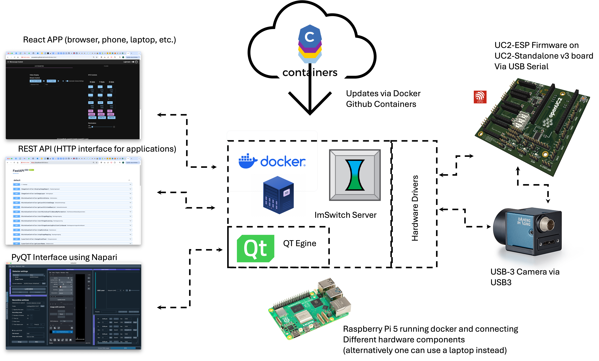

# ImSwitch in Docker II Tutorial

This tutorial outlines how to set up and run ImSwitch using Docker, where ImSwitch is deployed as a Python application inside a container. The container uses an Ubuntu image with all required libraries and dependencies, including UC2-REST for ESP32 control, and provides access to ImSwitch via a FastAPI-based REST API server.

## Setup Overview

ImSwitch is a modular Python application installed inside a Docker container. The process includes:
- Creating an isolated environment with all necessary libraries.
- Pulling and installing ImSwitch from the latest GitHub master branch.
- Installing the UC2-REST library to control external devices like ESP32.
- Setting up FastAPI to expose a REST API interface for remote control.
- Running a React app on top of the REST API for web-based control.



### One-Step Installation (Raspi + Debian?)

For Debian-based systems (Raspberry Pi and others), there is a one-step installation script that installs Docker, camera drivers, and pulls the Docker container for ImSwitch:

Repository: [openUC2/ImSwitchDockerInstall](https://github.com/openUC2/ImSwitchDockerInstall)
Script: `install_all.sh` installs everything you need.

#### Two-step installation (most other cases)

Pull the docker-container and run it

```bash
docker pull ghcr.io/openuc2/imswitch-noqt-x64:latest
sudo docker run -it --rm -p 8001:8001 -p 2222:22 -e HEADLESS=1 -e HTTP_PORT=8001 -e CONFIG_FILE=example_uc2_hik_flowstop.json -e UPDATE_GIT=0 -e UPDATE_CONFIG=0 --privileged ghcr.io/openuc2/imswitch-noqt-x64:latest
```

More information about this here:
https://openuc2.github.io/docs/ImSwitch/ImSwitchDocker#docker-quick-start


### Building the Docker Image

ImSwitch and UC2-REST are cloned and installed into the Docker image directly from the latest commits. During each build, the Git archives are fetched again, ensuring the installation is up-to-date without starting from scratch.

The Dockerfile for ImSwitch can be found here:
[Dockerfile](https://github.com/openUC2/ImSwitch/blob/master/dockerfile)

### Running ImSwitch via Docker

After the Docker image is built, you can run the container with ImSwitch by specifying the necessary parameters. Here’s an example startup script:

```bash
params=()
if [[ $HEADLESS == "1" || $HEADLESS == "True" || $HEADLESS == "true" ]]; then
    params+=" --headless"
fi;
if [[ $ssl == "0" || $ssl == "False" || $ssl == "false" ]]; then
    params+=" --no-ssl"
fi;
params+=" --http-port ${HTTP_PORT:-8001}"
params+=" --config-folder ${CONFIG_PATH:-None}"
params+=" --config-file ${CONFIG_FILE:-None}"
params+=" --ext-data-folder ${DATA_PATH:-None}"

echo 'Starting ImSwitch with the following parameters:'
echo "${params[@]}"
python3 /tmp/ImSwitch/main.py $params
```

### Key Entry Points

1. **Main Execution**:
   ImSwitch is launched from the main Python script, where configuration files and parameters are passed to set up the environment.
   - Entry point file:
     [main.py](https://github.com/openUC2/ImSwitch/blob/master/main.py)
     [__main__.py](https://github.com/openUC2/ImSwitch/blob/master/imswitch/__main__.py)

2. **API Decorators**:
   Functions decorated with `@APIExport` are automatically exposed as API endpoints in the FastAPI server.
   - API definition:
     [ImSwitchServer.py#L171](https://github.com/openUC2/ImSwitch/blob/acd12e24d124e0dbf7759af2a9afa7eb9a02eed6/imswitch/imcontrol/controller/server/ImSwitchServer.py#L171)

### Accessing the REST API

The REST API server runs on port 8001 by default, with SSL enabled. You can interact with the API through the following interfaces:

- **Swagger UI**:
  Access the API documentation here:
  `https://localhost:8001/docs`

- **Web Interface**:
  A React app is served on top of the REST API:
  `https://localhost:8001/imswitch/index.html`

With this setup, you now have a running ImSwitch instance inside Docker, accessible via both API and web-based interfaces for control and configuration.
