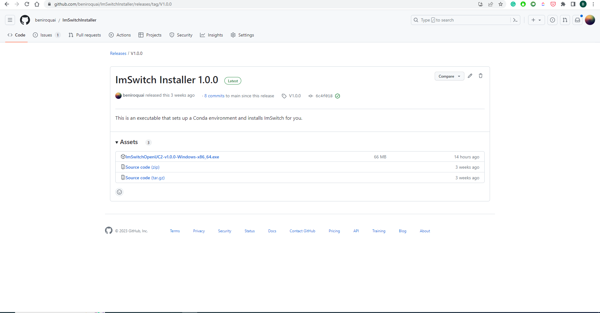
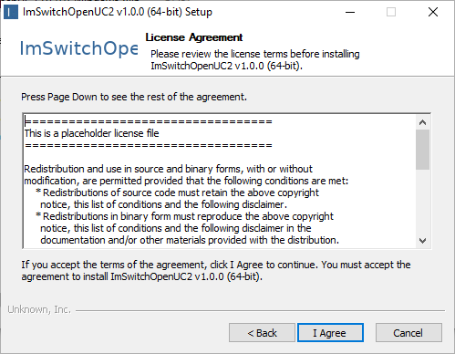
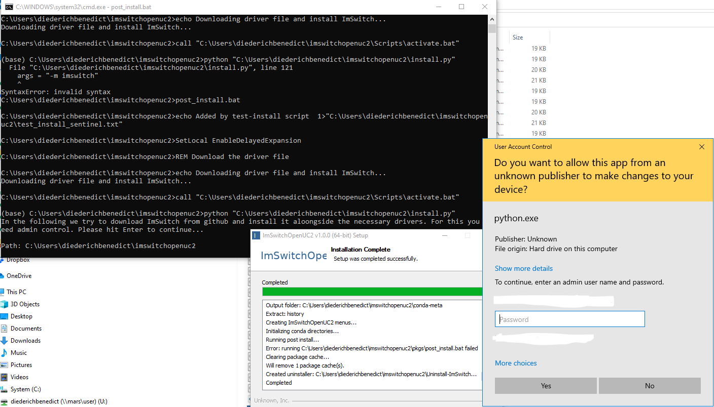
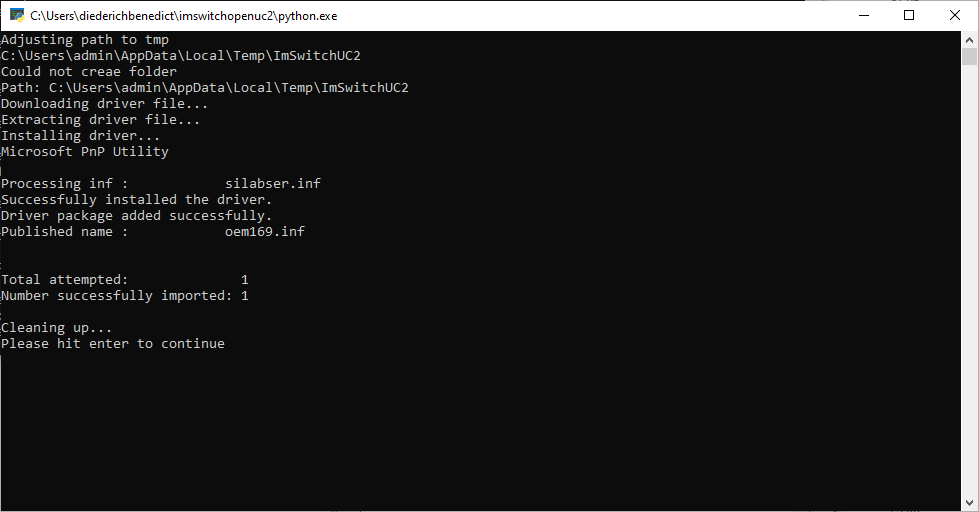

:::warn
This tutorial is outdated! Please look for the Standalone Electron-based version!
:::

We created a customized conda installer for the ImSwitchUC2 package that is based on the open-source [conda constructor](https://github.com/conda/constructor/) project. All files to construct the package installer can be found in this repository https://github.com/beniroquai/ImSwitchInstaller


## General concept

We were seeking for a way to ship the latest version of ImSwitchUC2 as the simplest possible solution without using any command line hacks. Besides the PyInstaller Implementation that's still somewhere existent, we were looking for a nicer way in terms of shipping updates. The PyInstaller packages all the necessary libraries in one large ZIP file, but lacks the abbility to simply update it. A new version requires yet another >1GB file to be downloaded.
Our solution works as follows:

- A local conda environemnt is created called `ImSwitchopenUC2`
- The installer will start `post_install` scripts that will:
1. try to download and install the necessary usb drivers
2. download the latest imswitch code and `pip install` it
3. Create a double-clickable icon on the desktop to start ImSwitch


## How to install?

So far, we only have a windows installer, but for mac and linux it should work equally well. Ping us, if you need this :)


1. Download the latest exectuable here: https://github.com/beniroquai/ImSwitchInstaller



2. Double click on the installer and go through the process


3. Agree to the license terms (yet a placeholder, text has to be updated..)



4. Install for me, which does not yet require admin rights


5. Choose a path to install the conda environment to (Hint: path should not exceed 40 digits)


6. Proceed


7. Wait until the packages are installed


8. A command prompt will appear and ask you for granting admin rights; Here a python script tries to download and install the silabs USB UART drivers for the ESP32


9. The installation will tell you if the installation process scussful



10. In the next steps, all necessary packages in the environemnt for ImSwitch will be downloaded and installed


11. The installer informs you once it's done


12. Once everything has been installed, the installer tells you it'S done


13. Exit the installer by hitting finish


14. On the desktop a new icon has been created to start the ImSwitch software. Double click and wait until the windows shows up


## Trouble shoot

The conda installer installs your environment in the location that you have selected previously. To find out, you can open a command line window by hiting the keys WIN+r and type "cmd" and enter. Then enter

```
conda env list
```

The name `imswitchopenuc2` should appear. You can activate this python environemnt by typing

```
conda activate imswitchopenuc2
```

If this works successfully, you can start imswitch by typing

```
imswitch
```


# Disclaimer

This is still very early stage and may have errors. **Exepect Errors**  Feel free to file any issues in our repository  or write us a mail. :)
