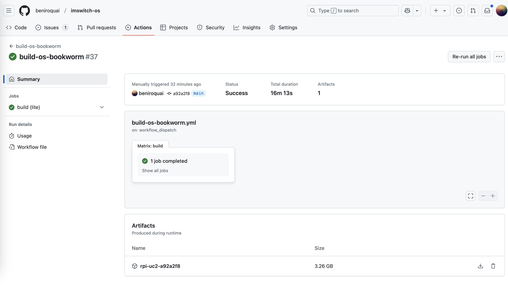

# Quickstart to use the Raspberry Pi with our ImSwitch and UC2-ESP

The Raspberry Pi connects the UC2-ESP via USB and the USB3 camera to the ImSwitch that runs in Docker. You can access the frontend via your browser on a phone or laptop. It's experimental at the moment! A demo version of the latest ImSwitch running in the web can be found here:
- https://imswitch.openuc2.com/imswitch/index.html
including its API:
- https://imswitch.openuc2.com/docs


## Login Data for Raspberry Pi (SSH / Login)

The Raspberry Pi login credentials are:
- **Username:** `UC2`
- **Password:** `youseetoo`

It runs the Raspberry Pi OS Light version with a Docker integration of our systems, linked on Twitter. You can log in via SSH and start the ImSwitch server.

[ImSwitch Docker Installation Guide](https://github.com/openUC2/ImSwitchDockerInstall?tab=readme-ov-file#imswitch--docker-on-raspi)

## WiFi Hotspot

- **SSID:** `openuc2-RANDOMNUMBER`
- **Password:** `youseetoo`

Configure the hotspot using RaspAP:
- Go to [http://10.3.141.1/](http://10.3.141.1/)
- Login: **admin** / **secret**
- (Refer to RaspAP GitHub for more details)

## Accessing ImSwitch

If the Docker image has started automatically, you can access ImSwitch at:
- [https://10.3.141.1:8001/imswitch/index.html](https://10.3.141.1:8001/imswitch/index.html)
- (Self-signed certificate warning: Accept untrusted, this will be fixed in the future.)

## Connecting via SSH

To SSH into the Raspberry Pi and manually start ImSwitch:
```sh
ssh uc2@10.3.141.1  # Password: youseetoo
# Start ImSwitch
cd ~/Desktop
./launch_docker_container.sh
```

## Changing ImSwitch Parameters

Configuration file path:
```sh
nano ~/ImSwitchConfig/config/imcontrol_options.json
```

- **Active setup file:** `example_uc2_vimba.json`

Example JSON snippet:
```json
{
    "setupFileName": "example_uc2_vimba.json",
    "recording": {
        "outputFolder": "./ImSwitch/ImSwitch/recordings",
        "includeDateInOutputFolder": true
    }
}
```

To modify configurations:
```sh
nano ~/ImSwitchConfig/imcontrol_setups/example_histo_daheng.json
```

Example positioner settings:
```json
"positioners":{
    "ESP32Stage":{
        "managerName":"ESP32StageManager",
        "managerProperties":{
            "rs232device":"ESP32",
            "isEnable":true,
            "stepsizeX":-0.3125,
            "stepsizeY":-0.3125,
            "stepsizeZ":0.3125,
            "homeSpeedX":15000,
            "homeSpeedY":15000,
            "homeSpeedZ":25000
        }
    }
}
```

For more details, visit: [ImSwitchConfig GitHub](https://github.com/openUC2/imswitchconfig)


A full example file:

  ### Step 2: Using the ImSwitch Config File

  Now that ImSwitch is installed, you need to configure it for your specific setup. Here is an example configuration file (`uc2_hik_histo.json`) for controlling the UC2 system:

  ```json
  {
    "positioners": {
      "ESP32Stage": {
        "managerName": "ESP32StageManager",
        "managerProperties": {
          "rs232device": "ESP32",
          "stepsizeX": -0.3125,
          "stepsizeY": -0.3125,
          "stepsizeZ": 0.3125,
          "homeSpeedX": 15000,
          "homeSpeedY": 15000,
          "homeSpeedZ": 15000
        },
        "axes": ["X", "Y", "Z"],
        "forScanning": true
      }
    },
    "rs232devices": {
      "ESP32": {
        "managerName": "ESP32Manager",
        "managerProperties": {
          "host_": "192.168.43.129",
          "serialport": "COM3"
        }
      }
    },
    "lasers": {
      "LED": {
        "managerName": "ESP32LEDLaserManager",
        "managerProperties": {
          "rs232device": "ESP32",
          "channel_index": 1
        },
        "wavelength": 635
      }
    },
    "detectors": {
      "WidefieldCamera": {
        "managerName": "HikCamManager",
        "managerProperties": {
          "isRGB": 1,
          "hikcam": {
            "exposure": 0,
            "gain": 0,
            "blacklevel": 100,
            "image_width": 1000,
            "image_height": 1000
          }
        },
        "forAcquisition": true
      }
    },
    "autofocus": {
      "camera": "WidefieldCamera",
      "positioner": "ESP32Stage",
      "updateFreq": 10,
      "frameCropx": 780,
      "frameCropy": 400
    }
  }
  ``

  This file configures the ESP32 stage, LED control, and the camera for widefield imaging. Ensure the `host_` and `serialport` match your system setup.


Close the application with:
```sh
CTRL + C
```

## Hardware Connection

- Connect **UC2-ESP Board** via USB to Raspberry Pi
- Connect **USB3 Camera** to Raspberry Pi

## Accessing ImSwitch via Web Browser

Open the following URL in a browser:
[https://10.3.141.1:8001/imswitch/index.html](https://10.3.141.1:8001/imswitch/index.html)


## The installation process

There are multiple ways to install ImSwitch on multiple different platforms. Each comes with its pros and cons. Here we are only looking at the Docker-based installation on an ARM64 (i.e. CPU architecture of the Raspberry Pi or MAC Metall). Alternatively you can install it "natively" as a python application. Reach out to us if you need help!

We have packaged everything into a docker file for you! This means it has all the drivers and python packages included and its guaranteed to run - at lesat from the dependency point of view! Yay!

In collaboration with Ethan from the Forklift Project https://github.com/forklift-run we have put all the necessary steps into a single img file that you simply need to download and flash to your SD card and boom. Everthing is working out of the box. It contains all the drivers on both host and docker side as well as the necessary settings to get you starting. Modifications still need to be done following the protocols above (e.g. ImSwitchConfig), but it'll be a lot easier for you to get starting. If you want to perform an installation on your own, this is still possible and explained here step by step (e.g. from Raspberry Pi OS to ImSwitch running on the Raspi). We recommmend to use the Raspberry Pi 5 with 8GB. Rasip 4 works, but a lot slower!


  1. **Pull the Docker container**:
     ``bash
     sudo docker pull ghcr.io/openuc2/imswitch-noqt-x64:latest
     ``

  2. **Run the Docker container**:
     ``bash
     sudo docker run -it --rm -p 8001:8001 -p 2222:22 \
     -e HEADLESS=1 \
     -e HTTP_PORT=8001 \
     -e CONFIG_FILE=example_uc2_hik_flowstop.json \
     -e CONFIG_PATH=/config \
     -v ~/Downloads:/config \
     --privileged ghcr.io/openuc2/imswitch-noqt-x64:latest
     ``

  Once you have ImSwitch installed and running, you can access the web interface at `localhost:8001` to control the system.

  For detailed instructions on Docker installation, visit the [ImSwitch Docker Guide](https://openuc2.github.io/docs/ImSwitch/ImSwitchDocker/).


  ### Step 3: Running the Microscope with ImSwitch

  1. **Launch ImSwitch**:
     ```bash
     python -m imswitch
     ```

  2. **Select the Configuration**:
     Upon launch, choose **"Virtual Microscope"** or load your custom configuration file, such as `uc2_hik_histo.json`.

  3. **Control the System**:
     Use the ImSwitch GUI to move the motorized stage, control the LED-matrix, and capture images. The interface allows you to automate tasks such as focus stacking and digital phase-contrast imaging.


## Install Raspberry Pi + ImSwitch

1. Download and INstall the  Raspberry PI Imager here: https://www.raspberrypi.com/software/


2. Flash Raspberry Pi OS 64Bit Bookworm Lite on an SD card with appropriate size (e.g. 64GB for the Raspi 5) -> add the necessary settings (i.e. enable SSH access, Choose the wifi password and ssid from the Wifi you know) )> Flash the firmware onto the SD card


3. Insert the SD Card into the Raspberry Pi and Boot Raspberry Pi and wait until it's full there; ~5 minutes => It should be connected to your wifi (make sure you are in the same network as the pi); **HINT** If you connect e.g. to the AP created with your phone you can easily retreive the IP of the raspberry pi.  you're computer should be in the same network; Alternatively you can also hook up a montiro via the micro HDMI cabel
4. You should be able to log into that using ssh => (Windows + R => CMD ) = > Terminal opens and then type `ssh uc2@IP-OF-YOURRASPI`


(You can find the IP-Adress of your Raspberry using e.g. [angry ip scanner](https://angryip.org/download) or a screen connected to your rapsberry pi)

5. Install imswitch; Go to https://github.com/openUC2/ImSwitchDockerInstall?tab=readme-ov-file#imswitch--docker-on-raspi and then follow the procedures by copy-pasting the following code into the terminal (e.g. Windows Command Line INterface, Mac Terminal, etc.):

```bash
mkdir Downloads
mkdir Desktop
sudo apt-get install git -y
cd ~/Downloads
git clone https://github.com/openUC2/ImSwitchDockerInstall
cd ImSwitchDockerInstall
chmod +x install_all.sh
./install_all.sh
```

This will:
- install docker
- install all necessary camera drivers (e.g. Allied Vision, HIK, Daheng)
- install imswitch via docker
- create necessray startup files on the desktop so that you can launch imsiwtch and update it (the desktop won't be visible on a headless machine of course)

6. ONce everything has been downloaded, By typing the following command via the SSH prompt (e.g. Windows CMD or MAC Terminal) you can launch ImSwitch it by doing; `bash ~/Desktop/launch_docker_container.sh`


8. Go to your browser and enter the `https://IP-OF-YOUR-RASPI:8001/imswitch/index.html`
You should see something like this:


9. Have a look for additional information here: https://openuc2.github.io/docs/ImSwitch/ImSwitchOnRaspi/ or any related page in this wiki
8. Close the applicaiton by hitting ctrl + c
9. update the applicaoin by executing `bash ~/Desktop/update_docker_container.sh`

### launch imswitch
if you have installed it alredy execute the following

```
bash ~/Desktop/launch_docker_container.sh
```

This will run the following code:
```bash
echo "#!/bin/bash
#!/bin/bash
# Run the docker container with specified parameters
sudo docker run -it --rm -p 8001:8001 -p 8002:8002 -p 8003:8003 -p 8888:8888 -p 2222:22 \
-e CONFIG_PATH=/config \
-e DATA_PATH=/dataset \
-v ~/Documents/imswitch_docker/imswitch_git:/tmp/ImSwitch-changes \
-v ~/Documents/imswitch_docker/imswitch_pip:/persistent_pip_packages \
-v ~/Downloads:/dataset \
-v ~/:/config \
-e HEADLESS=1 \
-e HTTP_PORT=8001 \
-e UPDATE_INSTALL_GIT=0 \
-e UPDATE_CONFIG=0 \
--privileged ghcr.io/openuc2/imswitch-noqt-arm64:latest
" >"$DESKTOP_PATH/launch_docker_container.sh"
```


### update imswitch

run this code via SSH:
```bash
docker pull ghcr.io/openuc2/imswitch-noqt-arm64:latest
```


## altternaive use the img file provided by forklift

Flash the pre-built image from this link using this software., .As mentioned previously we use the fork lift mechanism to modify the raspberry pi image files using github actions. This is a powerful tool and will essentially outsource the above steps and returns the prebuild image file for you which you simply need to download, extract (~3GB as a zip and 7GB uncompressed) and flash this to an SD card following steps from abiove.

This is where it's getting stored:


Unfortutnately we have to provide an external storage for this very large file as github doesn't allow releases to be bigger than 2GB

For a glimpse of how this works follow this link:
https://github.com/beniroquai/imswitch-os/blob/main/setup.sh#L60
It essentially performs all the steps above for you! Just with the difference that you get a fully packed IMG file out in the end -ready to flash!

# LINk from GOOGLE DRIVE
