# Quickstart Guide: Using Raspberry Pi with ImSwitch and UC2-ESP

The Raspberry Pi serves as a bridge between the UC2-ESP board and a USB3 camera, running the ImSwitch software inside a Docker container. The system allows you to control the microscope through a web interface accessible from a phone or laptop.

> **Note:** This setup is experimental! You can try a demo version of the latest ImSwitch here:
> - [Live Demo](https://imswitch.openuc2.com/imswitch/index.html)
> - [ImSwitch API](https://imswitch.openuc2.com/docs)

---

## Getting Started

### Raspberry Pi Login Credentials
- **Username:** `UC2`
- **Password:** `youseetoo`

The system runs Raspberry Pi OS Lite and includes a Docker integration for ImSwitch. You can log in via SSH to start the ImSwitch server.

[ImSwitch Docker Installation Guide](https://github.com/openUC2/ImSwitchDockerInstall?tab=readme-ov-file#imswitch--docker-on-raspi)

### WiFi Hotspot
- **SSID:** `openuc2-RANDOMNUMBER`
- **Password:** `youseetoo`

To configure the hotspot using RaspAP:
1. Open a browser and go to [http://10.3.141.1/](http://10.3.141.1/)
2. Login with:
   - **Username:** `admin`
   - **Password:** `secret`

### Accessing ImSwitch
If the Docker container starts automatically, access ImSwitch at:
- [https://10.3.141.1:8001/imswitch/index.html](https://10.3.141.1:8001/imswitch/index.html)
- Ignore self-signed certificate warnings (this will be fixed later).

### Connecting via SSH
To manually start ImSwitch:
```sh
ssh uc2@10.3.141.1  # Password: youseetoo
cd ~/Desktop
./launch_docker_container.sh
```

### Modifying ImSwitch Configuration
To adjust settings, edit the configuration file:
```sh
nano ~/ImSwitchConfig/config/imcontrol_options.json
```
For example, changing the active setup file:
```json
{
    "setupFileName": "example_uc2_vimba.json",
    "recording": {
        "outputFolder": "./ImSwitch/ImSwitch/recordings",
        "includeDateInOutputFolder": true
    }
}
```

More details: [ImSwitchConfig GitHub](https://github.com/openUC2/imswitchconfig)

---

## Hardware Setup
- Connect **UC2-ESP Board** via USB to the Raspberry Pi
- Connect **USB3 Camera** to Raspberry Pi

To access ImSwitch via a browser:
- Open: [https://10.3.141.1:8001/imswitch/index.html](https://10.3.141.1:8001/imswitch/index.html)

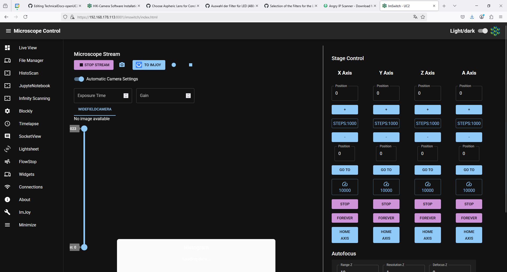

---

## Installing Raspberry Pi OS & ImSwitch

There are two ways to set up the Raspberry Pi for ImSwitch:
1. **Manual Installation** (for full control over package installation)
2. **Pre-built Image** (faster setup using a ready-made Raspberry Pi image)

### **Option 1: Manual Installation**

#### **Step 1: Install Raspberry Pi OS**
1. Download and install the Raspberry Pi Imager: [Download Here](https://www.raspberrypi.com/software/)

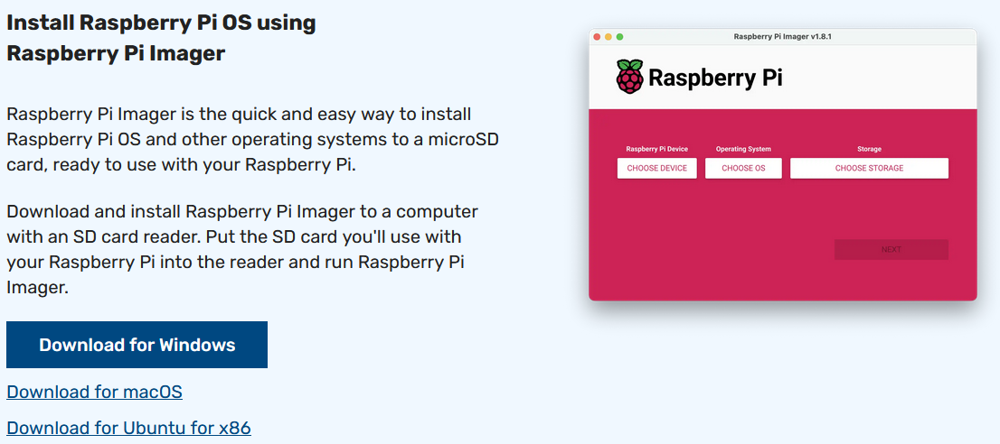

2. Flash **Raspberry Pi OS 64-bit Bookworm Lite** onto an SD card (64GB recommended for Raspberry Pi 5).
3. Configure settings:
   - Enable SSH
   - Set WiFi SSID and password
4. Insert the SD card into the Raspberry Pi and boot it up.

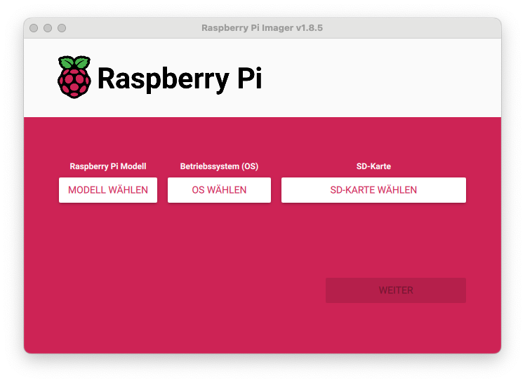
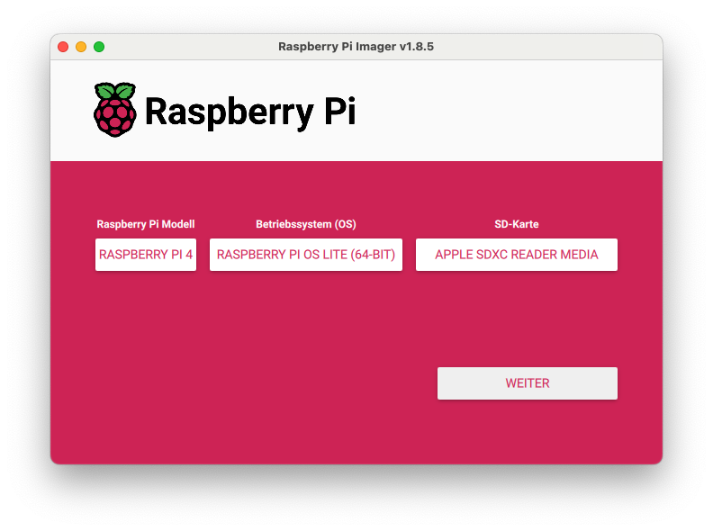

#### **Step 2: Connect to Raspberry Pi**
1. Wait ~5 minutes for booting.
2. Find the Raspberry Pi’s IP address using:
   - [Angry IP Scanner](https://angryip.org/download)
   - A monitor connected via micro-HDMI

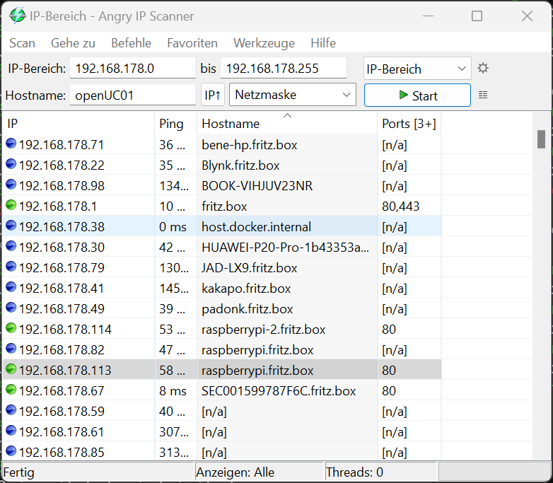

3. Log in via SSH:
```sh
ssh uc2@IP-OF-YOURRASPI
```

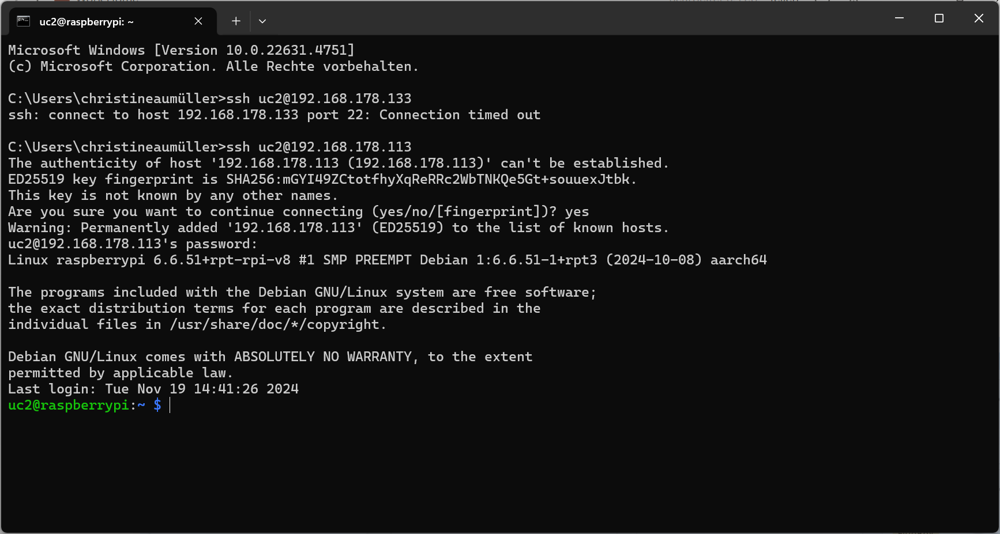

#### **Step 3: Install ImSwitch**
1. Run the following commands:
```sh
mkdir Downloads
mkdir Desktop
sudo apt-get install git -y
cd ~/Downloads
git clone https://github.com/openUC2/ImSwitchDockerInstall
cd ImSwitchDockerInstall
chmod +x install_all.sh
./install_all.sh
```

2. This will:
   - Install Docker
   - Install necessary camera drivers (Allied Vision, HIK, Daheng)
   - Set up ImSwitch via Docker
   - Create startup files for launching ImSwitch

3. Start ImSwitch:
```sh
bash ~/Desktop/launch_docker_container.sh
```
4. Access the interface at:
```sh
https://IP-OF-YOUR-RASPI:8001/imswitch/index.html
```
5. Update ImSwitch when needed:
```sh
bash ~/Desktop/update_docker_container.sh
```

---

### **Option 2: Using the Pre-Built Forklift Image**

This is a compiled image for the Raspberry Pi 5 to deploy ImSwitch in Docker. 

It is based on the following repository that builds the image file based on Raspberry Pi OS lite using GitHub Actions:

- [ImSwitch OS Repository](https://github.com/openuc2/imswitch-os/tree/main)
- [OpenUC2 Pallet Repository](https://github.com/openUC2/pallet)

The image is built from the following workflow:

- [GitHub Actions Build](https://github.com/beniroquai/imswitch-os/actions/runs/13718023729)

#### **Requirements**
- microSD Card with >32GB
- Raspberry Pi 4 or preferably Pi 5 (8GB RAM recommended)
- microSD Card reader

If you prefer a faster setup, you can use this **pre-built image** that includes all necessary software and drivers. This image was created with the [Forklift Project](https://github.com/forklift-run) and automates all setup steps.

#### **How to Use the Pre-Built Image:**
1. **Download the image** from Zenodo: [Zenodo Image Link](https://zenodo.org/records/14988987)
2. **Extract the image** (~3GB as a ZIP, ~11GB uncompressed).
3. **Flash it to an SD card** using [Raspberry Pi Imager](https://www.raspberrypi.com/software/).

##### **Flashing the Image**
Use the Raspberry Pi Imager to flash the image onto an SD card, then insert the SD card into the Raspberry Pi and boot it.


1. Select your Raspberry Pi model.
2. Choose the downloaded image file as the OS type.
3. Select the SD card as the target.
4. Do **not** specify additional user-specific settings.

##### **Default Credentials**
- **SSID:** `openUC2-unknown`
- **WiFi Password:** `copepode`
- **Username:** `pi`
- **User Password:** `youseetoo`

> **Note:** The Forklift image is updated automatically and ensures all software is correctly configured.

:::warning
If you want to have Internet on the Raspberry Pi, you can either plug the LAN port into a router with internet - then the wifi that is shared by the access point is automatically briding that connection. Alternatively, you can use an Android phone in USB access point mode and share the internet connection by that mean.
:::

:::error
In case the GUI hangs - this might be due to an older version that expected internet to load javascript libraries/fonts. It times out after 60s and renders the ImSwitch webapp - please update the software.
:::


For a detailed breakdown of the image creation process, see:
[ImSwitch OS GitHub Setup Script](https://github.com/beniroquai/imswitch-os/blob/main/setup.sh#L60)

#### **Connecting to the Raspberry Pi**
1. Wait until the Raspberry Pi boots and you see the SSID `openUC2-unknown`.
2. Connect to the SSID and navigate to `http://192.168.4.1:9090` to access Cockpit.

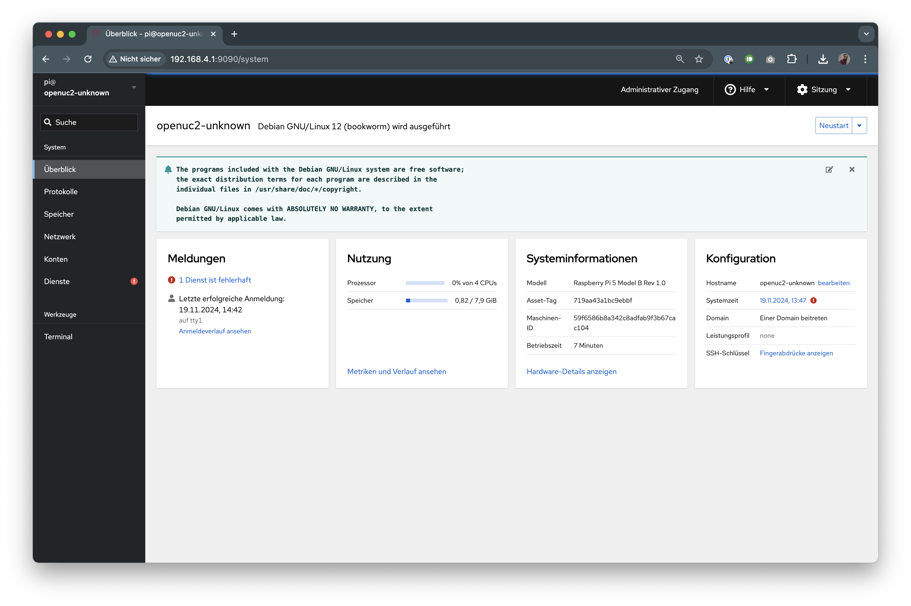

- **Cockpit Login Credentials:**
  - Username: `pi`
  - Password: `youseetoo`

3. Connect to ImSwitch by navigating to `https://192.168.4.1:8001/imswitch/index.html`. Accept the HTTPS warning (the certificate is self-signed for now).

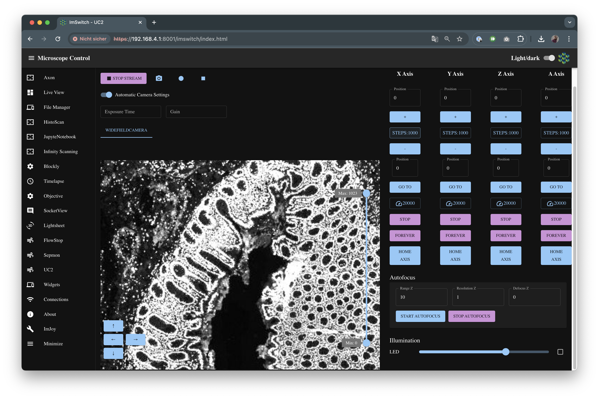

#### Configuring ImSwitch
The default configuration is in **Demo Mode**. For hardware-specific configurations, refer to the [ImSwitch Configuration Guide](https://openuc2.github.io/docs/ImSwitch/ImSwitchOnRaspi#modifying-imswitch-configuration).


##### Configure ImSwitch using the Cockpit

Once you are connected to the Raspberry Pi, you can go to http://192.168.4.1:9090 and move over to the terminal. This is the command line interface that does the same thing as the SSH connection you would otherwise do via e.g. `ssh pi@192.168.4.1` (with `youseetoo`) as a password. Below you will find the commands that are helpful to stop/relaunch docker and add configurations manually:


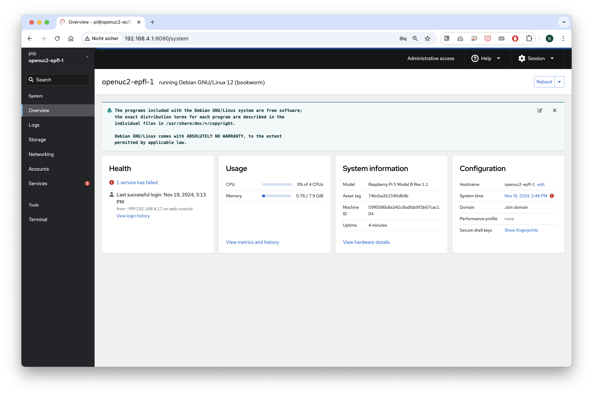

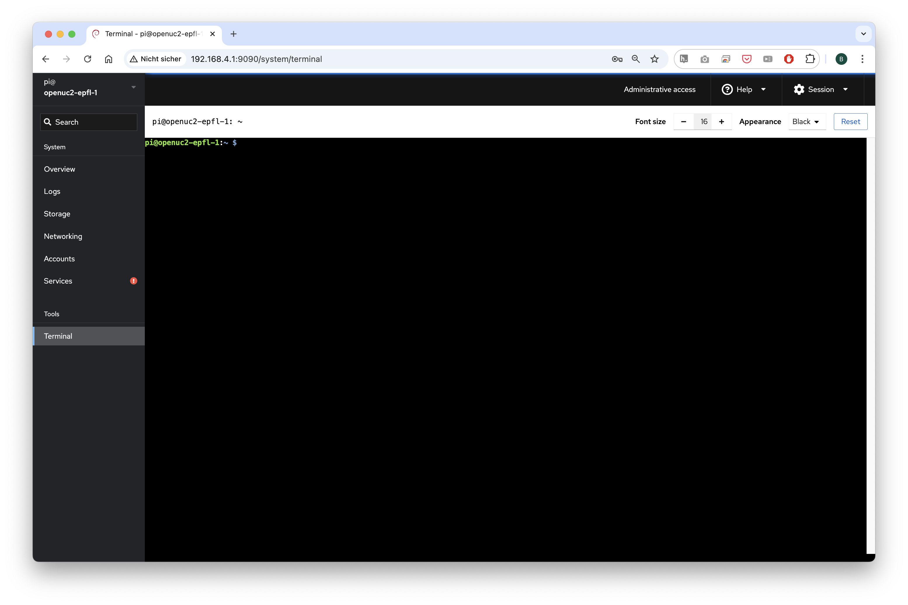

**Stop ImSwitch running in Docker**

```bash
pi@odocker ps # find out the  hash of the currently running docker container
docker stop *HASH* # stop container
```

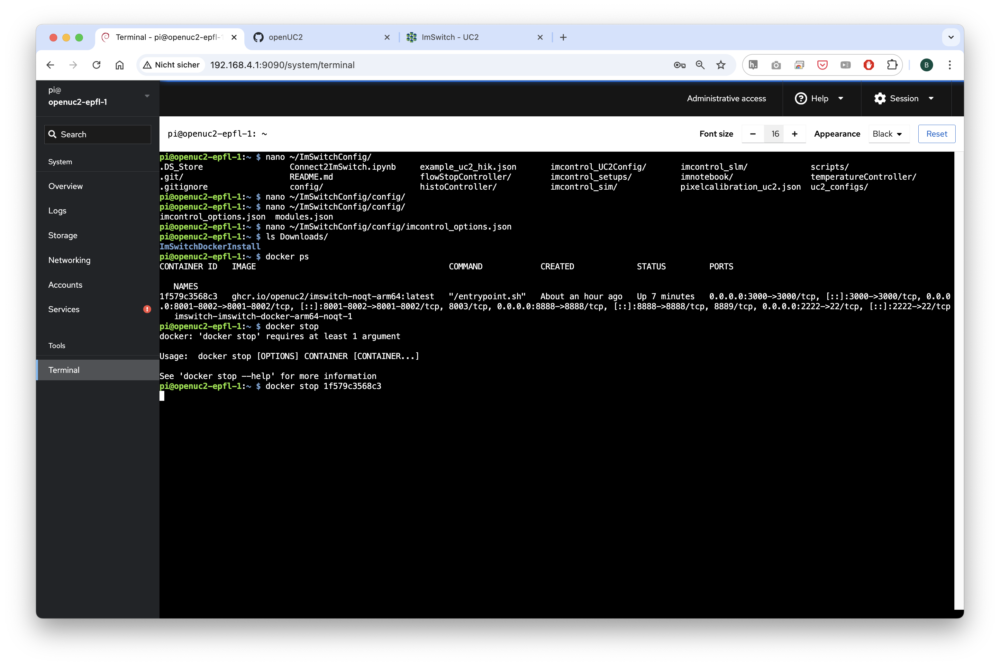

**Update Docker manually**

```bash
pi@openuc2-epfl-1:~ $ ~/Desktop/update_docker_container.sh
```

**Start Docker Container Manually**


```bash
pi@openuc2-epfl-1:~ $ ~/Desktop/launch_docker_container.sh
```

**Get logs back from a started Container**

**Assuming blissful_wecoff** is the name of the docker container `docker ps`
```bash
docker logs -f blissful_wescoff
```

**Get an interactive shell**

```bash
docker exec -it blissful_wescoff /bin/bash
```

**Edit ImSwitch configuration files**

More information can be found here: [ImSwitch Configuration Guide](https://openuc2.github.io/docs/ImSwitch/ImSwitchOnRaspi#modifying-imswitch-configuration).

Edit the file that is pointing to the currently active configuration file:
```bash
pi@openuc2-epfl-nano ImSwitchConfig/imcontrol_setups/epfl_hik.json # => this is the active configuration
```

Edit the configuration file that you would like to use with ImSwitch (e.g. cameras, stages, controllers...)

```bash
nano ImSwitchConfig/config/imcontrol_options.json  # => name for the active configuration
```

Enter content by copy pasting that into the files when using the nano editor (e.g. HIK camera with UC2 electronics):

```json
{
    "positioners": {
        "ESP32Stage": {
          "managerName": "ESP32StageManager",
          "managerProperties": {
            "rs232device": "ESP32",
            "isEnable": false,
            "enableauto": true,
            "stepsizeZ": 0.3125,
            "stepsizeA": 0.3125,
            "initialSpeed": {"X": 15000, "Y":  15000,"Z": 15000, "A": 15000}
          },
          "axes": [
            "A",
            "X",
            "Y",
            "Z"
          ],
          "forPositioning": true
        }
      },
    "rs232devices": {
    "ESP32": {
      "managerName": "ESP32Manager",
      "managerProperties": {
        "host_": "192.168.43.129",
        "serialport": "/dev/cu.SLAB_USBtoUART",
        "baudrate":115200,
        "debug":1
      }
    }
  },
  "lasers": {
    "LED": {
      "analogChannel": null,
      "digitalLine": null,
      "managerName": "ESP32LEDLaserManager",
      "managerProperties": {
        "rs232device": "ESP32",
        "channel_index": 1
      },
      "wavelength": 635,
      "valueRangeMin": 0,
      "valueRangeMax": 1023
    }
  },
  "detectors": {
    "WidefieldCamera": {
        "analogChannel": null,
        "digitalLine": null,
        "managerName": "HikCamManager",
        "managerProperties": {
            "isRGB": 0,
            "cameraListIndex": 0,
            "cameraEffPixelsize": 0.2257,
            "hikcam": {
                "exposure": 0,
                "gain": 0,
                "blacklevel": 100,
                "image_width": 1000,
                "image_height": 1000
            }
        },
        "forAcquisition": true,
        "forFocusLock": true
    }
    },
  "rois": {
    "Full chip": {
      "x": 600,
      "y": 600,
      "w": 1200,
      "h": 1200
    }
  },
  "autofocus": {
    "camera": "WidefieldCamera",
    "positioner": "ESP32Stage",
    "updateFreq": 10,
    "frameCropx": 780,
    "frameCropy": 400,
    "frameCropw": 500,
    "frameCroph": 100
  },
  "availableWidgets": [
    "Settings",
    "View",
    "Recording",
    "Image",
    "Laser",
    "Positioner",
    "UC2Config",
    "FlowStop"
    ],
  "nonAvailableWidgets":[
    "UC2Config",
    "LEDMatrix",
    "Hypha",
    "FlowStop",
    "Hypha",
    "FocusLock",
    "HistoScan",
    "STORMRecon",
    "DPC",
    "ImSwitchServer",
    "PixelCalibration",
    "FocusLock"]
}
```

#### Alternatively edit the config via UC2-Menu

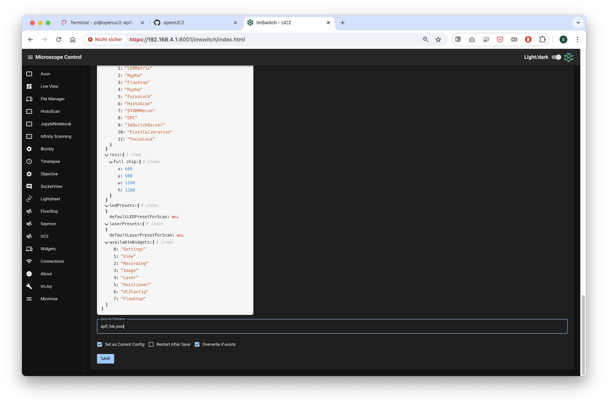

Overwrite and reboot. Wait for some time, eventually reconnect wifi and refresh the page. Done :)

#### Troubleshooting pallet configurations

If you are facing a problem with a wrong docker configuration (i.e. Docker Compose File is not correct), you can do a temporarily fix by editing the Docker compose file at `~/.local/share/forklift/pallet/packages/imswitch/compose.yml`  on the Raspberry Pi, and then run `forklift pallet stage --no-cache-img` and reboot. The location `~/.local/share/forklift/pallet` is in fact the git repo of the https://github.com/openUC2/pallet repo.


#### Enabling Tailscale on ImSwitch OS

The filename of the file containing the tailscale auth token should be tailscale-auth-key. The file will need to exist on the boot partition in a new run subdirectory of the init-root directory.

---

## Summary
- The **manual installation** allows full customization of Raspberry Pi OS and software.
- The **pre-built image** provides a quick and reliable setup, including all necessary drivers.

For additional details, visit: [ImSwitch Documentation](https://openuc2.github.io/docs/ImSwitch/ImSwitchOnRaspi/)

---

## Troubleshooting & Support
- If you encounter issues, check the logs using:
```sh
docker logs $(docker ps -q --filter ancestor=ghcr.io/openuc2/imswitch-noqt-arm64:latest)
```
- Join our community for help: [OpenUC2 GitHub](https://github.com/openUC2/)

Happy experimenting!
