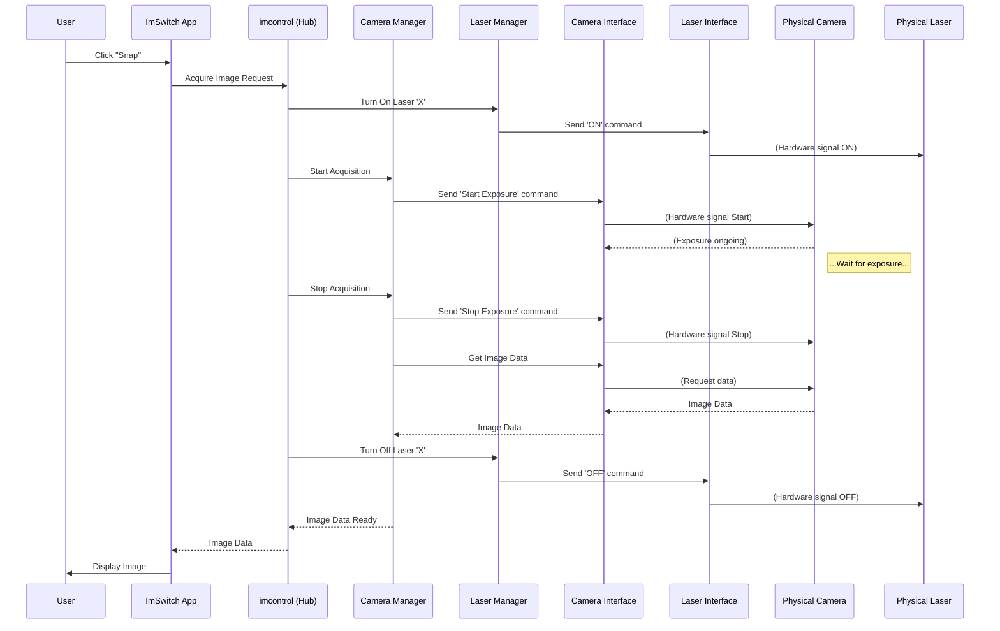

# Chapter 1: Hardware Control Hub (`imcontrol`)

Welcome to the ImSwitch tutorial! We're excited to guide you through the core concepts of this powerful open-source microscopy software.

Imagine you're sitting in front of a complex microscope with lots of different parts: a sensitive camera, multiple lasers of different colors, a motorized stage to move your sample, and maybe some special LEDs. How do you get all these pieces to work together smoothly to capture the exact image or data you need for your research? Trying to control each piece manually would be like trying to fly a plane by individually tweaking every wire!

This is where the **Hardware Control Hub (`imcontrol`)** comes in.

## What Problem Does `imcontrol` Solve?

The main challenge is **coordination**. Microscopes often involve multiple hardware components that need to perform actions in a specific sequence.

**Use Case Example: Taking a Simple Fluorescence Image**

Let's say you want to take a picture of a biological sample stained with a fluorescent dye. You need to:

1.  **Turn on** the correct laser to excite the dye.
2.  **Tell the camera** to start capturing light.
3.  **Wait** for the camera to collect enough light (exposure time).
4.  **Tell the camera** to stop capturing.
5.  **Turn off** the laser.
6.  **Get the image data** from the camera.

Doing this manually for every image is tedious and prone to errors. `imcontrol` acts as the central coordinator, managing all these steps automatically based on your instructions.

## `imcontrol`: The Microscope's Cockpit

Think of `imcontrol` as the **cockpit of an airplane** or the **conductor of an orchestra**.

*   **Airplane Cockpit:** The pilot (ImSwitch software, or you telling the software what to do) uses the controls in the cockpit (`imcontrol`) to manage the engines (lasers), flaps (shutters), navigation systems (motorized stage), and sensors (camera) to successfully fly the plane (run an experiment).
*   **Orchestra Conductor:** The conductor (`imcontrol`) directs different sections of the orchestra (hardware like cameras, lasers, motors) to play their parts at the right time and volume, creating a harmonious piece (your experiment).

In essence, `imcontrol` is the **central command center** for discovering, configuring, controlling, and coordinating all the physical hardware components connected to your microscope.

## Key Ideas Inside `imcontrol`

`imcontrol` isn't just one monolithic block. It's organized logically:

1.  **Device Managers:** Instead of knowing about every single specific camera model, `imcontrol` groups hardware into categories. There's a *manager* for cameras (`detectors`), a manager for lasers (`lasers`), one for motorized stages (`positioners`), one for simple LEDs (`LEDs`), etc. These managers know how to handle the general tasks for their category (e.g., the Camera Manager knows about starting/stopping acquisition, setting exposure time).
    *   You can find the code for these managers in directories like `imswitch/imcontrol/model/managers/detectors/`, `imswitch/imcontrol/model/managers/lasers/`, etc.

2.  **Device Interfaces:** How does the Camera Manager talk to a *specific* camera, like a Hamamatsu Orca Flash 4.0? It uses a specific **Device Interface**. This is like a translator or a specific plug adapter that knows the exact commands and language *that particular model* understands. We'll dive deeper into these in [Chapter 5: Device Interfaces (`imcontrol/model/interfaces`)](05_device_interfaces___imcontrol_model_interfaces___.md).

3.  **The Core Controller:** At the heart of `imcontrol` lies components like `ImConMainController` (from `imswitch/imcontrol/controller/`) which orchestrates the overall activity, receives commands, and delegates tasks to the appropriate managers. Think of this as the main flight computer or the conductor's brain.

## How `imcontrol` Works: Taking That Image

Let's revisit our "Take a Simple Fluorescence Image" example and see how `imcontrol` handles it step-by-step:

1.  **You Click "Snap":** You (or a script) issue a command through the ImSwitch interface (like the [GUI Toolkit (`guitools`)](03_gui_toolkit___guitools___.md)) to acquire an image.
2.  **Command Reaches `imcontrol`:** The main ImSwitch application sends this "acquire" request to `imcontrol`.
3.  **`imcontrol` Delegates:** `imcontrol` understands this involves a laser and a camera. It tells the Laser Manager to turn on the specific laser you selected. It then tells the Camera Manager (the `detectors` manager) to prepare for acquisition.
4.  **Managers Use Interfaces:** The Laser Manager uses the specific [Device Interfaces (`imcontrol/model/interfaces`)](05_device_interfaces___imcontrol_model_interfaces___.md) for your laser model to send the "turn on" command. The Camera Manager uses the camera's specific interface to send the "start exposure" command.
5.  **Hardware Acts:** The physical laser turns on, and the physical camera starts collecting light.
6.  **Waiting:** `imcontrol` (or the Camera Manager) waits for the specified exposure time.
7.  **Stopping:** `imcontrol` tells the Camera Manager to stop the exposure and the Laser Manager to turn off the laser, again using the specific device interfaces.
8.  **Data Transfer:** The Camera Manager, via the interface, retrieves the image data from the camera's internal memory.
9.  **Data Delivered:** `imcontrol` receives the image data and typically passes it along for processing or display, potentially involving the [Image Reconstruction Pipeline (`imreconstruct`)](02_image_reconstruction_pipeline___imreconstruct___.md).

Here's a simplified diagram showing the flow:



## A Glimpse Under the Hood (Conceptual Code)

You usually won't interact with `imcontrol`'s internal code directly when just *using* ImSwitch through its graphical interface. But understanding the structure helps if you want to write scripts or understand how things work.

The main controller often acts as the entry point:

```python
# Conceptual: Getting access to the main controller
# (Actual access might differ depending on context)
from imswitch.imcontrol.controller import ImConMainController

# Imagine 'main_controller' is the running instance of ImConMainController
# main_controller = get_running_imcontrol_instance() # How you get this varies
```

This `main_controller` object holds references to all the device managers. To control a device, you'd typically get its manager first:

```python
# Get the manager for detectors (cameras)
camera_manager = main_controller.get_manager("detectors")

# Get the manager for lasers
laser_manager = main_controller.get_manager("lasers")
```

Then, you can issue commands through the manager:

```python
# Tell the camera manager to start a single acquisition (snap)
# The manager figures out which specific camera interface to use.
camera_manager.snap()

# Tell the laser manager to set the power of a specific laser
# (Assume laser 'LaserA' is configured)
laser_manager.set_power("LaserA", 50) # Set power to 50%
```

The real code involves more details about specific device names, settings, and handling asynchronous operations (since hardware takes time!), but this gives you the basic idea. The core logic resides within the `imswitch/imcontrol/controller/` directory, while the definitions of hardware types and their specific interfaces are primarily within `imswitch/imcontrol/model/`.

## Conclusion

You've now learned about the **Hardware Control Hub (`imcontrol`)**, the essential component in ImSwitch responsible for managing and coordinating all the physical parts of your microscope. It acts like a central cockpit, using specific managers and interfaces to talk to devices like cameras, lasers, and motors, allowing complex experiments to run smoothly.

Understanding `imcontrol` is the first step in mastering ImSwitch. Now that we know how hardware is controlled and data (like images) is acquired, let's move on to see what happens with that data next.

Ready to see how raw images are processed and potentially transformed? Let's dive into the [Chapter 2: Image Reconstruction Pipeline (`imreconstruct`)](02_image_reconstruction_pipeline___imreconstruct___.md).

---

Generated by [AI Codebase Knowledge Builder](https://github.com/The-Pocket/Tutorial-Codebase-Knowledge)