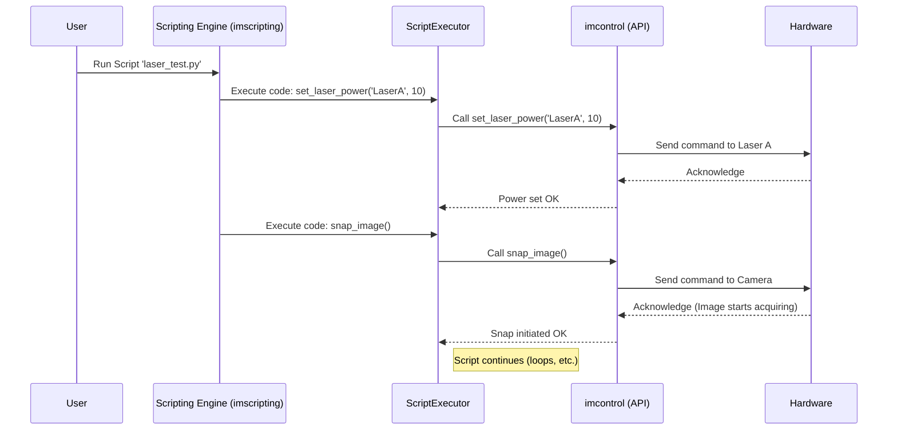

# Chapter 4: Scripting Engine (`imscripting`, `imnotebook`)

In the previous chapter, we learned about the [GUI Toolkit (`guitools`)](03_gui_toolkit___guitools___.md) which provides the buttons, sliders, and windows you use to interact with ImSwitch manually. Clicking buttons is great for simple tasks, but what if you need to do something complex or repeat a sequence of actions many times?

Imagine you want to test how your sample looks under different conditions. Maybe you need to take an image with Laser A at 10% power, then 20%, then 30%, all the way up to 100%. Then maybe repeat the whole process with Laser B! Doing this manually by clicking buttons and adjusting sliders over and over would be very time-consuming and you might even make mistakes.

This is where the **Scripting Engine (`imscripting`, `imnotebook`)** comes to the rescue!

## What Problem Does the Scripting Engine Solve?

The main challenge is **automating complex or repetitive tasks**. Manually controlling the microscope for long experiments or complex sequences is tedious, slow, and prone to human error.

**Use Case Example: Automated Laser Power Test**

Let's stick with our example: taking images of a sample using Laser A at various power levels (10%, 20%, ..., 100%).

1.  **Manual Way:**
    *   Set Laser A power to 10%.
    *   Click "Snap" to take an image.
    *   Wait. Save the image.
    *   Set Laser A power to 20%.
    *   Click "Snap".
    *   Wait. Save the image.
    *   ... repeat 8 more times ... (Ugh!)

2.  **Scripting Way:**
    *   Write a short script (a set of instructions) that tells ImSwitch: "Loop through powers 10% to 100% in steps of 10%. In each step, set Laser A power to the current value, then take a picture."
    *   Run the script.
    *   Go grab a coffee while ImSwitch automatically performs all 10 steps perfectly!

## `imscripting`: Your Experiment Recipe Book

Think of the Scripting Engine like writing a **recipe** or a **playbook**.

*   **Recipe:** Instead of standing in the kitchen and deciding each step as you go (manual control), you write down the entire recipe beforehand: "Preheat oven to 350°F, mix flour and sugar, add eggs..." (`imscripting` lets you write the recipe). Then, the oven and mixer follow your instructions automatically (ImSwitch executes the script).
*   **Playbook (Sports):** Instead of the coach shouting individual instructions during the game (manual control), the team practices specific plays written in a playbook (`imscripting`). When the coach calls "Play #7", everyone knows exactly what sequence of actions to perform automatically (ImSwitch executes the script).

**`imscripting`** is the core part of ImSwitch that lets you write these "recipes" or "plays" using the Python programming language. You write code to tell ImSwitch exactly what sequence of actions to perform.

**`imnotebook`** is a special flavor that integrates this scripting capability directly into **Jupyter Notebooks**. Jupyter notebooks are fantastic tools used by scientists and data analysts because they let you mix code, explanatory text, images, and results all in one document. Using `imnotebook`, you can control your microscope, acquire data, analyze it, and document the whole process interactively within a notebook environment.

In essence, the Scripting Engine provides a way to **programmatically control ImSwitch**, automating experiments and analysis using Python code.

## How Does Scripting Work? A Simple Example

Scripts are just text files containing Python code. Inside the script, you can use special functions provided by ImSwitch to interact with the different parts of the system we've learned about:

*   You can tell the [Hardware Control Hub (`imcontrol`)](01_hardware_control_hub___imcontrol___.md) to turn on lasers, move the stage, or snap images.
*   You can potentially trigger processing in the [Image Reconstruction Pipeline (`imreconstruct`)](02_image_reconstruction_pipeline___imreconstruct___.md).
*   You can perform calculations, save data, or print messages.

Let's write a very simple script to solve our "Automated Laser Power Test" use case:

```python
# A simple ImSwitch script (conceptual example)

# Get access to the hardware controls
imcontrol = get_imcontrol_api()

# Define the laser we want to use
laser_name = "LaserA"

# Loop through power levels from 10 to 100, in steps of 10
for power in range(10, 101, 10):
    print(f"Setting {laser_name} power to {power}%")
    imcontrol.set_laser_power(laser_name, power)

    print(f"Taking image at {power}% power...")
    imcontrol.snap_image() # Tells the camera to take one picture

    # Optional: Add a small pause if needed
    # time.sleep(0.5) # Wait for half a second

print("Automated laser test finished!")
```

**Explanation:**

1.  `imcontrol = get_imcontrol_api()`: This line (conceptually) gives your script access to the functions that control the hardware, like setting laser power or taking pictures.
2.  `laser_name = "LaserA"`: We store the name of the laser we want to control in a variable.
3.  `for power in range(10, 101, 10):`: This is a standard Python loop. It creates a variable `power` that will take the values 10, 20, 30, ..., up to 100.
4.  `print(...)`: This just displays messages on the screen so you can see what the script is doing.
5.  `imcontrol.set_laser_power(laser_name, power)`: This is the key command! It tells the [Hardware Control Hub (`imcontrol`)](01_hardware_control_hub___imcontrol___.md) to find the laser named "LaserA" and set its power to the current value of the `power` variable.
6.  `imcontrol.snap_image()`: This command tells `imcontrol` to trigger the connected camera to take a single picture (a "snap").
7.  The loop repeats for each power level.
8.  `print("Automated laser test finished!")`: A final message when the script is done.

When you run this script within ImSwitch (using `imscripting`), it will automatically execute these steps one by one, precisely controlling the laser and camera for you! If you were using `imnotebook`, you could run this exact code block within a Jupyter cell.

## A Glimpse Under the Hood

How does ImSwitch actually run your script and connect it to the hardware?

**Conceptual Flow:**

1.  **You Write:** You create your Python script (like the example above).
2.  **You Run:** You tell ImSwitch (either through its GUI or a Jupyter notebook) to execute your script.
3.  **Engine Reads:** The Scripting Engine (`imscripting`) reads your Python code.
4.  **Executor Runs:** A component called the `ScriptExecutor` starts running your code line by line.
5.  **API Calls:** When the executor encounters a command like `imcontrol.set_laser_power(...)`, it doesn't execute it directly. Instead, it calls the actual function provided by the [Hardware Control Hub (`imcontrol`)](01_hardware_control_hub___imcontrol___.md).
6.  **`imcontrol` Acts:** `imcontrol` receives the request (e.g., "set LaserA power to 20") and performs the necessary actions, possibly communicating with the specific [Device Interfaces (`imcontrol/model/interfaces`)](05_device_interfaces___imcontrol_model_interfaces___.md) for that laser (as discussed in Chapter 1).
7.  **Hardware Responds:** The physical laser changes its power output.
8.  **Loop Continues:** The `ScriptExecutor` moves to the next line of your script (e.g., `imcontrol.snap_image()`), makes the corresponding call to `imcontrol`, and so on, until the script finishes.

Here's a simplified sequence diagram:



**Code Structure:**

The main components involved are:

*   `imswitch/imscripting/controller/ImScrMainController.py`: This acts as the main coordinator for the scripting functionality, managing scripts and triggering their execution.
*   `imswitch/imscripting/model/ScriptExecutor.py`: This is the core component responsible for actually running the Python script code in a controlled environment.
*   `imswitch/imscripting/model/ScriptStore.py`: Helps manage saved scripts.
*   `imswitch/imscripting/model/actions.py`: This is crucial! It defines the specific functions (like our conceptual `get_imcontrol_api()` or the real underlying functions for `set_laser_power`, `snap_image`, etc.) that are made available ("exposed") to your scripts. It acts as the bridge between your simple script commands and the powerful capabilities of modules like `imcontrol` and `imreconstruct`.

```python
# Conceptual look inside actions.py or similar setup code

# Import the actual controller from imcontrol
from imswitch.imcontrol.controller import ImConMainController

# Get the running instance of the imcontrol controller
# (How this happens depends on the application structure)
imcontrol_controller = get_running_imcontrol_instance()

# Define functions that scripts can call
def script_set_laser_power(name, value):
    print(f"Script action: Setting laser {name} to {value}")
    imcontrol_controller.get_manager("lasers").set_power(name, value)

def script_snap_image():
    print("Script action: Snapping image")
    imcontrol_controller.get_manager("detectors").snap()

# Make these functions available to the ScriptExecutor under friendly names
# The ScriptExecutor would be configured to know that when a script calls
# 'imcontrol.set_laser_power', it should run 'script_set_laser_power'.
actions_scope = {
    "imcontrol": {
        "set_laser_power": script_set_laser_power,
        "snap_image": script_snap_image,
        # ... other functions ...
    }
    # Potentially actions for imreconstruct, file saving, etc.
}
```

This conceptual code shows how functions like `script_set_laser_power` are defined internally. These functions take the simple arguments from your script (`name`, `value`) and then call the more detailed methods within the actual controllers (like `imcontrol_controller.get_manager("lasers").set_power(...)`). The `ScriptExecutor` uses this `actions_scope` mapping to connect the commands in your script to the real ImSwitch functionality.

The `imnotebook` module (`imswitch/imnotebook/`) essentially adapts this scripting engine to work smoothly within the Jupyter environment, often involving setting up a communication channel between the main ImSwitch application and the Jupyter kernel.

## Conclusion

You've now learned about the **Scripting Engine (`imscripting`, `imnotebook`)**, which empowers you to automate complex sequences of actions in ImSwitch. By writing simple Python scripts, you can create recipes or playbooks for your experiments, making them more efficient, reproducible, and less prone to error. We saw how scripts can call functions to control hardware via the [Hardware Control Hub (`imcontrol`)](01_hardware_control_hub___imcontrol___.md) and how `imnotebook` brings this power into the flexible Jupyter environment.

We've mentioned controlling hardware like lasers and cameras quite a bit. But how does ImSwitch know how to talk to *your specific model* of laser or camera?

Let's dive into the details of how ImSwitch communicates with individual hardware pieces in the next chapter: [Chapter 5: Device Interfaces (`imcontrol/model/interfaces`)](05_device_interfaces___imcontrol_model_interfaces___.md).

---

Generated by [AI Codebase Knowledge Builder](https://github.com/The-Pocket/Tutorial-Codebase-Knowledge)