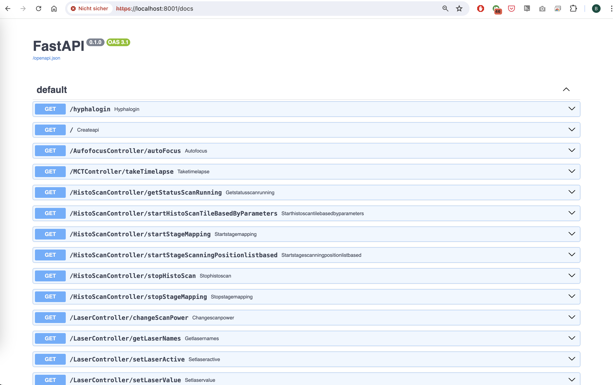
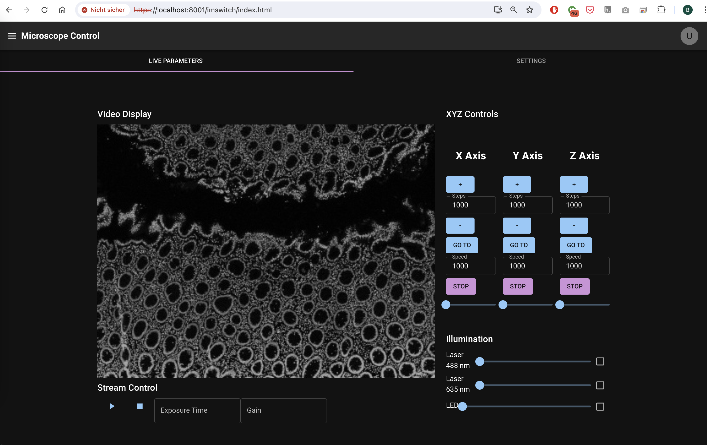
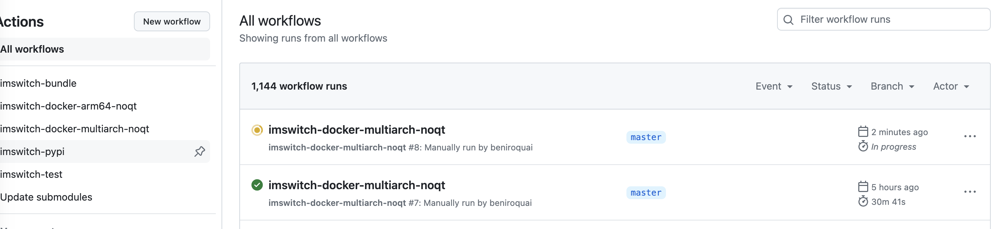
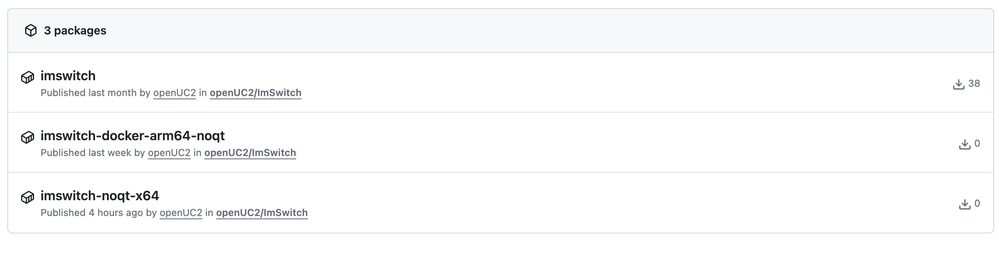

# ImSwitch Docker Installation

Docker installation is the recommended method for most users as it provides a complete, pre-configured environment with all dependencies included.

## Overview

ImSwitch is deployed as a Python application inside a Docker container with:
- **Ubuntu base image** with all required libraries and dependencies
- **UC2-REST library** for ESP32 control and hardware communication
- **FastAPI REST API server** for remote control and automation
- **React web interface** for browser-based microscopy control
- **Napari integration** for advanced image processing and analysis
- **Pre-installed camera drivers** for supported hardware (HIK, Daheng, USB cameras)

### Architecture Diagram


The system architecture includes:
- **Central component**: Python-based microscopy software *ImSwitch*
- **Function**: Connects hardware elements, device drivers, and controllers
- **Application**: Enables time-lapse recordings and complex scanning patterns
- **Abstraction**: Software acts as an independent server with generic interfaces
- **Docker integration**: ImSwitch packaged as a container with cloud-based compilation
- **Easy updates**: Automated script downloads and integrates changes
- **Hardware workflow**: Hardware integrated via JSON configuration files
- **USB integration**: Direct device interaction with Docker container
- **Cross-platform**: Runs on Raspberry Pi, desktop computers, and cloud systems
- **Web-based interface**: Browser access to REST API and control interface
- **Image processing**: Integration with *Napari* and open-source image processing tools

### ImSwitch Docker Features

**What you can expect:**
- **Headless Operation**: NO-QT (no PyQt/Qt dependency) version for server deployments
- **Web Access**: Application exposed on port 8001 with browser-based control
- **API Documentation**: Swagger GUI available at `https://localhost:8001/docs`
- **React Interface**: Full-featured web app at `https://localhost:8001/imswitch/index.html`
- **Configurable Setup**: Customize behavior using environment variables
- **Camera Support**: Pre-built drivers for HIK cameras (tested on ARM devices)
- **Multi-Architecture**: Support for ARM64 and X86 systems

**Screenshots:**


*Swagger UI Interface of the ImSwitch Server*


*The React APP hosted via FastAPI endpoint (**ENSURE YOU HAVE ACCEPTED THE CERTIFICATE**)*


*Images built using CI with [GitHub Actions](https://github.com/openUC2/ImSwitch/blob/master/.github/workflows/imswitch-docker-multiarch-noqt.yaml)*


*Docker Images hosted on [GitHub Container Registry](https://github.com/orgs/openUC2/packages?repo_name=ImSwitch)*

## Quick Start

### Prerequisites
- Docker installed on your system
- At least 4GB RAM and 10GB free disk space

### One-Step Installation (Raspberry Pi/Debian)

For Debian-based systems including Raspberry Pi, use the automated installation script that installs Docker, camera drivers, and pulls the ImSwitch container:

```bash
# Download and run the one-step installer
wget https://raw.githubusercontent.com/openUC2/ImSwitchDockerInstall/master/install_all.sh
chmod +x install_all.sh
sudo ./install_all.sh
```

This installer provides:
- **Docker installation** and configuration
- **Camera drivers** for HIK, Daheng, and USB cameras  
- **ImSwitch container** download and setup
- **System configuration** for optimal performance
- **Automatic startup** configuration

Repository: [openUC2/ImSwitchDockerInstall](https://github.com/openUC2/ImSwitchDockerInstall)

### Manual Installation

#### Step 1: Pull the Docker Image

```bash
# For ARM64 and X86 systems
sudo docker pull ghcr.io/openuc2/imswitch-noqt-amd64:latest
```

#### Step 2: Run ImSwitch Container

**Basic setup:**
```bash
sudo docker run -it --rm -p 8001:8001 -p 2222:22 \
  -e HEADLESS=1 \
  -e HTTP_PORT=8001 \
  -e CONFIG_FILE=example_uc2_hik_flowstop.json \
  --privileged \
  ghcr.io/openuc2/imswitch-noqt-amd64:latest
```

**Advanced setup with persistent data:**
```bash
sudo docker run -it --rm -p 8001:8001 -p 2222:22 \
  -e UPDATE_INSTALL_GIT=1 \
  -e PIP_PACKAGES="arkitekt UC2-REST" \
  -e DATA_PATH=/dataset \
  -e CONFIG_PATH=/config \
  -v ~/Documents/imswitch_docker/imswitch_git:/tmp/ImSwitch-changes \
  -v ~/Documents/imswitch_docker/imswitch_pip:/persistent_pip_packages \
  -v ~/Downloads:/config \
  --privileged \
  ghcr.io/openuc2/imswitch-noqt-x64:latest
```

## Environment Variables

| Variable | Description | Default |
|----------|-------------|---------|
| `HEADLESS` | Run without GUI | `1` |
| `HTTP_PORT` | Web interface port | `8001` |
| `CONFIG_FILE` | ImSwitch configuration file | `example_uc2_hik_flowstop.json` |
| `UPDATE_INSTALL_GIT` | Update ImSwitch from Git | `0` |
| `UPDATE_GIT` | Update repositories | `0` |
| `UPDATE_CONFIG` | Update configuration | `0` |
| `PIP_PACKAGES` | Additional packages to install | `""` |
| `DATA_PATH` | Data storage path | `/dataset` |
| `CONFIG_PATH` | Configuration path | `/config` |

## Volume Mounts

| Host Path | Container Path | Purpose |
|-----------|----------------|---------|
| `~/Documents/imswitch_docker/imswitch_git` | `/tmp/ImSwitch-changes` | Persist ImSwitch repository changes |
| `~/Documents/imswitch_docker/imswitch_pip` | `/persistent_pip_packages` | Persist installed pip packages |
| `~/Downloads` | `/config` | Configuration files |
| `~/Data` | `/dataset` | Data storage |

## Access Methods

### Web Interface
- **React App**: `http://localhost:8001/imswitch/index.html`
- **REST API**: `http://localhost:8001/docs` (Swagger UI)

### SSH Access
- **Port**: 2222
- **Default credentials**: Check container documentation

## Features

### Core Capabilities
- **No-Qt Installation**: Headless operation without PyQt dependencies
- **Cross-Platform**: Runs on Windows, macOS, Linux, Raspberry Pi
- **Hardware Integration**: USB device support with `--privileged` flag
- **Real-time Control**: FastAPI-based REST API for remote control
- **Image Processing**: Integrated Napari for advanced image analysis

### Hardware Support
- **Cameras**: HIK, Daheng, OpenCV, Raspberry Pi cameras
- **Motors**: UC2-ESP32 controlled stages and focus systems
- **Illumination**: LED arrays, lasers via UC2-ESP32
- **USB Devices**: Full USB support with proper container configuration

## Troubleshooting

### Common Issues

**Container won't start:**
```bash
# Check Docker is running
sudo systemctl status docker

# Check available ports
sudo netstat -tlnp | grep 8001
```

**Camera not detected:**
```bash
# Run with device access
sudo docker run --device=/dev/video0 [other options]

# Or use privileged mode (recommended)
sudo docker run --privileged [other options]

# check if camera is actually connected 
lsusb
```


**Permission denied errors:**
```bash
# Add user to docker group
sudo usermod -aG docker $USER
# Logout and login again
```

### Container Logs
```bash
# View container logs (retreive container id with docker ps)
sudo docker logs [container_id]

# Follow logs in real-time
sudo docker logs -f [container_id]
```

## Advanced Configuration

### Custom Configuration Files
Place your ImSwitch configuration files in the mounted config directory:
```bash
# Host: ~/Downloads/my_config.json
# Container: /config/my_config.json
-e CONFIG_FILE=my_config.json
```

### Development Mode
For development with live code changes:
```bash
sudo docker run -it --rm -p 8001:8001 \
  -e UPDATE_INSTALL_GIT=1 \
  -e PIP_PACKAGES="your-dev-packages" \
  -v $(pwd)/ImSwitch:/tmp/ImSwitch-changes \
  --privileged \
  ghcr.io/openuc2/imswitch-noqt-x64:latest
```

## Next Steps

After installation:
1. **[Configure your hardware](../03_Configuration/README.md)** - Set up cameras, stages, and other devices
2. **[Basic usage tutorial](../02_Usage/README.md)** - Learn ImSwitch fundamentals
3. **[UC2-REST setup](../02_Usage/UC2-REST.md)** - Configure ESP32 communication

## Related Links

- [ImSwitch Repository](https://github.com/openUC2/ImSwitch)
- [Docker Installation Scripts](https://github.com/openUC2/ImSwitchDockerInstall)
- [GitHub Container Registry](https://github.com/orgs/openUC2/packages?repo_name=ImSwitch)
- [Dockerfile Source](https://github.com/openUC2/ImSwitch/blob/master/docker/HIK/dockerfile)