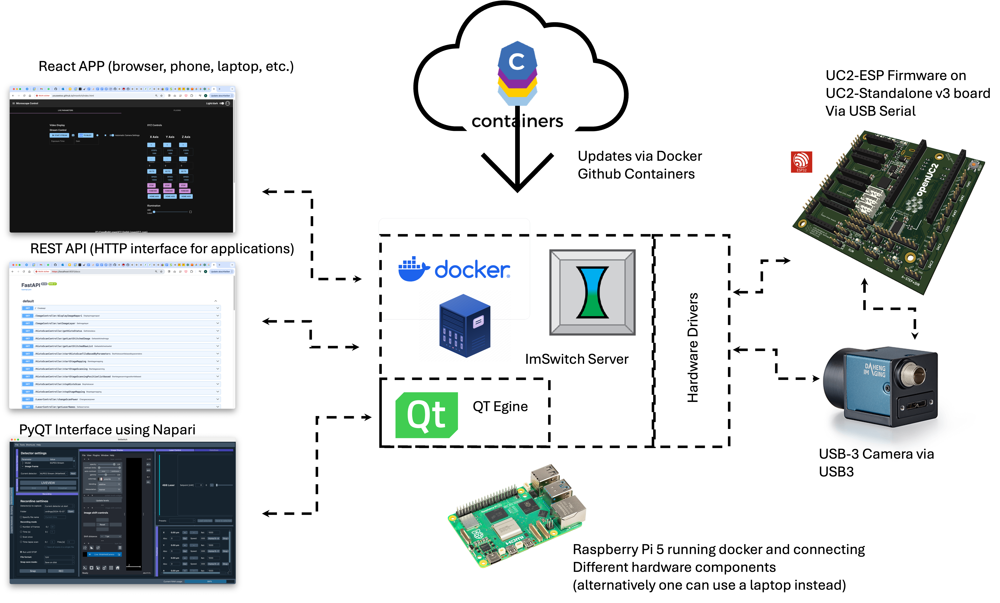

# ImSwitch Docker Installation

Docker installation is the recommended method for most users as it provides a complete, pre-configured environment with all dependencies included.


TODO: Merge with all docker-related ttutorials 

## Overview

ImSwitch runs as a Python application inside a Docker container with:
- Ubuntu base image with all required libraries
- UC2-REST library for ESP32 control
- FastAPI REST API server for remote control
- React web interface for browser-based control
- Napari integration for image processing
- All necessary camera drivers inside the docker image



## Quick Start

### Prerequisites
- Docker installed on your system
- At least 4GB RAM and 10GB free disk space

### One-Step Installation (Raspberry Pi/Debian)

For Debian-based systems, use the automated installation script:

```bash
# Clone the installation repository
git clone https://github.com/openUC2/ImSwitchDockerInstall
cd ImSwitchDockerInstall

# Run the installation script (installs Docker, drivers, docker and ImSwitch docker container)
chmod +x install_all.sh
sudo ./install_all.sh
```

This script installs:
- Docker and required drivers
- Camera drivers (HIK and others)
- ImSwitch Docker container
- All necessary dependencies

### Manual Installation

#### Step 1: Pull the Docker Image

```bash
# For ARM64 and X86 systems
sudo docker pull ghcr.io/openuc2/imswitch-noqt-amd64:latest
```

#### Step 2: Run ImSwitch Container

**Basic setup:**
```bash
sudo docker run -it --rm -p 8001:8001 -p 2222:22 \
  -e HEADLESS=1 \
  -e HTTP_PORT=8001 \
  -e CONFIG_FILE=example_uc2_hik_flowstop.json \
  --privileged \
  ghcr.io/openuc2/imswitch-noqt-amd64:latest
```

**Advanced setup with persistent data:**
```bash
sudo docker run -it --rm -p 8001:8001 -p 2222:22 \
  -e UPDATE_INSTALL_GIT=1 \
  -e PIP_PACKAGES="arkitekt UC2-REST" \
  -e DATA_PATH=/dataset \
  -e CONFIG_PATH=/config \
  -v ~/Documents/imswitch_docker/imswitch_git:/tmp/ImSwitch-changes \
  -v ~/Documents/imswitch_docker/imswitch_pip:/persistent_pip_packages \
  -v ~/Downloads:/config \
  --privileged \
  ghcr.io/openuc2/imswitch-noqt-x64:latest
```

## Environment Variables

| Variable | Description | Default |
|----------|-------------|---------|
| `HEADLESS` | Run without GUI | `1` |
| `HTTP_PORT` | Web interface port | `8001` |
| `CONFIG_FILE` | ImSwitch configuration file | `example_uc2_hik_flowstop.json` |
| `UPDATE_INSTALL_GIT` | Update ImSwitch from Git | `0` |
| `UPDATE_GIT` | Update repositories | `0` |
| `UPDATE_CONFIG` | Update configuration | `0` |
| `PIP_PACKAGES` | Additional packages to install | `""` |
| `DATA_PATH` | Data storage path | `/dataset` |
| `CONFIG_PATH` | Configuration path | `/config` |

## Volume Mounts

| Host Path | Container Path | Purpose |
|-----------|----------------|---------|
| `~/Documents/imswitch_docker/imswitch_git` | `/tmp/ImSwitch-changes` | Persist ImSwitch repository changes |
| `~/Documents/imswitch_docker/imswitch_pip` | `/persistent_pip_packages` | Persist installed pip packages |
| `~/Downloads` | `/config` | Configuration files |
| `~/Data` | `/dataset` | Data storage |

## Access Methods

### Web Interface
- **React App**: `http://localhost:8001/imswitch/index.html`
- **REST API**: `http://localhost:8001/docs` (Swagger UI)

### SSH Access
- **Port**: 2222
- **Default credentials**: Check container documentation

## Features

### Core Capabilities
- **No-Qt Installation**: Headless operation without PyQt dependencies
- **Cross-Platform**: Runs on Windows, macOS, Linux, Raspberry Pi
- **Hardware Integration**: USB device support with `--privileged` flag
- **Real-time Control**: FastAPI-based REST API for remote control
- **Image Processing**: Integrated Napari for advanced image analysis

### Hardware Support
- **Cameras**: HIK, Daheng, OpenCV, Raspberry Pi cameras
- **Motors**: UC2-ESP32 controlled stages and focus systems
- **Illumination**: LED arrays, lasers via UC2-ESP32
- **USB Devices**: Full USB support with proper container configuration

## Troubleshooting

### Common Issues

**Container won't start:**
```bash
# Check Docker is running
sudo systemctl status docker

# Check available ports
sudo netstat -tlnp | grep 8001
```

**Camera not detected:**
```bash
# Run with device access
sudo docker run --device=/dev/video0 [other options]

# Or use privileged mode (recommended)
sudo docker run --privileged [other options]

# check if camera is actually connected 
lsusb
```


**Permission denied errors:**
```bash
# Add user to docker group
sudo usermod -aG docker $USER
# Logout and login again
```

### Container Logs
```bash
# View container logs (retreive container id with docker ps)
sudo docker logs [container_id]

# Follow logs in real-time
sudo docker logs -f [container_id]
```

## Advanced Configuration

### Custom Configuration Files
Place your ImSwitch configuration files in the mounted config directory:
```bash
# Host: ~/Downloads/my_config.json
# Container: /config/my_config.json
-e CONFIG_FILE=my_config.json
```

### Development Mode
For development with live code changes:
```bash
sudo docker run -it --rm -p 8001:8001 \
  -e UPDATE_INSTALL_GIT=1 \
  -e PIP_PACKAGES="your-dev-packages" \
  -v $(pwd)/ImSwitch:/tmp/ImSwitch-changes \
  --privileged \
  ghcr.io/openuc2/imswitch-noqt-x64:latest
```

## Next Steps

After installation:
1. **[Configure your hardware](../03_Configuration/README.md)** - Set up cameras, stages, and other devices
2. **[Basic usage tutorial](../02_Usage/README.md)** - Learn ImSwitch fundamentals
3. **[UC2-REST setup](../02_Usage/UC2-REST.md)** - Configure ESP32 communication

## Related Links

- [ImSwitch Repository](https://github.com/openUC2/ImSwitch)
- [Docker Installation Scripts](https://github.com/openUC2/ImSwitchDockerInstall)
- [GitHub Container Registry](https://github.com/orgs/openUC2/packages?repo_name=ImSwitch)
- [Dockerfile Source](https://github.com/openUC2/ImSwitch/blob/master/docker/HIK/dockerfile)