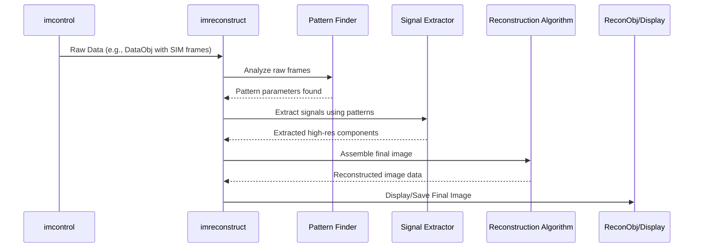

# Chapter 2: Image Reconstruction Pipeline (`imreconstruct`)

In [Chapter 1: Hardware Control Hub (`imcontrol`)](01_hardware_control_hub___imcontrol___.md), we learned how ImSwitch controls the microscope's hardware, like cameras and lasers, to acquire raw data. But often, the data captured directly by the camera isn't the final picture you want to see or analyze. It might be noisy, contain hidden patterns, or need special processing to reveal the interesting details.

This is where the **Image Reconstruction Pipeline (`imreconstruct`)** steps in.

## What Problem Does `imreconstruct` Solve?

Imagine you're developing film in a traditional photography darkroom. You start with an exposed film negative (the raw data) – it holds the information, but it's not yet a viewable photograph. You need to put it through a series of chemical baths and processes (like developing, stopping, fixing) to turn that latent image into a final print.

Similarly, `imreconstruct` takes the **raw data** acquired by the detectors (cameras) during an experiment and **processes it** to create the final, viewable image. This processing can involve various steps depending on the type of microscopy technique used.

**Use Case Example: Structured Illumination Microscopy (SIM)**

Some advanced microscopy techniques, like SIM, don't just take a single snapshot. Instead, they illuminate the sample with patterns of light (like stripes) and take multiple raw images.

*   **Raw Data:** You get a series of images, each showing the sample under a slightly different striped illumination pattern. Individually, these images might look strange or blurry.
*   **`imreconstruct` Job:** The pipeline needs to:
    1.  **Find the patterns:** Accurately determine the position and orientation of the stripes in each raw image.
    2.  **Extract signals:** Use the information from the patterns to pull out hidden high-resolution details from the raw images.
    3.  **Assemble:** Combine the extracted information mathematically to build a final image that has much higher resolution (is much sharper) than any single raw image.

Without `imreconstruct`, the raw SIM data wouldn't reveal the super-resolution details it contains.

## `imreconstruct`: The Digital Darkroom

Think of `imreconstruct` as ImSwitch's **digital darkroom** or an **image processing factory**.

*   **Digital Darkroom:** Raw data goes in, and through a series of "digital developing" steps, a refined, final image comes out.
*   **Processing Factory:** Raw materials (raw data frames) enter the factory (`imreconstruct`). They move along an assembly line where different machines perform specific tasks (pattern finding, signal extraction, mathematical combination). The finished product (the reconstructed image) emerges at the end.

In essence, `imreconstruct` is responsible for **transforming raw detector data into meaningful images** using specialized algorithms tailored to the specific microscopy experiment.

## Key Ideas Inside `imreconstruct`

The reconstruction process often involves several conceptual steps, which might be implemented by different software components within `imreconstruct`:

1.  **Input Data (`DataObj`):** The pipeline starts with the raw data, often packaged in a specific format. In ImSwitch, this is typically handled by [Data Objects (`imreconstruct/model`)](06_data_objects___imreconstruct_model___.md), which act as containers for the image frames and associated metadata (like settings used during acquisition).
2.  **Pattern Finding (`PatternFinder`):** For techniques like SIM, the first step is often to precisely locate the illumination patterns used. Specialized algorithms analyze the raw images to find these patterns. The `imswitch/imreconstruct/model/PatternFinder.py` might contain code related to this.
3.  **Signal Extraction (`SignalExtractor`):** Once patterns are known (if applicable), or based on other properties of the data, algorithms extract the relevant information needed for the final image. This might involve complex mathematical operations like Fourier transforms. See `imswitch/imreconstruct/model/SignalExtractor.py`.
4.  **Reconstruction (`ReconObj`):** The extracted signals are computationally combined or processed to generate the final image. The specific method depends heavily on the microscopy technique (e.g., SIM reconstruction, deconvolution for confocal images, or even just simple averaging or background subtraction). The result is often stored in a reconstruction object, potentially represented by `imswitch/imreconstruct/model/ReconObj.py`, which holds the final image data.

## How `imreconstruct` Works: Processing SIM Data

Let's revisit our SIM example:

1.  **Raw Data Arrives:** [Chapter 1: Hardware Control Hub (`imcontrol`)](01_hardware_control_hub___imcontrol___.md) finishes acquiring the series of raw images with striped patterns and passes this data (perhaps packaged in a `DataObj`) to `imreconstruct`.
2.  **`imreconstruct` Takes Over:** The main controller within `imreconstruct` receives the data and knows (based on the experiment settings) that SIM reconstruction is needed.
3.  **Pattern Finding:** It uses a `PatternFinder` component to analyze the raw frames and determine the exact parameters of the stripe patterns in each.
4.  **Signal Extraction:** Using the pattern information, a `SignalExtractor` component processes the raw data, often in frequency space (Fourier domain), to isolate the high-resolution signal components.
5.  **Assembly:** These components are mathematically combined according to the SIM algorithm's rules to produce the final super-resolution image.
6.  **Output:** The resulting image data is packaged (perhaps in a `ReconObj`) and made available for display or saving. This final image might be shown using the [GUI Toolkit (`guitools`)](03_gui_toolkit___guitools___.md).

Here's a simplified diagram showing the flow:



## A Glimpse Under the Hood (Conceptual Code)

Directly using `imreconstruct` from code often involves triggering a reconstruction process, perhaps after acquiring data or loading it from a file. The central coordinator is `ImRecMainController`.

```python
# Conceptual: Getting access to the reconstruction controller
# (Actual access depends on context, e.g., within ImSwitch GUI or scripting)
from imswitch.imreconstruct.controller import ImRecMainController

# Imagine 'recon_controller' is the running instance
# recon_controller = get_running_imreconstruct_instance() # How you get this varies

# Let's assume 'raw_data_object' is a DataObj containing raw SIM frames
# raw_data_object = load_raw_data("my_sim_experiment.ims") # Fictional loading

# Tell the controller to start reconstruction using a specific algorithm
# The controller manages the steps internally (pattern finding, etc.)
recon_controller.start_reconstruction(data=raw_data_object, algorithm="SIM")

# What happens?
# - recon_controller finds the 'SIM' algorithm implementation.
# - It likely uses PatternFinder, SignalExtractor, etc. internally.
# - It produces a final ReconObj.
# - It might automatically trigger display update via guitools.
```

This `recon_controller` (likely `imswitch/imreconstruct/controller/ImRecMainController.py`) manages the different reconstruction algorithms and data flow. The actual algorithms and data structures reside within `imswitch/imreconstruct/model/` (like `PatternFinder.py`, `SignalExtractor.py`, `DataObj.py`, `ReconObj.py`) and potentially algorithm-specific modules.

The specific implementation of a reconstruction algorithm might look something like this (highly simplified):

```python
# Conceptual structure within a hypothetical SIM reconstruction algorithm

from imswitch.imreconstruct.model import PatternFinder, SignalExtractor

def reconstruct_sim(raw_data_object):
    # Step 1: Find patterns
    pattern_finder = PatternFinder(method="some_method")
    patterns = pattern_finder.find(raw_data_object.get_frames())

    # Step 2: Extract signals
    signal_extractor = SignalExtractor(patterns=patterns)
    extracted_components = signal_extractor.extract(raw_data_object.get_frames())

    # Step 3: Assemble final image (complex math omitted)
    final_image_data = assemble_sim_image(extracted_components, patterns)

    # Step 4: Create the result object (e.g., ReconObj)
    # result = ReconObj(data=final_image_data, source=raw_data_object)
    # return result
    pass # Placeholder for actual implementation
```

This shows how the different conceptual parts (`PatternFinder`, `SignalExtractor`) might be used within a specific reconstruction process orchestrated by `imreconstruct`.

## Conclusion

You've now explored the **Image Reconstruction Pipeline (`imreconstruct`)**, ImSwitch's digital darkroom. You learned that it takes raw data from the hardware (delivered by `imcontrol`) and applies processing steps like pattern finding and signal extraction to generate the final, often enhanced, image. This is crucial for advanced microscopy techniques like SIM.

We've seen how hardware is controlled (`imcontrol`) and how raw data is processed into final images (`imreconstruct`). But how do you *see* these images and interact with the whole system?

Let's move on to the user interface: [Chapter 3: GUI Toolkit (`guitools`)](03_gui_toolkit___guitools___.md).

---

Generated by [AI Codebase Knowledge Builder](https://github.com/The-Pocket/Tutorial-Codebase-Knowledge)