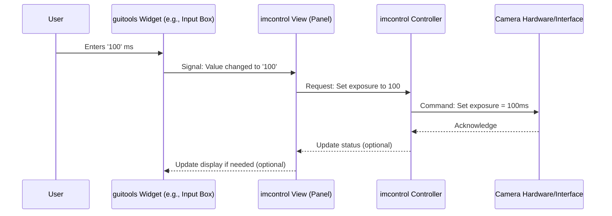

# Chapter 3: GUI Toolkit (`guitools`)

In the previous chapters, we explored how ImSwitch controls hardware with the [Hardware Control Hub (`imcontrol`)](01_hardware_control_hub___imcontrol___.md) and processes data using the [Image Reconstruction Pipeline (`imreconstruct`)](02_image_reconstruction_pipeline___imreconstruct___.md). But how do *you*, the user, actually interact with these systems? How do you tell the camera to start, see the resulting image, or adjust settings? You do this through the Graphical User Interface (GUI), and the consistency of this interface is thanks to the **GUI Toolkit (`guitools`)**.

## What Problem Does `guitools` Solve?

Imagine building a house. You need doors, windows, light switches, and cupboards in many different rooms – the kitchen, the bedrooms, the living room. It would be very strange and inefficient if the door knobs in the kitchen looked and worked completely differently from the ones in the bedroom, or if every window had a unique opening mechanism. You'd want a standard set of parts that look similar and function predictably throughout the house.

Building a software application like ImSwitch is similar. Different parts of the software (like `imcontrol` for hardware, `imreconstruct` for image processing, and later we'll see `imscripting` for coding) all need graphical elements like buttons, sliders, text boxes, and areas to display images.

`guitools` solves the problem of **consistency and reusability** for the user interface. It provides a standard "toolbox" filled with pre-made graphical components (widgets) that the developers can easily use across all the different modules of ImSwitch.

**Use Case Example: Setting Exposure Time**

You need to tell the camera how long to collect light for (the exposure time). This setting might appear in a few places:

1.  In the main camera control panel within `imcontrol`.
2.  Perhaps in a simplified "quick settings" panel.
3.  Maybe even within a specific experimental protocol setup in `imscripting`.

Without `guitools`, developers might create slightly different input boxes or sliders for the exposure time in each location. This could be confusing for the user ("Does this slider work the same way as the other one?"). `guitools` ensures that the *same* kind of input box or slider, with the same look and feel, is used everywhere you need to set the exposure time.

## `guitools`: The Standard Parts Toolbox

Think of `guitools` exactly like that standard toolbox for building a house:

*   **The Tools:** Inside the `guitools` toolbox are standard components: buttons, sliders, checkboxes, dropdown menus, text input fields, image display areas, etc. These are often called **widgets**.
*   **The Builders:** The developers working on different parts of ImSwitch (`imcontrol`, `imreconstruct`, `imscripting`) are the builders.
*   **The Rooms:** The different modules or sections of the ImSwitch application are like the rooms in the house.
*   **The Result:** When the builders use the standard tools from the `guitools` toolbox, all the rooms (modules) end up with consistent-looking and functioning components (buttons, sliders). This makes the entire house (ImSwitch application) feel cohesive and easier to navigate for the person living in it (you!).

Essentially, `guitools` is a **shared library of reusable graphical elements** that ensures a **consistent user experience** across the entire ImSwitch application.

## Key Ideas Inside `guitools`

1.  **Widgets:** These are the fundamental building blocks of the GUI. Examples include:
    *   `QPushButton`: A clickable button.
    *   `QSlider`: A slider to select a value within a range.
    *   `QLineEdit`: A box for typing text.
    *   `QComboBox`: A dropdown menu to select from a list.
    *   `QLabel`: Text labels to describe other widgets.
    *   Specialized ImSwitch widgets: `guitools` might also contain custom widgets built specifically for microscopy tasks, like displaying crosshairs on an image or showing laser status.

2.  **Layouts:** Widgets aren't just thrown onto the screen randomly. Layouts arrange them neatly. Common layouts include arranging widgets vertically (`QVBoxLayout`), horizontally (`QHBoxLayout`), or in a grid (`QGridLayout`). `guitools` helps manage these arrangements.

3.  **Consistency:** Because all modules use the same set of basic widgets from `guitools`, they look and feel the same. A button in the camera controls behaves just like a button in the image processing panel.

4.  **Reusability:** Developers don't need to write the code for a basic button or slider every time they need one. They can simply grab the pre-built one from the `guitools` toolbox, saving time and reducing errors.

## How `guitools` Works: Setting That Exposure Time

Let's trace our "Set Exposure Time" use case:

1.  **You See the Control:** You look at the camera control panel (part of the `imcontrol` view). You see a label "Exposure Time (ms):" next to a text box or a slider. This visual element (the label, the box/slider) was created using components from `guitools`.
2.  **You Interact:** You type `100` into the text box or drag the slider to the desired value. This interaction is captured by the specific `guitools` widget.
3.  **Widget Signals:** The widget (e.g., the text box) detects that its value has changed. It sends out a "signal" – basically, it shouts, "Hey, my value changed to 100!"
4.  **Module Responds:** The part of `imcontrol` responsible for managing the camera settings is "listening" for this signal. When it hears the signal from the exposure time widget, it takes action.
5.  **Action Taken:** `imcontrol` receives the new value (`100`) and uses it to update the camera's actual exposure time setting, potentially by communicating with the camera's [Device Interfaces (`imcontrol/model/interfaces`)](05_device_interfaces___imcontrol_model_interfaces___.md) as we saw in Chapter 1.

Here's a simplified diagram:



## A Glimpse Under the Hood

You typically don't interact with `guitools` code directly as a user. However, understanding its structure helps see how ImSwitch is built.

`guitools` isn't built from scratch; it uses an underlying GUI framework. ImSwitch primarily uses **Qt** (via libraries like **PyQt** or **PySide2**), which is a very popular and powerful framework for building graphical interfaces in Python and other languages. `guitools` essentially provides a standardized way for different ImSwitch modules to access and use these Qt components, sometimes with custom additions.

The core, truly shared widgets likely live in a common place, like `imswitch/imcommon/view/guitools/`.

```python
# Conceptual: Location of common GUI tools
# imswitch/imcommon/view/guitools/ contains widgets usable by ANY module.
# For example, maybe a custom button or slider definition.
```

Then, each module that needs a GUI (`imcontrol`, `imreconstruct`, `imscripting`) imports these common tools. You can see this in the `__init__.py` files provided earlier:

```python
# File: imswitch/imcontrol/view/guitools/__init__.py
# This line imports ALL common tools from the central location
from imswitch.imcommon.view.guitools import *  # noqa

# It might also define things specific to imcontrol's GUI needs
from .ViewSetupInfo import ROIInfo, LaserPresetInfo, ViewSetupInfo, LEDPresetInfo
```

This code snippet shows that the `guitools` within `imcontrol` starts by grabbing everything from the common `guitools` (`imcommon.view.guitools`) and then might add some specific view-related information structures (`ViewSetupInfo`) relevant only to controlling hardware. The same pattern applies to `imreconstruct` and `imscripting`.

**How a Developer Might Use `guitools` (Conceptual):**

Imagine a developer is building the camera control panel within `imcontrol`. They need a button to trigger the "Snap" action.

```python
# Conceptual code within imcontrol's view setup

# 1. Import necessary widgets from the common guitools
# (This might happen implicitly via the __init__.py import)
from imswitch.imcommon.view.guitools import QPushButton, QVBoxLayout, QWidget

# 2. Import the controller that knows *what* to do when snap is clicked
from imswitch.imcontrol.controller import ImConMainController

class CameraControlPanel(QWidget): # Create a panel widget
    def __init__(self, controller: ImConMainController):
        super().__init__()
        self.controller = controller

        # 3. Create a layout to arrange widgets vertically
        layout = QVBoxLayout()

        # 4. Create a button using the standard QPushButton from guitools
        self.snap_button = QPushButton("Snap Image")

        # 5. Connect the button's click signal to a function
        #    This function will likely call the controller
        self.snap_button.clicked.connect(self.on_snap_clicked)

        # 6. Add the button to the layout
        layout.addWidget(self.snap_button)
        # ... add other widgets like exposure slider ...

        # 7. Set the layout for this panel
        self.setLayout(layout)

    def on_snap_clicked(self):
        # 8. Tell the imcontrol controller to perform the snap action
        print("Snap button clicked! Telling controller...")
        # self.controller.snap_action() # Actual call to controller logic
        pass # Placeholder

# Somewhere else, this panel would be created and shown
# main_controller = get_running_imcontrol_instance()
# camera_panel = CameraControlPanel(main_controller)
# camera_panel.show()
```

This simplified example shows the key steps:
1.  Import standard widgets (`QPushButton`, `QVBoxLayout`) provided via `guitools`.
2.  Create instances of these widgets.
3.  Arrange them using layouts.
4.  Connect widget signals (like `clicked`) to functions that trigger actions in the relevant controller (like `ImConMainController` from [Chapter 1: Hardware Control Hub (`imcontrol`)](01_hardware_control_hub___imcontrol___.md)).

By reusing `QPushButton` everywhere, the "Snap Image" button will look and feel like other buttons throughout ImSwitch.

## Conclusion

You've now learned about the **GUI Toolkit (`guitools`)**, the essential component that provides the standard building blocks (widgets, layouts) for ImSwitch's user interface. It ensures that interacting with different parts of the software, like `imcontrol` and `imreconstruct`, feels consistent and intuitive, much like using standard door knobs and light switches throughout a well-built house. `guitools` promotes reusability for developers and provides a polished experience for you, the user.

So far, we've seen how to control hardware (`imcontrol`), process images (`imreconstruct`), and interact with the system through the GUI (`guitools`). But what if you want to automate complex experiments or perform custom analysis?

Let's explore how you can programmatically control ImSwitch in the next chapter: [Chapter 4: Scripting Engine (`imscripting`, `imnotebook`)](04_scripting_engine___imscripting____imnotebook___.md).

---

Generated by [AI Codebase Knowledge Builder](https://github.com/The-Pocket/Tutorial-Codebase-Knowledge)