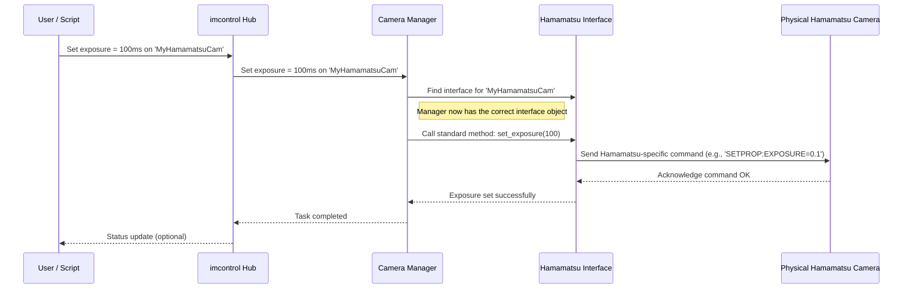

# Chapter 5: Device Interfaces (`imcontrol/model/interfaces`)

In [Chapter 4: Scripting Engine (`imscripting`, `imnotebook`)](04_scripting_engine___imscripting____imnotebook___.md), we saw how you can write scripts to automate tasks, telling ImSwitch what you want to do – like setting a laser power or snapping an image. But we glossed over a crucial detail: how does the central [Hardware Control Hub (`imcontrol`)](01_hardware_control_hub___imcontrol___.md) know *exactly* how to talk to the specific brand and model of camera or laser you have connected?

Imagine you want to travel internationally. You know you need to plug in your phone charger (the general task), but the wall sockets (hardware) are different in different countries! You need a specific adapter for the UK, another for Europe, another for the US.

Similarly, different hardware manufacturers (like Hamamatsu, Standa, Cobolt) design their devices to understand different sets of commands and communication rules (protocols). A command that works for a Hamamatsu camera won't work for a Thorlabs camera.

This is the problem solved by **Device Interfaces**.

## What Problem Do Device Interfaces Solve?

The challenge is **hardware diversity**. ImSwitch needs to control potentially hundreds of different devices from various manufacturers, each with its own unique "language". The core `imcontrol` system shouldn't need to know the intimate details of every single device ever made.

**Use Case Example: Setting Camera Exposure**

Let's say you have a "Hamamatsu Orca Flash 4.0" camera connected. Your script, or the GUI via [Chapter 3: GUI Toolkit (`guitools`)](03_gui_toolkit___guitools___.md), tells `imcontrol` to set the exposure time to 100 milliseconds.

*   `imcontrol` knows the general goal: "Set exposure to 100ms".
*   But how does it translate this goal into the *specific command* that the Hamamatsu Orca Flash 4.0 understands? Maybe this camera needs a command like `SETPROP:EXPOSURE=0.1` sent over a specific connection, while another camera might need a function call like `camera.set_exposure(100)` using a manufacturer's software library.

`imcontrol` can't possibly contain all these specific translations directly. It needs help.

## Device Interfaces: The Specific Translators

Device Interfaces are like **specialized translators** or **plug adapters** designed for one particular type or family of hardware.

*   **Translator Analogy:** Imagine `imcontrol` is a manager who only speaks English but needs to give instructions to workers who speak Japanese, German, or Spanish. The manager hires specific translators (the Device Interfaces). The manager tells the "Japanese Translator" the instruction in English ("Set exposure to 100ms"), and the translator converts it into the correct Japanese phrase for the Japanese worker (the specific hardware).
*   **Plug Adapter Analogy:** `imcontrol` provides the "electricity" (the control commands like "set power", "start acquisition"). The hardware (camera, laser, motor) has a specific type of "socket". The Device Interface is the **adapter** that fits between the standard `imcontrol` command "plug" and the unique hardware "socket", making the connection work.

Each Device Interface knows the exact commands, communication protocols, and quirks of the specific hardware it's designed for. These interfaces live within the `imswitch/imcontrol/model/interfaces/` directory in the ImSwitch codebase. You'll find files or folders there named after specific hardware or manufacturers, like `hamamatsu.py`, `standamotor.py`, `lantzlasers.py`, etc.

## Key Ideas

1.  **Specificity:** Each interface deals with one type of hardware (e.g., Hamamatsu cameras, Standa motors).
2.  **Translation:** It translates generic commands from `imcontrol`'s managers (like "set exposure") into the specific commands the hardware understands.
3.  **Protocol Handling:** It manages the low-level details of communicating with the hardware (e.g., sending commands over USB, Ethernet, or using a specific software library).
4.  **Location:** These interfaces are primarily found in `imcontrol/model/interfaces/`.

## How Interfaces Solve the Use Case

Let's revisit setting the exposure on our Hamamatsu camera:

1.  **Command Issued:** You (via GUI or script) tell `imcontrol` to set the exposure time for your camera named "MyHamamatsuCam" to 100ms.
2.  **`imcontrol` Delegates:** `imcontrol` passes this request to the relevant manager, the Camera Manager (part of `detectors`).
3.  **Manager Finds Interface:** The Camera Manager knows that "MyHamamatsuCam" is a Hamamatsu camera. It looks up and finds the specific **Hamamatsu Device Interface** that was created when the camera was first detected and configured.
4.  **Manager Uses Interface:** The Camera Manager doesn't try to send a command directly. Instead, it calls a standard function on the Hamamatsu Interface object, like `interface.set_exposure(100)`.
5.  **Interface Translates & Sends:** *Inside* the Hamamatsu Interface's `set_exposure` function is the specific code needed to talk to the Hamamatsu camera. It might format the command string (`SETPROP:EXPOSURE=0.1`) and send it using the correct communication library.
6.  **Hardware Acts:** The physical Hamamatsu camera receives the correctly formatted command and sets its exposure time.

The Camera Manager only needs to know the standard function name (`set_exposure`). The specific Hamamatsu Interface handles all the messy details. If you swapped the Hamamatsu for a Thorlabs camera, the Camera Manager would use the *Thorlabs Interface* instead, calling the *same* `interface.set_exposure(100)` function, but *that* interface would translate it into the correct command for the Thorlabs camera.

## A Glimpse Under the Hood

**Conceptual Flow:**

When `imcontrol` needs to interact with a specific device:

1.  The command goes from the main controller/script to the relevant Device Manager (e.g., Camera Manager, Laser Manager).
2.  The Manager identifies the specific device instance being controlled (e.g., "MyHamamatsuCam").
3.  The Manager retrieves the specific **Device Interface** object associated with that device instance.
4.  The Manager calls a standardized method on the Interface object (e.g., `.snap()`, `.set_power(50)`, `.set_exposure(100)`).
5.  The Interface method contains the hardware-specific code to translate the command and communicate with the physical device.

Here's a simplified diagram showing the interaction:



**Code Structure:**

The `imcontrol/model/interfaces/` directory contains the code for these translators. The `__init__.py` file often lists the available interfaces:

```python
# File: imswitch/imcontrol/model/interfaces/__init__.py
# This file imports the actual interface classes so they can be found.

from .hamamatsu import HamamatsuCamera, HamamatsuCameraMR # Interface for Hamamatsu cameras
# from .hamamatsu_mock import MockHamamatsu # A fake version for testing
from .lantzlasers import LantzLaser # Interface for lasers controlled via Lantz framework
from .standamotor import StandaMotor # Interface for Standa motors
# from .standamotor_mock import MockStandaMotor # Fake motor for testing

# ... potentially imports for Thorlabs, Andor, etc. ...
```
This shows how different interface classes (`HamamatsuCamera`, `LantzLaser`, `StandaMotor`) are made available.

Now, let's look at a *highly simplified, conceptual* structure of what might be inside `hamamatsu.py`:

```python
# Conceptual look inside: imcontrol/model/interfaces/hamamatsu.py

# Import necessary libraries to talk to the hardware (details hidden)
# import hamamatsu_sdk_library as hcam

class HamamatsuCamera: # The Interface class
    def __init__(self, camera_id):
        # Code to connect to the specific camera using its ID
        # self.camera_handle = hcam.open_camera(camera_id)
        print(f"Hamamatsu Interface: Connected to camera {camera_id}")

    def set_exposure(self, exposure_ms):
        # Convert ms to seconds if needed by the camera SDK
        exposure_sec = exposure_ms / 1000.0
        print(f"Hamamatsu Interface: Translating set_exposure({exposure_ms}ms)")
        # Send the SPECIFIC command for Hamamatsu cameras
        # hcam.set_property(self.camera_handle, "EXPOSURE_TIME", exposure_sec)
        print(f"   -> Sending Hamamatsu command for {exposure_sec} seconds")

    def snap_image(self):
        print("Hamamatsu Interface: Translating snap_image()")
        # Send SPECIFIC commands to prepare and trigger acquisition
        # hcam.prepare_acquisition(self.camera_handle)
        # hcam.trigger_acquisition(self.camera_handle)
        print("   -> Sending Hamamatsu acquisition commands")
        # Code to wait for image and retrieve data would follow
        # raw_data = hcam.get_image_data(self.camera_handle)
        # return raw_data # Return the image data

    def close_connection(self):
        print("Hamamatsu Interface: Closing connection")
        # Send SPECIFIC command to disconnect
        # hcam.close_camera(self.camera_handle)

```
**Explanation:**

*   The `HamamatsuCamera` class *is* the Device Interface for Hamamatsu cameras.
*   Methods like `set_exposure` and `snap_image` provide a standard way for the Camera Manager to interact with it.
*   **Crucially**, the *actual code* inside these methods (represented here by comments and `print` statements) uses the specific commands and libraries (`hamamatsu_sdk_library`) required only by Hamamatsu cameras. This is where the translation happens.

The Camera Manager would hold an instance of this `HamamatsuCamera` object and call its methods without needing to know the specific `hcam.` commands being used internally.

## Conclusion

You've now learned about **Device Interfaces (`imcontrol/model/interfaces`)**, the essential adapters or translators within ImSwitch. They bridge the gap between the general commands of the [Hardware Control Hub (`imcontrol`)](01_hardware_control_hub___imcontrol___.md) and the specific languages spoken by different hardware devices like cameras, lasers, and motors. Each interface handles the unique communication details for its device, allowing `imcontrol` to manage a wide variety of hardware in a standardized way. This modular approach makes ImSwitch flexible and extensible to new hardware.

We've seen how hardware is controlled (`imcontrol`), how specific devices are communicated with (Interfaces), how raw data might be processed ([`imreconstruct`](02_image_reconstruction_pipeline___imreconstruct___.md)), how you interact with the system ([`guitools`](03_gui_toolkit___guitools___.md)), and how to automate it ([`imscripting`](04_scripting_engine___imscripting____imnotebook___.md)). But when `imcontrol` gets data from a camera via an Interface, or when `imreconstruct` processes it, how is that data actually represented and passed around within the software?

Let's explore how ImSwitch packages and handles image data and metadata in the next chapter: [Chapter 6: Data Objects (`imreconstruct/model`)](06_data_objects___imreconstruct_model___.md).

---

Generated by [AI Codebase Knowledge Builder](https://github.com/The-Pocket/Tutorial-Codebase-Knowledge)