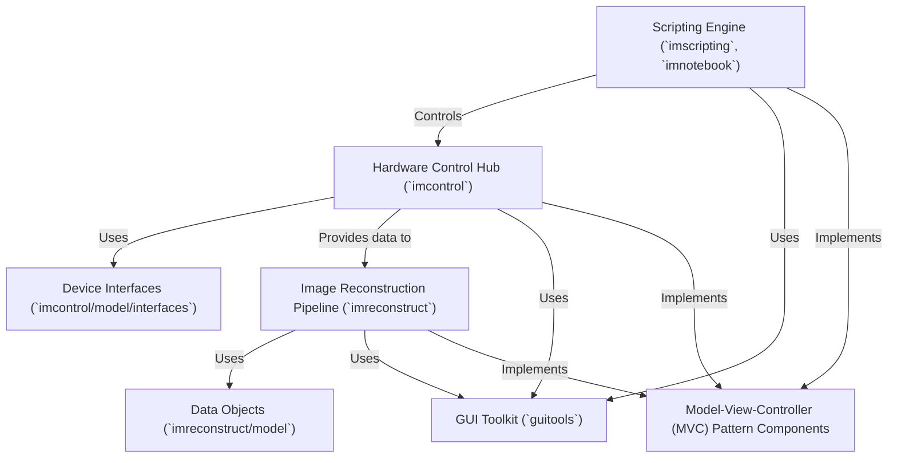

# Tutorial: ImSwitch

**ImSwitch** is software designed to control microscope hardware and manage experiments.
It acts as a central **Hardware Control Hub** (0), communicating with devices like cameras and lasers via specific **Device Interfaces** (3).
During an experiment, it collects *raw data* which is then processed by the **Image Reconstruction Pipeline** (1) using defined **Data Objects** (6) to create the final image.
Users can automate complex tasks using the **Scripting Engine** (2), and interact with the system through a graphical interface built with a common **GUI Toolkit** (5). The software's main components are structured using the **Model-View-Controller (MVC)** pattern (4).

**Source Repository:** [None](None)

## Chapters

1. [Hardware Control Hub (`imcontrol`)
](01_hardware_control_hub___imcontrol___.md)
2. [Image Reconstruction Pipeline (`imreconstruct`)
](02_image_reconstruction_pipeline___imreconstruct___.md)
3. [GUI Toolkit (`guitools`)
](03_gui_toolkit___guitools___.md)
4. [Scripting Engine (`imscripting`, `imnotebook`)
](04_scripting_engine___imscripting____imnotebook___.md)
5. [Device Interfaces (`imcontrol/model/interfaces`)
](05_device_interfaces___imcontrol_model_interfaces___.md)
6. [Data Objects (`imreconstruct/model`)
](06_data_objects___imreconstruct_model___.md)
7. [Model-View-Controller (MVC) Pattern Components
](07_model_view_controller__mvc__pattern_components_.md)

---

Generated by [AI Codebase Knowledge Builder](https://github.com/The-Pocket/Tutorial-Codebase-Knowledge)