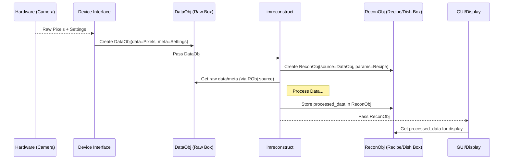

# Chapter 6: Data Objects (`imreconstruct/model`)

In [Chapter 5: Device Interfaces (`imcontrol/model/interfaces`)](05_device_interfaces___imcontrol_model_interfaces___.md), we saw how ImSwitch uses specific "translators" to communicate with your exact hardware, like a camera. The camera captures light and generates raw image data (basically, a grid of numbers representing pixel brightness). But once ImSwitch receives this data, where does it put it? How does it keep track of the raw data versus any processed images, along with important information like the camera settings used?

Imagine you're baking cookies. You gather your raw ingredients: flour, sugar, eggs, chocolate chips. You wouldn't just dump them all onto the counter! You'd keep them in bowls or containers. Later, when you mix them and bake them, you put the finished cookies on a plate, separate from the leftover raw ingredients.

ImSwitch needs similar containers for its data. This is where **Data Objects (`imreconstruct/model`)** come in.

## What Problem Do Data Objects Solve?

The main challenge is **organizing and standardizing data**. As data flows through ImSwitch – from the camera, possibly through processing steps, and finally to the display – it needs to be packaged neatly. We need a consistent way to hold:

1.  The raw pixel data itself.
2.  Associated information (metadata), like the exposure time, laser power used, or time the image was taken.
3.  The results of any processing steps.

Simply passing around raw grids of numbers and separate pieces of information would be messy and error-prone, like trying to bake with ingredients scattered everywhere.

**Use Case Example: Taking an Image and Applying Basic Processing**

1.  **Acquire:** You click "Snap" in ImSwitch. The camera (controlled by [Chapter 1: Hardware Control Hub (`imcontrol`)](01_hardware_control_hub___imcontrol___.md) via a [Device Interfaces (`imcontrol/model/interfaces`)](05_device_interfaces___imcontrol_model_interfaces___.md)) sends back the raw image pixels and info like the exposure time (e.g., 100ms).
2.  **Store Raw:** Where does this raw pixel grid and the "100ms" info go? It needs a dedicated container.
3.  **Process:** Maybe you apply a simple filter, like background subtraction, using the [Image Reconstruction Pipeline (`imreconstruct`)](02_image_reconstruction_pipeline___imreconstruct___.md).
4.  **Store Processed:** Where does the *new* image data (after background subtraction) go? How do we remember which raw image it came from and what processing was applied? It needs another container, perhaps linked to the first.

Data Objects provide these standardized containers.

## The Data Containers: `DataObj` and `ReconObj`

Think of these objects as specialized boxes designed for different stages of the "cooking" process (image acquisition and reconstruction):

1.  **`DataObj`: The Raw Ingredients Box**
    *   **Purpose:** Holds the **raw data** directly from the detector (camera).
    *   **Analogy:** This is like a container holding your precisely measured flour, sugar, and raw eggs – the basic components straight from their packages.
    *   **What's Inside:**
        *   The raw image pixel values (often as a NumPy array, a standard way Python handles grids of numbers).
        *   Metadata: A collection of information about how the raw data was acquired (e.g., camera settings, laser powers, timestamps).

2.  **`ReconObj`: The Recipe & Prepared Dish Container**
    *   **Purpose:** Holds information needed **for** image reconstruction/processing and the **results** of that processing.
    *   **Analogy:** This is like a container that holds the *recipe card* (processing instructions) and, eventually, the *finished cookies* (the processed image). It might also remember which "raw ingredient box" (`DataObj`) was used.
    *   **What's Inside:**
        *   Information about the reconstruction/processing task (the "recipe").
        *   Often, a link back to the original `DataObj` containing the raw data.
        *   The final, reconstructed, or processed image data.

These objects live primarily within the `imswitch/imreconstruct/model/` directory.

## How Data Objects Work: Following the Image Data

Let's trace our use case using these containers:

1.  **Acquisition:** The camera sends raw pixel data and settings (e.g., exposure=100ms) to the appropriate [Device Interfaces (`imcontrol/model/interfaces`)](05_device_interfaces___imcontrol_model_interfaces___.md).
2.  **Packaging Raw Data:** The interface (or `imcontrol`) takes this raw data and metadata and packs it into a `DataObj`.
    ```python
    # Conceptual: Creating a DataObj
    raw_pixels = get_pixels_from_camera() # e.g., a NumPy array
    metadata = {"exposure_ms": 100, "timestamp": "2023-10-27..."}

    # Create the 'raw ingredients box'
    data_container = DataObj(data=raw_pixels, meta=metadata)
    ```
3.  **Passing to Processing:** This `data_container` (`DataObj`) is passed to the [Image Reconstruction Pipeline (`imreconstruct`)](02_image_reconstruction_pipeline___imreconstruct___.md).
4.  **Preparing for Processing:** `imreconstruct` might create a `ReconObj` to manage the processing task. It links this `ReconObj` to the original `DataObj` and stores the processing "recipe".
    ```python
    # Conceptual: Creating a ReconObj for background subtraction
    processing_recipe = {"method": "subtract_background", "value": 50}

    # Create the 'recipe & dish container', linking it to the raw data
    recon_container = ReconObj(source=data_container, params=processing_recipe)
    ```
5.  **Performing Processing:** `imreconstruct` uses the raw data *from* the `data_container.data` and the recipe *from* `recon_container.params` to calculate the new image.
    ```python
    # Conceptual: Accessing data and performing the calculation
    raw_image = data_container.data
    bg_value = recon_container.params["value"]
    processed_image = raw_image - bg_value # Simple subtraction
    ```
6.  **Storing the Result:** The resulting `processed_image` is stored *inside* the `ReconObj`.
    ```python
    # Conceptual: Storing the final image in the ReconObj
    recon_container.recon_data = processed_image
    ```
7.  **Displaying:** The `recon_container` (which now holds the final, processed image in its `.recon_data` attribute) is sent to the [GUI Toolkit (`guitools`)](03_gui_toolkit___guitools___.md) for display. The GUI knows to look inside the `ReconObj` for the image to show.

By using `DataObj` and `ReconObj`, the flow of data is organized. We know where the raw data is, where the processed data is, and what steps were taken.

## A Glimpse Under the Hood

**Conceptual Flow:**

This diagram shows how data moves between components, packaged within our Data Objects:



**Code Structure:**

The definitions for these container classes are found in:

*   `imswitch/imreconstruct/model/DataObj.py`: Defines the `DataObj` class.
*   `imswitch/imreconstruct/model/ReconObj.py`: Defines the `ReconObj` class.

These classes are essentially structured ways to hold data.

```python
# Conceptual look inside DataObj.py (simplified)
import numpy as np # Library for numerical arrays

class DataObj:
    def __init__(self, data: np.ndarray, meta: dict):
        """Initialize with raw data and metadata."""
        self.data = data # The actual image pixels (e.g., NumPy array)
        self.meta = meta # Dictionary holding settings, timestamp, etc.
        print("DataObj created!")

    def get_shape(self):
        """Get the dimensions of the raw image."""
        return self.data.shape
```
*   **Explanation:** The `DataObj` mainly holds two important things: `self.data` (the pixel grid) and `self.meta` (a dictionary of associated information). It might have helper functions like `get_shape`.

```python
# Conceptual look inside ReconObj.py (simplified)
class ReconObj:
    def __init__(self, source: DataObj, params: dict):
        """Initialize with source DataObj and processing parameters."""
        self.source = source # Link back to the original raw data
        self.params = params # The 'recipe' for processing
        self.recon_data = None # Placeholder for the result
        print("ReconObj created, ready for processing.")

    def set_result(self, result_data):
        """Store the final processed image."""
        self.recon_data = result_data
        print("Result stored in ReconObj.")

    def get_result(self):
        """Get the final processed image."""
        return self.recon_data
```
*   **Explanation:** The `ReconObj` holds a reference to the original `DataObj` (`self.source`), the processing parameters (`self.params`), and a place to store the final image (`self.recon_data`). Functions like `set_result` and `get_result` allow storing and retrieving the processed data.

These classes provide the standard "boxes" that different parts of ImSwitch can use to pass data around reliably.

## Conclusion

You've now learned about **Data Objects (`imreconstruct/model`)**, specifically `DataObj` and `ReconObj`. These act as standardized containers within ImSwitch. `DataObj` is like a box holding the raw ingredients (raw detector data and metadata), while `ReconObj` is like a container holding the recipe (processing parameters) and the final dish (the reconstructed or processed image). Using these objects ensures that data is well-organized and easily passed between different parts of the software, like the [Hardware Control Hub (`imcontrol`)](01_hardware_control_hub___imcontrol___.md), the [Image Reconstruction Pipeline (`imreconstruct`)](02_image_reconstruction_pipeline___imreconstruct___.md), and the [GUI Toolkit (`guitools`)](03_gui_toolkit___guitools___.md).

We've now covered many core components: hardware control, reconstruction, GUI, scripting, device interfaces, and data handling. How do all these pieces fit together in a larger software design pattern?

Let's explore the overall structure in the final chapter: [Chapter 7: Model-View-Controller (MVC) Pattern Components](07_model_view_controller__mvc__pattern_components_.md).

---

Generated by [AI Codebase Knowledge Builder](https://github.com/The-Pocket/Tutorial-Codebase-Knowledge)