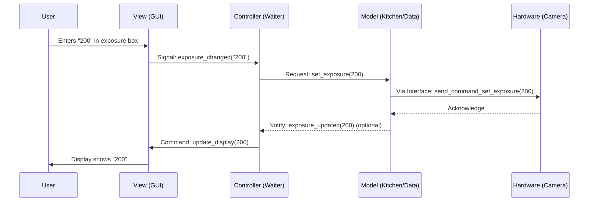

# Chapter 7: Model-View-Controller (MVC) Pattern Components

In the previous chapter, [Chapter 6: Data Objects (`imreconstruct/model`)](06_data_objects___imreconstruct_model___.md), we saw how ImSwitch packages raw and processed image data into neat containers like `DataObj` and `ReconObj`. We've now explored many individual pieces: controlling hardware ([`imcontrol`](01_hardware_control_hub___imcontrol___.md)), processing images ([`imreconstruct`](02_image_reconstruction_pipeline___imreconstruct___.md)), building the user interface ([`guitools`](03_gui_toolkit___guitools___.md)), automating tasks ([`imscripting`](04_scripting_engine___imscripting____imnotebook___.md)), talking to specific devices ([Device Interfaces](05_device_interfaces___imcontrol_model_interfaces___.md)), and handling data ([Data Objects](06_data_objects___imreconstruct_model___.md)).

But how do all these parts fit together within the major sections of ImSwitch like `imcontrol` or `imreconstruct`? If every piece of code could talk directly to every other piece, it would quickly become a tangled mess, like a plate of spaghetti! How do we keep things organized?

ImSwitch uses a common software design pattern called **Model-View-Controller (MVC)** to structure its main modules.

## What Problem Does MVC Solve?

The main challenge is **keeping the code organized and manageable**. In a complex application like ImSwitch, you have:

1.  Code that handles the actual data and logic (like managing hardware settings or running reconstruction algorithms).
2.  Code that displays information to the user and captures their input (like buttons, sliders, image displays).
3.  Code that acts as a go-between, coordinating the user's actions with the data and logic.

If these were all mixed together in one giant file, making changes or fixing bugs would be extremely difficult. Imagine trying to update the recipe for a dish *and* redesign the restaurant menu *and* retrain the waiters all by editing the same single document!

MVC solves this by **separating concerns**. It divides the code within a module into three distinct roles, making the software easier to understand, develop, and maintain.

**Use Case Example: Changing Camera Exposure Time**

Let's think about a simple action: you want to change the camera's exposure time using the graphical interface.

1.  You see the current exposure time displayed in a text box (Interface).
2.  You type a new value, say "200", into the box and press Enter (User Input).
3.  The software needs to recognize this input, validate it, tell the camera hardware to change its setting, and maybe update the display to confirm the change.

MVC provides a structured way to handle this interaction without tangling the display code with the hardware control code.

## The MVC Pattern: A Restaurant Analogy

Think of a restaurant:

1.  **Model (The Kitchen & Pantry):**
    *   **Role:** Manages the data, logic, and "state" of the application. It handles the core tasks.
    *   **Analogy:** The kitchen is where the food (data) is stored (pantry) and prepared according to recipes (logic). It knows the current state of ingredients and dishes. It doesn't interact directly with the customer.
    *   **In ImSwitch:** This part contains the [Data Objects (`imreconstruct/model`)](06_data_objects___imreconstruct_model___.md), knows the current hardware settings, talks to the [Device Interfaces (`imcontrol/model/interfaces`)](05_device_interfaces___imcontrol_model_interfaces___.md), and performs calculations like image reconstruction. It represents the underlying reality of the system. Code typically resides in `*/model/` directories.

2.  **View (The Dining Area & Menu):**
    *   **Role:** Displays information (the Model's state) to the user and presents the interface for user input. It doesn't handle the data or logic itself.
    *   **Analogy:** The dining area is where the customer sees the menu (available options), the table setting, and eventually the food. Customers interact with the restaurant through the View (ordering from the menu, eating the food).
    *   **In ImSwitch:** This is the graphical user interface you see, built using the [GUI Toolkit (`guitools`)](03_gui_toolkit___guitools___.md). It shows buttons, sliders, status indicators, and image displays. It captures your clicks and keyboard input. Code typically resides in `*/view/` directories.

3.  **Controller (The Waiter):**
    *   **Role:** Acts as the intermediary between the Model and the View. It takes user input from the View, interprets it, tells the Model what to do, and updates the View based on changes in the Model.
    *   **Analogy:** The waiter takes your order from the menu (View), relays it to the kitchen (Model), brings the food (updated data) back from the kitchen to your table (View), and maybe tells you if the kitchen is out of an ingredient (updates the View based on Model changes).
    *   **In ImSwitch:** This part receives signals from the GUI widgets (e.g., "button clicked", "slider moved"). It calls the appropriate functions in the Model to perform actions (e.g., "set laser power", "start reconstruction"). It might also observe the Model and tell the View to refresh when data changes. Code typically resides in `*/controller/` directories.

## How MVC Solves the Exposure Time Use Case

Let's apply MVC to changing the exposure time to "200" ms:

1.  **User Input (View):** You type "200" into the exposure time text box in the GUI (the View) and press Enter.
2.  **View Notifies Controller:** The text box widget in the View detects the change and sends a signal (like shouting "Order up!") to the Controller (the Waiter). The signal carries the value "200".
3.  **Controller Processes Input:** The Controller receives the signal. It understands this means "change the exposure time". It might validate the input (e.g., check if "200" is a valid number).
4.  **Controller Updates Model:** The Controller tells the Model (the Kitchen) to update the exposure time setting to 200ms.
    ```python
    # Conceptual Controller code
    def user_changed_exposure(self, new_value_str):
        print("Controller (Waiter): Got exposure change request from View.")
        try:
            new_exposure_ms = int(new_value_str) # Convert text to number
            # Tell the Model (Kitchen) to update
            self.model.set_camera_exposure(new_exposure_ms)
            print(f"Controller: Told Model to set exposure to {new_exposure_ms} ms.")
        except ValueError:
            print("Controller: Invalid input from View.")
            # Optionally, tell View to show an error message
    ```
5.  **Model Updates State & Hardware:** The Model receives the instruction. It updates its internal record of the exposure time. It then likely uses the appropriate [Device Interfaces (`imcontrol/model/interfaces`)](05_device_interfaces___imcontrol_model_interfaces___.md) to send the actual command to the camera hardware.
    ```python
    # Conceptual Model code
    def set_camera_exposure(self, exposure_ms):
        print(f"Model (Kitchen): Updating exposure to {exposure_ms} ms.")
        self.current_exposure = exposure_ms
        # Use the camera interface (specific tool) to talk to hardware
        # self.camera_interface.set_exposure(exposure_ms)
        print("Model: Sent command to hardware via interface.")
        # Notify Controller/View that state changed (optional)
        # self.notify_observers()
    ```
6.  **Model Notifies Controller (Optional):** The Model might signal back to the Controller that the exposure time has indeed been updated.
7.  **Controller Updates View:** The Controller tells the View to update its display to reflect the new state (e.g., make sure the text box reliably shows "200").
    ```python
    # Conceptual Controller code (responding to Model update or confirming action)
    def refresh_exposure_display(self):
         current_exposure = self.model.get_camera_exposure()
         print("Controller: Telling View to display exposure:", current_exposure)
         # self.view.update_exposure_display(current_exposure)
    ```
8.  **View Updates Display:** The View updates the text box widget to show the confirmed value.

This separation ensures the View only worries about display and input, the Model only worries about data and hardware logic, and the Controller handles the coordination.

## A Glimpse Under the Hood

**Communication Flow:**

Here’s how the components typically interact:



**Code Structure in ImSwitch:**

You can see this pattern reflected in the directory structure of the main modules:

*   **`imcontrol` (Hardware Control):**
    *   `imswitch/imcontrol/model/`: Contains hardware managers, [Device Interfaces (`imcontrol/model/interfaces`)](05_device_interfaces___imcontrol_model_interfaces___.md), logic for coordinating devices. (The Kitchen)
    *   `imswitch/imcontrol/view/`: Contains the GUI elements (panels, buttons, status lights) for hardware control, using [GUI Toolkit (`guitools`)](03_gui_toolkit___guitools___.md). (The Dining Area)
    *   `imswitch/imcontrol/controller/`: Contains `ImConMainController`, which connects the View's actions to the Model's logic. (The Waiter)

*   **`imreconstruct` (Image Reconstruction):**
    *   `imswitch/imreconstruct/model/`: Contains [Data Objects (`imreconstruct/model`)](06_data_objects___imreconstruct_model___.md) (`DataObj`, `ReconObj`), pattern finders, signal extractors, and reconstruction algorithms. (The Kitchen)
    *   `imswitch/imreconstruct/view/`: Contains GUI elements for selecting reconstruction parameters and displaying results. (The Dining Area)
    *   `imswitch/imreconstruct/controller/`: Contains `ImRecMainController`, which handles requests from the View (e.g., "start reconstruction") and tells the Model what to do. (The Waiter)

*   **`imscripting` (Scripting Engine):**
    *   `imswitch/imscripting/model/`: Contains the `ScriptExecutor`, `ScriptStore`, and the `actions` that define what scripts can do (connecting to other Models like `imcontrol`). (The Kitchen/Rulebook)
    *   `imswitch/imscripting/view/`: Contains the GUI for loading, editing, and running scripts. (The Editor/Run Button Area)
    *   `imswitch/imscripting/controller/`: Contains `ImScrMainController`, managing script execution triggered by the View. (The Conductor)

The `__init__.py` files within these `controller/`, `model/`, and `view/` directories often import the main classes for that component, making them accessible. For example:

```python
# File: imswitch/imcontrol/controller/__init__.py
# Makes the main controller class for imcontrol available
from .ImConMainController import ImConMainController

# File: imswitch/imcontrol/view/__init__.py
# Makes the main view class for imcontrol available
# (Actual view might be composed of many smaller widgets)
# from .ImConMainView import ImConMainView # Example if there's one main view

# File: imswitch/imcontrol/model/__init__.py
# Makes various model components like managers available
# from .managers import DetectorManager, LaserManager # etc.
# from .interfaces import HamamatsuCamera # etc.
```

This structure makes it clear where to find code related to data/logic (Model), presentation (View), and coordination (Controller) for each major part of ImSwitch.

## Conclusion

You've now learned about the **Model-View-Controller (MVC)** pattern, a fundamental design principle used to organize the code within ImSwitch's major modules like `imcontrol`, `imreconstruct`, and `imscripting`. By separating responsibilities – the **Model** handling data and logic (the Kitchen), the **View** handling presentation and input (the Dining Area/Menu), and the **Controller** acting as the intermediary (the Waiter) – MVC makes the software much easier to understand, develop, and maintain. This structured approach is key to managing the complexity of a powerful application like ImSwitch.

This concludes our tour through the core components and structural concepts of ImSwitch! We hope this gives you a solid foundation for understanding how the software works under the hood.

---

Generated by [AI Codebase Knowledge Builder](https://github.com/The-Pocket/Tutorial-Codebase-Knowledge)