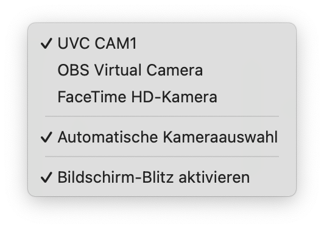
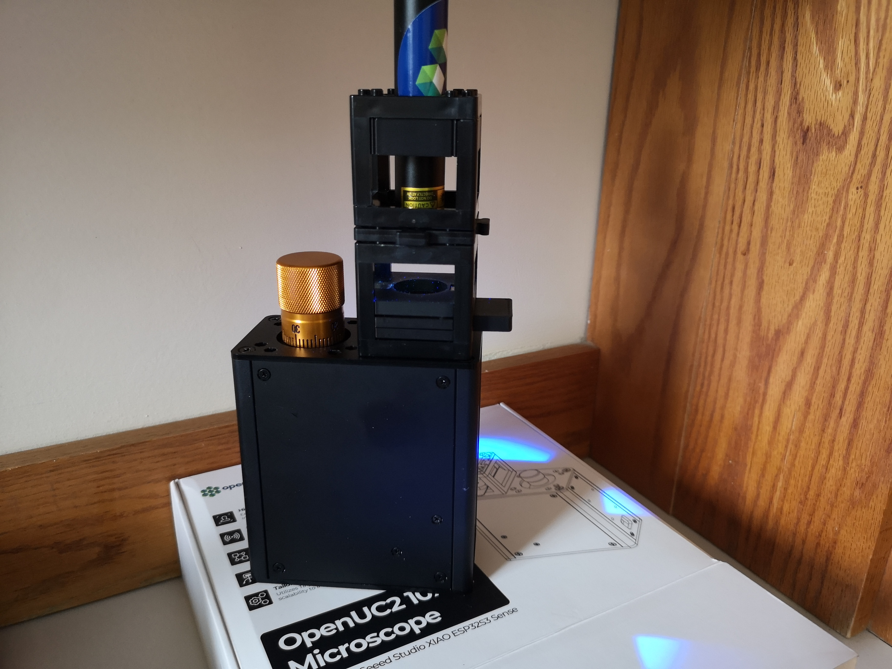

# openUC2 Microscopy Workshop @ AQLM/MBL Woods Hole

Welcome to the openUC2 Workshop on Modular and Digital Microscopy. This hands-on session will introduce participants—especially those with a biology background—to accessible, customizable microscopy using open-source tools. We will walk through building and extending microscopes, from simple lens assemblies to digital microscopy. 👩‍💻🔬


## Installation of Jupyter Notebook

We assume you have a python instance (e.g. inside a anaconda/mamba environment) available.
Then you can do:

```bash
# optional - probable:
# conda create -n mjpyter python=3.10 -y
# conda env activate mjupyter
# conda activate mjupyter
pip install notebook jupyterlab
jupyter lab
# or
jupyter notebook
```

## Scientific Background

Microscopy is important -obviously! Traditional microscopes, however, can be expensive, inflexible, and non-transparent in design.
The openUC2 ecosystem offers an open-source, modular alternative. With 3D-printed components, low-cost electronics, and standardized 50mm cube modules, users can build anything from a simple smartphone microscope to a fully automated fluorescence light-sheet setup.

Feel free to share any of your data under **`#openUC2AQLM`

*What you are going to learn:*


| Chapter | Topic                              | Est. Time |
| ------- | ---------------------------------- | --------- |
| 1       | openUC2 **coreBOX** basics         | 45 min    |
| 2       | openUC2 **Seeed** Microscope setup | 30 min    |
| 3       | Fluorescence add‑on                | 30 min    |
| 4       | LED‑Matrix illumination & contrast | 45 min    |
| 5       | Jupyter workflow (DPC)             | 60 min    |
| 6       | Light‑sheet hands‑on               | 60 min    |


## Some References

Please go through the following links to check about the:
- [coreBOX](https://openuc2.github.io/docs/Toolboxes/DiscoveryCore/ENGLISH/uc2miniboxEN)
-  [openUC2 x Seeed Studio AI Microscope](https://openuc2.github.io/docs/Toolboxes/DiscoveryElectronics/04_1_seeedmicroscope)
- [openUC2 Electronics](https://openuc2.github.io/docs/Toolboxes/DiscoveryElectronics/automation_intro)


## Chapter 1: Getting Started with the openUC2 coreBOX

### Goals

* Unbox & inspect components
* Understand the concept of modular optics
* Build a **Kepler telescope**
* Convert setup into a **smartphone microscope**

### Instructions

0. **Read the manual** (QR‑code inside lid) – note safety icons.
1. Unpack your **coreBOX** and review the included printed or digital manual.
2. Assemble a **[simple telescope](https://openuc2.github.io/docs/Toolboxes/DiscoveryCore/ENGLISH/CoreTelescope)** to understand lens focusing.
   a. Assemble two lens holders at 50 mm spacing.
   b. Insert eyepiece (10×) & objective (50 mm f).
   c. Align by sliding cubes until full‑field image is sharp.
3. Build the **[smartphone microscope](https://openuc2.github.io/docs/Toolboxes/DiscoveryCore/ENGLISH/coreMicroscope#smartphone-microscope)** using the RMS objective holder and phone adapter.
   a. Adjust the setup depending on your phone (add a cube spacer in between eventually)
   b. Mount sample slide on slide‑holder cube.
   c. Use flashlight cube for epi‑illumination.
4. Place a sample and capture an image.

Find a cool sample and take pictures of your setup and share them on social media using `#openUC2AQLM` if you like :)


### Result

This was captured using two crossed polarizers during the course


## Chapter 2: Upgrading Illumination with LED Matrix

### Goals

* Replace the flashlight with programmable LED matrix
* Explore the impact of illumination patterns on image contrast

### Theory

Illumination geometry affects how (especially visible with transparent) samples scatter light. Oblique, ring-shaped, or side-specific lighting can enhance features invisible under uniform illumination.

### Instructions

1. Replace the flashlight with the **openUC2 LED matrix**.
2. Flash the firmware onto the LED controller (see LED Matrix Flash Guide).
3. Connect to the board using the webserial webpage and test control commands: `left`, `right`, `top`, `bottom`, `ring`, etc.
4. View your sample again using the matrix lighting and observe contrast changes:

   * Outer ring: **Darkfield illumination** (black background, white features)
   * Side lighting: **Gradient effects**

Take photos of the visual effects and share your results and post it if you like :)


#### Flash the firmware to the openUC2 LED Matrix


*Go to this website: youseetoo.github.io and flash the firmware (**WAVEHSARE MATRIX**)*


*Select the port*


*Select INstall Firmware*


*Yes, go for the firmware and flash it*


*Wait for it..*


*Done! Reflash/Close the page*


#### Test the LED Matrix

*Go to the testing website, connect to the device and test it by hitting the buttons for on/off, left/right, etc.*


#### Acquire images with varying

Acquire images using your openUC2 cellphone microscope.


## Chapter 3: Digital Microscopy with the Seeed Studio Microscope

### Goals

* Use the Seeed Studio UC2 microscope as a USB webcam
* Prepare for digital contrast enhancement

### Instructions

1. Assemble the Seeed Studio UC2 microscope with a transmissive LED base and flash the right firmware (**WEBCAM**)
2. Focus on your sample using the live preview on your computer (macOS: Photo Booth / Windows: Camera App).


#### 1 Setup the Microscope and flash the right firmware

In order to get the microscope running it's best to use it in a wired mode. We have prepared a firmware that can convert the Wifi-enabled XIAO ESP32 camera into a UVC type webcam so that you can use it from any webcam software using a usb cable.

:::error
This process cannot easily be undone! You have to disassemble the microscope to bring the microcontroller into boot mode, so better think about this step twice!
More information here: https://openuc2.github.io/docs/Toolboxes/DiscoveryElectronics/04_3_seeedmicroscoperepair#flashing-the-esp32s3-in-case-the-bootloader-is-not-responding
:::

In order to flash the firmware, follow the following steps:

##### 1. Reset the firmware
*This will remove the current firmware. Go to https://espressif.github.io/esptool-js/*


*Connect to the openUC2 Seeed Studio Microscope*


*Hit the **Erase Flash** button*


*Wait for a moment and then disconnect/close the page*


##### 2 Install the new firmware

*Go to our website (https://youseetoo.github.io/) and select the **XIAO WEBCAM FIRMWARE** by clicking on the button*


*Connect to the Seeed Microscope*


*Select the right port*


*Flash the firmware and wait patiently*


*If it says 100% -> well done, refresh/close the page*


##### 3 Use the Webcam

*Open your beloved Webcam Programm and open the camera (e.g. on Mac => Photo Booth, on Windows Camera APP*)



*With no light you should only see noise*


## Chapter 4: Fluorescence Microscopy Extension

### Goals

* Add fluorescence capability using UV LED and emission filter cubes

#### Instructions

1. Prepare the Microscope and remove the sample holder for now
2. Prepare the sample holder with the Filter holder and sandwich it between sample and cube.
3. Test both **transmission mode** and **darkfield mode**.
4. Handle UV LEDs with care—avoid eye and skin exposure.
*Get the parts ready. For this you need the fluorescence filter slider and the UV LED/Torch*


*Insert an appropriate emission filter (e.g., 500–550 nm bandpass). Sandwich it through the sample insert in the objective lens*


*Attach the UV LED cube to the Seeed microscope from above or....*


*From the side to enable some sort of darkfield Fluorescence. This has the potential to block more direct light*


*Some labelled paper in the focus*


*from the side*


#### Result

This is a z-stack of lens tissue labelled with a yellow text marker (Stabilo) in darkfield configuration. You nicely see the fluorescence that is attached to the Fibers:


## Chapter 5: Digital Phase Contrast using LED Matrix + Webcam

### Goals

* Use programmable lighting for digital differential phase contrast (DPC)
* Visualize Contrast enhancement in the browser
* Automate image acquisition and processing via Jupyter Notebook

### Instructions (Standalone via youseetoo.github.io)

1. Replace the UV/normal LED Flashlight with the LED Matrix Cube and go over to https://youseetoo.github.io/indexWebSerialTest.html, connect to the board as described previously and then try different illumination modes -> Capture photos

*Add the led matrix (for Darkfield it actually can also go in the same cube as the sample so that the NA_illu > NA_detection)*


*Change Illu settings over the webpage*


You can turn on the live stream of the camera inside the webpage as described in the following video (Sometimes the camera has to be "reactiveated" - simply select another camera, like the inbuilt one from your laptop or so):


### Instructions (Using Jupyter Notebook)

1. Open the Jupyter Notebook provided here: https://github.com/openUC2/openUC2-SEEED-XIAO-Camera/blob/seeed/JUPYTER/2025_05_01_UC2_Example_DPC.ipynb (click `RAW` to donwnload the `.ipynb`-file)
2. Run the cell that synchronizes camera snapshots with lighting directions.
3. Capture four images (top, bottom, left, right illumination).
4. Compute: `(left - right) / (left + right)` and `(top - bottom) / (top + bottom)`.
5. Combine into a qualitative phase gradient map resembling DIC microscopy.
6. Combine into a quantitative phase map using qDPC


### DPC and qDPC Imaging with the openUC2 Seeed Studio Microscope

#### Goals

In this notebook, you will:

- Connect the openUC2 Seeed Studio Microscope as a USB webcam
- Control the LED matrix to vary illumination patterns (left, right, top, bottom, ring)
- Acquire images under different directional illuminations
- Calculate a Differential Phase Contrast (DPC) image
- Optionally reconstruct a Quantitative DPC (qDPC) phase map

#### Background

Biological samples, especially unstained cells, often exhibit low contrast under brightfield illumination. By controlling the angle of illumination, we can highlight phase gradients—changes in optical density—which are otherwise invisible.

Differential Phase Contrast (DPC) uses asymmetric illumination to estimate local phase gradients. This enhances image contrast and reveals subcellular structures. The basic mathematicall formular is the following: `(I_top-I_bottom)/(I_top+I_bottom)`. This subtracts the brigthfield image from the gradient image.

Quantitative DPC (qDPC) goes one step further by reconstructing the actual phase distribution of the sample—providing information about refractive index variations or thickness. This is done by computing the (weak) object transfer function and then further deconvolves the images with the resutling response function

*Further reading:*
- Introduction to Digital Microscopy: https://openuc2.github.io/docs/Toolboxes/DiscoveryElectronics/DigitalMicroscopy
- Theory and Implementation of DPC: https://openuc2.github.io/docs/Toolboxes/DiscoveryPhaseMicroscopy/DPCmicroscopy/

#### Prerequisites

Install the following Python libraries before running the notebook:

```bash
pip install https://github.com/openUC2/UC2-REST/archive/refs/heads/master.zip
pip install imageio[ffmpeg]
pip install numpy scipy matplotlib


### Getting to know the LED Array


```python
###%%
import uc2rest
import numpy as np
import time

### Connect the LED array to the computer and try to find it
port = "unknown"
ESP32 = uc2rest.UC2Client(serialport=port, baudrate=115200, DEBUG=False)

### Create LedMatrix object, pass a reference to your “parent” that has post_json()
my_led_matrix = ESP32.led


### Flash it a few times
for i in range(2):
    # Turn off all LEDs
    my_led_matrix.send_LEDMatrix_off()
    time.sleep(0.1)
    # Fill entire matrix with red
    my_led_matrix.send_LEDMatrix_full((255,0,0), getReturn=False)
    time.sleep(0.1)

### Light only left half in bright white
mDirections = ["left", "right", "top", "bottom"]
for iDirection in mDirections:
    my_led_matrix.send_LEDMatrix_halves(region=iDirection, intensity=(255,255,255), getReturn=False)
    time.sleep(0.1)
    mFrames.append(cam.read()[-1])

### Draw a ring of radius 3 in purple
my_led_matrix.send_LEDMatrix_rings(radius=3, intensity=(128,0,128))

### Draw a filled circle of radius 5 in green
my_led_matrix.send_LEDMatrix_circles(radius=3, intensity=(0,255,0))

### turn on indidivual LEDs
for iLED in range(5):
    # timeout = 0 means no timeout => mResult will be rubish!
    mResult = ESP32.led.send_LEDMatrix_single(indexled=iLED, intensity=(255, 255, 255), getReturn=0, timeout=0.1)
    mResult = ESP32.led.send_LEDMatrix_single(indexled=iLED, intensity=(0, 0, 0),  getReturn=0, timeout=0.1)

### display random pattern
for i in range(5):
    led_pattern = np.random.randint(0,55, (25,3))
    mResult = ESP32.led.send_LEDMatrix_array(led_pattern=led_pattern,getReturn=0,timeout=0)

### turn off
ESP32.led.send_LEDMatrix_full(intensity=(0, 0, 0), getReturn=False)

```

    [OpenDevice]: Port not found
    Using API version 2
    {0: [], 1: [], 2: [], 3: [], 4: [], 5: [], 6: [], 7: [], 8: [], 9: []}
    [SendingCommands]:{"task": "/ledarr_act", "qid": 1, "led": {"action": "off"}}


### Getting to know the camera


```python
import imageio as iio
import matplotlib.pyplot as plt
import numpy as np
import time

### initialize camera
camera = iio.get_reader("<video0>")

### acquire some frames
for i in range(10):
    mFrame = camera.get_next_data()
    time.sleep(0.1)
    plt.imshow(mFrame), plt.show()

### close camera
camera.close()

```

### Acquiring the images at varying illumination and merge them


```python
import imageio as iio
import matplotlib.pyplot as plt
import uc2rest
import numpy as np
import time

### initialize the LED Array
port = "unknown"
###ESP32 = uc2rest.UC2Client(serialport=port, baudrate=115200, DEBUG=True)
### sometimes the automatic detection doesn'T work with this board, then find out the port number
### (e.g. COM3, /dev/cu.usbmodem101, /dev/ttyUSB0  or something - actually the one that you used for flashing on youseetoo.github.io
port = "/dev/cu.usbmodem101"
ESP32 = uc2rest.UC2Client(serialport=port, baudrate=115200, DEBUG=True, skipFirmwareCheck=True)
### Create LedMatrix object, pass a reference to your “parent” that has post_json()
my_led_matrix = ESP32.led

### initialize camera
camera = iio.get_reader("<video0>")

mColour = (0,0,255) # let'S choose blue to "maximise resolution"

### store the images
mFrames = []
### Light only left half in bright white
mDirections = ["left", "right", "top", "bottom"]
for iDirection in mDirections:
    my_led_matrix.send_LEDMatrix_halves(region=iDirection, intensity=mColour, getReturn=False)
    time.sleep(0.1)
    # the xiao camera has some buffer that we need to free everytime for frame synchronisation..
    for i in range(10):
        mFrame = camera.get_next_data()
        time.sleep(0.1)
    mFrames.append(mFrame)
    plt.imshow(mFrame), plt.show()
camera.close()
my_led_matrix.send_LEDMatrix_off()

```

    Using API version 2
    {0: [], 1: [], 2: [], 3: [], 4: [], 5: [], 6: [], 7: [], 8: [], 9: []}
    [SendingCommands]:{"task": "/ledarr_act", "qid": 1, "led": {"action": "halves", "region": "left", "r": 0, "g": 0, "b": 255}}

    [ProcessLines]:+
    [ProcessLines]:{qid1"ucs"1-


    [SendingCommands]:{"task": "/ledarr_act", "qid": 2, "led": {"action": "halves", "region": "right", "r": 0, "g": 0, "b": 255}}

    [ProcessLines]:++
    Failed to read the line in serial: device reports readiness to read but returned no data (device disconnected or multiple access on port?)
    Failed to read the line in serial: 'bool' object has no attribute 'decode'
    Failed to read the line in serial: device reports readiness to read but returned no data (device disconnected or multiple access on port?)
    Failed to read the line in serial: 'bool' object has no attribute 'decode'
    Failed to load the json from serial
    Error: Expecting value: line 1 column 1 (char 0)


    [SendingCommands]:{"task": "/ledarr_act", "qid": 3, "led": {"action": "halves", "region": "top", "r": 0, "g": 0, "b": 255}}

    [ProcessLines]:+
    Failed to read the line in serial: device reports readiness to read but returned no data (device disconnected or multiple access on port?)
    Failed to read the line in serial: 'bool' object has no attribute 'decode'
    Reconnecting to the serial device
    Reconnected to the serial device


    [SendingCommands]:{"task": "/ledarr_act", "qid": 1, "led": {"action": "halves", "region": "bottom", "r": 0, "g": 0, "b": 255}}

    Failed to read the line in serial: device reports readiness to read but returned no data (device disconnected or multiple access on port?)
    Failed to read the line in serial: 'bool' object has no attribute 'decode'
    [ProcessLines]:{"qid":1,"success":1}
    [ProcessLines]:--
    Failed to load the json from serial
    Error: Expecting value: line 1 column 1 (char 0)
    [ProcessLines]:+{"state":r"deifr_":2.,"en_4 0592:2,ietfe_,"conf":0,"pindef":"waveshare_esp32s3_ledarray","I2C_SLAVE":0},"qid":0}
    [ProcessLines]:--
    Failed to load the json from serial
    Error: Expecting value: line 1 column 1 (char 0)


    [SendingCommands]:{"task": "/ledarr_act", "qid": 2, "led": {"action": "off"}}

    [ProcessLines]:++
    [ProcessLines]:{"qid":2,"success":1}
    [ProcessLines]:--
    Failed to load the json from serial
    Error: Expecting value: line 1 column 1 (char 0)
    It takes too long to get a response, we will resend the last command: {'task': '/ledarr_act', 'qid': 2, 'led': {'action': 'off'}}
    Failed to write the line in serial: We have a queue, so after a while we need to resend the wrong command!
    It takes too long to get a response, we will resend the last command: {'task': '/ledarr_act', 'qid': 2, 'led': {'action': 'off'}}
    Failed to write the line in serial: We have a queue, so after a while we need to resend the wrong command!
    It takes too long to get a response, we will resend the last command: {'task': '/ledarr_act', 'qid': 2, 'led': {'action': 'off'}}
    Failed to write the line in serial: We have a queue, so after a while we need to resend the wrong command!
    It takes too long to get a response, we will resend the last command: {'task': '/ledarr_act', 'qid': 2, 'led': {'action': 'off'}}
    Failed to write the line in serial: We have a queue, so after a while we need to resend the wrong command!


    'No response received'


    [ProcessCommands]: {'qid': 2, 'success': 1}


```python
### Visualize the different images
plt.subplot(221)
plt.imshow(mFrames[0])
plt.subplot(222)
plt.imshow(mFrames[1])
plt.subplot(223)
plt.imshow(mFrames[2])
plt.subplot(224)
plt.imshow(mFrames[3])


```


    <matplotlib.image.AxesImage at 0x16c76e550>


### Compute the DPC images

**ATTENTION:** Ensure that the images are TOP/BOTTOM, LEFT/RIGHT illumination, you can adjust the indices mFrames 0..3


```python
iChannel = 1 # play with this to minimize/maximize crosstalk - against the rules anyway

### extract the colour channel
dpcLeft = np.float32(mFrames[2][:,:,iChannel])
dpcRight = np.float32(mFrames[3][:,:,iChannel])
dpcTop = np.float32(mFrames[0][:,:,iChannel])
dpcBottom = np.float32(mFrames[1][:,:,iChannel])

dpcVert = (dpcLeft-dpcRight)/(dpcLeft+dpcRight)
dpcHorz = (dpcTop-dpcBottom)/(dpcTop+dpcBottom)

### display

plt.subplot(121)
plt.title("DPC Vertical")
plt.imshow(dpcVert, cmap='gray')
plt.subplot(122)
plt.title("DPC Horizontal")
plt.imshow(dpcHorz,cmap='gray')

```


    <matplotlib.image.AxesImage at 0x17e0b8990>


### Introduce the qDPC Model


```python
import numpy as np
from scipy.ndimage import uniform_filter
pi    = np.pi
naxis = np.newaxis
F     = lambda x: np.fft.fft2(x)
IF    = lambda x: np.fft.ifft2(x)

def pupilGen(fxlin, fylin, wavelength, na, na_in=0.0):
    pupil = np.array(fxlin[naxis, :]**2+fylin[:, naxis]**2 <= (na/wavelength)**2)
    if na_in != 0.0:
        pupil[fxlin[naxis, :]**2+fylin[:, naxis]**2 < (na_in/wavelength)**2] = 0.0
    return pupil

def _genGrid(size, dx):
    xlin = np.arange(size, dtype='complex128')
    return (xlin-size//2)*dx

class DPCSolver:
    def __init__(self, dpc_imgs, wavelength, na, na_in, pixel_size, rotation, dpc_num=4):
        self.wavelength = wavelength
        self.na         = na
        self.na_in      = na_in
        self.pixel_size = pixel_size
        self.dpc_num    = 4
        self.rotation   = rotation
        self.fxlin      = np.fft.ifftshift(_genGrid(dpc_imgs.shape[-1], 1.0/dpc_imgs.shape[-1]/self.pixel_size))
        self.fylin      = np.fft.ifftshift(_genGrid(dpc_imgs.shape[-2], 1.0/dpc_imgs.shape[-2]/self.pixel_size))
        self.dpc_imgs   = dpc_imgs.astype('float64')
        self.normalization()
        self.pupil      = pupilGen(self.fxlin, self.fylin, self.wavelength, self.na)
        self.sourceGen()
        self.WOTFGen()

    def setTikhonovRegularization(self, reg_u = 1e-6, reg_p = 1e-6):
        self.reg_u      = reg_u
        self.reg_p      = reg_p

    def normalization(self):
        for img in self.dpc_imgs:
            img          /= uniform_filter(img, size=img.shape[0]//2)
            meanIntensity = img.mean()
            img          /= meanIntensity        # normalize intensity with DC term
            img          -= 1.0                  # subtract the DC term

    def sourceGen(self):
        self.source = []
        pupil       = pupilGen(self.fxlin, self.fylin, self.wavelength, self.na, na_in=self.na_in)
        for rotIdx in range(self.dpc_num):
            self.source.append(np.zeros((self.dpc_imgs.shape[-2:])))
            rotdegree = self.rotation[rotIdx]
            if rotdegree < 180:
                self.source[-1][self.fylin[:, naxis]*np.cos(np.deg2rad(rotdegree))+1e-15>=
                                self.fxlin[naxis, :]*np.sin(np.deg2rad(rotdegree))] = 1.0
                self.source[-1] *= pupil
            else:
                self.source[-1][self.fylin[:, naxis]*np.cos(np.deg2rad(rotdegree))+1e-15<
                                self.fxlin[naxis, :]*np.sin(np.deg2rad(rotdegree))] = -1.0
                self.source[-1] *= pupil
                self.source[-1] += pupil
        self.source = np.asarray(self.source)

    def WOTFGen(self):
        self.Hu = []
        self.Hp = []
        for rotIdx in range(self.source.shape[0]):
            FSP_cFP  = F(self.source[rotIdx]*self.pupil)*F(self.pupil).conj()
            I0       = (self.source[rotIdx]*self.pupil*self.pupil.conj()).sum()
            self.Hu.append(2.0*IF(FSP_cFP.real)/I0)
            self.Hp.append(2.0j*IF(1j*FSP_cFP.imag)/I0)
        self.Hu = np.asarray(self.Hu)
        self.Hp = np.asarray(self.Hp)

    def solve(self, xini=None, plot_verbose=False, **kwargs):
        dpc_result  = []
        AHA         = [(self.Hu.conj()*self.Hu).sum(axis=0)+self.reg_u,            (self.Hu.conj()*self.Hp).sum(axis=0),\
                       (self.Hp.conj()*self.Hu).sum(axis=0)           , (self.Hp.conj()*self.Hp).sum(axis=0)+self.reg_p]
        determinant = AHA[0]*AHA[3]-AHA[1]*AHA[2]
        for frame_index in range(self.dpc_imgs.shape[0]//self.dpc_num):
            fIntensity = np.asarray([F(self.dpc_imgs[frame_index*self.dpc_num+image_index]) for image_index in range(self.dpc_num)])
            AHy        = np.asarray([(self.Hu.conj()*fIntensity).sum(axis=0), (self.Hp.conj()*fIntensity).sum(axis=0)])
            absorption = IF((AHA[3]*AHy[0]-AHA[1]*AHy[1])/determinant).real
            phase      = IF((AHA[0]*AHy[1]-AHA[2]*AHy[0])/determinant).real
            dpc_result.append(absorption+1.0j*phase)

        return np.asarray(dpc_result)
```


```python
import numpy as np
import matplotlib.pyplot as plt
from os import listdir
from skimage import io
from mpl_toolkits.axes_grid1 import make_axes_locatable

```


```python

dpc_images = np.array((dpcLeft, dpcRight, dpcTop, dpcBottom))


###plot first set of measured DPC measurements
f, ax = plt.subplots(2, 2, sharex=True, sharey=True, figsize=(6, 6))

for plot_index in range(4):
    plot_row = plot_index//2
    plot_col = np.mod(plot_index, 2)
    ax[plot_row, plot_col].imshow(dpc_images[plot_index], cmap="gray")
    ax[plot_row, plot_col].axis("off")
    ax[plot_row, plot_col].set_title("DPC {:02d}".format(plot_index))
plt.show()

```


```python
wavelength     =  0.514 #micron
mag            =   40.0
na             =   0.40 #numerical aperture
na_in          =    0.0
pixel_size_cam =    6.5 #pixel size of camera
dpc_num        =      4 #number of DPC images captured for each absorption and phase frame
pixel_size     = pixel_size_cam/mag
rotation       = [0, 180, 90, 270] #degree
```


```python
### Initialize DPC Solver
dpc_solver_obj = DPCSolver(dpc_images, wavelength, na, na_in, pixel_size, rotation, dpc_num=dpc_num)
```


```python
###plot the sources
max_na_x = max(dpc_solver_obj.fxlin.real*dpc_solver_obj.wavelength/dpc_solver_obj.na)
min_na_x = min(dpc_solver_obj.fxlin.real*dpc_solver_obj.wavelength/dpc_solver_obj.na)
max_na_y = max(dpc_solver_obj.fylin.real*dpc_solver_obj.wavelength/dpc_solver_obj.na)
min_na_y = min(dpc_solver_obj.fylin.real*dpc_solver_obj.wavelength/dpc_solver_obj.na)
f, ax  = plt.subplots(2, 2, sharex=True, sharey=True, figsize=(6, 6))
for plot_index, source in enumerate(list(dpc_solver_obj.source)):
    plot_row = plot_index//2
    plot_col = np.mod(plot_index, 2)
    ax[plot_row, plot_col].imshow(np.fft.fftshift(dpc_solver_obj.source[plot_index]),\
                                  cmap='gray', clim=(0,1), extent=[min_na_x, max_na_x, min_na_y, max_na_y])
    ax[plot_row, plot_col].axis("off")
    ax[plot_row, plot_col].set_title("DPC Source {:02d}".format(plot_index))
    ax[plot_row, plot_col].set_xlim(-1.2, 1.2)
    ax[plot_row, plot_col].set_ylim(-1.2, 1.2)
    ax[plot_row, plot_col].set_aspect(1)
```


```python
### Visualize the Weak object transfer function (WOTF)

###plot the transfer functions
f, ax = plt.subplots(2, 4, sharex=True, sharey=True, figsize = (10, 4))
for plot_index in range(ax.size):
    plot_row = plot_index//4
    plot_col = np.mod(plot_index, 4)
    divider  = make_axes_locatable(ax[plot_row, plot_col])
    cax      = divider.append_axes("right", size="5%", pad=0.05)
    if plot_row == 0:
        plot = ax[plot_row, plot_col].imshow(np.fft.fftshift(dpc_solver_obj.Hu[plot_col].real), cmap='jet',\
                                             extent=[min_na_x, max_na_x, min_na_y, max_na_y], clim=[-2., 2.])
        ax[plot_row, plot_col].set_title("Absorption WOTF {:02d}".format(plot_col))
        plt.colorbar(plot, cax=cax, ticks=[-2., 0, 2.])
    else:
        plot = ax[plot_row, plot_col].imshow(np.fft.fftshift(dpc_solver_obj.Hp[plot_col].imag), cmap='jet',\
                                             extent=[min_na_x, max_na_x, min_na_y, max_na_y], clim=[-.8, .8])
        ax[plot_row, plot_col].set_title("Phase WOTF {:02d}".format(plot_col))
        plt.colorbar(plot, cax=cax, ticks=[-.8, 0, .8])
    ax[plot_row, plot_col].set_xlim(-2.2, 2.2)
    ax[plot_row, plot_col].set_ylim(-2.2, 2.2)
    ax[plot_row, plot_col].axis("off")
    ax[plot_row, plot_col].set_aspect(1)
```


```python
###parameters for Tikhonov regurlarization [absorption, phase] ((need to tune this based on SNR)
dpc_solver_obj.setTikhonovRegularization(reg_u = 1e-1, reg_p = 5e-3)
dpc_result = dpc_solver_obj.solve()
```


```python
_, axes  = plt.subplots(1, 2, figsize=(10, 6), sharex=True, sharey=True)
divider  = make_axes_locatable(axes[0])
cax_1    = divider.append_axes("right", size="5%", pad=0.05)
plot     = axes[0].imshow(dpc_result[0].real, clim=[-0.15, 0.02], cmap="gray", extent=[0, dpc_result[0].shape[-1], 0, dpc_result[0].shape[-2]])
axes[0].axis("off")
plt.colorbar(plot, cax=cax_1, ticks=[-0.15, 0.02])
axes[0].set_title("Absorption")
divider  = make_axes_locatable(axes[1])
cax_2    = divider.append_axes("right", size="5%", pad=0.05)
plot     = axes[1].imshow(dpc_result[0].imag, clim=[-1.0, 3.0], cmap="gray", extent=[0, dpc_result[0].shape[-1], 0, dpc_result[0].shape[-2]])
axes[1].axis("off")
plt.colorbar(plot, cax=cax_2, ticks=[-1.0, 3.0])
axes[1].set_title("Phase")
```


## Chapter 6: Light-Sheet Microscopy Hands-On (Optional)

### Goals

* Explore 3D imaging using a robotic light-sheet setup
* Maybe build it on your own
* Learn how to control it using python

### Resources

Please visit the dedicated light-sheet documentation at:
https://openuc2.github.io/docs/Toolboxes/DiscoveryLightsheet/Light_sheet_Fluoresence_microscope or https://openuc2.com/light-sheet-3

### Instructions

* Use the sample stage to scan your specimen through the light-sheet
* Record and stack images to create a volume
* Visualize using 3D rendering tools (e.g. napari, use `viewer.layers[0].scale = (10,1,1))``


## Summary & Discussion

By completing this workshop, you've explored the openUC2 toolkit from analog to digital microscopy, built programmable lighting systems, and gained insight into contrast-enhancing techniques. You now have the tools and knowledge to build your own flexible microscopy setup tailored to your biological application.

If you enjoyed this, please share your results under `#openUC2AQLM` and consider contributing improvements or documentation back to the openUC2 community!
