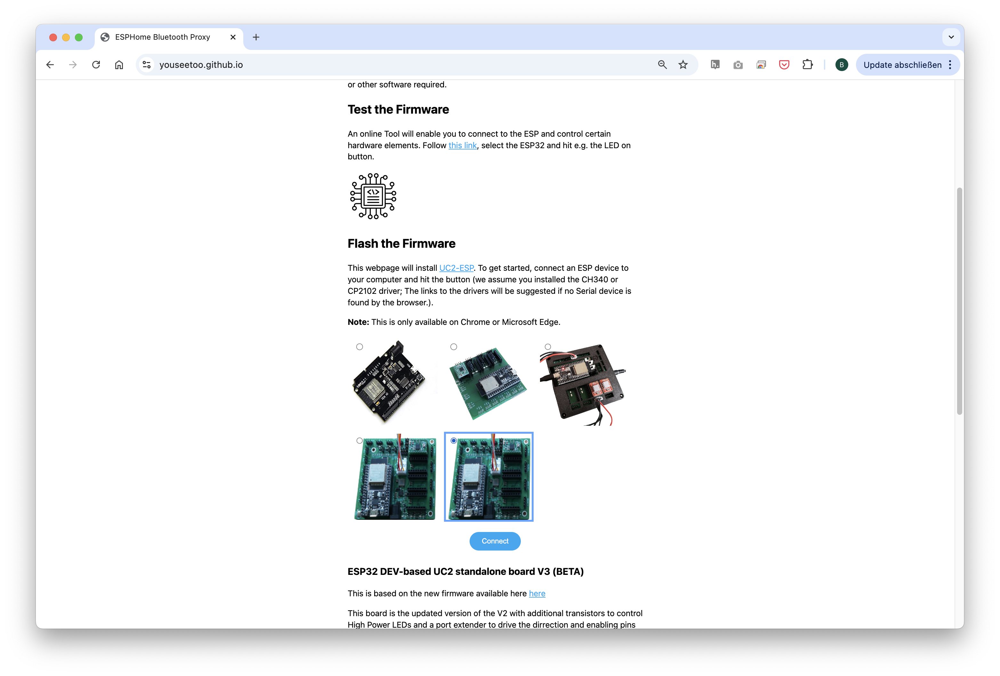
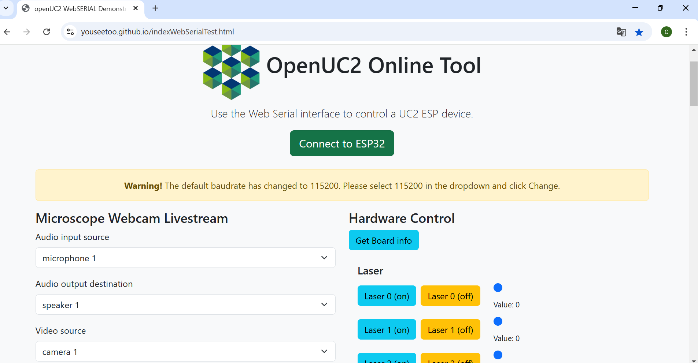

# Tutorial: Building a XXX

      Short introduction for Example:
      In this workshop, we will guide you through assembling a XXX
---
      Image of complete setup


### Materials Needed

1.
2.
3. etc.


### Diagram

    image of black and white box diagram,
    components labeled for easier understanding


### Theory of Operation

    Explanation of the finished setup for example:
    Light-sheet microscopy is based on the principle of fluorescence and
    like confocal microscopy, it is a technique that creates optical sections that can then be
    reconstructed into a coherent image. It differs from traditional microscopy technologies in its special type of illumination and detection, which enables gentler and faster acquisition of 3D images, making it particularly suitable for the three-dimensional visualization of biological samples.
---

    images as needed


### Theoretical Background

    Explanation of the physical prinziples the setup/ experiment is based on
    for example: Fluorescence is a photophysical process that describes the spontaneous emission of light shortly after an electron is excited to a higher-energy state.


## Tutorial: XXX

    Image of all the components laying next to each other
    needed for the setup/ experiment


## Step 1: Assemble the XXX

      Step by Step describtion on how to place the cubes and adjust the optical parts. No Electronics here!

This guide will walk you through the assembly step by step. You can follow the process according to the functional modules or refer to the diagram above for orientation.


1. placement

        Image of finished 1. task
2. placement
        Image of finished 2. task
3. placement
        Image of finished 3. task


## Step 2: Electronics

     only if Laser is used:

      **⚠️ ATTENTION!**

      NEVER LOOK DIRECTLY INTO THE LASER! EYE WILL BE DAMAGED DIRECTLY

      NEVER SWITCH ON THE LASER WITHOUT INTENDED USE

      BEAM HAS TO GO AWAY FROM ONESELF - ALWAYS!


### 2.1: Plug in the Electronics as Shown Below

**⚠️ Caution!**
If you need to change any of the cables or their position, always unplug the 12V power cable before doing so. Otherwise, the electronic components might get damaged!

        image of complete Electronic setup (you can see every wire connected correctly)

- connect the XXX to the Mainboard at `XXX1`

- Connect XXY to the Mainboard at `XXY2`
-
-
-


- Plug in the micro-USB at your ESP32 and connect to your PC.

- Plug in the 12V power cable.


### 2.2: Flashing the ESP32 Firmware
          is always the same , no changing here

1. Before proceeding, ensure your ESP32 board has the latest firmware. You can download and flash the firmware via the official [openUC2 website](https://youseetoo.github.io/), selecting your version (most likely **ESO32-DEV-based UC2 standalone board V3 (beta)**), then click on the `connect` button.



The source code can be found [here](https://github.com/youseetoo/uc2-esp32).

2. Connect the ESP32 to your computer using the micro-USB cable.


3. In your Chrome browser, a dialog will prompt you to select the COM port for your ESP32, which should be shown as `CP2102 USB to UART Bridge Controller`. Once connected, you can install the latest firmware by simply clicking the "Install" button.
  

  

  If nothing shows up, you can install the drivers from the prompt that appears when you click anywhere on the screen:

   

4. Wait until the firmware has been successfully flashed.


### 2.3: Connecting to the Web Interface
        is always the same , no changing here
1. After flashing the firmware, go to the testing section on the same website.

2. Connect to your ESP32 board using the "Connect" button again, ensuring the correct COM port is selected.

   

3. Once connected, test the system by sending a simple command:

```json
{"task":"/motor_act", "motor": { "steppers": [ { "stepperid": 3, "position": -1000, "speed": 1000, "isabs": 0, "isaccel": 0} ] } }
```


This command will move the Z-axis motor by -1000 steps (1 full rotation) at a speed of 1000 steps per second. Each step corresponds to a movement of 300nm when using microstepping. You’ll observe the motor rotating, adjusting the focus.

**Note:** Ensure that the command string has no line breaks.


### 2.4: Testing in the Web Interface
        is always the same , no changing here

1. After completing the test, go back to the first tab to control the other components via buttons:
   - `Laser 1(on)` and `Laser 1(off)` control the laser diode.
   - `Motor Z(+)` and `Motor Z(-)` control the Z-stage.
   - `Motor X(+)/Y(+)/A(+)` and `Motor X(-)/Y(-)/A(-)` control the XYZ-stage.
   - `LED (on)` and `LED (off)` control the LED-matrix panel


### 2.5: Pairing the PS4 Controller &#x1F3AE;
        only if some sort of motorized stage is used

The UC2-ESP firmware supports various input devices, including the PS4 controller, to make interacting with the microscope easier. While you've already worked with USB serial commands, using the PS4 controller offers a more flexible, hands-on approach. For more detailed instructions on pairing, refer to the[UC2 PS4 Controller Pairing Guide](https://openuc2.github.io/docs/Electronics/PS4-Controller/PS4-Controller). Here’s a brief summary:

1. **Put your PS4 controller into pairing mode** by holding down the `Share` button and the `PS` button simultaneously until the light bar starts blinking.
2. Click the `Pair Controller` button in the web interface. Alternatively, open the serial prompt in your browser (connected to the ESP32 board) or use the web interface and enter the following command:


```json
{"bt_scan":1}
```

  This will initiate the Bluetooth scan on the ESP32, which will detect and pair with the controller.

  Once paired, you can control the motorized stage using the analog sticks and switch the LED-matrix on/off using the buttons. The complete pinout of the diffrent function you can find here: [UC2 PS4 Controller Pairing Guide](https://openuc2.github.io/docs/Electronics/PS4-Controller/PS4-Controller)


### 2.6: Setup and Use the Camera Software
        only if HIK Camera is used

1. Connect the camera via cable to your PC.

2. For the installation process and useage of the software, follow these instructions: [Install MVS App for Camera Utilization](https://openuc2.github.io/docs/Electronics/HIKCamera/SoftwareTutorial)


## Step 3: Aligning the XXX

        Most of the Times Alliging the Experiemnt is only possible after the Electronic setup


  1. placement

          Image of finished 1. task
  2. placement
          Image of finished 2. task
  3. placement
          Image of finished 3. task


## Step 4: Install Imswitch (optional)


#### 1. Installation process

For this, please refer to the installation instructions [here](https://openuc2.github.io/docs/ImSwitch/Quickstart).

On top of this, you can use the following `ImSwitchClient` template to remote control your microscopy using google colab or jupyter notebook. This gives some hints on the use of the API:

<a target="_blank" href="https://colab.research.google.com/drive/1W3Jcw4gFn0jtQXa3_2aCtJYJglMNGkXr?usp=sharing">
  
</a>
This makes use of the default URL hosted publicly on https://imswitch.openuc2.com/imswitch/index.html, but you can change this to the `PORT` (i.e. 8001) nad `URL` (e.g. the Raspberry Pi's IP address that runs ImSwitch in docker and is in the same network as you computer).


**Your Setup is compete, now let's start the Experiments**


---
---


## Experiment 1:
1. step
        Image of finished 1. task
2. step
        Image of finished 2. task
3. step
        Image of finished 3. task


## Experiment 2:
1. step
        Image of finished 1. task
2. step
        Image of finished 2. task
3. step
        Image of finished 3. task
